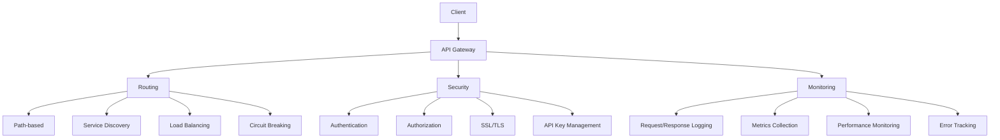
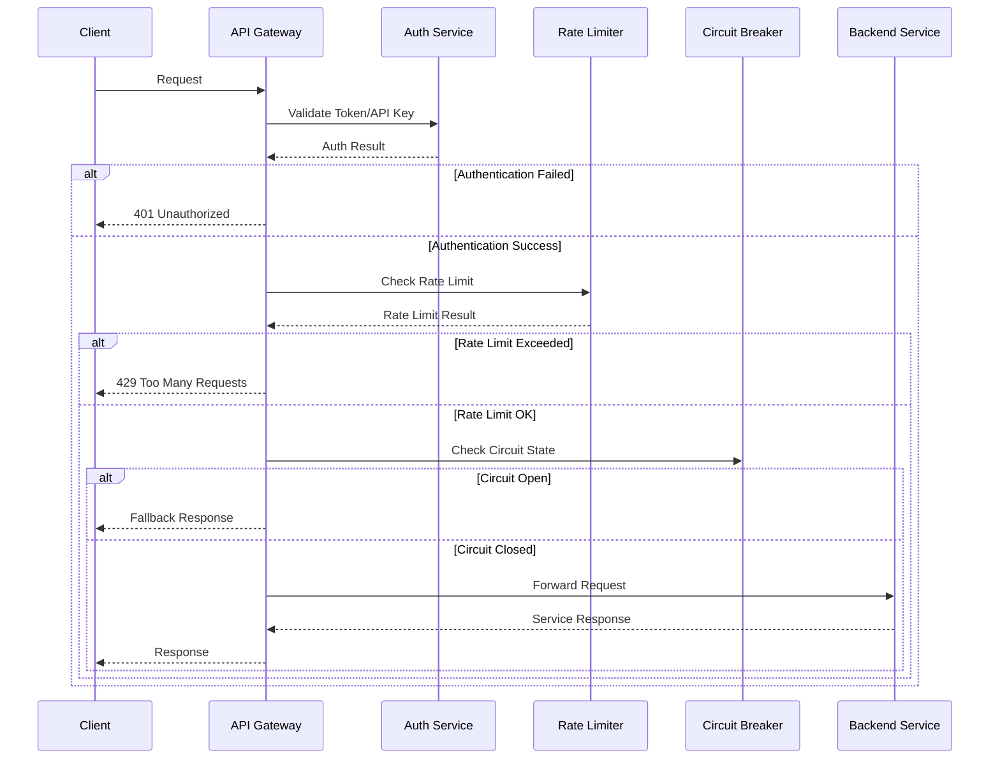
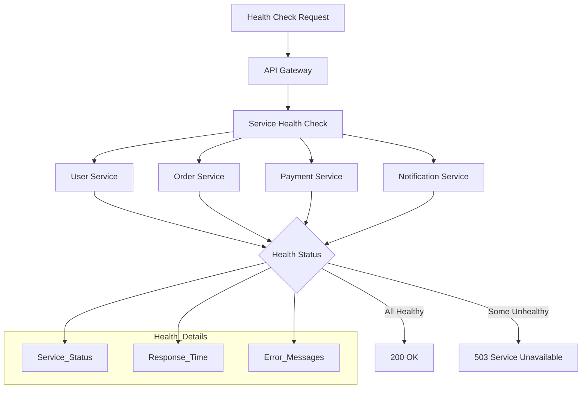

# 5.3. API Gateway Kullanımı

## Temel Fonksiyonlar

### Yönlendirme (Routing)
- **Yol tabanlı yönlendirme**
- **Servis keşfi**
- **Yük dengeleme**
- **Devre kesici**



### Güvenlik
- **Kimlik doğrulama**
- **Yetkilendirme**
- **SSL/TLS sonlandırma**
- **API anahtarı yönetimi**

### İzleme
- **İstek/yanıt kaydı**
- **Metrik toplama**
- **Performans izleme**
- **Hata takibi**

## Kong Gateway

### Özellikler
- **Eklenti mimarisi**
- **Deklaratif yapılandırma**
- **Veritabanısız mod**
- **Kubernetes entegrasyonu**

### Eklentiler (Plugins)
- Oran sınırlama (Rate limiting)
- JWT kimlik doğrulama
- OAuth2
- İstek dönüştürücü (Request transformer)

### Dağıtım
- Docker konteynerleri
- Kubernetes operatörü
- Hibrit mod
- Çoklu veri merkezi

## Apigee

### Özellikler
- **API yaşam döngüsü yönetimi**
- **Geliştirici portalı**
- **Analitik paneli**
- **Ticarileştirme (Monetization)**

### Güvenlik
- OAuth2/OpenID Connect
- API anahtarı yönetimi
- Tehdit koruması
- Veri şifreleme

### Entegrasyon
- Bulut servisleri
- Yerel sistemler
- Üçüncü parti API'ler
- Özel arka uçlar

## Spring Boot API Gateway Uygulaması

### Spring Cloud Gateway Yapılandırması
```java
@Configuration
@EnableConfigurationProperties({GatewayProperties.class})
public class ApiGatewayConfig {
    
    @Bean
    public RouteLocator customRouteLocator(RouteLocatorBuilder builder) {
        return builder.routes()
            // User Service Routes
            .route("user-service", r -> r
                .path("/api/users/**")
                .filters(f -> f
                    .stripPrefix(1)
                    .addRequestHeader("X-Gateway", "spring-cloud-gateway")
                    .circuitBreaker(config -> config
                        .setName("user-service-cb")
                        .setFallbackUri("forward:/fallback/users"))
                    .retry(config -> config
                        .setRetries(3)
                        .setBackoff(Duration.ofMillis(100), Duration.ofSeconds(1), 2, true)))
                .uri("lb://user-service"))
                
            // Order Service Routes
            .route("order-service", r -> r
                .path("/api/orders/**")
                .filters(f -> f
                    .stripPrefix(1)
                    .addRequestHeader("X-Gateway", "spring-cloud-gateway")
                    .requestRateLimiter(config -> config
                        .setRateLimiter(redisRateLimiter())
                        .setKeyResolver(userKeyResolver()))
                    .circuitBreaker(config -> config
                        .setName("order-service-cb")
                        .setFallbackUri("forward:/fallback/orders")))
                .uri("lb://order-service"))
                
            // Payment Service Routes
            .route("payment-service", r -> r
                .path("/api/payments/**")
                .filters(f -> f
                    .stripPrefix(1)
                    .addRequestHeader("X-Gateway", "spring-cloud-gateway")
                    .filter(new AuthenticationGatewayFilterFactory().apply(
                        new AuthenticationGatewayFilterFactory.Config()))
                    .requestRateLimiter(config -> config
                        .setRateLimiter(redisRateLimiter())
                        .setKeyResolver(apiKeyResolver())))
                .uri("lb://payment-service"))
                
            // Notification Service Routes
            .route("notification-service", r -> r
                .path("/api/notifications/**")
                .filters(f -> f
                    .stripPrefix(1)
                    .addRequestHeader("X-Gateway", "spring-cloud-gateway"))
                .uri("lb://notification-service"))
                
            build();
    }
    
    @Bean
    public RedisRateLimiter redisRateLimiter() {
        return new RedisRateLimiter(100, 200, 1); // replenishRate, burstCapacity, requestedTokens
    }
    
    @Bean
    public KeyResolver userKeyResolver() {
        return exchange -> {
            String userId = exchange.getRequest().getHeaders().getFirst("X-User-ID");
            return Mono.just(userId != null ? "user:" + userId : "anonymous");
        };
    }
    
    @Bean
    public KeyResolver apiKeyResolver() {
        return exchange -> {
            String apiKey = exchange.getRequest().getHeaders().getFirst("X-API-Key");
            return Mono.just(apiKey != null ? "api:" + apiKey : "anonymous");
        };
    }
    
    @Bean
    public KeyResolver ipKeyResolver() {
        return exchange -> {
            String clientIp = getClientIpAddress(exchange.getRequest());
            return Mono.just("ip:" + clientIp);
        };
    }
    
    private String getClientIpAddress(ServerHttpRequest request) {
        String xForwardedFor = request.getHeaders().getFirst("X-Forwarded-For");
        if (xForwardedFor != null && !xForwardedFor.isEmpty()) {
            return xForwardedFor.split(",")[0].trim();
        }
        
        String xRealIp = request.getHeaders().getFirst("X-Real-IP");
        if (xRealIp != null && !xRealIp.isEmpty()) {
            return xRealIp;
        }
        
        return request.getRemoteAddress() != null ? 
            request.getRemoteAddress().getAddress().getHostAddress() : "unknown";
    }
}
```



### Özel Kimlik Doğrulama Filtresi
```java
@Component
public class AuthenticationGatewayFilterFactory extends AbstractGatewayFilterFactory<AuthenticationGatewayFilterFactory.Config> {
    
    @Autowired
    private JwtTokenValidator jwtTokenValidator;
    
    @Autowired
    private ApiKeyValidator apiKeyValidator;
    
    public AuthenticationGatewayFilterFactory() {
        super(Config.class);
    }
    
    @Override
    public GatewayFilter apply(Config config) {
        return (exchange, chain) -> {
            ServerHttpRequest request = exchange.getRequest();
            
            // Skip authentication for health checks
            if (request.getPath().value().contains("/actuator/health")) {
                return chain.filter(exchange);
            }
            
            // Try JWT authentication first
            String authHeader = request.getHeaders().getFirst("Authorization");
            if (authHeader != null && authHeader.startsWith("Bearer ")) {
                String token = authHeader.substring(7);
                return jwtTokenValidator.validateToken(token)
                    .flatMap(claims -> {
                        ServerHttpRequest mutatedRequest = request.mutate()
                            .header("X-User-ID", claims.getSubject())
                            .header("X-User-Roles", String.join(",", claims.getRoles()))
                            .build();
                        return chain.filter(exchange.mutate().request(mutatedRequest).build());
                    })
                    .onErrorResume(error -> {
                        log.warn("JWT validation failed: {}", error.getMessage());
                        return handleAuthenticationError(exchange, "Invalid JWT token");
                    });
            }
            
            // Try API Key authentication
            String apiKey = request.getHeaders().getFirst("X-API-Key");
            if (apiKey != null) {
                return apiKeyValidator.validateApiKey(apiKey)
                    .flatMap(apiKeyInfo -> {
                        ServerHttpRequest mutatedRequest = request.mutate()
                            .header("X-Client-ID", apiKeyInfo.getClientId())
                            .header("X-API-Key-Scope", String.join(",", apiKeyInfo.getScopes()))
                            .build();
                        return chain.filter(exchange.mutate().request(mutatedRequest).build());
                    })
                    .onErrorResume(error -> {
                        log.warn("API Key validation failed: {}", error.getMessage());
                        return handleAuthenticationError(exchange, "Invalid API key");
                    });
            }
            
            // No authentication provided
            return handleAuthenticationError(exchange, "Authentication required");
        };
    }
    
    private Mono<Void> handleAuthenticationError(ServerWebExchange exchange, String message) {
        ServerHttpResponse response = exchange.getResponse();
        response.setStatusCode(HttpStatus.UNAUTHORIZED);
        response.getHeaders().add("Content-Type", "application/json");
        
        String errorResponse = """
            {
                "error": "Unauthorized",
                "message": "%s",
                "timestamp": "%s"
            }
            """.formatted(message, Instant.now().toString());
        
        DataBuffer buffer = response.bufferFactory().wrap(errorResponse.getBytes());
        return response.writeWith(Mono.just(buffer));
    }
    
    @Data
    public static class Config {
        private boolean required = true;
        private List<String> excludePaths = new ArrayList<>();
    }
}

@Component
@Slf4j
public class JwtTokenValidator {
    
    @Value("${jwt.secret}")
    private String jwtSecret;
    
    @Value("${jwt.expiration:3600}")
    private long jwtExpiration;
    
    private Key getSigningKey() {
        byte[] keyBytes = Decoders.BASE64.decode(jwtSecret);
        return Keys.hmacShaKeyFor(keyBytes);
    }
    
    public Mono<JwtClaims> validateToken(String token) {
        return Mono.fromCallable(() -> {
            Claims claims = Jwts.parserBuilder()
                .setSigningKey(getSigningKey())
                .build()
                .parseClaimsJws(token)
                .getBody();
            
            List<String> roles = claims.get("roles", List.class);
            return new JwtClaims(claims.getSubject(), roles != null ? roles : new ArrayList<>());
        })
        .doOnError(error -> log.error("JWT validation error: {}", error.getMessage()))
        .onErrorMap(JwtException.class, ex -> new AuthenticationException("Invalid JWT token: " + ex.getMessage()));
    }
}

@Data
@AllArgsConstructor
public class JwtClaims {
    private String subject;
    private List<String> roles;
}

@Component
@Slf4j
public class ApiKeyValidator {
    
    @Autowired
    private RedisTemplate<String, Object> redisTemplate;
    
    @Autowired
    private ApiKeyRepository apiKeyRepository;
    
    public Mono<ApiKeyInfo> validateApiKey(String apiKey) {
        return Mono.fromCallable(() -> {
            // Try cache first
            String cacheKey = "api_key:" + apiKey;
            ApiKeyInfo cachedInfo = (ApiKeyInfo) redisTemplate.opsForValue().get(cacheKey);
            
            if (cachedInfo != null) {
                if (cachedInfo.isExpired()) {
                    redisTemplate.delete(cacheKey);
                    throw new AuthenticationException("API key expired");
                }
                return cachedInfo;
            }
            
            // Fallback to database
            ApiKeyEntity entity = apiKeyRepository.findByKeyHash(hashApiKey(apiKey))
                .orElseThrow(() -> new AuthenticationException("Invalid API key"));
            
            if (entity.isExpired() || !entity.isActive()) {
                throw new AuthenticationException("API key expired or inactive");
            }
            
            ApiKeyInfo info = new ApiKeyInfo(
                entity.getClientId(),
                entity.getScopes(),
                entity.getExpiresAt(),
                entity.getRateLimit()
            );
            
            // Cache for 5 minutes
            redisTemplate.opsForValue().set(cacheKey, info, Duration.ofMinutes(5));
            
            return info;
        })
        .doOnError(error -> log.error("API key validation error: {}", error.getMessage()));
    }
    
    private String hashApiKey(String apiKey) {
        return DigestUtils.sha256Hex(apiKey);
    }
}

@Data
@AllArgsConstructor
public class ApiKeyInfo implements Serializable {
    private String clientId;
    private List<String> scopes;
    private Instant expiresAt;
    private Integer rateLimit;
    
    public boolean isExpired() {
        return expiresAt != null && Instant.now().isAfter(expiresAt);
    }
}

public class AuthenticationException extends RuntimeException {
    public AuthenticationException(String message) {
        super(message);
    }
}
```

### Devre Kesici Yapılandırması
```java
@Configuration
public class CircuitBreakerConfig {
    
    @Bean
    public Customizer<ReactiveResilience4JCircuitBreakerFactory> circuitBreakerCustomizer() {
        return factory -> {
            factory.configureDefault(id -> new Resilience4JConfigBuilder(id)
                .circuitBreakerConfig(CircuitBreakerConfiguration.ofDefaults())
                .timeLimiterConfig(TimeLimiterConfiguration.ofDefaults())
                .build());
            
            // User service specific configuration
            factory.configure(builder -> builder
                .circuitBreakerConfig(CircuitBreakerConfiguration.custom()
                    .failureRateThreshold(50)
                    .waitDurationInOpenState(Duration.ofSeconds(30))
                    .slidingWindowSize(10)
                    .minimumNumberOfCalls(5)
                    .build())
                .timeLimiterConfig(TimeLimiterConfiguration.custom()
                    .timeoutDuration(Duration.ofSeconds(5))
                    .build()), "user-service-cb");
                    
            // Order service specific configuration
            factory.configure(builder -> builder
                .circuitBreakerConfig(CircuitBreakerConfiguration.custom()
                    .failureRateThreshold(60)
                    .waitDurationInOpenState(Duration.ofSeconds(45))
                    .slidingWindowSize(15)
                    .minimumNumberOfCalls(8)
                    .build())
                .timeLimiterConfig(TimeLimiterConfiguration.custom()
                    .timeoutDuration(Duration.ofSeconds(10))
                    .build()), "order-service-cb");
        };
    }
}
```

### Fallback Kontrolcüleri
```java
@RestController
@RequestMapping("/fallback")
@Slf4j
public class FallbackController {
    
    @GetMapping("/users/**")
    public ResponseEntity<Map<String, Object>> userServiceFallback(HttpServletRequest request) {
        log.warn("User service fallback triggered for request: {}", request.getRequestURI());
        
        Map<String, Object> fallbackResponse = Map.of(
            "error", "Service Temporarily Unavailable",
            "message", "User service is currently experiencing issues. Please try again later.",
            "service", "user-service",
            "timestamp", Instant.now(),
            "fallback", true
        );
        
        return ResponseEntity.status(HttpStatus.SERVICE_UNAVAILABLE).body(fallbackResponse);
    }
    
    @GetMapping("/orders/**")
    public ResponseEntity<Map<String, Object>> orderServiceFallback(HttpServletRequest request) {
        log.warn("Order service fallback triggered for request: {}", request.getRequestURI());
        
        Map<String, Object> fallbackResponse = Map.of(
            "error", "Service Temporarily Unavailable",
            "message", "Order service is currently experiencing issues. Please try again later.",
            "service", "order-service",
            "timestamp", Instant.now(),
            "fallback", true
        );
        
        return ResponseEntity.status(HttpStatus.SERVICE_UNAVAILABLE).body(fallbackResponse);
    }
    
    @PostMapping("/orders/**")
    public ResponseEntity<Map<String, Object>> orderServicePostFallback(HttpServletRequest request) {
        log.warn("Order service POST fallback triggered for request: {}", request.getRequestURI());
        
        Map<String, Object> fallbackResponse = Map.of(
            "error", "Service Temporarily Unavailable",
            "message", "Order creation is currently unavailable. Your request has been queued and will be processed when the service recovers.",
            "service", "order-service",
            "timestamp", Instant.now(),
            "fallback", true,
            "queuedForProcessing", true
        );
        
        return ResponseEntity.status(HttpStatus.ACCEPTED).body(fallbackResponse);
    }
}
```

### Gateway Metrikleri ve İzleme
```java
@Component
@Slf4j
public class GatewayMetricsFilter implements GlobalFilter, Ordered {
    
    private final MeterRegistry meterRegistry;
    private final Timer.Sample requestTimer;
    
    public GatewayMetricsFilter(MeterRegistry meterRegistry) {
        this.meterRegistry = meterRegistry;
        this.requestTimer = Timer.start(meterRegistry);
    }
    
    @Override
    public Mono<Void> filter(ServerWebExchange exchange, GatewayFilterChain chain) {
        Timer.Sample sample = Timer.start(meterRegistry);
        String route = getRouteName(exchange);
        String method = exchange.getRequest().getMethod().name();
        
        return chain.filter(exchange)
            .doOnSuccess(aVoid -> recordMetrics(sample, route, method, exchange, true))
            .doOnError(error -> recordMetrics(sample, route, method, exchange, false))
            .doFinally(signalType -> {
                // Record additional metrics
                recordRequestMetrics(exchange, route, method);
            });
    }
    
    private void recordMetrics(Timer.Sample sample, String route, String method, 
                             ServerWebExchange exchange, boolean success) {
        HttpStatus status = exchange.getResponse().getStatusCode();
        
        sample.stop(Timer.builder("gateway.request.duration")
            .tag("route", route)
            .tag("method", method)
            .tag("status", status != null ? status.toString() : "unknown")
            .tag("success", String.valueOf(success))
            .register(meterRegistry));
    }
    
    private void recordRequestMetrics(ServerWebExchange exchange, String route, String method) {
        Counter.builder("gateway.requests.total")
            .tag("route", route)
            .tag("method", method)
            .register(meterRegistry)
            .increment();
            
        // Record response size
        ServerHttpResponse response = exchange.getResponse();
        if (response.getHeaders().getContentLength() > 0) {
            DistributionSummary.builder("gateway.response.size")
                .tag("route", route)
                .tag("method", method)
                .register(meterRegistry)
                .record(response.getHeaders().getContentLength());
        }
    }
    
    private String getRouteName(ServerWebExchange exchange) {
        Route route = exchange.getAttribute(ServerWebExchangeUtils.GATEWAY_ROUTE_ATTR);
        return route != null ? route.getId() : "unknown";
    }
    
    @Override
    public int getOrder() {
        return Ordered.HIGHEST_PRECEDENCE;
    }
}

@Component
@Slf4j
public class GatewayLoggingFilter implements GlobalFilter, Ordered {
    
    @Override
    public Mono<Void> filter(ServerWebExchange exchange, GatewayFilterChain chain) {
        ServerHttpRequest request = exchange.getRequest();
        
        String requestId = UUID.randomUUID().toString();
        String clientIp = getClientIpAddress(request);
        String userAgent = request.getHeaders().getFirst("User-Agent");
        
        // Add request ID to headers for tracing
        ServerHttpRequest mutatedRequest = request.mutate()
            .header("X-Request-ID", requestId)
            .build();
        
        long startTime = System.currentTimeMillis();
        
        log.info("Gateway Request - ID: {}, Method: {}, URI: {}, IP: {}, User-Agent: {}",
            requestId, request.getMethod(), request.getURI(), clientIp, userAgent);
        
        return chain.filter(exchange.mutate().request(mutatedRequest).build())
            .doFinally(signalType -> {
                long duration = System.currentTimeMillis() - startTime;
                HttpStatus status = exchange.getResponse().getStatusCode();
                
                log.info("Gateway Response - ID: {}, Status: {}, Duration: {}ms",
                    requestId, status, duration);
            });
    }
    
    private String getClientIpAddress(ServerHttpRequest request) {
        String xForwardedFor = request.getHeaders().getFirst("X-Forwarded-For");
        if (xForwardedFor != null && !xForwardedFor.isEmpty()) {
            return xForwardedFor.split(",")[0].trim();
        }
        
        String xRealIp = request.getHeaders().getFirst("X-Real-IP");
        if (xRealIp != null && !xRealIp.isEmpty()) {
            return xRealIp;
        }
        
        return request.getRemoteAddress() != null ? 
            request.getRemoteAddress().getAddress().getHostAddress() : "unknown";
    }
    
    @Override
    public int getOrder() {
        return Ordered.HIGHEST_PRECEDENCE + 1;
    }
}
```

### API Gateway Sağlık Kontrolleri
```java
@Component
public class ServiceHealthIndicator implements HealthIndicator {
    
    @Autowired
    private ReactiveLoadBalancerClientFactory loadBalancerClientFactory;
    
    @Autowired
    private WebClient.Builder webClientBuilder;
    
    private final List<String> serviceNames = Arrays.asList(
        "user-service", "order-service", "payment-service", "notification-service"
    );
    
    @Override
    public Health health() {
        Health.Builder builder = Health.up();
        Map<String, Object> details = new HashMap<>();
        
        for (String serviceName : serviceNames) {
            try {
                ServiceHealthStatus status = checkServiceHealth(serviceName);
                details.put(serviceName, status);
                
                if (!status.isHealthy()) {
                    builder.down();
                }
            } catch (Exception e) {
                details.put(serviceName, new ServiceHealthStatus(false, e.getMessage()));
                builder.down();
            }
        }
        
        return builder.withDetails(details).build();
    }
    
    private ServiceHealthStatus checkServiceHealth(String serviceName) {
        try {
            ReactiveLoadBalancerClient loadBalancerClient = 
                loadBalancerClientFactory.getInstance(serviceName);
            
            WebClient webClient = webClientBuilder.build();
            
            String healthResponse = webClient.get()
                .uri("lb://" + serviceName + "/actuator/health")
                .retrieve()
                .bodyToMono(String.class)
                .timeout(Duration.ofSeconds(5))
                .block();
                
            return new ServiceHealthStatus(true, "Service is healthy");
        } catch (Exception e) {
            log.warn("Health check failed for service {}: {}", serviceName, e.getMessage());
            return new ServiceHealthStatus(false, e.getMessage());
        }
    }
    
    @Data
    @AllArgsConstructor
    public static class ServiceHealthStatus {
        private boolean healthy;
        private String message;
    }
}
```



Bu uygulama, Spring Cloud Gateway'i üretim ortamında güvenli ve ölçeklenebilir bir şekilde kullanmak için gerekli tüm bileşenleri içerir.
