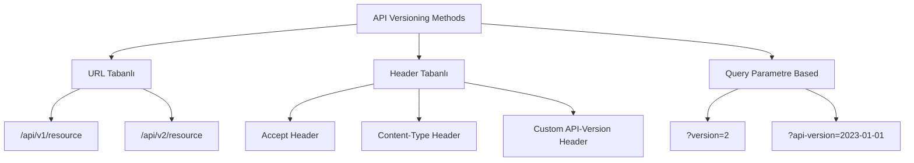
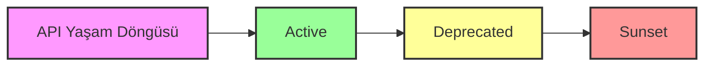

# 5.1. API Versioning

## Neden Gerekli
- **Arka uç değişiklikleri istemcileri etkilemeden sürdürülebilirliği sağlamak**
- **Geriye dönük uyumluluk (backward compatibility)**
- **Aşamalı geçiş (gradual migration)**
- **API yaşam döngüsü yönetimi**

## Uygulama Yöntemleri

### URL'de Versiyonlama
- `/api/v1/resource`
- `/api/v2/resource`
- **Avantaj**: Basit ve anlaşılır
- **Dezavantaj**: URL yapısını değiştirir

### HTTP Başlıklarında
- `Accept: application/vnd.myapi.v2+json`
- `Content-Type: application/vnd.myapi.v2+json`
- **Avantaj**: URL temiz kalır
- **Dezavantaj**: Daha karmaşık implementasyon

### Query Parametreleri
- `?version=2`
- `?api-version=2023-01-01`
- **Avantaj**: Kolay test edilebilir
- **Dezavantaj**: Caching zorlukları





## Best Practices
- Semantic versioning (MAJOR.MINOR.PATCH)
- Deprecation policy
- Version lifecycle management
- Documentation versioning
- Client migration strategy

## Spring Boot API Versioning Implementation

### URL-Based Versioning
```java
@RestController
@RequestMapping("/api/v1/users")
public class UserV1Controller {
    
    @Autowired
    private UserService userService;
    
    @GetMapping("/{id}")
    public ResponseEntity<UserV1Response> getUser(@PathVariable Long id) {
        User user = userService.findById(id);
        UserV1Response response = convertToV1Response(user);
        return ResponseEntity.ok(response);
    }
    
    @PostMapping
    public ResponseEntity<UserV1Response> createUser(@RequestBody @Valid UserV1Request request) {
        User user = userService.createUser(convertFromV1Request(request));
        UserV1Response response = convertToV1Response(user);
        return ResponseEntity.status(HttpStatus.CREATED).body(response);
    }
    
    private UserV1Response convertToV1Response(User user) {
        return UserV1Response.builder()
            .id(user.getId())
            .name(user.getFirstName() + " " + user.getLastName()) // V1 tek isim alanı
            .email(user.getEmail())
            .createdAt(user.getCreatedAt())
            .build();
    }
}

@RestController
@RequestMapping("/api/v2/users")
public class UserV2Controller {
    
    @Autowired
    private UserService userService;
    
    @GetMapping("/{id}")
    public ResponseEntity<UserV2Response> getUser(@PathVariable Long id) {
        User user = userService.findById(id);
        UserV2Response response = convertToV2Response(user);
        return ResponseEntity.ok(response);
    }
    
    @PostMapping
    public ResponseEntity<UserV2Response> createUser(@RequestBody @Valid UserV2Request request) {
        User user = userService.createUser(convertFromV2Request(request));
        UserV2Response response = convertToV2Response(user);
        return ResponseEntity.status(HttpStatus.CREATED).body(response);
    }
    
    private UserV2Response convertToV2Response(User user) {
        return UserV2Response.builder()
            .id(user.getId())
            .firstName(user.getFirstName()) // V2 ayrı isim alanları
            .lastName(user.getLastName())
            .email(user.getEmail())
            .phone(user.getPhone()) // V2'de yeni alan
            .profile(user.getProfile()) // V2'de yeni nesne
            .createdAt(user.getCreatedAt())
            .updatedAt(user.getUpdatedAt())
            .build();
    }
}
```

### Header-Based Versioning
```java
@RestController
@RequestMapping("/api/users")
public class VersionedUserController {
    
    @Autowired
    private UserService userService;
    
    @GetMapping("/{id}")
    public ResponseEntity<?> getUser(
            @PathVariable Long id,
            @RequestHeader(value = "Accept", required = false) String acceptHeader,
            @RequestHeader(value = "API-Version", required = false) String apiVersion) {
        
        String version = determineVersion(acceptHeader, apiVersion);
        User user = userService.findById(id);
        
        switch (version) {
            case "v1":
                return ResponseEntity.ok(convertToV1Response(user));
            case "v2":
                return ResponseEntity.ok(convertToV2Response(user));
            default:
                return ResponseEntity.ok(convertToV2Response(user)); // Default latest
        }
    }
    
    @PostMapping
    public ResponseEntity<?> createUser(
            @RequestBody Map<String, Object> requestBody,
            @RequestHeader(value = "Content-Type", required = false) String contentType,
            @RequestHeader(value = "API-Version", required = false) String apiVersion) {
        
        String version = determineVersionFromContentType(contentType, apiVersion);
        
        try {
            User user;
            switch (version) {
                case "v1":
                    UserV1Request v1Request = objectMapper.convertValue(requestBody, UserV1Request.class);
                    user = userService.createUser(convertFromV1Request(v1Request));
                    return ResponseEntity.status(HttpStatus.CREATED).body(convertToV1Response(user));
                case "v2":
                    UserV2Request v2Request = objectMapper.convertValue(requestBody, UserV2Request.class);
                    user = userService.createUser(convertFromV2Request(v2Request));
                    return ResponseEntity.status(HttpStatus.CREATED).body(convertToV2Response(user));
                default:
                    return ResponseEntity.badRequest().body("Unsupported API version");
            }
        } catch (Exception e) {
            return ResponseEntity.badRequest().body("Invalid request format for version: " + version);
        }
    }
    
    private String determineVersion(String acceptHeader, String apiVersion) {
        if (apiVersion != null) {
            return apiVersion;
        }
        
        if (acceptHeader != null) {
            if (acceptHeader.contains("application/vnd.myapi.v1+json")) {
                return "v1";
            } else if (acceptHeader.contains("application/vnd.myapi.v2+json")) {
                return "v2";
            }
        }
        
        return "v2"; // Default to latest
    }
    
    private String determineVersionFromContentType(String contentType, String apiVersion) {
        if (apiVersion != null) {
            return apiVersion;
        }
        
        if (contentType != null) {
            if (contentType.contains("application/vnd.myapi.v1+json")) {
                return "v1";
            } else if (contentType.contains("application/vnd.myapi.v2+json")) {
                return "v2";
            }
        }
        
        return "v2"; // Default to latest
    }
}
```

### Query Parameter Versioning
```java
@RestController
@RequestMapping("/api/users")
public class QueryVersionedUserController {
    
    @Autowired
    private UserService userService;
    
    @GetMapping("/{id}")
    public ResponseEntity<?> getUser(
            @PathVariable Long id,
            @RequestParam(value = "version", defaultValue = "2") String version,
            @RequestParam(value = "api-version", required = false) String apiVersion) {
        
        String finalVersion = apiVersion != null ? apiVersion : version;
        User user = userService.findById(id);
        
        switch (finalVersion) {
            case "1":
            case "v1":
                return ResponseEntity.ok(convertToV1Response(user));
            case "2":
            case "v2":
                return ResponseEntity.ok(convertToV2Response(user));
            default:
                return ResponseEntity.badRequest().body("Unsupported version: " + finalVersion);
        }
    }
    
    @GetMapping
    public ResponseEntity<?> getUsers(
            @RequestParam(value = "version", defaultValue = "2") String version,
            @RequestParam(value = "page", defaultValue = "0") int page,
            @RequestParam(value = "size", defaultValue = "20") int size) {
        
        Pageable pageable = PageRequest.of(page, size);
        Page<User> users = userService.findAll(pageable);
        
        switch (version) {
            case "1":
            case "v1":
                List<UserV1Response> v1Responses = users.getContent().stream()
                    .map(this::convertToV1Response)
                    .collect(Collectors.toList());
                return ResponseEntity.ok(new PagedResponse<>(v1Responses, users));
            case "2":
            case "v2":
                List<UserV2Response> v2Responses = users.getContent().stream()
                    .map(this::convertToV2Response)
                    .collect(Collectors.toList());
                return ResponseEntity.ok(new PagedResponse<>(v2Responses, users));
            default:
                return ResponseEntity.badRequest().body("Unsupported version: " + version);
        }
    }
}
```

### Custom Annotation-Based Versioning
```java
@Target({ElementType.METHOD, ElementType.TYPE})
@Retention(RetentionPolicy.RUNTIME)
public @interface ApiVersion {
    String value();
}

@Component
public class ApiVersionRequestMappingHandlerMapping extends RequestMappingHandlerMapping {
    
    private static final String VERSION_HEADER = "API-Version";
    private static final String VERSION_PARAM = "version";
    
    @Override
    protected RequestCondition<?> getCustomTypeCondition(Class<?> handlerType) {
        ApiVersion apiVersion = AnnotationUtils.findAnnotation(handlerType, ApiVersion.class);
        return createCondition(apiVersion);
    }
    
    @Override
    protected RequestCondition<?> getCustomMethodCondition(Method method) {
        ApiVersion apiVersion = AnnotationUtils.findAnnotation(method, ApiVersion.class);
        return createCondition(apiVersion);
    }
    
    private RequestCondition<?> createCondition(ApiVersion apiVersion) {
        return apiVersion == null ? null : new ApiVersionCondition(apiVersion.value());
    }
    
    private static class ApiVersionCondition implements RequestCondition<ApiVersionCondition> {
        private final String version;
        
        public ApiVersionCondition(String version) {
            this.version = version;
        }
        
        @Override
        public ApiVersionCondition combine(ApiVersionCondition other) {
            return new ApiVersionCondition(other.version);
        }
        
        @Override
        public ApiVersionCondition getMatchingCondition(HttpServletRequest request) {
            String requestVersion = getVersionFromRequest(request);
            return version.equals(requestVersion) ? this : null;
        }
        
        @Override
        public int compareTo(ApiVersionCondition other, HttpServletRequest request) {
            return other.version.compareTo(this.version);
        }
        
        private String getVersionFromRequest(HttpServletRequest request) {
            String headerVersion = request.getHeader(VERSION_HEADER);
            if (headerVersion != null) {
                return headerVersion;
            }
            
            String paramVersion = request.getParameter(VERSION_PARAM);
            if (paramVersion != null) {
                return paramVersion;
            }
            
            return "v2"; // Default version
        }
    }
}

@RestController
@RequestMapping("/api/users")
public class AnnotationVersionedUserController {
    
    @Autowired
    private UserService userService;
    
    @GetMapping("/{id}")
    @ApiVersion("v1")
    public ResponseEntity<UserV1Response> getUserV1(@PathVariable Long id) {
        User user = userService.findById(id);
        return ResponseEntity.ok(convertToV1Response(user));
    }
    
    @GetMapping("/{id}")
    @ApiVersion("v2")
    public ResponseEntity<UserV2Response> getUserV2(@PathVariable Long id) {
        User user = userService.findById(id);
        return ResponseEntity.ok(convertToV2Response(user));
    }
    
    @PostMapping
    @ApiVersion("v1")
    public ResponseEntity<UserV1Response> createUserV1(@RequestBody @Valid UserV1Request request) {
        User user = userService.createUser(convertFromV1Request(request));
        return ResponseEntity.status(HttpStatus.CREATED).body(convertToV1Response(user));
    }
    
    @PostMapping
    @ApiVersion("v2")
    public ResponseEntity<UserV2Response> createUserV2(@RequestBody @Valid UserV2Request request) {
        User user = userService.createUser(convertFromV2Request(request));
        return ResponseEntity.status(HttpStatus.CREATED).body(convertToV2Response(user));
    }
}
```

### API Version Management Service
```java
@Service
@Slf4j
public class ApiVersionManagementService {
    
    @Value("${api.version.current:v2}")
    private String currentVersion;
    
    @Value("${api.version.supported:v1,v2}")
    private List<String> supportedVersions;
    
    @Value("${api.version.deprecated:}")
    private List<String> deprecatedVersions;
    
    private final Map<String, Instant> versionDeprecationDates = new HashMap<>();
    private final Map<String, Instant> versionSunsetDates = new HashMap<>();
    
    @PostConstruct
    public void initializeVersionLifecycle() {
        // V1 deprecation and sunset dates
        versionDeprecationDates.put("v1", Instant.parse("2024-06-01T00:00:00Z"));
        versionSunsetDates.put("v1", Instant.parse("2024-12-01T00:00:00Z"));
        
        log.info("API Version Management initialized. Current: {}, Supported: {}", 
            currentVersion, supportedVersions);
    }
    
    public boolean isVersionSupported(String version) {
        return supportedVersions.contains(version);
    }
    
    public boolean isVersionDeprecated(String version) {
        return deprecatedVersions.contains(version);
    }
    
    public boolean isVersionSunset(String version) {
        Instant sunsetDate = versionSunsetDates.get(version);
        return sunsetDate != null && Instant.now().isAfter(sunsetDate);
    }
    
    public String getCurrentVersion() {
        return currentVersion;
    }
    
    public List<String> getSupportedVersions() {
        return new ArrayList<>(supportedVersions);
    }
    
    public void addDeprecationHeaders(HttpServletResponse response, String version) {
        if (isVersionDeprecated(version)) {
            Instant sunsetDate = versionSunsetDates.get(version);
            response.addHeader("Deprecation", "true");
            response.addHeader("Warning", "299 - \"API version " + version + " is deprecated\"");
            
            if (sunsetDate != null) {
                response.addHeader("Sunset", sunsetDate.toString());
            }
        }
    }
    
    @EventListener
    @Async
    public void handleVersionUsage(ApiVersionUsageEvent event) {
        // Track version usage for analytics
        log.info("API Version {} used by client: {}", 
            event.getVersion(), event.getClientId());
            
        // Send notifications for deprecated version usage
        if (isVersionDeprecated(event.getVersion())) {
            notifyClientOfDeprecation(event.getClientId(), event.getVersion());
        }
    }
    
    private void notifyClientOfDeprecation(String clientId, String version) {
        // Implementation for notifying clients about deprecated versions
        log.warn("Client {} is using deprecated API version {}", clientId, version);
    }
}

@Component
public class ApiVersionInterceptor implements HandlerInterceptor {
    
    @Autowired
    private ApiVersionManagementService versionManagementService;
    
    @Override
    public boolean preHandle(HttpServletRequest request, HttpServletResponse response, 
                           Object handler) throws Exception {
        
        String version = extractVersionFromRequest(request);
        
        // Check if version is supported
        if (!versionManagementService.isVersionSupported(version)) {
            response.setStatus(HttpStatus.BAD_REQUEST.value());
            response.getWriter().write("{\"error\":\"Unsupported API version: " + version + "\"}");
            return false;
        }
        
        // Check if version is sunset
        if (versionManagementService.isVersionSunset(version)) {
            response.setStatus(HttpStatus.GONE.value());
            response.getWriter().write("{\"error\":\"API version " + version + " is no longer available\"}");
            return false;
        }
        
        // Add deprecation headers if needed
        versionManagementService.addDeprecationHeaders(response, version);
        
        // Track version usage
        String clientId = request.getHeader("X-Client-ID");
        if (clientId != null) {
            ApiVersionUsageEvent event = new ApiVersionUsageEvent(version, clientId, Instant.now());
            applicationEventPublisher.publishEvent(event);
        }
        
        return true;
    }
    
    private String extractVersionFromRequest(HttpServletRequest request) {
        // Extract from header
        String headerVersion = request.getHeader("API-Version");
        if (headerVersion != null) {
            return headerVersion;
        }
        
        // Extract from parameter
        String paramVersion = request.getParameter("version");
        if (paramVersion != null) {
            return paramVersion;
        }
        
        // Extract from path
        String path = request.getRequestURI();
        if (path.contains("/v1/")) {
            return "v1";
        } else if (path.contains("/v2/")) {
            return "v2";
        }
        
        return versionManagementService.getCurrentVersion();
    }
}
```

### DTO Version Mapping
```java
// V1 DTOs
@Data
@Builder
@NoArgsConstructor
@AllArgsConstructor
public class UserV1Request {
    @NotBlank
    private String name; // Tek isim alanı
    
    @Email
    @NotBlank
    private String email;
}

@Data
@Builder
@NoArgsConstructor
@AllArgsConstructor
public class UserV1Response {
    private Long id;
    private String name; // Tek isim alanı
    private String email;
    private Instant createdAt;
}

// V2 DTOs
@Data
@Builder
@NoArgsConstructor
@AllArgsConstructor
public class UserV2Request {
    @NotBlank
    private String firstName; // Ayrı isim alanları
    
    @NotBlank
    private String lastName;
    
    @Email
    @NotBlank
    private String email;
    
    private String phone; // Yeni alan
    private UserProfileRequest profile; // Yeni nesne
}

@Data
@Builder
@NoArgsConstructor
@AllArgsConstructor
public class UserV2Response {
    private Long id;
    private String firstName;
    private String lastName;
    private String email;
    private String phone;
    private UserProfileResponse profile;
    private Instant createdAt;
    private Instant updatedAt;
}

@Data
@Builder
@NoArgsConstructor
@AllArgsConstructor
public class UserProfileRequest {
    private String bio;
    private String website;
    private String location;
}

@Data
@Builder
@NoArgsConstructor
@AllArgsConstructor
public class UserProfileResponse {
    private String bio;
    private String website;
    private String location;
    private String avatarUrl;
}
```

Bu implementation API versioning'in farklı yaklaşımlarını Spring Boot ekosistemi ile entegre eder ve production-ready çözümler sunar.
