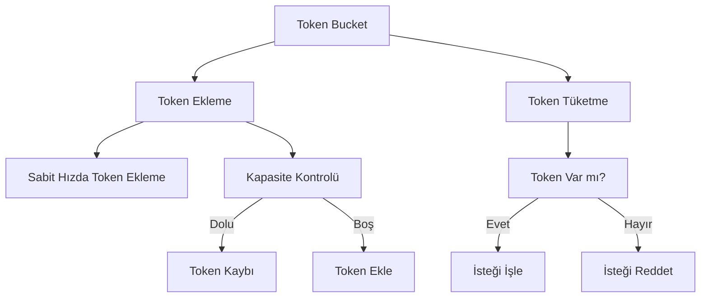
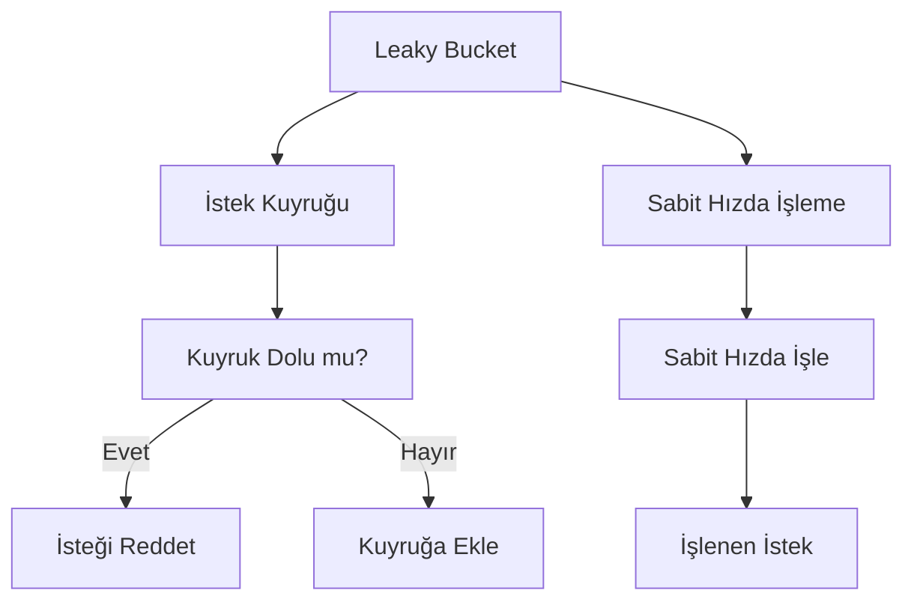
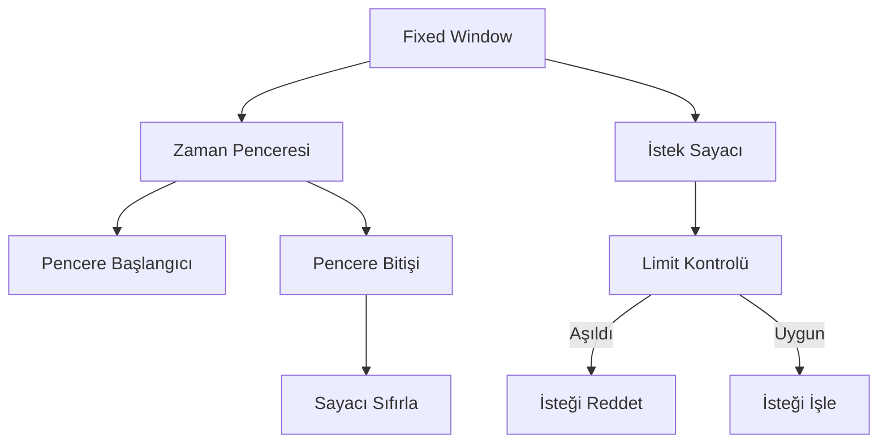
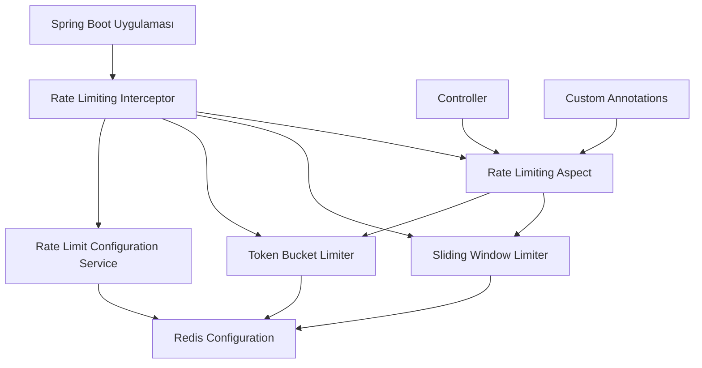

# 5.2. Hız Sınırlama & Kısıtlama

## Hız Sınırlama Stratejileri

### Token Bucket
- **Burst handling**
- **Rate configuration**
- **Token distribution**
- **Overflow handling**



### Leaky Bucket
- **Constant rate processing**
- **Queue management**
- **Overflow handling**
- **Rate smoothing**



### Fixed Window
- **Time-based limits**
- **Request counting**
- **Reset intervals**
- **Simple implementation**



## Throttling Mekanizmaları

### Request Throttling
- **Concurrent request limits**
- **Queue depth monitoring**
- **Rejection policies**
- **Retry mechanisms**

### Resource Throttling
- **CPU/Memory limits**
- **Connection pool limits**
- **Thread pool management**
- **Database connection limits**

## Implementasyon Araçları

### NGINX
- `limit_req_zone`
- `limit_conn_zone`
- Custom Hız Sınırlama
- IP-based limiting

### Kong
- Hız Sınırlama plugin
- Response Hız Sınırlama
- Custom policies
- Cluster-wide limiting

### AWS API Gateway
- Usage plans
- API keys
- Throttling settings
- Burst handling

## Spring Boot Hız Sınırlama Implementation



### Redis-Based Token Bucket Implementation
```java
@Component
@Slf4j
public class RedisTokenBucketRateLimiter {
    
    @Autowired
    private StringRedisTemplate redisTemplate;
    
    @Value("${rate-limiter.default-capacity:100}")
    private int defaultCapacity;
    
    @Value("${rate-limiter.default-tokens-per-second:10}")
    private int defaultTokensPerSecond;
    
    public boolean tryConsume(String key, int tokens) {
        return tryConsume(key, tokens, defaultCapacity, defaultTokensPerSecond);
    }
    
    public boolean tryConsume(String key, int tokens, int capacity, int tokensPerSecond) {
        String script = """
            local key = KEYS[1]
            local capacity = tonumber(ARGV[1])
            local tokens = tonumber(ARGV[2])
            local interval = tonumber(ARGV[3])
            local requested = tonumber(ARGV[4])
            
            local bucket = redis.call('HMGET', key, 'tokens', 'last_refill')
            local current_tokens = tonumber(bucket[1]) or capacity
            local last_refill = tonumber(bucket[2]) or redis.call('TIME')[1]
            
            local now = redis.call('TIME')[1]
            local elapsed = now - last_refill
            
            -- Refill tokens based on elapsed time
            local new_tokens = math.min(capacity, current_tokens + (elapsed * tokens / interval))
            
            if new_tokens >= requested then
                new_tokens = new_tokens - requested
                redis.call('HMSET', key, 'tokens', new_tokens, 'last_refill', now)
                redis.call('EXPIRE', key, interval * 2)
                return 1
            else
                redis.call('HMSET', key, 'tokens', new_tokens, 'last_refill', now)
                redis.call('EXPIRE', key, interval * 2)
                return 0
            end
        """;
        
        List<String> keys = Arrays.asList(key);
        List<String> args = Arrays.asList(
            String.valueOf(capacity),
            String.valueOf(tokensPerSecond),
            "1", // 1 second interval
            String.valueOf(tokens)
        );
        
        Object result = redisTemplate.execute(
            (RedisCallback<Object>) connection -> 
                connection.eval(script.getBytes(), ReturnType.INTEGER,
                    keys.size(), keys.toArray(new String[0]),
                    args.toArray(new String[0]))
        );
        
        return Long.valueOf(1).equals(result);
    }
    
    public RateLimitInfo getRateLimitInfo(String key) {
        return getRateLimitInfo(key, defaultCapacity, defaultTokensPerSecond);
    }
    
    public RateLimitInfo getRateLimitInfo(String key, int capacity, int tokensPerSecond) {
        String script = """
            local key = KEYS[1]
            local capacity = tonumber(ARGV[1])
            local tokens_per_second = tonumber(ARGV[2])
            
            local bucket = redis.call('HMGET', key, 'tokens', 'last_refill')
            local current_tokens = tonumber(bucket[1]) or capacity
            local last_refill = tonumber(bucket[2]) or redis.call('TIME')[1]
            
            local now = redis.call('TIME')[1]
            local elapsed = now - last_refill
            
            local new_tokens = math.min(capacity, current_tokens + (elapsed * tokens_per_second))
            
            return {new_tokens, capacity, now, last_refill}
        """;
        
        List<String> keys = Arrays.asList(key);
        List<String> args = Arrays.asList(
            String.valueOf(capacity),
            String.valueOf(tokensPerSecond)
        );
        
        @SuppressWarnings("unchecked")
        List<Object> result = (List<Object>) redisTemplate.execute(
            (RedisCallback<Object>) connection -> 
                connection.eval(script.getBytes(), ReturnType.MULTI,
                    keys.size(), keys.toArray(new String[0]),
                    args.toArray(new String[0]))
        );
        
        if (result != null && result.size() >= 4) {
            double currentTokens = ((Number) result.get(0)).doubleValue();
            int maxCapacity = ((Number) result.get(1)).intValue();
            long now = ((Number) result.get(2)).longValue();
            long lastRefill = ((Number) result.get(3)).longValue();
            
            return new RateLimitInfo(
                (int) currentTokens,
                maxCapacity,
                tokensPerSecond,
                Instant.ofEpochSecond(now),
                Instant.ofEpochSecond(lastRefill)
            );
        }
        
        return new RateLimitInfo(capacity, capacity, tokensPerSecond, Instant.now(), Instant.now());
    }
}

@Data
@AllArgsConstructor
public class RateLimitInfo {
    private int currentTokens;
    private int capacity;
    private int tokensPerSecond;
    private Instant currentTime;
    private Instant lastRefill;
    
    public int getSecondsUntilRefill() {
        if (currentTokens >= capacity) {
            return 0;
        }
        int tokensNeeded = capacity - currentTokens;
        return (int) Math.ceil((double) tokensNeeded / tokensPerSecond);
    }
}
```

### Sliding Window Rate Limiter
```java
@Component
@Slf4j
public class SlidingWindowRateLimiter {
    
    @Autowired
    private StringRedisTemplate redisTemplate;
    
    public boolean isAllowed(String key, int limit, Duration window) {
        long windowSizeMs = window.toMillis();
        long currentTimeMs = System.currentTimeMillis();
        long windowStart = currentTimeMs - windowSizeMs;
        
        String script = """
            local key = KEYS[1]
            local window_start = tonumber(ARGV[1])
            local current_time = tonumber(ARGV[2])
            local limit = tonumber(ARGV[3])
            
            -- Remove old entries outside the window
            redis.call('ZREMRANGEBYSCORE', key, 0, window_start)
            
            -- Count current requests in the window
            local current_count = redis.call('ZCARD', key)
            
            if current_count < limit then
                -- Add current request
                redis.call('ZADD', key, current_time, current_time)
                redis.call('EXPIRE', key, math.ceil((current_time - window_start) / 1000))
                return {1, current_count + 1, limit}
            else
                return {0, current_count, limit}
            end
        """;
        
        List<String> keys = Arrays.asList(key);
        List<String> args = Arrays.asList(
            String.valueOf(windowStart),
            String.valueOf(currentTimeMs),
            String.valueOf(limit)
        );
        
        @SuppressWarnings("unchecked")
        List<Object> result = (List<Object>) redisTemplate.execute(
            (RedisCallback<Object>) connection -> 
                connection.eval(script.getBytes(), ReturnType.MULTI,
                    keys.size(), keys.toArray(new String[0]),
                    args.toArray(new String[0]))
        );
        
        if (result != null && result.size() >= 3) {
            boolean allowed = Long.valueOf(1).equals(result.get(0));
            long currentCount = ((Number) result.get(1)).longValue();
            long maxLimit = ((Number) result.get(2)).longValue();
            
            log.debug("Rate limit check for key {}: allowed={}, count={}/{}", 
                key, allowed, currentCount, maxLimit);
                
            return allowed;
        }
        
        return false;
    }
    
    public RateLimitStatus getRateLimitStatus(String key, Duration window) {
        long windowSizeMs = window.toMillis();
        long currentTimeMs = System.currentTimeMillis();
        long windowStart = currentTimeMs - windowSizeMs;
        
        String script = """
            local key = KEYS[1]
            local window_start = tonumber(ARGV[1])
            
            -- Remove old entries
            redis.call('ZREMRANGEBYSCORE', key, 0, window_start)
            
            -- Get current count and oldest entry
            local current_count = redis.call('ZCARD', key)
            local oldest_entries = redis.call('ZRANGE', key, 0, 0, 'WITHSCORES')
            
            local oldest_timestamp = nil
            if #oldest_entries > 0 then
                oldest_timestamp = oldest_entries[2]
            end
            
            return {current_count, oldest_timestamp}
        """;
        
        List<String> keys = Arrays.asList(key);
        List<String> args = Arrays.asList(String.valueOf(windowStart));
        
        @SuppressWarnings("unchecked")
        List<Object> result = (List<Object>) redisTemplate.execute(
            (RedisCallback<Object>) connection -> 
                connection.eval(script.getBytes(), ReturnType.MULTI,
                    keys.size(), keys.toArray(new String[0]),
                    args.toArray(new String[0]))
        );
        
        if (result != null && result.size() >= 2) {
            long currentCount = ((Number) result.get(0)).longValue();
            Long oldestTimestamp = result.get(1) != null ? 
                ((Number) result.get(1)).longValue() : null;
            
            return new RateLimitStatus(
                (int) currentCount,
                oldestTimestamp != null ? Instant.ofEpochMilli(oldestTimestamp) : null,
                Instant.ofEpochMilli(currentTimeMs),
                window
            );
        }
        
        return new RateLimitStatus(0, null, Instant.ofEpochMilli(currentTimeMs), window);
    }
}

@Data
@AllArgsConstructor
public class RateLimitStatus {
    private int currentCount;
    private Instant oldestRequest;
    private Instant currentTime;
    private Duration windowSize;
    
    public Instant getWindowResetTime() {
        if (oldestRequest != null) {
            return oldestRequest.plus(windowSize);
        }
        return currentTime.plus(windowSize);
    }
    
    public Duration getTimeUntilReset() {
        Instant resetTime = getWindowResetTime();
        return Duration.between(currentTime, resetTime);
    }
}
```

### Hız Sınırlama Interceptor
```java
@Component
@Order(1)
public class RateLimitingInterceptor implements HandlerInterceptor {
    
    @Autowired
    private RedisTokenBucketRateLimiter tokenBucketLimiter;
    
    @Autowired
    private SlidingWindowRateLimiter slidingWindowLimiter;
    
    @Autowired
    private RateLimitConfigurationService configService;
    
    @Override
    public boolean preHandle(HttpServletRequest request, HttpServletResponse response, 
                           Object handler) throws Exception {
        
        // Skip Hız Sınırlama for health checks
        if (request.getRequestURI().startsWith("/actuator/health")) {
            return true;
        }
        
        String clientId = getClientIdentifier(request);
        String endpoint = getEndpointIdentifier(request);
        
        // Get rate limit configuration
        RateLimitConfig config = configService.getRateLimitConfig(clientId, endpoint);
        
        if (config == null) {
            return true; // No Hız Sınırlama configured
        }
        
        boolean allowed = false;
        RateLimitResult result = null;
        
        switch (config.getStrategy()) {
            case TOKEN_BUCKET:
                allowed = tokenBucketLimiter.tryConsume(
                    "rate_limit:tb:" + clientId + ":" + endpoint,
                    1,
                    config.getCapacity(),
                    config.getTokensPerSecond()
                );
                
                if (!allowed) {
                    RateLimitInfo info = tokenBucketLimiter.getRateLimitInfo(
                        "rate_limit:tb:" + clientId + ":" + endpoint,
                        config.getCapacity(),
                        config.getTokensPerSecond()
                    );
                    result = new RateLimitResult(false, info.getCurrentTokens(), 
                        config.getCapacity(), info.getSecondsUntilRefill());
                }
                break;
                
            case SLIDING_WINDOW:
                allowed = slidingWindowLimiter.isAllowed(
                    "rate_limit:sw:" + clientId + ":" + endpoint,
                    config.getLimit(),
                    config.getWindow()
                );
                
                if (!allowed) {
                    RateLimitStatus status = slidingWindowLimiter.getRateLimitStatus(
                        "rate_limit:sw:" + clientId + ":" + endpoint,
                        config.getWindow()
                    );
                    result = new RateLimitResult(false, status.getCurrentCount(),
                        config.getLimit(), (int) status.getTimeUntilReset().getSeconds());
                }
                break;
        }
        
        if (!allowed) {
            handleRateLimitExceeded(response, result, config);
            return false;
        }
        
        // Add rate limit headers
        addRateLimitHeaders(response, config, clientId, endpoint);
        
        return true;
    }
    
    private String getClientIdentifier(HttpServletRequest request) {
        // Try API key first
        String apiKey = request.getHeader("X-API-Key");
        if (apiKey != null) {
            return "api_key:" + apiKey;
        }
        
        // Try authenticated user
        String userId = request.getHeader("X-User-ID");
        if (userId != null) {
            return "user:" + userId;
        }
        
        // Fall back to IP address
        String clientIp = getClientIpAddress(request);
        return "ip:" + clientIp;
    }
    
    private String getClientIpAddress(HttpServletRequest request) {
        String xForwardedFor = request.getHeader("X-Forwarded-For");
        if (xForwardedFor != null && !xForwardedFor.isEmpty()) {
            return xForwardedFor.split(",")[0].trim();
        }
        
        String xRealIp = request.getHeader("X-Real-IP");
        if (xRealIp != null && !xRealIp.isEmpty()) {
            return xRealIp;
        }
        
        return request.getRemoteAddr();
    }
    
    private String getEndpointIdentifier(HttpServletRequest request) {
        String method = request.getMethod();
        String path = request.getRequestURI();
        
        // Normalize path (remove path parameters, query parameters)
        path = path.replaceAll("/\\d+", "/{id}");
        path = path.replaceAll("\\?.*", "");
        
        return method + ":" + path;
    }
    
    private void handleRateLimitExceeded(HttpServletResponse response, 
                                       RateLimitResult result, 
                                       RateLimitConfig config) throws IOException {
        response.setStatus(HttpStatus.TOO_MANY_REQUESTS.value());
        response.setContentType("application/json");
        response.setHeader("Retry-After", String.valueOf(result.getRetryAfterSeconds()));
        
        RateLimitErrorResponse errorResponse = new RateLimitErrorResponse(
            "Rate limit exceeded",
            "Too many requests. Current: " + result.getCurrentCount() + 
            ", Limit: " + result.getLimit(),
            result.getRetryAfterSeconds(),
            config.getStrategy().name().toLowerCase()
        );
        
        ObjectMapper objectMapper = new ObjectMapper();
        response.getWriter().write(objectMapper.writeValueAsString(errorResponse));
    }
    
    private void addRateLimitHeaders(HttpServletResponse response, 
                                   RateLimitConfig config, 
                                   String clientId, 
                                   String endpoint) {
        try {
            switch (config.getStrategy()) {
                case TOKEN_BUCKET:
                    RateLimitInfo info = tokenBucketLimiter.getRateLimitInfo(
                        "rate_limit:tb:" + clientId + ":" + endpoint,
                        config.getCapacity(),
                        config.getTokensPerSecond()
                    );
                    response.setHeader("X-RateLimit-Limit", String.valueOf(config.getCapacity()));
                    response.setHeader("X-RateLimit-Remaining", String.valueOf(info.getCurrentTokens()));
                    response.setHeader("X-RateLimit-Reset", String.valueOf(info.getSecondsUntilRefill()));
                    break;
                    
                case SLIDING_WINDOW:
                    RateLimitStatus status = slidingWindowLimiter.getRateLimitStatus(
                        "rate_limit:sw:" + clientId + ":" + endpoint,
                        config.getWindow()
                    );
                    response.setHeader("X-RateLimit-Limit", String.valueOf(config.getLimit()));
                    response.setHeader("X-RateLimit-Remaining", 
                        String.valueOf(config.getLimit() - status.getCurrentCount()));
                    response.setHeader("X-RateLimit-Reset", 
                        String.valueOf(status.getWindowResetTime().getEpochSecond()));
                    break;
            }
        } catch (Exception e) {
            log.warn("Failed to add rate limit headers", e);
        }
    }
}

@Data
@AllArgsConstructor
public class RateLimitResult {
    private boolean allowed;
    private int currentCount;
    private int limit;
    private int retryAfterSeconds;
}

@Data
@AllArgsConstructor
public class RateLimitErrorResponse {
    private String error;
    private String message;
    private int retryAfterSeconds;
    private String strategy;
}
```

### Rate Limit Configuration Service
```java
@Service
@Slf4j
public class RateLimitConfigurationService {
    
    @Autowired
    private RedisTemplate<String, Object> redisTemplate;
    
    private final Map<String, RateLimitConfig> defaultConfigs = new HashMap<>();
    
    @PostConstruct
    public void initializeDefaultConfigs() {
        // Default configurations
        defaultConfigs.put("default", new RateLimitConfig(
            RateLimitStrategy.TOKEN_BUCKET, 100, 10, Duration.ofMinutes(1)
        ));
        
        defaultConfigs.put("premium", new RateLimitConfig(
            RateLimitStrategy.TOKEN_BUCKET, 1000, 100, Duration.ofMinutes(1)
        ));
        
        defaultConfigs.put("public", new RateLimitConfig(
            RateLimitStrategy.SLIDING_WINDOW, 50, 0, Duration.ofMinutes(1)
        ));
        
        log.info("Rate limit configurations initialized: {}", defaultConfigs.keySet());
    }
    
    public RateLimitConfig getRateLimitConfig(String clientId, String endpoint) {
        // Try client-specific configuration first
        String clientConfigKey = "rate_limit:config:client:" + clientId;
        RateLimitConfig clientConfig = (RateLimitConfig) redisTemplate.opsForValue().get(clientConfigKey);
        if (clientConfig != null) {
            return clientConfig;
        }
        
        // Try endpoint-specific configuration
        String endpointConfigKey = "rate_limit:config:endpoint:" + endpoint;
        RateLimitConfig endpointConfig = (RateLimitConfig) redisTemplate.opsForValue().get(endpointConfigKey);
        if (endpointConfig != null) {
            return endpointConfig;
        }
        
        // Determine default based on client type
        if (clientId.startsWith("api_key:")) {
            return defaultConfigs.get("premium");
        } else if (clientId.startsWith("user:")) {
            return defaultConfigs.get("default");
        } else {
            return defaultConfigs.get("public");
        }
    }
    
    public void setClientRateLimit(String clientId, RateLimitConfig config) {
        String configKey = "rate_limit:config:client:" + clientId;
        redisTemplate.opsForValue().set(configKey, config, Duration.ofDays(1));
        log.info("Rate limit configuration set for client {}: {}", clientId, config);
    }
    
    public void setEndpointRateLimit(String endpoint, RateLimitConfig config) {
        String configKey = "rate_limit:config:endpoint:" + endpoint;
        redisTemplate.opsForValue().set(configKey, config, Duration.ofDays(1));
        log.info("Rate limit configuration set for endpoint {}: {}", endpoint, config);
    }
    
    public void removeClientRateLimit(String clientId) {
        String configKey = "rate_limit:config:client:" + clientId;
        redisTemplate.delete(configKey);
        log.info("Rate limit configuration removed for client: {}", clientId);
    }
}

@Data
@AllArgsConstructor
@NoArgsConstructor
public class RateLimitConfig implements Serializable {
    private RateLimitStrategy strategy;
    private int capacity; // For token bucket or limit for sliding window
    private int tokensPerSecond; // For token bucket only
    private Duration window; // For sliding window only
    
    // Convenience constructors
    public RateLimitConfig(int limit, Duration window) {
        this(RateLimitStrategy.SLIDING_WINDOW, limit, 0, window);
    }
    
    public RateLimitConfig(int capacity, int tokensPerSecond) {
        this(RateLimitStrategy.TOKEN_BUCKET, capacity, tokensPerSecond, Duration.ofMinutes(1));
    }
    
    public int getLimit() {
        return capacity;
    }
}

public enum RateLimitStrategy {
    TOKEN_BUCKET,
    SLIDING_WINDOW,
    FIXED_WINDOW
}
```

### Custom Hız Sınırlama Annotations
```java
@Target(ElementType.METHOD)
@Retention(RetentionPolicy.RUNTIME)
public @interface RateLimit {
    int value() default 100; // requests per period
    int period() default 60; // period in seconds
    RateLimitStrategy strategy() default RateLimitStrategy.TOKEN_BUCKET;
    String key() default ""; // custom key expression
    String message() default "Rate limit exceeded";
}

@Aspect
@Component
@Slf4j
public class RateLimitingAspect {
    
    @Autowired
    private RedisTokenBucketRateLimiter tokenBucketLimiter;
    
    @Autowired
    private SlidingWindowRateLimiter slidingWindowLimiter;
    
    @Around("@annotation(rateLimit)")
    public Object handleRateLimit(ProceedingJoinPoint joinPoint, RateLimit rateLimit) throws Throwable {
        HttpServletRequest request = getCurrentRequest();
        if (request == null) {
            return joinPoint.proceed();
        }
        
        String key = buildRateLimitKey(joinPoint, rateLimit, request);
        boolean allowed = false;
        
        switch (rateLimit.strategy()) {
            case TOKEN_BUCKET:
                allowed = tokenBucketLimiter.tryConsume(key, 1, rateLimit.value(), 
                    rateLimit.value() / rateLimit.period());
                break;
                
            case SLIDING_WINDOW:
                allowed = slidingWindowLimiter.isAllowed(key, rateLimit.value(), 
                    Duration.ofSeconds(rateLimit.period()));
                break;
        }
        
        if (!allowed) {
            throw new RateLimitExceededException(rateLimit.message());
        }
        
        return joinPoint.proceed();
    }
    
    private String buildRateLimitKey(ProceedingJoinPoint joinPoint, RateLimit rateLimit, 
                                   HttpServletRequest request) {
        if (!rateLimit.key().isEmpty()) {
            // Use SpEL for custom key
            return evaluateSpelExpression(rateLimit.key(), joinPoint, request);
        }
        
        // Default key: method + client identifier
        String methodName = joinPoint.getSignature().getName();
        String clientId = getClientIdentifier(request);
        return "rate_limit:" + methodName + ":" + clientId;
    }
    
    private String evaluateSpelExpression(String expression, ProceedingJoinPoint joinPoint, 
                                        HttpServletRequest request) {
        SpelExpressionParser parser = new SpelExpressionParser();
        Expression exp = parser.parseExpression(expression);
        
        StandardEvaluationContext context = new StandardEvaluationContext();
        context.setVariable("request", request);
        context.setVariable("method", joinPoint.getSignature().getName());
        context.setVariable("args", joinPoint.getArgs());
        
        return exp.getValue(context, String.class);
    }
    
    private HttpServletRequest getCurrentRequest() {
        RequestAttributes requestAttributes = RequestContextHolder.getRequestAttributes();
        if (requestAttributes instanceof ServletRequestAttributes) {
            return ((ServletRequestAttributes) requestAttributes).getRequest();
        }
        return null;
    }
    
    private String getClientIdentifier(HttpServletRequest request) {
        String apiKey = request.getHeader("X-API-Key");
        if (apiKey != null) {
            return "api_key:" + apiKey;
        }
        
        String userId = request.getHeader("X-User-ID");
        if (userId != null) {
            return "user:" + userId;
        }
        
        return "ip:" + request.getRemoteAddr();
    }
}

@ResponseStatus(HttpStatus.TOO_MANY_REQUESTS)
public class RateLimitExceededException extends RuntimeException {
    public RateLimitExceededException(String message) {
        super(message);
    }
}

// Usage example
@RestController
@RequestMapping("/api/users")
public class RateLimitedUserController {
    
    @GetMapping("/{id}")
    @RateLimit(value = 100, period = 60, strategy = RateLimitStrategy.TOKEN_BUCKET)
    public ResponseEntity<User> getUser(@PathVariable Long id) {
        // Method implementation
        return ResponseEntity.ok(userService.findById(id));
    }
    
    @PostMapping
    @RateLimit(value = 10, period = 60, strategy = RateLimitStrategy.SLIDING_WINDOW,
               key = "'create_user:' + #request.getHeader('X-User-ID')")
    public ResponseEntity<User> createUser(@RequestBody UserRequest request) {
        // Method implementation
        return ResponseEntity.status(HttpStatus.CREATED).body(userService.create(request));
    }
}
```

Bu implementation çeşitli Hız Sınırlama stratejilerini Spring Boot ve Redis ile entegre eder, production-ready çözümler sunar.
