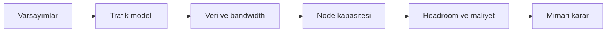

# Back-of-the-Envelope Hesaplama

Back-of-the-envelope hesaplama, eksik bilgiyle hızlı ve makul bir kapasite modeli kurma yöntemidir. Amaç kesin sayı bulmak değil, mimariyi yanlış ölçeğe oturtacak varsayımları erken yakalamaktır.

## Hızlı Karar

| Hesap | Basit formül | Tasarım kararı |
| --- | --- | --- |
| Ortalama RPS | Günlük istek / 86.400 | API ve worker kapasitesi |
| Peak RPS | Ortalama RPS × peak katsayısı | Autoscaling ve buffer |
| Concurrency | RPS × latency saniye | Thread, connection ve worker sayısı |
| Storage | Kullanıcı × kayıt × kayıt boyutu | DB, partition ve retention |
| Bandwidth | RPS × response/request boyutu | CDN, compression ve network |
| Availability | Uptime oranı | Error budget ve failover hedefi |

## Üretim Kontrol Listesi

- Her sayının kaynağı veya varsayımı yazıldı mı?
- Ortalama, peak ve büyüme katsayıları birbirinden ayrıldı mı?
- Binary ve decimal birimler karıştırılmadı mı?
- Tek instance kapasitesi benchmark veya güvenlik payı ile sınırlandı mı?
- Sonuç, latency budget, queue depth ve maliyetle birlikte yorumlandı mı?

## Hesaplama Sırası

1. Kullanıcı, tenant veya cihaz sayısını tahmin et.
2. Günlük aktif oranı ve kullanıcı başına operasyon sayısını varsay.
3. Günlük toplamı saniyeye bölerek ortalama RPS bul.
4. Peak-to-average katsayısı uygula.
5. İstek ve yanıt boyutundan bandwidth hesapla.
6. Veri boyutu, retention, replication ve index overhead ekle.
7. Tek node kapasitesine böl ve headroom bırak.



## Trafik Hesabı

Örnek varsayımlar:

```text
10.000.000 günlük aktif kullanıcı
Kullanıcı başına günde 20 API isteği
Peak katsayısı: 5
```

```text
Günlük istek = 10.000.000 × 20 = 200.000.000
Ortalama RPS = 200.000.000 / 86.400 ≈ 2.315
Peak RPS ≈ 2.315 × 5 = 11.575
```

Bu sonuç API'nin 11.575 RPS'i tek başına taşıması gerektiği anlamına gelmez. CDN hit rate, cache hit rate, queue ile ayrılan işler ve endpoint dağılımı hesaba katılmalıdır.

## Storage ve Bandwidth

```text
Günlük yeni veri = günlük işlem × kayıt boyutu
Toplam storage = günlük veri × retention gün × replication katsayısı
Bandwidth = RPS × ortalama payload boyutu
```

Örneğin 2.000 byte response ve 10.000 peak RPS yaklaşık 20 MB/s uygulama çıkışı üretir. HTTP header, TLS, compression, retry ve replica trafiği için ayrıca pay bırakılır.

Storage hesabında yalnızca ham payload değil; index, metadata, WAL, snapshot, backup ve compaction alanı da dikkate alınır.

## Concurrency ve Little's Law

Little's Law:

```text
L = λ × W
```

- `L`: Sistemde aynı anda bulunan iş sayısı
- `λ`: Throughput, iş/saniye
- `W`: Ortalama sistemde kalma süresi, saniye

10.000 RPS ve 200 ms ortalama latency için:

```text
Concurrency = 10.000 × 0,2 = 2.000 aktif istek
```

Bu sayı thread sayısı değildir; connection pool, event loop, queue ve downstream concurrency limitleri ayrıca modellenir.

## Latency Budget

200 ms hedefi tek bir servise verilmez:

```text
Client/network       40 ms
DNS/TLS/edge          20 ms
Gateway/auth          20 ms
Application           50 ms
Database/cache        50 ms
Headroom              20 ms
Toplam               200 ms
```

Bir downstream çağrısı için 500 ms timeout koymak, toplam hedef 200 ms ise tasarım hatasıdır. Timeout'lar parent latency budget'tan kısa olmalı ve retry bütçesiyle birlikte hesaplanmalıdır.

## Kapasite ve Headroom

Tek instance benchmark sonucu 1.000 RPS ise production kapasitesi doğrudan 1.000 alınmaz. Güvenlik payı, GC, deploy, zone kaybı ve trafik dengesizliği için örneğin %50–70 kullanım hedeflenebilir.

```text
Gerekli instance = peak RPS / (instance kapasitesi × hedef kullanım)
```

Sonuç, en az bir failure domain kaybında da SLO'yu koruyacak şekilde kontrol edilir.

## Sık Hatalar

- Ortalama RPS ile peak trafiği karıştırmak.
- Cache hit rate'i %100 varsaymak.
- Fan-out, retry ve replication trafiğini unutmak.
- Payload boyutunu yalnızca JSON gövdesi olarak saymak.
- Headroom bırakmadan kapasite planlamak.
- Tahmini benchmark yerine kesin gerçek gibi sunmak.

Hesaplama sonucu bir aralık ve hassasiyet notuyla kaydedilmelidir. En çok sonucu değiştiren varsayım ayrıca ölçüm planına dönüştürülür.
