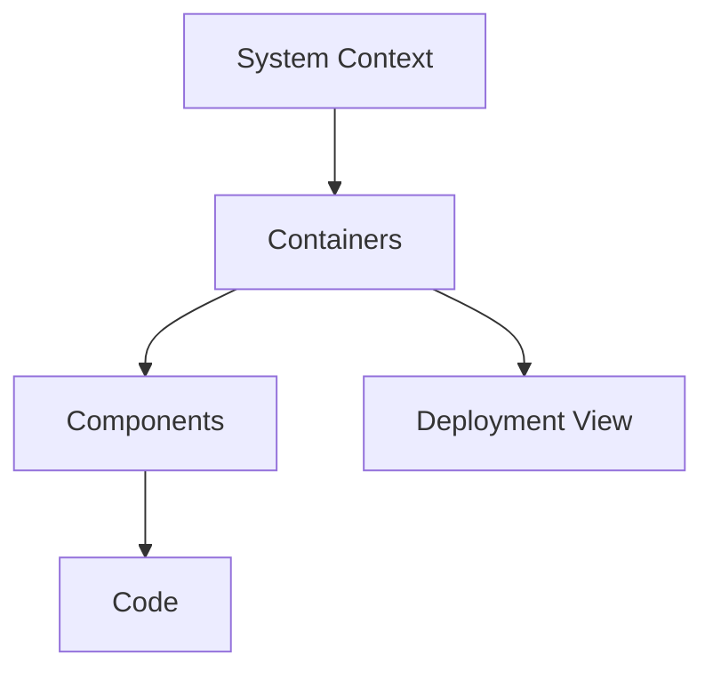

# Gereksinimler, Trade-off ve C4 Modeli

İyi sistem tasarımı, çözümü çizmeden önce problemi ve başarı ölçütünü netleştirir. Gereksinimler; kullanıcı değerini, operasyonel sınırları ve mimari kararların nedenini görünür kılar.

## Hızlı Karar

| Durum | Kullanılacak araç | Çıktı |
| --- | --- | --- |
| Problem belirsiz | Stakeholder interview ve user journey | Problem tanımı ve kapsam |
| Davranış tanımlanacak | Functional requirement | Use case, API veya event sözleşmesi |
| Hedef sınırları belirlenecek | Non-functional requirement | SLI/SLO, latency, kapasite ve güvenlik hedefi |
| Mimari anlatılacak | C4 modeli | Context, container, component, deployment görünümü |
| Alternatifler yarışıyor | Trade-off kaydı | Seçim, reddedilen seçenek ve geri dönüş koşulu |

## Üretim Kontrol Listesi

- Gereksinimlerin sahibi, önceliği ve doğrulama yöntemi belli mi?
- Functional ve non-functional gereksinimler birbirine karıştırılmamış mı?
- Latency, availability, throughput, data retention ve security hedefleri sayısal mı?
- C4 diyagramları aynı sistem sınırını ve isimlendirmeyi kullanıyor mu?
- Trade-off kararı cost, performance, complexity ve failure mode ile açıklanmış mı?

## Functional ve Non-Functional Requirements

**Functional requirement**, sistemin ne yapacağını söyler: “Kullanıcı bir playlist oluşturabilir” veya “Ödeme başarılı olduğunda sipariş olayı yayınlanır.”

**Non-functional requirement**, sistemin bunu hangi kalite ve sınırlarla yapacağını söyler:

| Alan | Örnek |
| --- | --- |
| Latency | API isteklerinin p95'i 200 ms altında |
| Availability | Aylık başarı oranı %99,9 |
| Throughput | Peak saatte 50.000 sipariş |
| Durability | Başarılı ödeme kaybolmamalı |
| Security | Hassas veri şifrelenmiş ve audit edilebilir |
| Operability | Kritik hatalar beş dakika içinde fark edilmeli |
| Compliance | Verinin belirli bölgede tutulması |

Bir NFR ölçülemiyorsa tasarım kararı ve test sonucu da belirsiz kalır.

## Gereksinim Toplama ve Dokümantasyon

Önce şu sorular cevaplanır:

1. Kullanıcı kim, hangi akışı tamamlamak istiyor?
2. Başarı ve başarısızlık nasıl anlaşılacak?
3. Trafik, veri hacmi, büyüme ve peak davranışı nedir?
4. Hangi veri kritik, sahibi kim ve ne kadar saklanacak?
5. Kabul edilebilir gecikme, hata ve tutarlılık nedir?
6. Güvenlik, regülasyon ve operasyon kısıtları nelerdir?

Basit bir gereksinim kaydı şu alanları taşıyabilir:

```text
Problem: Kullanıcı hangi problemi yaşıyor?
Actors: Kullanıcılar, sistemler ve sahipleri
Functional scope: Yapılacak davranışlar
Quality targets: p95, availability, throughput, durability
Data: Entity, source of truth, retention, privacy
Failure behavior: Timeout, retry, duplicate, degradation
Acceptance: Ölçülebilir test ve gözlem koşulu
Open decisions: Varsayım ve karar sahibi
```

## Trade-off Analizi

Her alternatif için aynı sorular sorulur:

| Boyut | Sorulacak soru |
| --- | --- |
| Cost | Altyapı, operasyon ve veri transferi maliyeti nedir? |
| Performance | Hangi latency/throughput hedefini iyileştiriyor? |
| Complexity | Kaç yeni bileşen, sözleşme ve failure mode getiriyor? |
| Consistency | Stale veya duplicate veri kabul ediliyor mu? |
| Operability | Deploy, debug, backup ve incident response nasıl değişiyor? |
| Reversibility | Karar yanlışsa geri dönmek ne kadar zor? |

En ucuz veya en hızlı seçenek otomatik olarak en iyi seçenek değildir. Seçim, gereksinim ağırlıkları ve geri dönüş koşulu ile kaydedilir.

## C4 Modeli

C4, aynı mimariyi farklı yakınlaştırma seviyelerinde anlatır:

1. **Context:** Sistem, kullanıcılar ve dış sistemler.
2. **Container:** Deploy edilen uygulama, database, queue veya worker sınırları.
3. **Component:** Bir container içindeki modül ve sorumluluklar.
4. **Code:** Gerekliyse sınıf veya fonksiyon seviyesindeki ayrıntı.
5. **Deployment:** Node, region, cluster ve ağ yerleşimi.



Her diyagramda kapsam, isimlendirme, ilişkilerin yönü ve veri akışı açık olmalıdır. Container diyagramı component ayrıntısıyla, component diyagramı da tüm sınıflarla doldurulmamalıdır.

## Tasarım Belgesi Sırası

Önerilen sıra: problem ve gereksinimler → trafik/veri varsayımları → context → container → kritik component → veri ve iletişim kararları → failure/observability → trade-off ve rollout.
