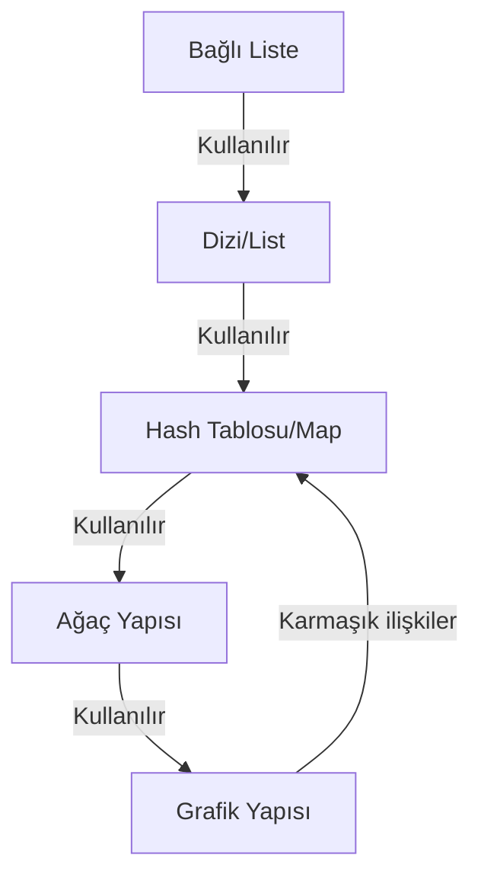
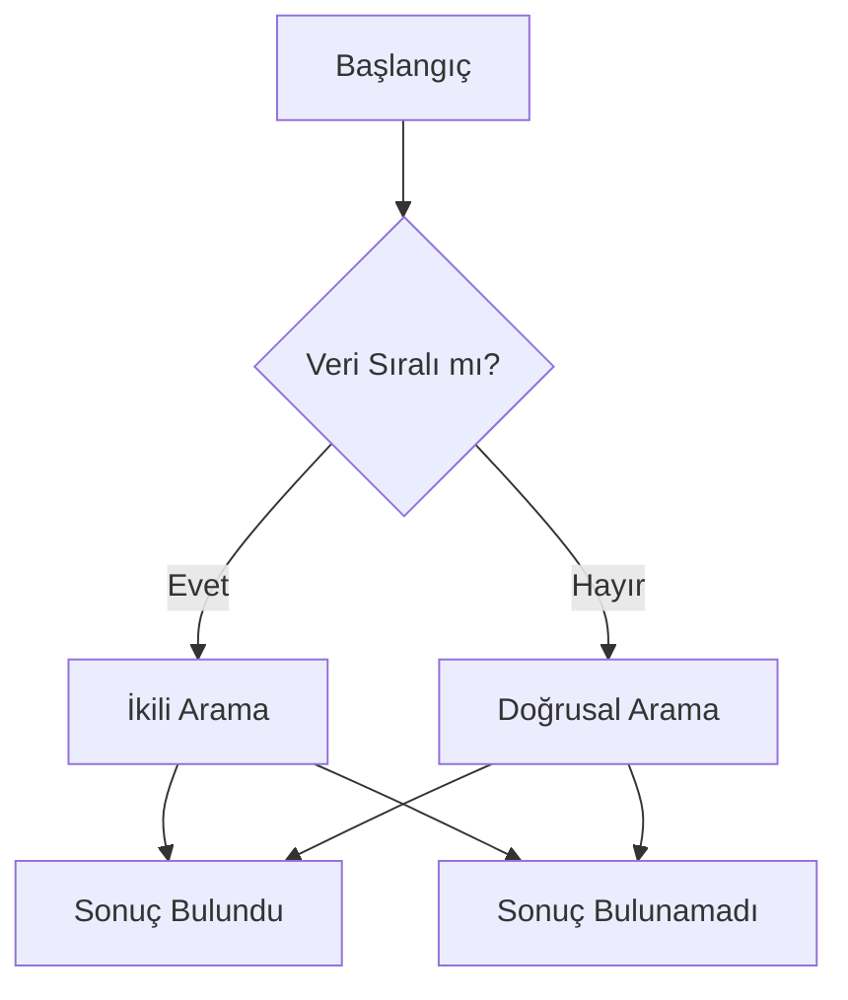
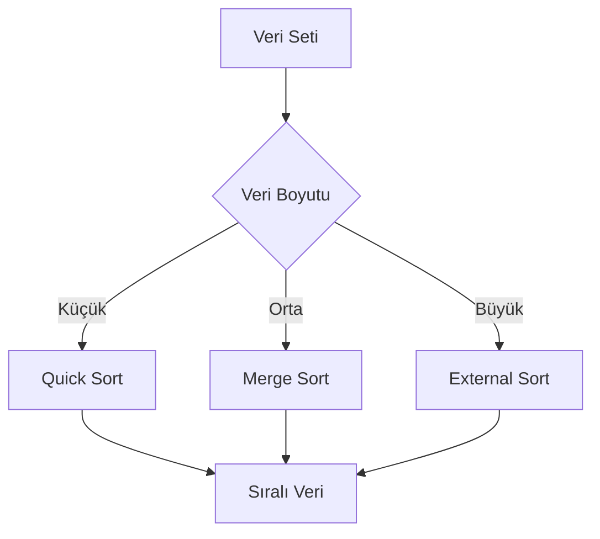
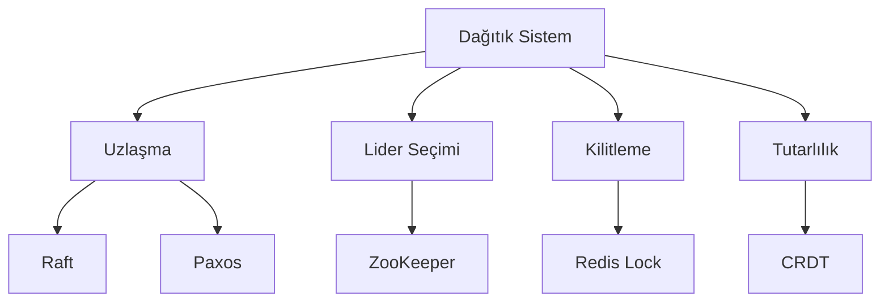

# Temel Veri Yapıları ve Algoritmalar - Sistem Tasarımı Bağlamı

## Veri Yapıları Diyagramı



## Veri Yapıları (Üretim Kullanım Senaryoları)

### Dizi/List
- **Spring Framework'te dependency injection container**
- `@Autowired List<Service>` ile birden fazla bean enjeksiyonu
- Sabit boyutlu ve dinamik diziler
- Bellek yakınlığı avantajları

### Bağlı Liste
- **LRU önbellek uygulaması**
- Mesajlaşma sistemlerinde kuyruk yapıları
- **Spring Cloud Stream mesaj işleme**
- O(1) ekleme/silme

### Hash Tablosu/Map
- **Spring önbellek soyutlamaları**
- Thread-safe işlemler için `ConcurrentHashMap`
- **Redis ile dağıtık önbellekleme**
- Ortalama O(1) arama süresi

### Ağaç Yapıları
- **Veritabanlarında B-tree indeksleri**
- **Otomatik tamamlama için trie yapıları**
- **İş kurallarında karar ağaçları**
- Dengeli ağaçlar ile garanti edilen performans

### Grafik Yapıları
- **Spring IoC container'da bağımlılık grafikleri**
- Sosyal ağlar
- Öneri sistemleri
- **Circuit breaker durum makineleri**

## Algoritmalar (Gerçek Dünya Uygulamaları)

### Arama Algoritmaları


### Sıralama Algoritmaları


### Önbellekleme Algoritmaları
- **LRU/LFU tahliye politikaları**
- **Write-through/write-back stratejileri**
- **Dağıtık önbellek tutarlılığı**
- Önbellek değiştirme politikaları

### Yük Dengeleme
- **Round-robin** algoritması
- **Ağırlıklı round-robin**
- Spring Cloud LoadBalancer'da **en az bağlantı** algoritmaları
- Dağıtık sistemler için tutarlı karma

### Uzlaşma Algoritmaları
- Dağıtık sistemlerde **Raft**
- Dağıtık uzlaşma için **Paxos**
- Mikroservislerde **lider seçimi**
- Bizans hata toleransı

## Performans Sonuçları

### Zaman Karmaşıklığı
- Önbellek sistemlerinde **O(1)** hash aramaları
- Veritabanı indeks aramalarında **O(log n)**
- Sıralama işlemlerinde **O(n log n)**
- Kaçınılması gereken **O(n²)** iç içe döngüler

### Alan Karmaşıklığı
- Bellek verimli veri yapıları
- Çöp toplama (garbage collection) dikkate alınması
- **Heap dışı depolama stratejileri**
- Bellek havuzları ve nesne tekrar kullanımı

### Dağıtık Sistemler
- **CAP teoremi** dengeleri
- **Sonunda tutarlılık** modelleri
- **Bölümlendirme stratejileri**
- Ağ gecikmesi dikkate alınması

## Dağıtık Sistem Desenleri


### Lider Seçimi
- **ZooKeeper** tabanlı lider seçimi
- Servis koordinasyonu için **etcd**
- Özel uygulama desenleri
- Split-brain önleme

### Dağıtık Kilitleme
- Süreli **Redis tabanlı kilitler**
- Tutarlılık için **veritabanı kilitleri**
- İyimser ve kötümser kilitleme
- Deadlock tespiti ve önlenmesi

### Sonunda Tutarlılık
- **CRDT**'ler (Çakışmasız çoğaltılmış veri tipleri)
- Nedensellik takibi için **vektör saatler**
- Çakışma çözümü için **sürüm vektörleri**
- Veri yayılımı için gossip protokolleri

### Hata Tespiti
- Canlılık tespiti için **heartbeat mekanizması**
- Hata tespiti için zaman aşımı stratejileri
- Phi accrual hata dedektörü
- Uyarlanabilir zaman aşımı algoritmaları

## Ölçeklenebilirlik Desenleri

### Yatay Ölçekleme
- **Durumsuz servis** tasarımı
- **Paylaşımsız mimari**
- Mikroservis ayrıştırması
- Veritabanı parçalama stratejileri

### Dikey Ölçekleme
- **Kaynak optimizasyonu** teknikleri
- **JVM ayarları** parametreleri
- Donanım yükseltme stratejileri
- Performans darboğazı tespiti

### Önbellekleme Stratejileri
- **Çok katmanlı önbellek** hiyerarşisi
- **Önbellek geçersiz kılma** stratejileri
- Write-through ve write-behind karşılaştırması
- Önbellek baskını önleme

### Veritabanı Ölçekleme
- Okuma ölçekleme için **okuma kopyaları**
- Yazma ölçekleme için **parçalama**
- **Bölümlendirme** stratejileri
- Parçalar arası sorgu zorlukları

### Mesaj Kuyruğu
- **Asenkron işleme** desenleri
- **Backpressure yönetimi** mekanizmaları
- Mesaj sıralama garantileri
- Dead letter queue yönetimi

## Algoritma Karmaşıklık Analizi

### Yaygın İşlemler
| Veri Yapısı | Erişim | Arama | Ekleme | Silme |
|----------------|--------|--------|-----------|----------|
| Dizi | O(1) | O(n) | O(n) | O(n) |
| Bağlı Liste | O(n) | O(n) | O(1) | O(1) |
| Hash Tablosu | O(1) | O(1) | O(1) | O(1) |
| İkili Ağaç | O(log n) | O(log n) | O(log n) | O(log n) |
| B-Tree | O(log n) | O(log n) | O(log n) | O(log n) |

### Sıralama Algoritmaları
| Algoritma | En İyi Durum | Ortalama Durum | En Kötü Durum | Alan |
|-----------|-----------|--------------|------------|-------|
| Quick Sort | O(n log n) | O(n log n) | O(n²) | O(log n) |
| Merge Sort | O(n log n) | O(n log n) | O(n log n) | O(n) |
| Heap Sort | O(n log n) | O(n log n) | O(n log n) | O(1) |
| Tim Sort | O(n) | O(n log n) | O(n log n) | O(n) |

## Üretim Ortamı Uygulama Örnekleri

### LRU Önbellek Uygulaması
```java
@Component
public class LRUCache<K, V> {
    private final int capacity;
    private final Map<K, Node<K, V>> cache;
    private final Node<K, V> head, tail;
    
    public LRUCache(int capacity) {
        this.capacity = capacity;
        this.cache = new ConcurrentHashMap<>();
        this.head = new Node<>();
        this.tail = new Node<>();
        head.next = tail;
        tail.prev = head;
    }
    
    // Implementation details...
}
```

### Yük Dengeleme için Tutarlı Karma
```java
@Component
public class ConsistentHashLoadBalancer {
    private final SortedMap<Integer, String> circle = new TreeMap<>();
    private final int virtualNodes = 100;
    
    public void addServer(String server) {
        for (int i = 0; i < virtualNodes; i++) {
            circle.put(hash(server + i), server);
        }
    }
    
    public String getServer(String key) {
        int hash = hash(key);
        SortedMap<Integer, String> tailMap = circle.tailMap(hash);
        return tailMap.isEmpty() ? circle.firstEntry().getValue() : tailMap.firstEntry().getValue();
    }
}
```

## Bellek Yönetimi

### JVM Bellek Optimizasyonu
- Heap boyutu ayarı (-Xmx, -Xms)
- Çöp toplama algoritması seçimi
- Büyük veri kümeleri için heap dışı depolama
- Bellek sızıntısı tespiti ve önlenmesi

### Dağıtık Bellek
- Dağıtık önbellek için Redis kümeleme
- Bellek içi veri ızgarası için Hazelcast
- Dağıtık hesaplama için Apache Ignite
- Tutarlılık ve performans dengesi

## Güvenlik Dikkatleri

### Algoritma Güvenliği
- Kriptografik hash fonksiyonları
- Güvenli rastgele sayı üretimi
- Zamanlama saldırısı önleme
- Yan kanal saldırısı azaltma

### Veri Yapısı Güvenliği
- Veri yapıları için giriş doğrulama
- Dizilerde sınır kontrolü
- Hash çakışma saldırısı önleme
- Yerel kodda bellek güvenliği
