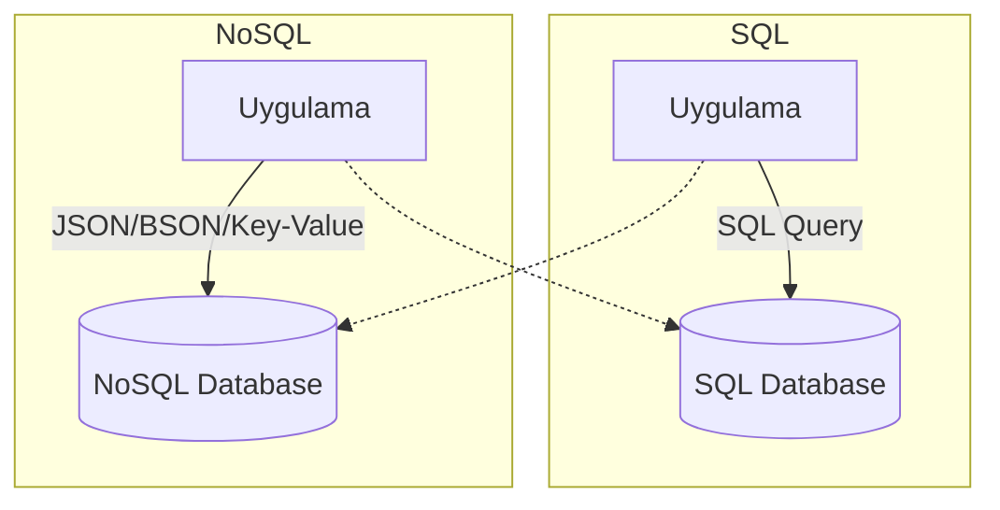
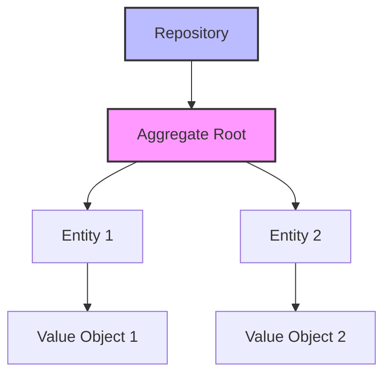
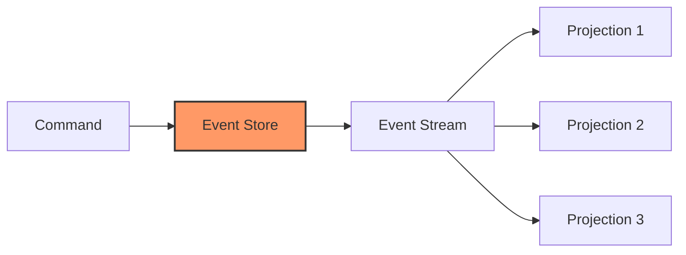
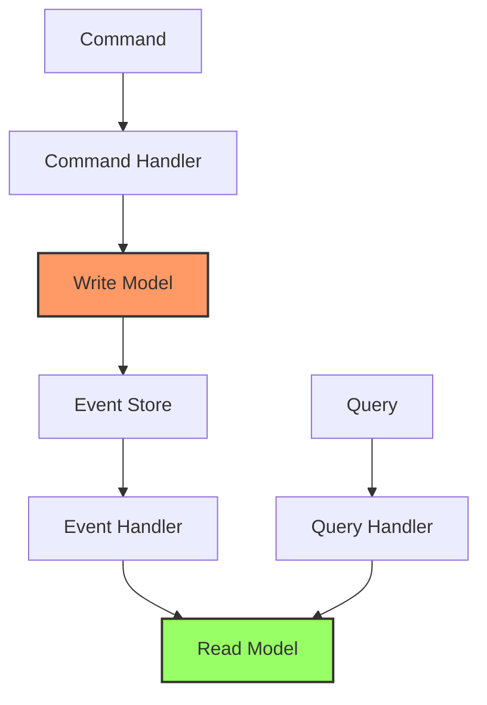
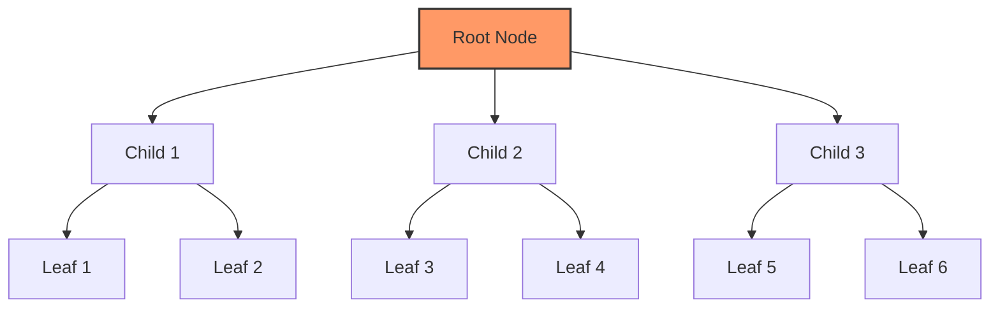
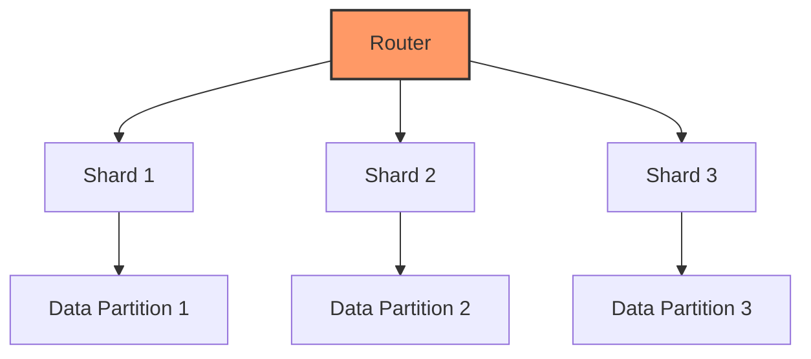
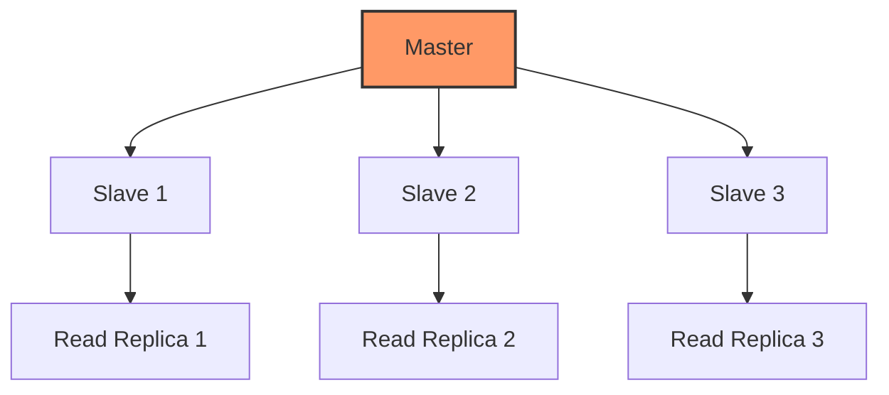
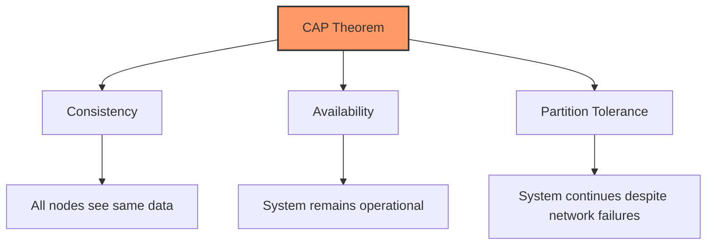

# Temel Veritabanı Kavramları

## Veritabanı Mimarisi Diyagramı

# Temel Veritabanı Konseptleri

## SQL Veritabanları (Spring Boot ile)

### Spring Data JPA
- **Hibernate ORM** üzerinden entity eşleme
- `@Entity`/`@Table` anotasyonları ile şema eşleme

### Repository Deseni
- `JpaRepository<Entity, ID>` ile CRUD işlemleri
- Özel sorgu metotları (`@Query` anotasyonu)

### Transaction Yönetimi
- `@Transactional` anotasyonu ile deklaratif transaction yönetimi
- İzolasyon seviyeleri
- Yayılım davranışları

### Bağlantı Havuzu (Connection Pooling)
- **HikariCP** ile üretime hazır bağlantı havuzu
- Bağlantı sızıntısı tespiti

### Veritabanı Göçleri (Migration)
- **Flyway/Liquibase** ile şema versiyonlama
- Başlangıç göçleri
- Tekrarlanabilir scriptler

### PostgreSQL
- JSON/JSONB desteği
- Gelişmiş indeksleme
- Tam metin arama
- Yatay ölçekleme ile CitusDB

### MySQL
- Master-slave replikasyonu
- InnoDB depolama motoru
- Bölümlendirme stratejileri

## NoSQL Veritabanları (Spring Boot ile)

### MongoDB
- **Spring Data MongoDB** ile doküman tabanlı depolama
- `@Document` anotasyonu
- Tepkisel (reactive) destek

### Redis
- **Spring Data Redis** ile önbellekleme katmanı
- RedisTemplate/StringRedisTemplate
- Yayın/abone mesajlaşma

### Elasticsearch
- **Spring Data Elasticsearch** ile tam metin arama
- Toplu sorgular (aggregations)
- Gerçek zamanlı analizler

### Cassandra
- **Spring Data Cassandra** ile geniş sütunlu veri deposu
- Sonunda tutarlılık (eventual consistency)
- Yüksek erişilebilirlik

## Veritabanı Tasarım Desenleri

### Alan Odaklı Tasarım (Domain-Driven Design)

### Olay Kaynaklı Mimari (Event Sourcing)

### CQRS

### Servis Başına Veritabanı
- Mikroservis deseni
- Veri sahipliği
- Dağıtık transaction zorlukları

## İndeksleme (Indexleme) - Spring Boot Perspektifi

### JPA İndeks Anotasyonları
- `@Index` anotasyonu ile entity seviyesinde indeks tanımları
- `@Table(indexes = {...})` ile bileşik indeksler

### Veritabanına Özgü İndeksler
- **PostgreSQL JSONB indeksleri**
- **MySQL tam metin indeksleri**
- **Coğrafi veriler için uzamsal indeksler**

### Performans İzleme
- Spring Boot Actuator ile yavaş sorgu tespiti
- Hibernate istatistikleri
- Bağlantı havuzu metrikleri

### İndeks Stratejisi
- Kardinalite analizi
- Kapsayıcı indeksler ile sorgu performansı
- Kısmi indeksler ile depolama optimizasyonu

### B-tree Uygulaması

## Normalizasyon ve Denormalizasyon - Spring Boot Bağlamı

### Normalizasyon (3NF/BCNF)
- JPA `@OneToMany`/`@ManyToOne` ilişkileri ile yabancı anahtar kısıtları
- `@JoinColumn` ile ilişki eşleme

### Denormalizasyon Stratejileri
- `@Formula` anotasyonu ile hesaplanmış alanlar
- `@SecondaryTable` ile tablo bölme
- Okuma için optimize görünümler

### Olay Tabanlı Denormalizasyon
- Alan olayları ile türetilmiş veri senkronizasyonu
- Sonunda tutarlılık desenleri

### Materyalize Görünümler
- Veritabanı seviyesinde önceden hesaplanmış toplulaştırmalar
- Spring zamanlanmış görevler ile görünüm güncelleme

### Tercihler
- Yazma karmaşıklığı vs okuma performansı
- Depolama maliyeti vs sorgu hızı
- Tutarlılık vs erişilebilirlik

## Performans Optimizasyonu

### İndeksleme Stratejileri
- **B-tree indeksleri**: Varsayılan indeks türü, eşitlik ve aralık sorguları için iyi
- **Kısmi indeksler**: Sadece belirli satırları indeksler, indeks boyutunu azaltır
- **Bileşik indeksler**: Birden fazla sütun, sıralama önemli
- **Kapsayıcı indeksler**: Tüm gerekli sütunları içerir, tabloya erişimi önler

### Sorgu Optimizasyonu
- **EXPLAIN PLAN** analizi
- **N+1 sorgu problemi** (`@EntityGraph`, `@BatchSize`)

### Önbellekleme Katmanları
- **İkinci seviye önbellek** (Hibernate)
- **Sorgu sonucu önbelleği**
- **Dağıtık önbellek** (Redis)

### Okuma Kopyaları (Read Replicas)
- Master-slave replikasyonu
- Okuma-yazma ayrımı
- Sonunda tutarlılık yönetimi

## Dağıtık Veritabanı Desenleri

### Parçalama Stratejileri (Sharding)

### Replikasyon

### CAP Teoremi

### Veritabanı Federasyonu
- Veritabanları arası sorgular
- Veri sanallaştırma
- Servis odaklı veri erişimi

### Çoklu Veritabanı Kullanımı (Polyglot Persistence)
- Doğru iş için doğru araç
- Hibrit depolama stratejileri
- Veri senkronizasyonu zorlukları

## SQL ve NoSQL Karşılaştırması

| Özellik | SQL | NoSQL |
|---------|-----|-------|
| Şema | Sabit | Esnek |
| ACID | ✅ | Değişken |
| Ölçeklenebilirlik | Dikey | Yatay |
| Karmaşık Sorgular | ✅ | Sınırlı |
| Tutarlılık | Güçlü | Sonunda |
| Olgunluk | Yüksek | Değişken |

## Veritabanı Seçim Kriterleri

### SQL Veritabanı Kullan
- Karmaşık ilişkiler
- ACID uyumluluğu gerekli
- Karmaşık sorgular ve analizler
- Güçlü tutarlılık ihtiyacı
- Olgun ekosistem gereksinimi

### NoSQL Veritabanı Kullan
- Yatay ölçeklenebilirlik ihtiyacı
- Esnek şema gereksinimi
- Yüksek erişilebilirlik önceliği
- Basit sorgu desenleri
- Hızlı geliştirme döngüleri

## İzleme ve Performans

### Veritabanı Metrikleri
- Sorgu yürütme süresi
- Bağlantı havuzu kullanımı
- İndeks kullanımı
- Kilitlenme (lock contention)
- Replikasyon gecikmesi

### Optimizasyon Teknikleri
- Sorgu performans ayarı
- İndeks optimizasyonu
- Bağlantı havuzu ayarı
- Bölümlendirme stratejileri
- Önbellekleme uygulamaları
