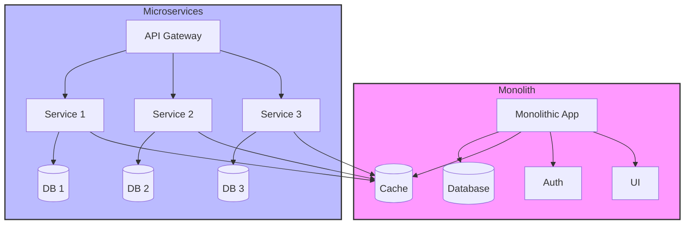

# Monolith vs. Microservice Mimari

## Mimari Karşılaştırması

## Monolitik Mimari (Spring Boot ile)

### Tek Uygulama Yaklaşımı
Spring Boot'ta tüm business logic, veri erişim katmanları ve web katmanları tek bir JAR dosyasında paketlenir.

### Spring Boot Avantajları
- **Auto-configuration** sayesinde hızlı başlangıç
- **Embedded server** (Tomcat/Jetty) ile kolay deployment
- Spring Framework'ün tüm özelliklerinden yararlanma

### Geliştirme Süreci
- Spring Boot starter dependencies ile hızlı konfigürasyon
- Spring Data JPA ile veritabanı işlemleri
- Spring Security ile güvenlik
- Spring Test ile entegrasyon testleri

### Sınırlamalar
- Uygulamanın büyümesiyle beraber startup süresi uzar
- Teknoloji stack değişikliği zor
- Büyük ekiplerde merge conflict'ler artar

### Uygun Senaryolar
- Küçük-orta ölçekli projeler
- Prototype geliştirme
- Az sayıda geliştirici olan ekipler
- Hızlı time-to-market gerektiren projeler

## Mikroservis Mimari (Spring Boot + Spring Cloud ile)

### Servis Odaklı Yaklaşım
Her mikroservis ayrı bir Spring Boot uygulaması olarak geliştirilir, kendi veritabanına sahiptir.

### Spring Cloud Ekosistemi
- **Service Discovery** (Eureka)
- **API Gateway** (Spring Cloud Gateway)
- **Circuit Breaker** (Hystrix/Resilience4j)
- **Distributed Configuration** (Spring Cloud Config)

### İletişim Modelleri
- **REST API'ler** için Spring WebMVC/WebFlux
- **Async messaging** için Spring Cloud Stream + RabbitMQ/Kafka
- **Inter-service communication** için OpenFeign client

### Veri Yönetimi
- Her servis kendi PostgreSQL/MongoDB instance'ı
- Distributed transactions için Saga pattern
- Event sourcing için Spring Cloud Stream

### Deployment
- Her servis ayrı Docker container
- Kubernetes orchestration
- Spring Boot actuator ile health checks
- Git-based deployment pipeline

### Organizasyonel Avantajlar
- **Conway's Law** uyarınca ekip yapısı servis mimarisini yansıtır
- Farklı ekipler farklı technology stack kullanabilir
- Independent release cycles

### Operational Karmaşıklık
- Service mesh (Istio)
- Distributed tracing (Sleuth + Zipkin)
- Centralized logging (ELK stack)
- Monitoring (Micrometer + Prometheus)

## Hybrid Mimari Yaklaşımı

### Strangler Fig Pattern
Monolitik uygulamayı kademeli olarak mikroservislere dönüştürme stratejisi

### Modüler Monolit
- Domain-driven design ile modüler yapı
- İleride mikroservislere geçiş kolaylığı

### Bounded Context
- Her modülün kendi veri modeli ve business logic'i
- Loose coupling

### Shared Kernel
- Ortak kullanılan kodların yönetimi
- Versioning stratejisi

### Anti-Corruption Layer
Eski sistem ile yeni sistem arasında çeviri katmanı

## Karar Kriterleri

| Kriter | Monolitik | Mikroservis |
|--------|-----------|-------------|
| Ekip Büyüklüğü | < 10 kişi | > 10 kişi |
| Deployment Sıklığı | Haftalık/Aylık | Günlük/Saatlik |
| Sistem Karmaşıklığı | Basit-Orta | Karmaşık |
| Performans Gereksinimleri | Orta | Yüksek |
| Operational Deneyim | Sınırlı | İleri düzey |

## Best Practices

### Monolitik için
- Modüler tasarım kullanın
- Dependency injection ile loose coupling
- Comprehensive testing strategy
- CI/CD pipeline kurulumu

### Mikroservis için
- Domain-driven design approach
- API-first development
- Robust monitoring ve observability
- Failure isolation ve resilience patterns
