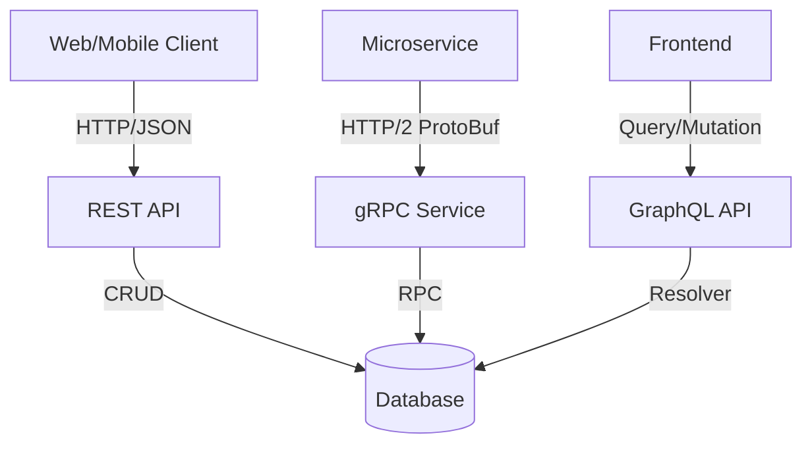
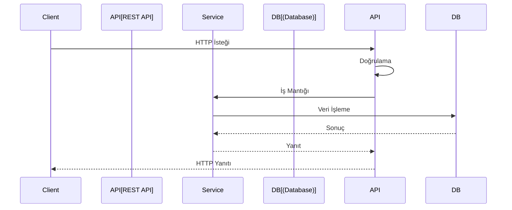
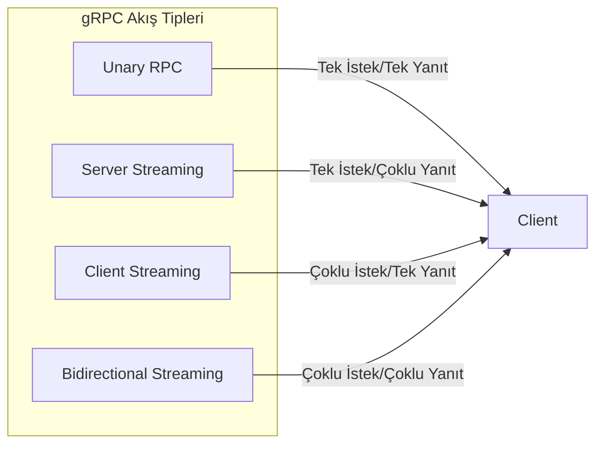
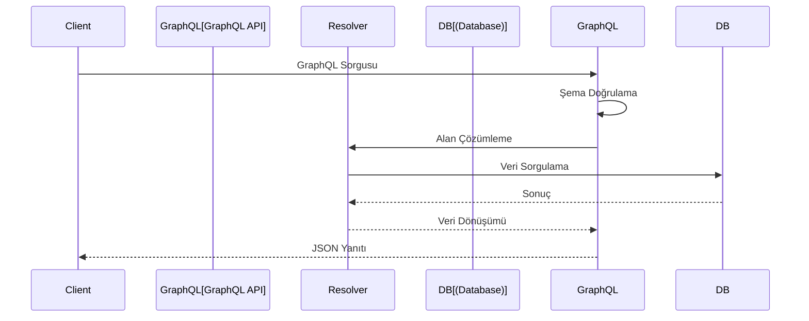
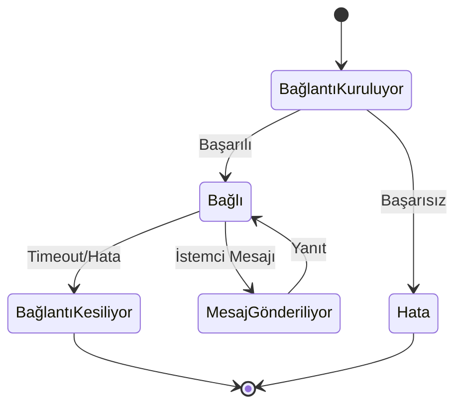
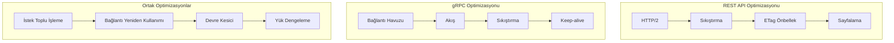

# HTTP, REST, gRPC Protokolleri

## Protokol Etkileşimi



## REST API Yaşam Döngüsü



## gRPC Akış Tipleri



## Spring Boot ile REST API Geliştirme

### Spring WebMVC
- Geleneksel servlet tabanlı yaklaşım
- Bloklanabilir I/O modeli
- Yaygın olarak benimsenmiş ve olgun

### Spring WebFlux
- Reaktif programlama modeli
- Bloklanmayan I/O
- Mono/Flux türleri ile eşzamansız akışlar

### İçerik Müzakeresi
- `@RequestMapping(produces/consumes)` ile MediaType işleme
- JSON/XML/Protocol Buffers desteği

### Doğrulama
- Bean Validation (`@Valid`, `@NotNull`, `@Size`) ile istek doğrulama
- MethodValidationInterceptor ile metod seviyesi doğrulama

### Hata İşleme
- `@ControllerAdvice` ile global istisna işleme
- ResponseEntity ile özel HTTP durum kodları

## REST API En İyi Uygulamalar (Spring Boot ile)

### Richardson Olgunluk Modeli
- **Seviye 0**: HTTP taşıma olarak
- **Seviye 1**: Kaynaklar
- **Seviye 2**: HTTP Fiilleri
- **Seviye 3**: HATEOAS desteği için Spring HATEOAS kütüphanesi

### Sürümleme Stratejileri
- **URL sürümlemesi** (`/api/v1/`)
- **Başlık tabanlı sürümleme**
- **İçerik müzakeresi**

### Dokümantasyon
- **SpringDoc OpenAPI** (Swagger) ile otomatik API dokümantasyonu
- `@Operation` ve `@Schema` açıklamaları

### Güvenlik
- **Spring Security** ile JWT token doğrulama
- **OAuth2 Resource Server** yapılandırması

## gRPC Entegrasyonu (Spring Boot ile)

### gRPC Başlatıcıları
- `spring-boot-starter-grpc-server`/`client` bağımlılıkları

### Protobuf Kod Üretimi
- `protobuf-maven-plugin` ile Java sınıf üretimi

### Servis Uygulaması
- `@GrpcService` açıklaması ile servis uygulaması
- Bloklanabilir/bloklanmayan taslaklar

### Kesiciler
- gRPC kesicileri ile kimlik doğrulama, günlükleme, metrik toplama

### Performans Faydaları
- İkili serileştirme ile %30-50 daha az bant genişliği
- HTTP/2 çoklama
- Çift yönlü akış

## Protokol Seçim Kriterleri

### REST
- ✅ Genel API'ler
- ✅ Tarayıcı tabanlı istemciler
- ✅ İnsan tarafından okunabilir gereksinimler
- ✅ Önbellek desteği
- ❌ Yüksek performans senaryoları

### gRPC
- ✅ Yüksek performanslı dahili servisler
- ✅ Çok dilli mikroservisler
- ✅ Gerçek zamanlı akış gereksinimleri
- ✅ Tür güvenliği
- ❌ Tarayıcı desteği

### GraphQL
- ✅ Karmaşık sorgu gereksinimleri
- ✅ Mobil istemciler ile bant genişliği optimizasyonu
- ✅ Ön uç odaklı geliştirme
- ❌ Önbellek karmaşıklığı

## GraphQL Entegrasyonu

### Spring GraphQL
- Şema öncelikli yaklaşım
- Tür tanımları

### DataFetcher
- Özel çözümleyici uygulamaları
- N+1 problem çözümü

### Toplu İşleme ve Önbellek
- DataLoader deseni
- Alan seviyesi önbellekleme

### Güvenlik
- Alan seviyesi yetkilendirme
- Derinlik sınırlama

### Performans İzleme
- Sorgu karmaşıklığı analizi
- Yürütme süresi takibi

## WebSocket ve Sunucu Gönderilen Olaylar

### Spring WebSocket
- STOMP protokolü
- Mesaj aracısı entegrasyonu

### Gerçek Zamanlı Güncellemeler
- Yayın/abone deseni
- Konu tabanlı mesajlaşma

### Bağlantı Yönetimi
- Kalp atışı mekanizması
- Yeniden bağlanma stratejisi

### Ölçeklenebilirlik
- WebSocket kümeleme
- Yapışkan oturumlar

### Güvenlik
- CSRF koruması
- Kaynak doğrulama

## Protokol Karşılaştırması

| Özellik | REST | gRPC | GraphQL |
|---------|------|------|---------|
| Performans | Orta | Yüksek | Orta |
| Tarayıcı Desteği | ✅ | ❌ | ✅ |
| Akış | ❌ | ✅ | ✅ |
| Tür Güvenliği | ❌ | ✅ | ✅ |
| Önbellekleme | ✅ | ❌ | Karmaşık |
| Öğrenme Eğrisi | Düşük | Orta | Yüksek |

## Uygulama Örnekleri

### REST Uç Noktası
```java
@RestController
@RequestMapping("/api/v1/users")
public class UserController {
    
    @GetMapping("/{id}")
    public ResponseEntity<User> getUser(@PathVariable Long id) {
        User user = userService.findById(id);
        return ResponseEntity.ok(user);
    }
    
    @PostMapping
    public ResponseEntity<User> createUser(@Valid @RequestBody CreateUserRequest request) {
        User user = userService.create(request);
        return ResponseEntity.status(CREATED).body(user);
    }
}
```

### gRPC Servisi
```java
@GrpcService
public class UserGrpcService extends UserServiceGrpc.UserServiceImplBase {
    
    @Override
    public void getUser(GetUserRequest request, StreamObserver<UserResponse> responseObserver) {
        User user = userService.findById(request.getId());
        UserResponse response = UserResponse.newBuilder()
            .setUser(convertToProto(user))
            .build();
        
        responseObserver.onNext(response);
        responseObserver.onCompleted();
    }
}
```

## Performans Optimizasyonu

### REST API Optimizasyonu
- HTTP/2 desteği
- Yanıt sıkıştırma
- ETag önbellekleme
- Sayfalama
- Alan seçimi

### gRPC Optimizasyonu
- Bağlantı havuzu
- Büyük veri kümeleri için akış
- Sıkıştırma algoritmaları
- Canlı tutma ayarları

### Ortak Optimizasyonlar
- İstek toplu işleme
- Bağlantı yeniden kullanımı
- Devre kesici deseni
- Yük dengeleme
- Sağlık kontrolleri

## GraphQL Sorgu Akışı



## WebSocket Bağlantı Yaşam Döngüsü



## Performans Optimizasyonu Akışı



