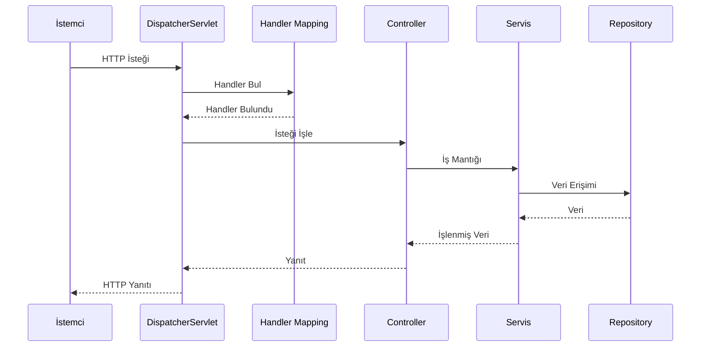
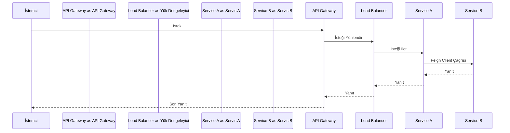
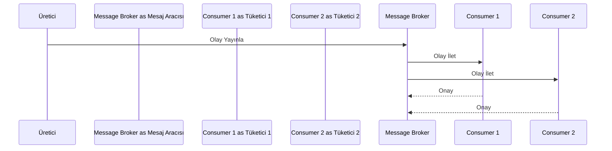
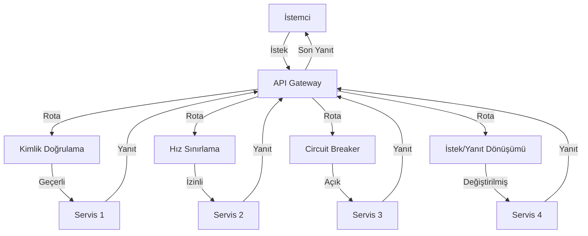
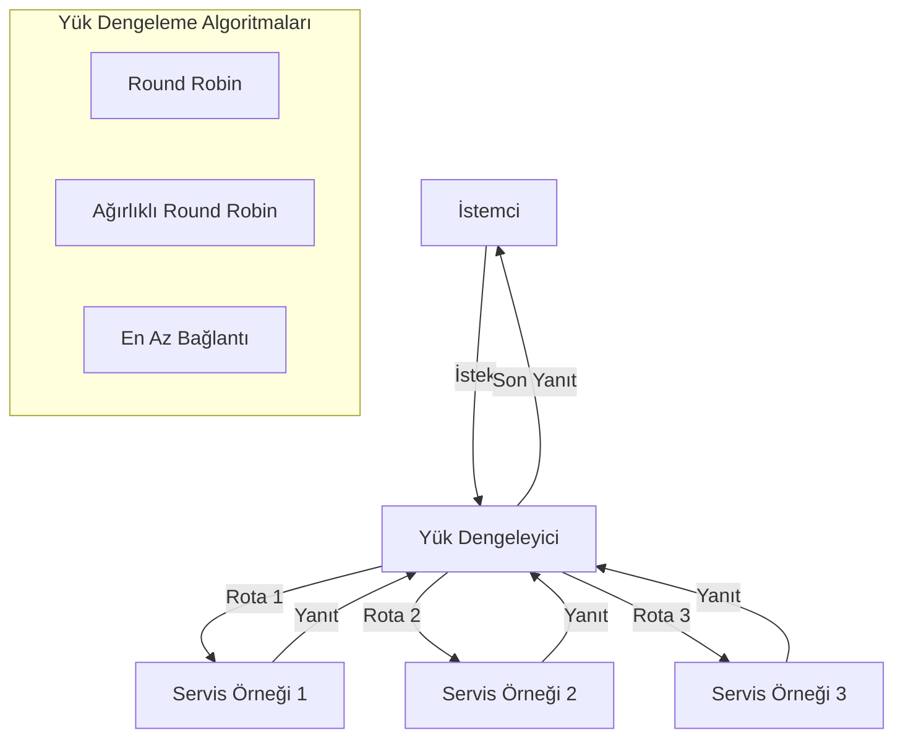
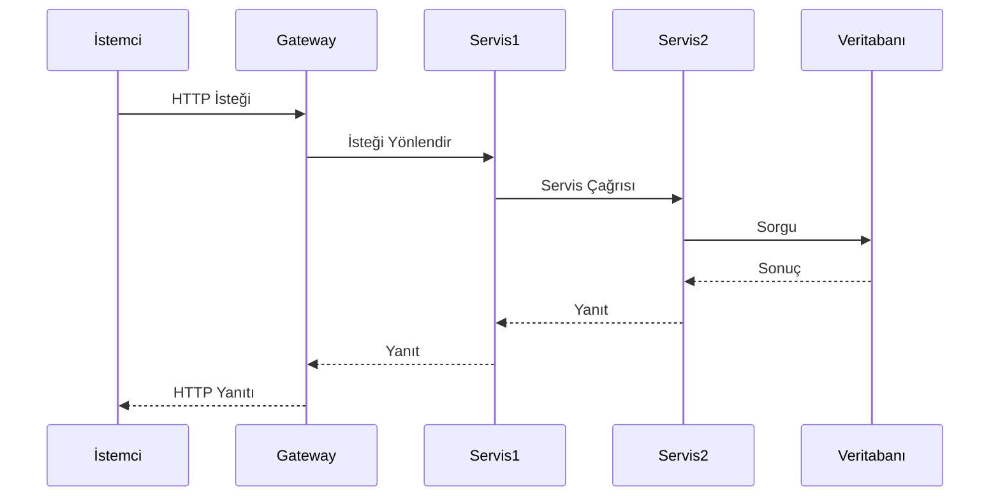
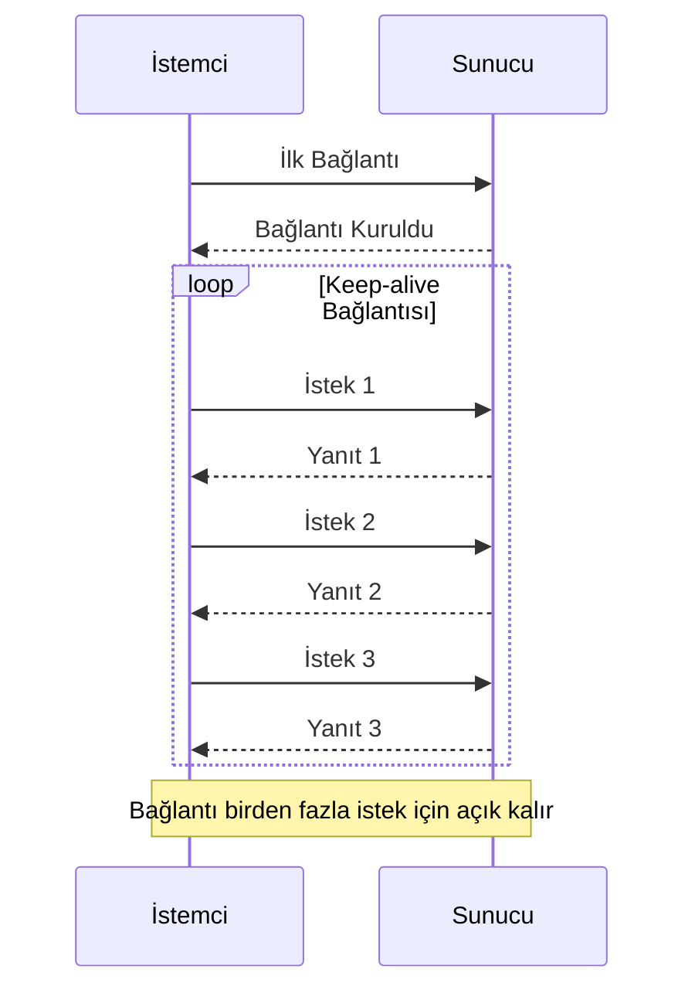

# Request-Response Model (İstek-Yanıt Modeli)

## Spring Boot'ta Request-Response Yaşam Döngüsü

### DispatcherServlet
Spring MVC'nin kalbi, gelen HTTP isteklerini ilgili controller'lara yönlendirir.

### Handler Mapping
URL kalıplarını (`@RequestMapping`, `@GetMapping`) controller metodlarına eşler.

### Controller Katmanı
- `@RestController` ile RESTful uç noktalar
- `@RequestBody`/`@ResponseBody` ile JSON serialization/deserialization

### Servis Katmanı
- `@Service` annotation ile iş mantığı
- `@Transactional` ile transaction yönetimi

### Repository Katmanı
- Spring Data JPA ile ORM eşleme
- `@Repository` ile veri erişim katmanı

## Mikroservislerde Servisler Arası İletişim

### Senkron İletişim
- **OpenFeign client** ile service-to-service HTTP çağrıları
- **Yük dengeleme** için Ribbon/Spring Cloud LoadBalancer

### Asenkron İletişim
- **Spring Cloud Stream** ile mesaj odaklı mimari
- **RabbitMQ/Apache Kafka** entegrasyonu

### Olay Odaklı Mimari
- **Domain olayları** ile gevşek bağlantı
- **Eventual consistency** için event sourcing kalıbı

### Timeout ve Yeniden Deneme
- `@Retryable` annotation ile otomatik yeniden deneme
- **Circuit breaker kalıbı** ile hata toleransı

## Performans Değerlendirmeleri

### Bağlantı Havuzu
- **HikariCP** ile veritabanı bağlantı havuzu
- **Apache HttpClient** ile HTTP bağlantı havuzu

### Önbellekleme
- **Spring Cache abstraction** (`@Cacheable`) ile Redis/Hazelcast entegrasyonu

### Asenkron İşleme
- `@Async` annotation ile engellenmeyen işlemler
- **CompletableFuture** ile asenkron programlama

## API Gateway Kalıbı

### Spring Cloud Gateway
- Rota tanımları
- Koşullar
- Filtreler

### Hız Sınırlama
- Redis tabanlı hız sınırlama
- Token bucket algoritması

### Circuit Breaking
- Resilience4j entegrasyonu
- Fallback mekanizmaları

### İstek/Yanıt Dönüşümü
- Header manipülasyonu
- Body dönüşümü

### Güvenlik
- JWT doğrulama
- OAuth2 entegrasyonu
- API anahtarı yönetimi

## Yük Dengeleme Stratejileri

### İstemci Tarafı Yük Dengeleme
- Spring Cloud LoadBalancer
- Ribbon

### Sunucu Tarafı Yük Dengeleme
- Nginx
- HAProxy
- AWS ALB

### Sağlık Kontrolleri
- Spring Boot Actuator
- Özel sağlık göstergeleri

### Servis Keşfi Entegrasyonu
- Eureka
- Consul
- Kubernetes servis keşfi

## İstek Yaşam Döngüsü Örneği

## Performans Optimizasyonu

### İstek Optimizasyonu
- Keep-alive bağlantıları
- HTTP/2 multiplexing
- İstek gruplandırma
- Sıkıştırma (gzip)

### Yanıt Optimizasyonu
- Yanıt önbellekleme
- Sayfalama
- Alan filtreleme
- Veri sıkıştırma

### Hata Yönetimi
- Circuit breaker kalıbı
- Yeniden deneme mekanizmaları
- Zarif bozulma
- Fallback yanıtları

## İzleme ve Gözlemlenebilirlik

### İstek İzleme
- Dağıtık izleme
- Korelasyon ID'leri
- İstek zamanlaması
- Hata takibi

### Metrik Toplama
- İstek sayısı
- Yanıt süresi
- Hata oranı
- İş hacmi

### Günlükleme Stratejisi
- Yapılandırılmış günlükleme
- Günlük toplama
- İstek/yanıt günlükleme
- Güvenlik olayları
