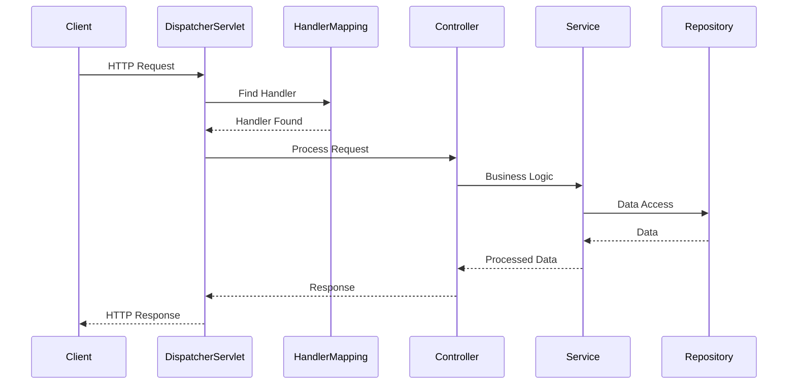
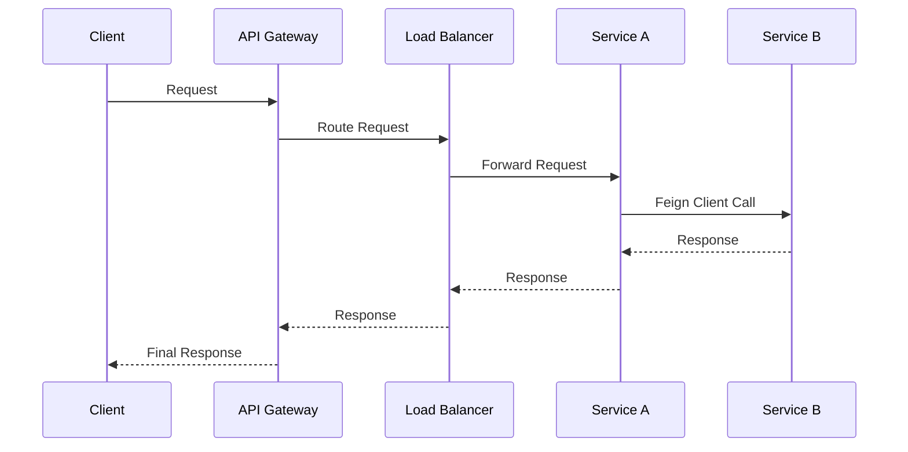
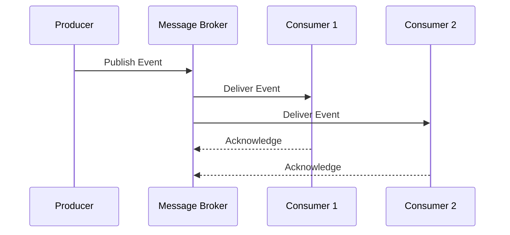
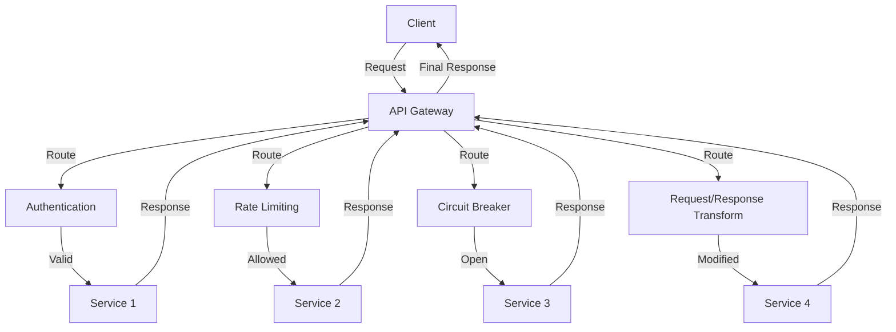
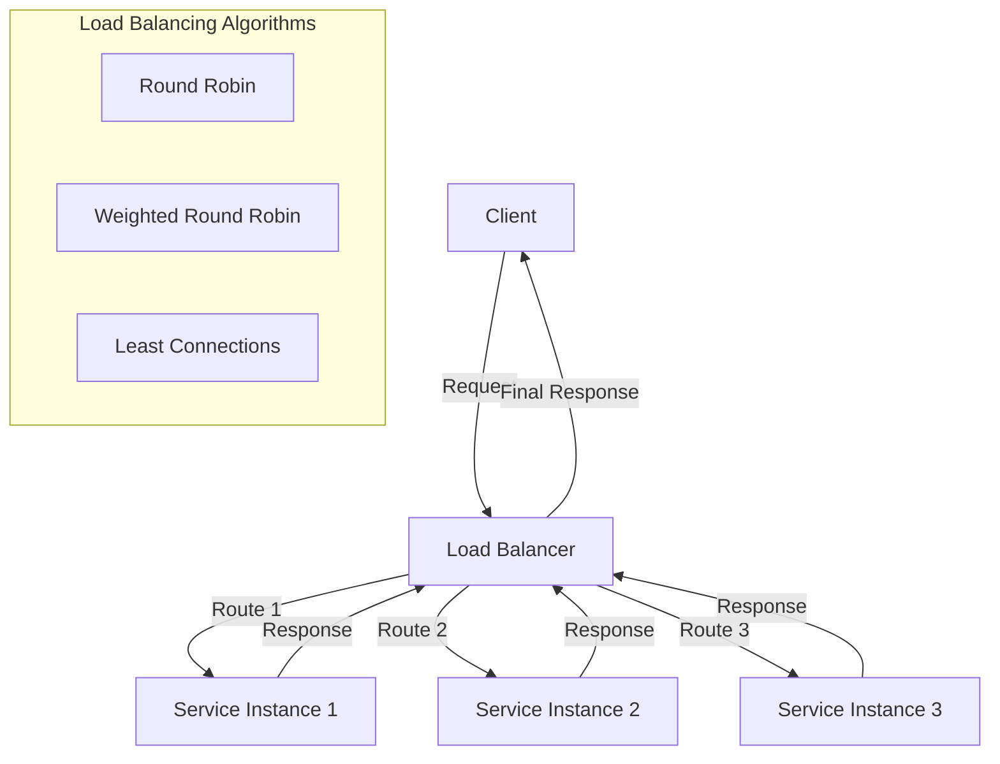
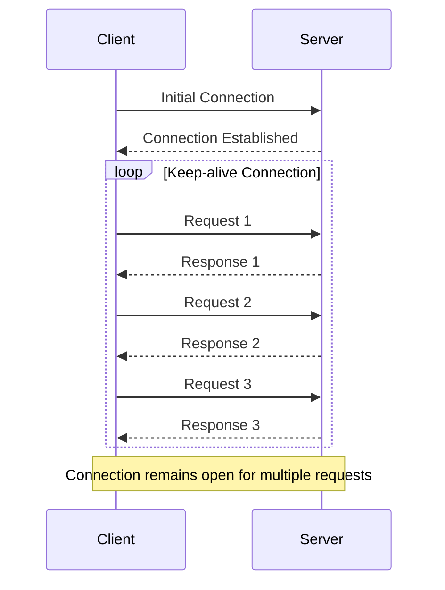

# İstek/Yanıt Döngüsü (Request–Response Model)

## Spring Boot'ta Request-Response Lifecycle

### DispatcherServlet
Spring MVC'nin kalbi, gelen HTTP isteklerini ilgili controller'lara yönlendirir.

### Handler Mapping
URL pattern'lerini (`@RequestMapping`, `@GetMapping`) controller method'larına map eder.

### Controller Layer
- `@RestController` ile RESTful endpoint'ler
- `@RequestBody`/`@ResponseBody` ile JSON serialization/deserialization

### Service Layer
- `@Service` annotation ile business logic
- `@Transactional` ile transaction yönetimi

### Repository Layer
- Spring Data JPA ile ORM mapping
- `@Repository` ile veri erişim katmanı

## Mikroservislerde Inter-Service Communication

### Synchronous Communication
- **OpenFeign client** ile service-to-service HTTP calls
- **Load balancing** için Ribbon/Spring Cloud LoadBalancer

### Asynchronous Communication
- **Spring Cloud Stream** ile message-driven architecture
- **RabbitMQ/Apache Kafka** entegrasyonu

### Event-Driven Architecture
- **Domain events** ile loose coupling
- **Eventual consistency** için event sourcing pattern

### Timeout & Retry
- `@Retryable` annotation ile automatic retry
- **Circuit breaker pattern** ile fault tolerance

## Performance Considerations

### Connection Pooling
- **HikariCP** ile database connection pooling
- **Apache HttpClient** ile HTTP connection pooling

### Caching
- **Spring Cache abstraction** (`@Cacheable`) ile Redis/Hazelcast entegrasyonu

### Async Processing
- `@Async` annotation ile non-blocking operations
- **CompletableFuture** ile async programming

## API Gateway Pattern

### Spring Cloud Gateway
- Route definitions
- Predicates
- Filters

### Rate Limiting
- Redis-based rate limiting
- Token bucket algorithm

### Circuit Breaking
- Resilience4j integration
- Fallback mechanisms

### Request/Response Transformation
- Header manipulation
- Body transformation

### Security
- JWT validation
- OAuth2 integration
- API key management

## Load Balancing Strategies

### Client-side Load Balancing
- Spring Cloud LoadBalancer
- Ribbon

### Server-side Load Balancing
- Nginx
- HAProxy
- AWS ALB

### Health Checks
- Spring Boot Actuator
- Custom health indicators

### Service Discovery Integration
- Eureka
- Consul
- Kubernetes service discovery

## Request Lifecycle Örneği

## Performance Optimization

### Request Optimization
- Keep-alive connections
- HTTP/2 multiplexing
- Request batching
- Compression (gzip)

### Response Optimization
- Response caching
- Pagination
- Field filtering
- Data compression

### Error Handling
- Circuit breaker pattern
- Retry mechanisms
- Graceful degradation
- Fallback responses

## Monitoring & Observability

### Request Tracing
- Distributed tracing
- Correlation IDs
- Request timing
- Error tracking

### Metrics Collection
- Request count
- Response time
- Error rate
- Throughput

### Logging Strategy
- Structured logging
- Log aggregation
- Request/response logging
- Security events
