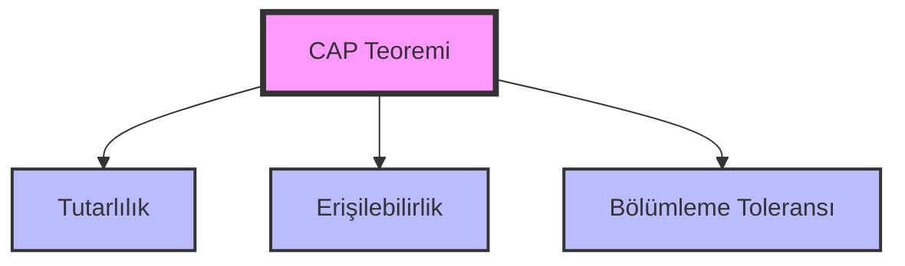
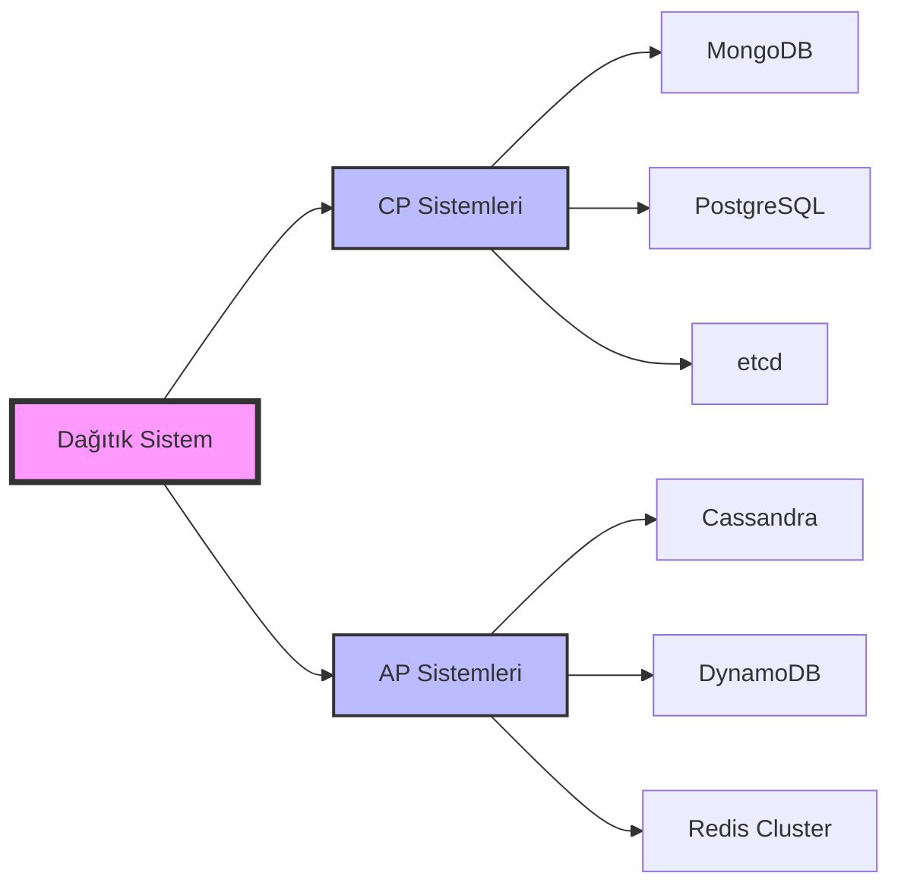
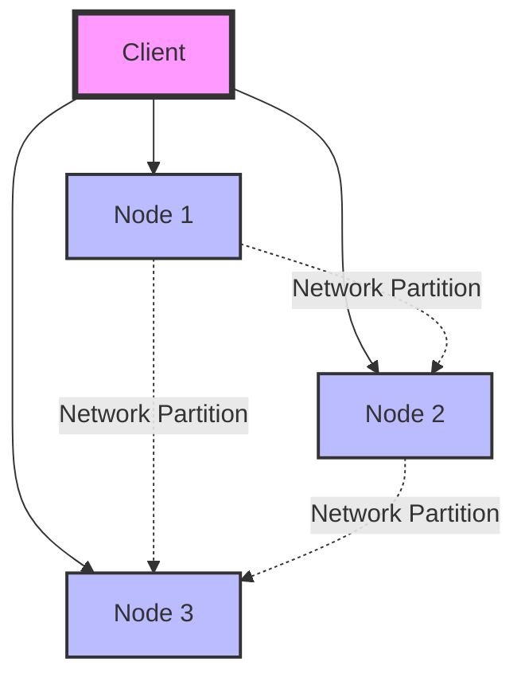

# 4.2. CAP Teoremi

## Tanım
Dağıtık sistemlerde aynı anda sadece iki özellik sağlanabilir:

### 1. Tutarlılık (Consistency)
- Tüm düğümler aynı veriyi görür
- Atomik işlemler
- Doğrusallık (Linearizability)
- Sıralı tutarlılık (Sequential consistency)

### 2. Erişilebilirlik (Availability)
- Her istek yanıt alır
- Zaman aşımı yok
- Hata yanıtı yok
- Her zaman yanıt verir

### 3. Bölümleme Toleransı (Partition Tolerance)
- Ağ bölünmesi durumunda çalışmaya devam eder
- Split-brain yönetimi
- Ağ hatası kurtarma
- Coğrafi dağıtım

## CAP Teoremi Diyagramları

### CAP Üçgeni


### CP vs AP Sistemleri


### Ağ Bölünmesi Senaryosu


## Uygulama Örnekleri

### CP Sistemleri

#### MongoDB
- Replica set yapılandırması
- Yazma onay seviyeleri
- Okuma tercih modları
- Parçalama stratejisi

##### Spring Boot MongoDB CP Uygulaması
```java
@Configuration
public class MongoDBCPConfig {
    
    @Bean
    public MongoClient mongoClient() {
        MongoClientSettings settings = MongoClientSettings.builder()
            .applyConnectionString(new ConnectionString(
                "mongodb://localhost:27017,localhost:27018,localhost:27019/mydb?replicaSet=rs0"
            ))
            // CP Configuration: Strong consistency over availability
            .readPreference(ReadPreference.primary()) // Always read from primary
            .writeConcern(WriteConcern.MAJORITY.withWTimeout(10000, TimeUnit.MILLISECONDS))
            .readConcern(ReadConcern.MAJORITY) // Majority read concern
            .build();
            
        return MongoClients.create(settings);
    }
    
    @Bean
    public MongoTransactionManager transactionManager(MongoDatabaseFactory dbFactory) {
        return new MongoTransactionManager(dbFactory);
    }
}

@Service
@Transactional
public class ConsistentOrderService {
    
    @Autowired
    private MongoTemplate mongoTemplate;
    
    @Transactional(rollbackFor = Exception.class)
    public Order createOrder(OrderRequest request) {
        // Strong consistency - use transactions
        Order order = new Order(request);
        
        // Inventory check with strong consistency
        Product product = mongoTemplate.findById(request.getProductId(), Product.class);
        if (product == null) {
            throw new ProductNotFoundException("Product not found");
        }
        
        if (product.getStock() < request.getQuantity()) {
            throw new InsufficientStockException("Not enough stock");
        }
        
        // Update stock atomically
        Query productQuery = Query.query(Criteria.where("id").is(request.getProductId()));
        Update stockUpdate = new Update().inc("stock", -request.getQuantity());
        
        UpdateResult result = mongoTemplate.updateFirst(productQuery, stockUpdate, Product.class);
        if (result.getModifiedCount() == 0) {
            throw new ConcurrentUpdateException("Failed to update stock");
        }
        
        // Save order
        return mongoTemplate.save(order);
    }
    
    @Transactional(readOnly = true)
    public Order getOrder(String orderId) {
        // Strong consistency read
        return mongoTemplate.findById(orderId, Order.class);
    }
}
```

#### PostgreSQL
- Senkron replikasyon
- İki aşamalı onay (two-phase commit)
- Seri hale getirilebilir izolasyon
- Dağıtık işlemler

##### Spring Boot PostgreSQL CP Uygulaması
```java
@Configuration
@EnableTransactionManagement
public class PostgreSQLCPConfig {
    
    @Primary
    @Bean("primaryDataSource")
    @ConfigurationProperties("spring.datasource.primary")
    public DataSource primaryDataSource() {
        HikariConfig config = new HikariConfig();
        config.setJdbcUrl("jdbc:postgresql://localhost:5432/primary");
        config.setUsername("user");
        config.setPassword("password");
        
        // CP System configuration
        config.setAutoCommit(false);
        config.setTransactionIsolation("TRANSACTION_SERIALIZABLE");
        config.setMaximumPoolSize(10);
        config.setConnectionTimeout(30000);
        config.setLeakDetectionThreshold(60000);
        
        return new HikariDataSource(config);
    }
    
    @Bean("secondaryDataSource")
    @ConfigurationProperties("spring.datasource.secondary")
    public DataSource secondaryDataSource() {
        HikariConfig config = new HikariConfig();
        config.setJdbcUrl("jdbc:postgresql://localhost:5433/secondary");
        config.setUsername("user");
        config.setPassword("password");
        
        // Secondary for read-only operations
        config.setReadOnly(true);
        config.setMaximumPoolSize(5);
        
        return new HikariDataSource(config);
    }
    
    @Bean
    public PlatformTransactionManager transactionManager(@Qualifier("primaryDataSource") DataSource dataSource) {
        return new DataSourceTransactionManager(dataSource);
    }
}

@Service
public class ConsistentBankingService {
    
    @Autowired
    @Qualifier("primaryDataSource")
    private DataSource primaryDataSource;
    
    @Transactional(isolation = Isolation.SERIALIZABLE, rollbackFor = Exception.class)
    public TransferResult transferFunds(Long fromAccountId, Long toAccountId, BigDecimal amount) {
        try (Connection connection = primaryDataSource.getConnection()) {
            connection.setAutoCommit(false);
            
            try {
                // Pessimistic locking for strong consistency
                PreparedStatement lockStmt = connection.prepareStatement(
                    "SELECT balance FROM accounts WHERE id IN (?, ?) FOR UPDATE"
                );
                lockStmt.setLong(1, fromAccountId);
                lockStmt.setLong(2, toAccountId);
                
                ResultSet rs = lockStmt.executeQuery();
                
                Map<Long, BigDecimal> balances = new HashMap<>();
                while (rs.next()) {
                    balances.put(rs.getLong("id"), rs.getBigDecimal("balance"));
                }
                
                BigDecimal fromBalance = balances.get(fromAccountId);
                if (fromBalance == null || fromBalance.compareTo(amount) < 0) {
                    connection.rollback();
                    return TransferResult.failed("Insufficient funds");
                }
                
                // Update balances atomically
                PreparedStatement updateStmt = connection.prepareStatement(
                    "UPDATE accounts SET balance = balance + ? WHERE id = ?"
                );
                
                // Debit from source
                updateStmt.setBigDecimal(1, amount.negate());
                updateStmt.setLong(2, fromAccountId);
                updateStmt.executeUpdate();
                
                // Credit to destination
                updateStmt.setBigDecimal(1, amount);
                updateStmt.setLong(2, toAccountId);
                updateStmt.executeUpdate();
                
                connection.commit();
                return TransferResult.success("Transfer completed");
                
            } catch (Exception e) {
                connection.rollback();
                throw e;
            }
        } catch (SQLException e) {
            throw new DatabaseException("Transfer failed", e);
        }
    }
}
```

#### etcd
- Raft uzlaşma algoritması
- Güçlü tutarlılık
- Lider seçimi
- Atomik işlemler

##### Spring Boot etcd Entegrasyonu
```java
@Configuration
public class EtcdCPConfig {
    
    @Bean
    public EtcdClient etcdClient() {
        return Client.builder()
            .endpoints("http://localhost:2379", "http://localhost:2380", "http://localhost:2381")
            .build();
    }
}

@Service
public class EtcdConsistentConfigService {
    
    @Autowired
    private EtcdClient etcdClient;
    
    public void setConfig(String key, String value) {
        try {
            KV kvClient = etcdClient.getKVClient();
            
            // Strong consistency write
            CompletableFuture<PutResponse> putFuture = kvClient.put(
                ByteSequence.from(key, StandardCharsets.UTF_8),
                ByteSequence.from(value, StandardCharsets.UTF_8)
            );
            
            PutResponse response = putFuture.get(10, TimeUnit.SECONDS);
            log.info("Config updated successfully, revision: {}", response.getHeader().getRevision());
            
        } catch (Exception e) {
            throw new ConfigurationException("Failed to update configuration", e);
        }
    }
    
    public String getConfig(String key) {
        try {
            KV kvClient = etcdClient.getKVClient();
            
            CompletableFuture<GetResponse> getFuture = kvClient.get(
                ByteSequence.from(key, StandardCharsets.UTF_8)
            );
            
            GetResponse response = getFuture.get(5, TimeUnit.SECONDS);
            
            if (response.getCount() > 0) {
                return response.getKvs().get(0).getValue().toString(StandardCharsets.UTF_8);
            }
            
            return null;
            
        } catch (Exception e) {
            throw new ConfigurationException("Failed to get configuration", e);
        }
    }
    
    // Distributed lock implementation
    public boolean acquireDistributedLock(String lockKey, long ttlSeconds) {
        try {
            Lease leaseClient = etcdClient.getLeaseClient();
            Lock lockClient = etcdClient.getLockClient();
            
            // Create lease
            long leaseId = leaseClient.grant(ttlSeconds).get().getID();
            
            // Acquire lock
            CompletableFuture<LockResponse> lockFuture = lockClient.lock(
                ByteSequence.from(lockKey, StandardCharsets.UTF_8), leaseId
            );
            
            LockResponse lockResponse = lockFuture.get(ttlSeconds, TimeUnit.SECONDS);
            return lockResponse != null;
            
        } catch (Exception e) {
            log.error("Failed to acquire distributed lock: {}", lockKey, e);
            return false;
        }
    }
}
```

### AP Sistemleri

#### Cassandra
- Ayarlanabilir tutarlılık seviyeleri
- Hinted handoff
- Okuma onarımı (read repair)
- Anti-entropy

##### Spring Boot Cassandra AP Uygulaması
```java
@Configuration
public class CassandraAPConfig {
    
    @Bean
    public CqlSession cqlSession() {
        return CqlSession.builder()
            .addContactPoint(new InetSocketAddress("localhost", 9042))
            .addContactPoint(new InetSocketAddress("localhost", 9043))
            .addContactPoint(new InetSocketAddress("localhost", 9044))
            .withLocalDatacenter("datacenter1")
            // AP Configuration: Availability over consistency
            .withDefaultConsistencyLevel(DefaultConsistencyLevel.ONE) // Fast writes
            .build();
    }
    
    @Bean
    public CassandraTemplate cassandraTemplate(CqlSession session) {
        return new CassandraTemplate(session);
    }
}

@Service
public class AvailableBlogService {
    
    @Autowired
    private CassandraTemplate cassandraTemplate;
    
    public void publishPost(BlogPost post) {
        // High availability write (eventual consistency)
        try {
            cassandraTemplate.insert(post);
            log.info("Post published successfully: {}", post.getId());
        } catch (Exception e) {
            // Even if some nodes fail, operation can succeed
            log.warn("Some nodes failed during post publication: {}", e.getMessage());
        }
    }
    
    public List<BlogPost> getRecentPosts(int limit) {
        // Available reads (may not be completely consistent)
        String cql = "SELECT * FROM blog_posts ORDER BY created_at DESC LIMIT ?";
        
        try {
            return cassandraTemplate.select(cql, BlogPost.class, limit);
        } catch (Exception e) {
            log.error("Failed to get recent posts", e);
            // Return empty list to maintain availability
            return Collections.emptyList();
        }
    }
    
    // Eventual consistency - async update
    @Async
    public void updatePostViewCount(UUID postId) {
        try {
            String cql = "UPDATE blog_posts SET view_count = view_count + 1 WHERE id = ?";
            cassandraTemplate.execute(cql, postId);
        } catch (Exception e) {
            log.error("Failed to update view count for post: {}", postId, e);
            // Don't fail the main operation
        }
    }
}
```

#### DynamoDB
- Sonunda tutarlı okuma
- Koşullu yazma
- Atomik sayaçlar
- Global tablolar

##### Spring Boot DynamoDB AP Uygulaması
```java
@Configuration
public class DynamoDBAP Config {
    
    @Bean
    public DynamoDbClient dynamoDbClient() {
        return DynamoDbClient.builder()
            .region(Region.US_EAST_1)
            .credentialsProvider(DefaultCredentialsProvider.create())
            .build();
    }
    
    @Bean
    public DynamoDbEnhancedClient enhancedClient(DynamoDbClient dynamoDbClient) {
        return DynamoDbEnhancedClient.builder()
            .dynamoDbClient(dynamoDbClient)
            .build();
    }
}

@Service
public class AvailableUserService {
    
    @Autowired
    private DynamoDbEnhancedClient enhancedClient;
    
    private DynamoDbTable<User> userTable;
    
    @PostConstruct
    public void init() {
        userTable = enhancedClient.table("users", TableSchema.fromBean(User.class));
    }
    
    public void saveUser(User user) {
        try {
            // High availability write
            userTable.putItem(user);
            log.info("User saved successfully: {}", user.getId());
        } catch (Exception e) {
            log.error("Failed to save user, but service remains available", e);
            // Could implement retry or queue for later processing
        }
    }
    
    public User getUser(String userId) {
        try {
            // Eventually consistent read (default)
            Key key = Key.builder().partitionValue(userId).build();
            return userTable.getItem(key);
        } catch (Exception e) {
            log.error("Failed to get user: {}", userId, e);
            // Return cached version or default user to maintain availability
            return getCachedUserOrDefault(userId);
        }
    }
    
    public User getUserConsistent(String userId) {
        try {
            // Strongly consistent read (lower availability)
            Key key = Key.builder().partitionValue(userId).build();
            GetItemEnhancedRequest request = GetItemEnhancedRequest.builder()
                .key(key)
                .consistentRead(true)
                .build();
            return userTable.getItem(request);
        } catch (Exception e) {
            log.error("Failed to get user with strong consistency: {}", userId, e);
            // Fallback to eventually consistent read
            return getUser(userId);
        }
    }
    
    private User getCachedUserOrDefault(String userId) {
        // Implementation for cached or default user
        return new User(userId, "Unknown", "unknown@example.com");
    }
}
```

#### Redis
- Asenkron replikasyon
- Redis Cluster
- Sentinel modu
- Yayın/abone mesajlaşma

##### Spring Boot Redis AP Uygulaması
```java
@Configuration
public class RedisAPConfig {
    
    @Bean
    public LettuceConnectionFactory redisConnectionFactory() {
        // Redis Cluster for high availability
        RedisClusterConfiguration clusterConfig = new RedisClusterConfiguration();
        clusterConfig.clusterNode("localhost", 7000);
        clusterConfig.clusterNode("localhost", 7001);
        clusterConfig.clusterNode("localhost", 7002);
        clusterConfig.clusterNode("localhost", 7003);
        clusterConfig.clusterNode("localhost", 7004);
        clusterConfig.clusterNode("localhost", 7005);
        
        LettuceClientConfiguration clientConfig = LettuceClientConfiguration.builder()
            .commandTimeout(Duration.ofSeconds(2))
            .build();
            
        return new LettuceConnectionFactory(clusterConfig, clientConfig);
    }
    
    @Bean
    public RedisTemplate<String, Object> redisTemplate() {
        RedisTemplate<String, Object> template = new RedisTemplate<>();
        template.setConnectionFactory(redisConnectionFactory());
        template.setDefaultSerializer(new GenericJackson2JsonRedisSerializer());
        return template;
    }
}

@Service
public class AvailableCacheService {
    
    @Autowired
    private RedisTemplate<String, Object> redisTemplate;
    
    public void cacheUser(String userId, User user) {
        try {
            // Asynchronous write for high availability
            redisTemplate.opsForValue().set("user:" + userId, user, Duration.ofMinutes(30));
        } catch (Exception e) {
            log.warn("Failed to cache user, but operation continues: {}", userId, e);
            // Service remains available even if cache fails
        }
    }
    
    public User getCachedUser(String userId) {
        try {
            return (User) redisTemplate.opsForValue().get("user:" + userId);
        } catch (Exception e) {
            log.warn("Cache read failed, falling back to database: {}", userId, e);
            return null; // Let caller handle fallback
        }
    }
    
    // Pub/Sub for eventual consistency
    public void publishUserUpdate(String userId, User user) {
        try {
            UserUpdateMessage message = new UserUpdateMessage(userId, user, Instant.now());
            redisTemplate.convertAndSend("user.updates", message);
        } catch (Exception e) {
            log.error("Failed to publish user update, but operation continues", e);
        }
    }
    
    @RedisListener("user.updates")
    public void handleUserUpdate(UserUpdateMessage message) {
        try {
            // Update local cache or other systems
            processUserUpdate(message);
        } catch (Exception e) {
            log.error("Failed to process user update message", e);
            // Could implement retry or dead letter queue
        }
    }
    
    private void processUserUpdate(UserUpdateMessage message) {
        // Process the user update for eventual consistency
        log.info("Processing user update: {}", message.getUserId());
    }
}

@Component
public class RedisMessageListener implements MessageListener {
    
    @Override
    public void onMessage(Message message, byte[] pattern) {
        try {
            String messageBody = new String(message.getBody());
            log.info("Received message: {}", messageBody);
            // Process message for eventual consistency
        } catch (Exception e) {
            log.error("Failed to process Redis message", e);
        }
    }
}
```

## CAP Teoremi Trade-off'ları

### CP vs AP Seçimi
```java
@Service
public class AdaptiveConsistencyService {
    
    @Autowired
    private MongoTemplate stronglyConsistentStore; // CP
    
    @Autowired
    private CassandraTemplate highlyAvailableStore; // AP
    
    @Autowired
    private CircuitBreaker circuitBreaker;
    
    public void saveData(DataEntity entity, boolean requireStrongConsistency) {
        if (requireStrongConsistency) {
            saveWithStrongConsistency(entity);
        } else {
            saveWithHighAvailability(entity);
        }
    }
    
    private void saveWithStrongConsistency(DataEntity entity) {
        try {
            // CP system - MongoDB with strong consistency
            stronglyConsistentStore.save(entity);
        } catch (Exception e) {
            log.error("Strong consistency save failed", e);
            // Could fallback to AP system if acceptable
            if (circuitBreaker.getState() == CircuitBreaker.State.OPEN) {
                saveWithHighAvailability(entity);
            } else {
                throw e;
            }
        }
    }
    
    private void saveWithHighAvailability(DataEntity entity) {
        try {
            // AP system - Cassandra with high availability
            highlyAvailableStore.insert(entity);
        } catch (Exception e) {
            log.error("High availability save failed", e);
            // Could implement retry queue or local storage
            throw e;
        }
    }
}
```

CAP teoremi, dağıtık sistem tasarımında kritik kararlar almanızı sağlar. Her uygulama için doğru dengeyi (trade-off) seçmek önemlidir.
