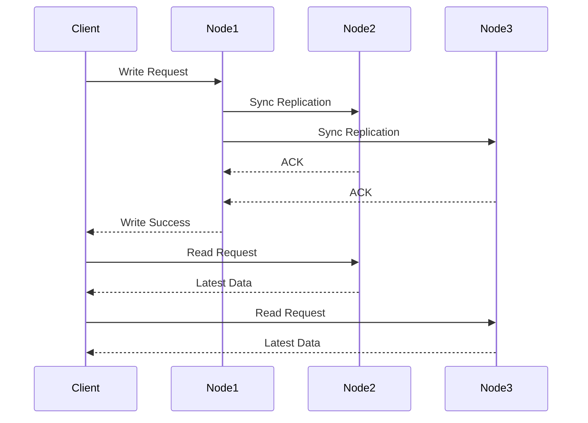
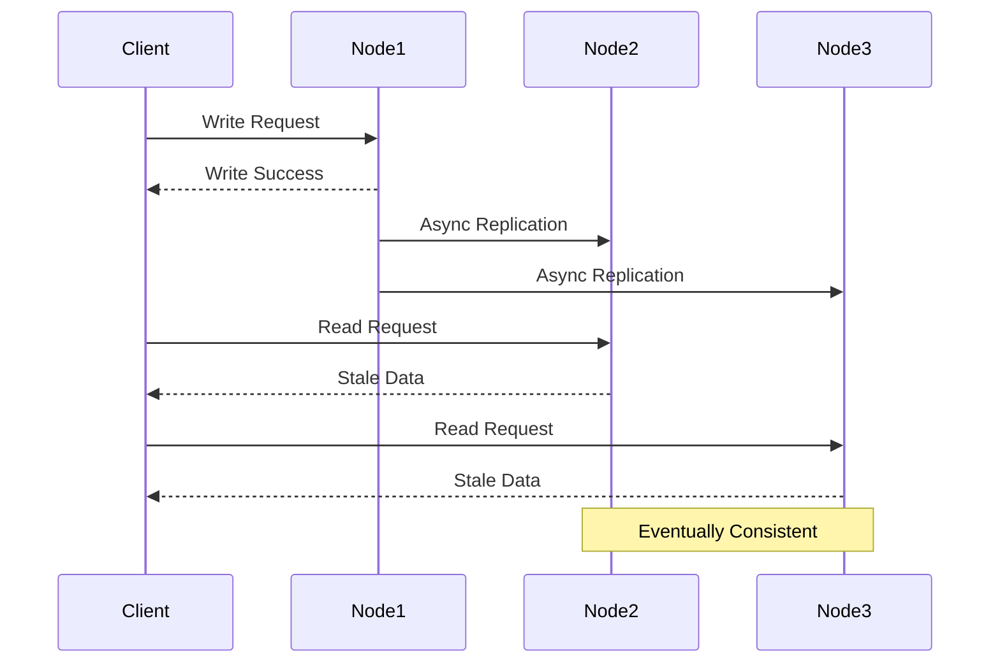

# 4.1. Strong vs Eventual Consistency

## Strong Consistency (Kesin Tutarlılık)

### Temel Özellikler
- Her okuma işlemi, en son yazılan veriyi döndürür
- Linearizability garantisi sağlar
- Sıralı işlem yürütme (sequential execution)
- Atomic işlemler



### Kullanım Senaryoları
- Finansal işlemler
- Kullanıcı kimlik doğrulama
- Kritik veri yönetimi
- Distributed locking

### Implementasyon Örnekleri
- **RDBMS**: ACID transactions
- **ZooKeeper**: Atomic operations
- **etcd**: Strong consistency guarantees
- **Consul**: Consistent reads

### Spring Boot Strong Consistency Implementation

#### Database Transaction Management
```java
@Configuration
@EnableTransactionManagement
public class StrongConsistencyConfig {
    
    @Bean
    public PlatformTransactionManager transactionManager(DataSource dataSource) {
        return new DataSourceTransactionManager(dataSource);
    }
    
    @Bean
    public DataSource dataSource() {
        HikariConfig config = new HikariConfig();
        config.setJdbcUrl("jdbc:postgresql://localhost:5432/strongdb");
        config.setUsername("user");
        config.setPassword("password");
        
        // Strong consistency için connection ayarları
        config.setAutoCommit(false);
        config.setTransactionIsolation("TRANSACTION_SERIALIZABLE");
        config.setMaximumPoolSize(10);
        config.setConnectionTimeout(30000);
        
        return new HikariDataSource(config);
    }
}
```

#### Financial Transaction Service
```java
@Service
@Transactional(isolation = Isolation.SERIALIZABLE)
public class BankTransactionService {
    
    @Autowired
    private AccountRepository accountRepository;
    
    @Autowired
    private TransactionHistoryRepository transactionHistoryRepository;
    
    @Transactional(rollbackFor = Exception.class)
    public TransferResult transferMoney(Long fromAccountId, Long toAccountId, 
                                       BigDecimal amount) {
        
        // Strong consistency garantisi için pessimistic locking
        Account fromAccount = accountRepository.findByIdWithLock(fromAccountId);
        Account toAccount = accountRepository.findByIdWithLock(toAccountId);
        
        if (fromAccount == null || toAccount == null) {
            throw new AccountNotFoundException("Account not found");
        }
        
        if (fromAccount.getBalance().compareTo(amount) < 0) {
            throw new InsufficientFundsException("Insufficient funds");
        }
        
        // Atomic operations
        fromAccount.setBalance(fromAccount.getBalance().subtract(amount));
        toAccount.setBalance(toAccount.getBalance().add(amount));
        
        // Aynı transaction içinde güncellemeler
        accountRepository.save(fromAccount);
        accountRepository.save(toAccount);
        
        // Transaction history
        TransactionHistory transaction = new TransactionHistory(
            fromAccountId, toAccountId, amount, Instant.now()
        );
        transactionHistoryRepository.save(transaction);
        
        return new TransferResult(true, "Transfer completed successfully");
    }
    
    @Transactional(readOnly = true, isolation = Isolation.SERIALIZABLE)
    public BigDecimal getAccountBalance(Long accountId) {
        Account account = accountRepository.findById(accountId)
            .orElseThrow(() -> new AccountNotFoundException("Account not found"));
        return account.getBalance();
    }
}

@Repository
public interface AccountRepository extends JpaRepository<Account, Long> {
    
    @Lock(LockModeType.PESSIMISTIC_WRITE)
    @Query("SELECT a FROM Account a WHERE a.id = :id")
    Account findByIdWithLock(@Param("id") Long id);
}
```

#### Distributed Locking with Redis
```java
@Component
public class RedisDistributedLock {
    
    @Autowired
    private StringRedisTemplate redisTemplate;
    
    public boolean acquireLock(String lockKey, String requestId, long expireTime) {
        String script = """
            if redis.call('get', KEYS[1]) == false then
                return redis.call('set', KEYS[1], ARGV[1], 'PX', ARGV[2])
            end
            return false
        """;
        
        List<String> keys = Arrays.asList(lockKey);
        List<String> args = Arrays.asList(requestId, String.valueOf(expireTime));
        
        Object result = redisTemplate.execute(
            (RedisCallback<Object>) connection -> 
                connection.eval(script.getBytes(), ReturnType.BOOLEAN, 
                    keys.size(), keys.toArray(new String[0]), 
                    args.toArray(new String[0]))
        );
        
        return Boolean.TRUE.equals(result);
    }
    
    public boolean releaseLock(String lockKey, String requestId) {
        String script = """
            if redis.call('get', KEYS[1]) == ARGV[1] then
                return redis.call('del', KEYS[1])
            else
                return 0
            end
        """;
        
        List<String> keys = Arrays.asList(lockKey);
        List<String> args = Arrays.asList(requestId);
        
        Object result = redisTemplate.execute(
            (RedisCallback<Object>) connection -> 
                connection.eval(script.getBytes(), ReturnType.INTEGER,
                    keys.size(), keys.toArray(new String[0]),
                    args.toArray(new String[0]))
        );
        
        return Long.valueOf(1).equals(result);
    }
}

@Service
public class CriticalOperationService {
    
    @Autowired
    private RedisDistributedLock distributedLock;
    
    public void performCriticalOperation(String operationId) {
        String lockKey = "critical_op:" + operationId;
        String requestId = UUID.randomUUID().toString();
        long expireTime = 30000; // 30 seconds
        
        if (distributedLock.acquireLock(lockKey, requestId, expireTime)) {
            try {
                // Critical operation with strong consistency
                executeCriticalLogic(operationId);
            } finally {
                distributedLock.releaseLock(lockKey, requestId);
            }
        } else {
            throw new ConcurrentOperationException("Operation already in progress");
        }
    }
    
    private void executeCriticalLogic(String operationId) {
        // Strong consistency gerektiren işlemler
        log.info("Executing critical operation: {}", operationId);
    }
}
```

## Eventual Consistency (Sonlu Tutarlılık)

### Temel Özellikler
- Yazma işlemleri zamanla tüm çoğaltmalara ulaşır
- Geçici tutarsızlıklara izin verir
- Yüksek performans ve ölçeklenebilirlik
- Asenkron replikasyon



### Kullanım Senaryoları
- Sosyal medya feed'leri
- Content delivery networks
- Analytics ve logging
- Cache sistemleri

### Implementasyon Örnekleri
- **Cassandra**: Tunable consistency
- **DynamoDB**: Eventually consistent reads
- **MongoDB**: Read preferences
- **Redis**: Asynchronous replication

### Spring Boot Eventual Consistency Implementation

#### Event-Driven Architecture
```java
@Configuration
@EnableJms
public class EventualConsistencyConfig {
    
    @Bean
    public JmsTemplate jmsTemplate(ConnectionFactory connectionFactory) {
        JmsTemplate template = new JmsTemplate(connectionFactory);
        template.setDeliveryPersistent(true);
        template.setSessionAcknowledgeMode(Session.AUTO_ACKNOWLEDGE);
        return template;
    }
    
    @Bean
    public Queue userUpdateQueue() {
        return new ActiveMQQueue("user.updates");
    }
    
    @Bean
    public Queue profileUpdateQueue() {
        return new ActiveMQQueue("profile.updates");
    }
}

@Service
public class UserService {
    
    @Autowired
    private UserRepository userRepository;
    
    @Autowired
    private JmsTemplate jmsTemplate;
    
    @Autowired
    private ApplicationEventPublisher eventPublisher;
    
    @Transactional
    public User updateUser(Long userId, UserUpdateRequest request) {
        User user = userRepository.findById(userId)
            .orElseThrow(() -> new UserNotFoundException("User not found"));
        
        // Primary store update (immediate consistency)
        user.setName(request.getName());
        user.setEmail(request.getEmail());
        user.setUpdatedAt(Instant.now());
        User updatedUser = userRepository.save(user);
        
        // Eventual consistency için event publish
        UserUpdatedEvent event = new UserUpdatedEvent(
            userId, request.getName(), request.getEmail(), Instant.now()
        );
        
        // Asenkron processing
        eventPublisher.publishEvent(event);
        
        return updatedUser;
    }
}

@Component
public class UserEventHandler {
    
    @Autowired
    private ProfileService profileService;
    
    @Autowired
    private CacheService cacheService;
    
    @Autowired
    private SearchIndexService searchIndexService;
    
    @EventListener
    @Async
    public void handleUserUpdated(UserUpdatedEvent event) {
        try {
            // Profile service update (eventual consistency)
            profileService.updateUserProfile(event.getUserId(), 
                event.getName(), event.getEmail());
            
            // Cache invalidation
            cacheService.invalidateUserCache(event.getUserId());
            
            // Search index update
            searchIndexService.updateUserIndex(event.getUserId(), 
                event.getName(), event.getEmail());
            
        } catch (Exception e) {
            log.error("Failed to handle user update event: {}", event, e);
            // Retry mechanism or dead letter queue
        }
    }
}
```

#### Asynchronous Replication
```java
@Service
public class AsyncReplicationService {
    
    @Autowired
    private PrimaryDataSource primaryDataSource;
    
    @Autowired
    private List<SecondaryDataSource> secondaryDataSources;
    
    @Autowired
    @Qualifier("asyncExecutor")
    private TaskExecutor asyncExecutor;
    
    @Transactional
    public void saveWithReplication(DataEntity entity) {
        // Primary write (immediate)
        primaryDataSource.save(entity);
        
        // Secondary writes (eventual consistency)
        for (SecondaryDataSource secondary : secondaryDataSources) {
            asyncExecutor.execute(() -> {
                try {
                    secondary.saveAsync(entity);
                } catch (Exception e) {
                    log.error("Failed to replicate to secondary: {}", 
                        secondary.getName(), e);
                    // Retry logic or compensating action
                }
            });
        }
    }
    
    @Scheduled(fixedDelay = 60000) // Her dakika
    public void reconcileData() {
        try {
            List<DataEntity> primaryData = primaryDataSource.findAll();
            
            for (SecondaryDataSource secondary : secondaryDataSources) {
                List<DataEntity> secondaryData = secondary.findAll();
                
                // Find inconsistencies
                List<DataEntity> missingInSecondary = findMissingEntities(
                    primaryData, secondaryData
                );
                
                // Repair inconsistencies
                for (DataEntity missing : missingInSecondary) {
                    secondary.saveAsync(missing);
                }
            }
        } catch (Exception e) {
            log.error("Data reconciliation failed", e);
        }
    }
    
    private List<DataEntity> findMissingEntities(List<DataEntity> primary, 
                                               List<DataEntity> secondary) {
        Set<Long> secondaryIds = secondary.stream()
            .map(DataEntity::getId)
            .collect(Collectors.toSet());
            
        return primary.stream()
            .filter(entity -> !secondaryIds.contains(entity.getId()))
            .collect(Collectors.toList());
    }
}
```

#### Cache-Aside Pattern with Eventual Consistency
```java
@Service
public class CacheAsideService {
    
    @Autowired
    private RedisTemplate<String, Object> redisTemplate;
    
    @Autowired
    private DatabaseService databaseService;
    
    @Value("${cache.ttl:300}") // 5 minutes default
    private long cacheTtl;
    
    public User getUser(Long userId) {
        String cacheKey = "user:" + userId;
        
        // Cache'den okuma
        User cachedUser = (User) redisTemplate.opsForValue().get(cacheKey);
        if (cachedUser != null) {
            return cachedUser;
        }
        
        // Cache miss - database'den okuma
        User user = databaseService.findUserById(userId);
        if (user != null) {
            // Cache'e yazma (eventual consistency)
            redisTemplate.opsForValue().set(cacheKey, user, 
                Duration.ofSeconds(cacheTtl));
        }
        
        return user;
    }
    
    public void updateUser(User user) {
        // Database update (immediate)
        databaseService.saveUser(user);
        
        // Cache invalidation (eventual consistency)
        String cacheKey = "user:" + user.getId();
        redisTemplate.delete(cacheKey);
        
        // Alternative: Update cache asynchronously
        CompletableFuture.runAsync(() -> {
            try {
                Thread.sleep(100); // Small delay for database propagation
                redisTemplate.opsForValue().set(cacheKey, user, 
                    Duration.ofSeconds(cacheTtl));
            } catch (Exception e) {
                log.error("Failed to update cache for user: {}", user.getId(), e);
            }
        });
    }
}
```

#### MongoDB Eventual Consistency Configuration
```java
@Configuration
public class MongoEventualConsistencyConfig {
    
    @Bean
    public MongoClient mongoClient() {
        MongoClientSettings settings = MongoClientSettings.builder()
            .applyConnectionString(new ConnectionString(
                "mongodb://localhost:27017,localhost:27018,localhost:27019/mydb?replicaSet=rs0"
            ))
            .readPreference(ReadPreference.secondaryPreferred()) // Eventual consistency
            .writeConcern(WriteConcern.MAJORITY.withWTimeout(5000, TimeUnit.MILLISECONDS))
            .build();
            
        return MongoClients.create(settings);
    }
    
    @Bean
    public MongoTemplate mongoTemplate() {
        return new MongoTemplate(mongoClient(), "mydb");
    }
}

@Repository
public class EventualConsistentUserRepository {
    
    @Autowired
    private MongoTemplate mongoTemplate;
    
    public User save(User user) {
        // Write to primary with majority concern
        return mongoTemplate.save(user);
    }
    
    public User findById(String id) {
        // Read from secondary (eventual consistency)
        Query query = Query.query(Criteria.where("id").is(id));
        return mongoTemplate.findOne(query, User.class);
    }
    
    public List<User> findByStatus(String status) {
        // Secondary read for analytics queries
        Query query = Query.query(Criteria.where("status").is(status));
        return mongoTemplate.find(query, User.class);
    }
}
```

#### Social Media Feed Implementation
```java
@Service
public class SocialMediaFeedService {
    
    @Autowired
    private RedisTemplate<String, Object> redisTemplate;
    
    @Autowired
    private PostRepository postRepository;
    
    @Autowired
    private FollowerRepository followerRepository;
    
    @Async
    public void publishPost(Long userId, String content) {
        // Post'u database'e kaydet
        Post post = new Post(userId, content, Instant.now());
        Post savedPost = postRepository.save(post);
        
        // Followers'ları al
        List<Long> followers = followerRepository.findFollowerIds(userId);
        
        // Her follower'ın feed'ine ekle (eventual consistency)
        for (Long followerId : followers) {
            String feedKey = "feed:" + followerId;
            
            CompletableFuture.runAsync(() -> {
                try {
                    redisTemplate.opsForList().leftPush(feedKey, savedPost);
                    redisTemplate.opsForList().trim(feedKey, 0, 99); // Keep latest 100
                    redisTemplate.expire(feedKey, Duration.ofDays(7));
                } catch (Exception e) {
                    log.error("Failed to update feed for user: {}", followerId, e);
                }
            });
        }
    }
    
    public List<Post> getUserFeed(Long userId, int page, int size) {
        String feedKey = "feed:" + userId;
        
        // Redis'den feed'i al
        long start = (long) page * size;
        long end = start + size - 1;
        
        List<Object> feedPosts = redisTemplate.opsForList().range(feedKey, start, end);
        
        if (feedPosts == null || feedPosts.isEmpty()) {
            // Fallback: Database'den generate et
            return generateFeedFromDatabase(userId, page, size);
        }
        
        return feedPosts.stream()
            .map(obj -> (Post) obj)
            .collect(Collectors.toList());
    }
    
    private List<Post> generateFeedFromDatabase(Long userId, int page, int size) {
        List<Long> followingIds = followerRepository.findFollowingIds(userId);
        Pageable pageable = PageRequest.of(page, size);
        return postRepository.findByUserIdInOrderByCreatedAtDesc(followingIds, pageable);
    }
}
```

Bu implementasyonlar, strong consistency ve eventual consistency modellerinin Spring Boot ekosisteminde nasıl uygulanabileceğini göstermektedir. Her model farklı senaryolar için optimize edilmiştir.
