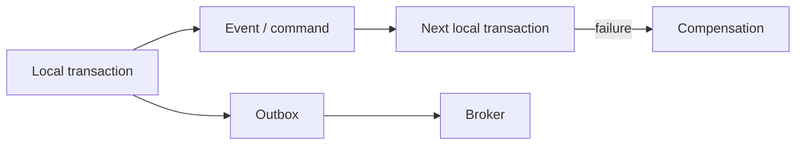

# ACID, Isolation ve Dağıtık Transaction'lar

Transaction tasarımı, tek bir veritabanında doğruluğu korumaktan çok, birden fazla işlem ve servis arasında hangi garantinin gerçekten gerekli olduğunu belirlemektir.

## Hızlı Karar

| İhtiyaç | Yaklaşım | Bedel |
| --- | --- | --- |
| Tek database içinde bütünlük | ACID transaction | Lock, contention ve daha düşük paralellik |
| Okuma tutarlılığı | Uygun isolation veya snapshot | Memory/version ve stale okuma maliyeti |
| Birden çok serviste iş akışı | Outbox + Saga | Compensation ve eventual consistency |
| Hepsi birlikte commit olmalı | 2PC | Coordinator, blocking ve operasyon karmaşıklığı |
| Sıkı sıralı sonuç | Serializable | Daha fazla conflict ve throughput düşüşü |

## Üretim Kontrol Listesi

- Transaction sınırı ve source of truth açık mı?
- Isolation seviyesi, gerçek anomaly ihtiyacına göre seçildi mi?
- Retry edilen transaction idempotent mi?
- Distributed flow için timeout, compensation ve stuck state var mı?
- Commit, event publish ve read model güncellemesi gözlemlenebilir mi?

## ACID

- **Atomicity:** Transaction'ın tüm etkileri uygulanır veya hiçbiri uygulanmaz.
- **Consistency:** Transaction, veritabanı kurallarını geçerli bir durumdan geçerli bir duruma taşır.
- **Isolation:** Eşzamanlı transaction'ların birbirini hangi seviyede görebileceğini belirler.
- **Durability:** Commit edilmiş veri, process veya node arızasından sonra korunur.

ACID uygulamanın tüm dağıtık sistemde tek bir global transaction olduğu anlamına gelmez. Database transaction sınırı ile iş süreci sınırı ayrı değerlendirilebilir.

## Isolation Seviyeleri ve Anomaly'ler

| Seviye | Kirli okuma | Non-repeatable read | Phantom read | Tipik yorum |
| --- | --- | --- | --- | --- |
| Read uncommitted | Mümkün | Mümkün | Mümkün | Çok özel raporlama; çoğu iş için riskli |
| Read committed | Önlenir | Mümkün | Mümkün | Yaygın varsayılan |
| Repeatable read | Önlenir | Önlenir | DB'ye göre değişir | Snapshot/MVCC ile güçlü okuma |
| Serializable | Önlenir | Önlenir | Önlenir | En güçlü izolasyon, daha fazla conflict |

- **Dirty read:** Commit edilmemiş veriyi okumak.
- **Non-repeatable read:** Aynı satırı transaction içinde iki kez okuyup farklı sonuç almak.
- **Phantom read:** Aynı predicate sorgusunda yeni veya silinmiş satır görmek.
- **Lost update:** İki yazmanın birbirinin sonucunu ezmesi.

Isolation adı tek başına yeterli değildir; kullanılan database motorunun MVCC, lock ve predicate davranışı da kontrol edilmelidir.

## Serializability

Bir execution, transaction'lar sırayla çalışmış gibi aynı sonucu veriyorsa serializable kabul edilir. Bunu sağlamak için strict locking, optimistic concurrency control veya serializable snapshot isolation kullanılabilir.

Serializability doğruluğu artırır ancak lock contention, abort ve retry oranını yükseltebilir. Daha düşük isolation seçilecekse invariant'lar application-level constraint, unique index, version check veya atomic update ile korunmalıdır.

## Dağıtık Transaction Seçenekleri

### Two-Phase Commit (2PC)

Coordinator önce tüm participant'lara **prepare**, sonra **commit** gönderir. Bir participant prepare'dan sonra coordinator'a erişemezse transaction belirsiz veya blocking durumda kalabilir. 2PC, güçlü atomiklik gerçekten zorunlu olduğunda ve participant'lar kontrollü olduğunda düşünülür.

### Outbox Pattern

İş verisi ve gönderilecek event aynı local transaction'da outbox tablosuna yazılır. Ayrı publisher outbox'ı okuyup broker'a gönderir. Broker delivery'si duplicate olabileceği için consumer idempotent olmalıdır.

### Saga Pattern

Uzun iş akışı local transaction'lara bölünür. Sonraki adım başarısız olduğunda önceki adımlar compensation ile geri alınır. Compensation, fiziksel olarak eski değeri geri yazmak değil, iş anlamında telafi edici bir işlem olabilir.

## Consistency ile İlişkisi

Tek database transaction'ı strong consistency sağlayabilir; servisler arası event akışı çoğu zaman eventual consistency üretir. Kullanıcıya read-your-writes garantisi gerekiyorsa primary read, version token, session affinity veya projection bekleme gibi ek bir politika gerekir.

Distributed transaction seçmeden önce şu sorulur: İş kuralı gerçekten tüm adımların aynı anda commit edilmesini mi istiyor, yoksa ara durum ve compensation kabul edilebilir mi?

## Retry ve Recovery

Transaction timeout sonrası commit'in gerçekleşip gerçekleşmediği belirsiz olabilir. Blind retry duplicate ödeme veya duplicate event üretebilir. Idempotency key, unique business key, transaction status query ve reconciliation job birlikte tasarlanmalıdır.
