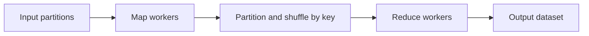

# Batch Processing ve MapReduce

Batch processing, sınırlı veya sınırsız veri akışını belirli bir zaman penceresinde toplu olarak işleyerek yüksek hacimli işlerde verimli sonuç üretir. Stream processing ile seçim; latency, maliyet, tekrar çalıştırma ve veri bütünlüğü gereksinimine göre yapılır.

## Hızlı Karar

| İhtiyaç | Yaklaşım | Dikkat |
| --- | --- | --- |
| Saatlik/günlük rapor | Batch | Data freshness gecikir |
| Milisaniye-saniye tepki | Stream | State ve operasyon karmaşıklığı |
| Büyük bağımsız kayıt seti | MapReduce | Shuffle ve network maliyeti |
| İşleri sıraya alıp ölçeklemek | Messaging + workers | Duplicate ve ordering |
| Model/analitik öncesi temizlik | Preprocessing pipeline | Schema, lineage ve replay |

## Üretim Kontrol Listesi

- Batch window, watermark, late data ve timezone davranışı açık mı?
- Job idempotent ve checkpoint/restart edilebilir mi?
- Input, intermediate ve output dataset'lerinin şeması versiyonlu mu?
- Queue veya broker kullanılıyorsa lag, retry ve DLQ izleniyor mu?
- Backfill ve yeniden çalıştırma duplicate sonuç üretmeden yapılabiliyor mu?

## Batch ve Stream Karşılaştırması

| Boyut | Batch | Stream |
| --- | --- | --- |
| Latency | Dakika-saat | Milisaniye-dakika |
| İşletme | Window ve scheduler odaklı | Sürekli çalışan job ve state |
| Replay | Dataset'ten kolay | Offset/checkpoint yönetimi gerekir |
| Maliyet | Kaynaklar pencere boyunca | Sürekli kaynak tüketimi |
| Veri | Bounded dataset | Unbounded event stream |

Hibrit mimaride aynı ham event'ler hem canlı stream tüketicilerine hem de replay edilebilir data lake/batch katmanına yazılabilir.

## Batch Pipeline


Pipeline adımları deterministik ve tekrar çalıştırılabilir olmalıdır. Ham veri immutable tutulursa hatalı transform düzeltilebilir ve backfill yapılabilir.

## Preprocessing Pipelines

Preprocessing; schema validation, type normalization, deduplication, PII maskeleme, enrichment, filtering ve partitioning adımlarını içerebilir.

```text
raw event
  → schema validation
  → timestamp/identity normalization
  → deduplication
  → privacy filtering
  → enrichment
  → partitioned curated data
```

Her kayıt için source, ingestion time, event time, schema version ve processing version tutulması lineage ve hata araştırmasını kolaylaştırır. Bozuk kayıtlar sessizce atılmamalı; quarantine veya DLQ benzeri bir akışa yönlendirilmelidir.

## MapReduce

MapReduce büyük veri işini iki temel aşamaya ayırır:

1. **Map:** Her input kaydını key/value çıktısına dönüştürür.
2. **Shuffle:** Aynı key'leri aynı reducer'a taşır ve gruplar.
3. **Reduce:** Her key grubunu toplar, birleştirir veya özetler.



Map aşaması paralel çalışabilir; shuffle network ve disk maliyetinin en pahalı bölümüdür. Skewed key tek reducer'ı hot spot yapabilir. Combiner, doğru partition key ve output partition sayısı bu riski azaltır.

## Messaging Sistemleriyle Veri İşleme

Queue görev dağıtır: bir mesaj genellikle bir consumer tarafından işlenir. Pub/Sub aynı olayı birden fazla bağımsız consumer group'a fan-out eder. Worker sayısı partition veya queue concurrency sınırını aşarsa ek paralellik üretmez.

Mesaj tabanlı batch için:

- bounded batch size ve max processing time belirle,
- acknowledgment'ı başarılı işlemden sonra yap,
- idempotency key ve checkpoint kullan,
- poison message için retry budget ve DLQ tanımla,
- queue depth ve processing age izle.

## Doğruluk ve Operasyon

Event time ile processing time ayrılmalıdır. Geç gelen veri için watermark ve correction window seçilir. Aynı batch birden fazla kez çalışabileceğinden output'a partition/date/job version yazmak ve atomic publish yapmak güvenlidir.

Başarısız job, tüm dataset'i baştan işlemek yerine son başarılı checkpoint'ten devam edebilmelidir. Ancak checkpoint'in input ve output sürümleriyle uyumlu olduğu doğrulanmalıdır.
