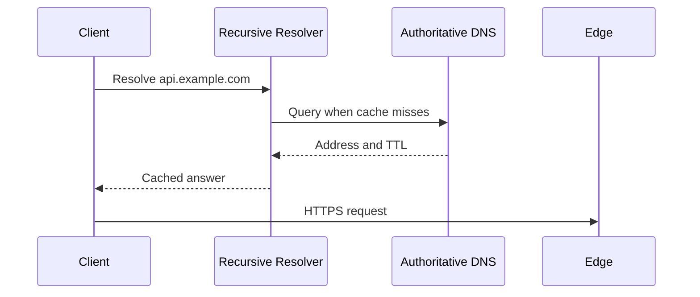

# DNS, CDN ve Request Path

Bir HTTP isteğinin uygulamaya ulaşması; DNS, edge cache, load balancer, reverse proxy, gateway ve servis katmanlarının ardışık kararlarından oluşur. Bu katmanları eklemek her zaman latency veya reliability kazandırmaz; her biri yeni bir cache, timeout ve failure domain'i getirir.

## Hızlı Karar

| İhtiyaç | Uygun katman | Kritik dikkat |
| --- | --- | --- |
| Alan adını IP'ye çözmek | DNS | TTL, cache ve stale kayıtlar |
| Statik veya cache'lenebilir içerik | CDN | Cache key, invalidation ve privacy |
| TCP/UDP seviyesinde dağıtım | L4 load balancer | İçeriği göremez; connection davranışı önemlidir |
| HTTP routing ve header politikası | L7 load balancer | TLS, health check ve retry sınırları |
| Ortak API politikaları | API/Application Gateway | Tek dar boğaz ve merkezi hata alanı |
| Uygulama önünde güvenli proxy | Reverse proxy | Header, timeout, buffering ve body limitleri |

## Üretim Kontrol Listesi

- DNS, CDN, LB, proxy ve gateway için ayrı health/failure sinyalleri var mı?
- Her katmanda timeout, retry ve maximum payload sınırı tanımlı mı?
- Cache key authorization, tenant ve content variation'ı doğru taşıyor mu?
- L4/L7 seçimi connection ve routing ihtiyacıyla gerekçelendirildi mi?
- Rate limit ve throttling client, identity, tenant ve global seviyelerde ölçülüyor mu?

## DNS Resolution

İstemci çoğu zaman önce işletim sistemi ve browser cache'ine, sonra recursive resolver'a bakar. Resolver ihtiyaç varsa root, TLD ve authoritative name server'lara giderek A/AAAA, CNAME veya diğer kayıtları çözer. Sonuç TTL boyunca cache'lenir.



DNS hızlı bir request router gibi kullanılmamalıdır. TTL değişikliği anında tüm client'lara ulaşmaz; resolver cache, negative caching ve stale cevaplar rollout veya failover'ı geciktirebilir. DNS failure için son bilinen endpoint'e güvenmek yerine client timeout, retry ve controlled fallback tasarlanır.

## CDN ve Caching

CDN edge node'ları kullanıcıya yakın tutarak statik asset, medya segmenti ve güvenli şekilde cache'lenebilir response'ları origin'e gitmeden sunabilir.

```text
Client → CDN edge
          ├─ cache hit  → response
          └─ cache miss → origin → store/serve response
```

Cache key; path, query, method, locale, content encoding, tenant ve authorization bağlamını doğru ayırmalıdır. Kişiye özel veya hassas response'lar yanlışlıkla public cache'e girmemelidir. Invalidation için versioned asset, short TTL, purge veya stale-while-revalidate seçilir.

CDN yalnızca gecikmeyi değil, origin request sayısını ve bandwidth maliyetini de düşürür. Cache miss storm, origin shield, request coalescing ve stale response davranışları ayrıca planlanır.

## Load Balancer: L4 ve L7

- **L4:** TCP/UDP akışlarını IP ve port üzerinden dağıtır. Daha az protokol bilgisiyle yüksek throughput ve düşük overhead sağlar.
- **L7:** HTTP method, host, path, header veya cookie üzerinden route eder. TLS termination, canary, auth entegrasyonu ve içerik bazlı policy mümkündür.

L7 daha fazla özellik sunarken parsing, state ve configuration karmaşıklığı getirir. Health check yalnızca process'in portu açık mı sorusunu değil, trafiği karşılayabilecek durumda mı sorusunu test etmelidir.

## Reverse Proxy

Reverse proxy client adına origin'e bağlanır ve şu sorumlulukları üstlenebilir:

- TLS termination ve certificate rotation,
- request/response buffering ve compression,
- header normalization ve access log,
- body size, timeout ve connection limitleri,
- upstream routing ve health check.

Proxy timeout'u backend timeout'undan uzun veya kısa seçilirken tüm request zincirinin latency budget'ı dikkate alınmalıdır. Proxy'de otomatik retry, non-idempotent POST işlemlerini çoğaltabilir.

## API Gateway ve Application Gateway

API Gateway; authentication, authorization, routing, rate limiting, quota, request transformation ve telemetry gibi API politikalarını merkezileştirir. Application Gateway bazı platformlarda L7 routing, WAF ve TLS özelliklerinin cloud ürün adıdır; isim değil, gerçek sorumluluklar karşılaştırılmalıdır.

Gateway'e business logic doldurmak onu deployment ve latency bottleneck'ine dönüştürür. Domain davranışı servislerde, ortak edge politikaları gateway'de tutulmalıdır.

## Rate Limiting ve Throttling

- **Rate limiting:** Belirli zaman aralığında kaç isteğe izin verileceğini sınırlar.
- **Throttling:** Kaynak doygunluğunda hızı düşürür, kuyruğa alır veya kontrollü reddeder.

Limit key'i IP, user, API key, tenant veya endpoint olabilir. Token bucket burst'e izin verir; leaky bucket çıkışı düzleştirir. `429` yanıtı, `Retry-After`, quota header'ları ve idempotency davranışı birlikte tanımlanır.

Rate limiting tek başına overload koruması değildir. Downstream queue depth, connection pool ve database saturation da global admission control kararına katılmalıdır.

## Uçtan Uca Debug Sırası

Bir latency veya erişim problemi için DNS timing → TLS/connection → CDN hit/miss → LB route → proxy queue → gateway policy → service → cache/DB sırasıyla ölçülür. Her hop için correlation ID ve timing bilgisi bulunmalıdır.
