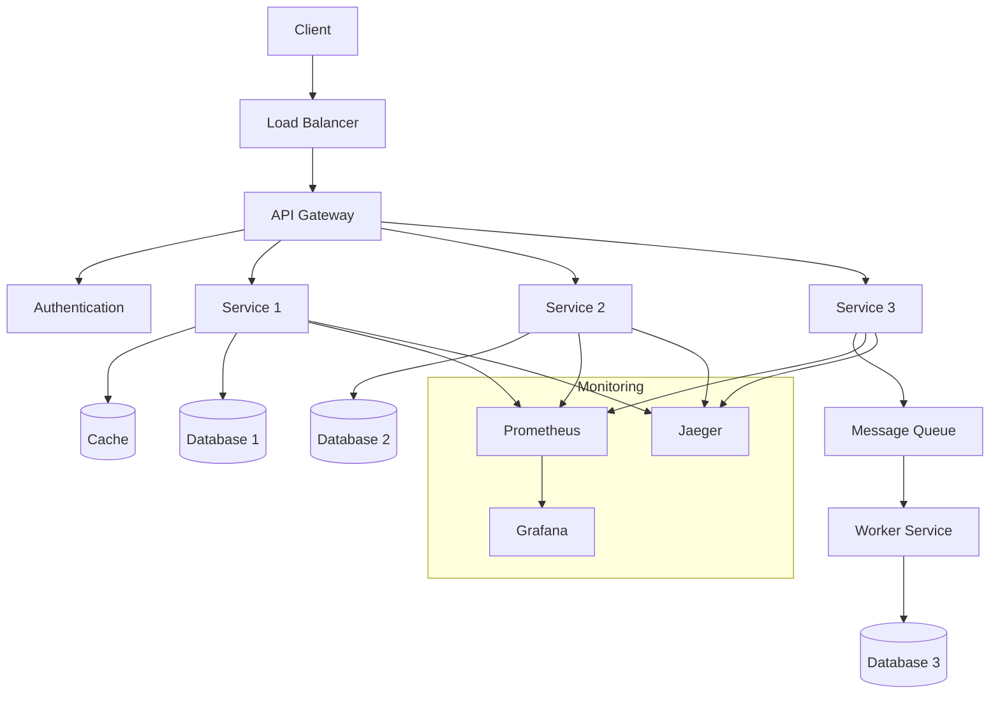
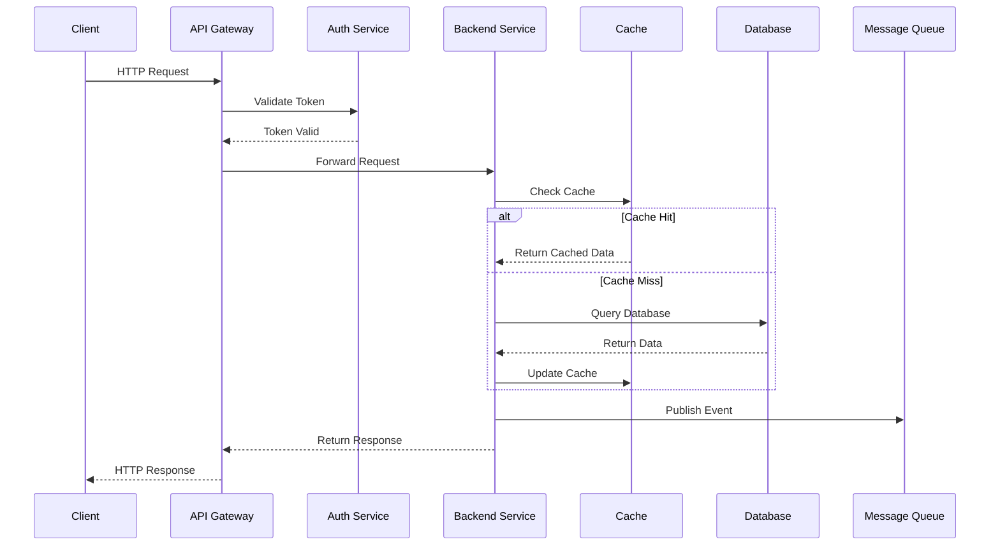

# Backend Sistem Tasarımı

Backend sistem tasarımı, ölçeklenebilir, güvenilir ve yüksek performanslı sunucu tarafı uygulamaları oluşturmanın temel prensiplerini kapsar.

## Genel Sistem Mimarisi

## Veri Akış Diyagramı

### 1. Temel Kavramlar ✅

Bu bölümde backend sistem tasarımının temel yapı taşlarını öğreneceksiniz:

- **[Monolith vs. Microservice Mimari](./basics/monolith-vs-microservice)** - Monolitik ve mikroservis mimarilerinin karşılaştırması
- **[İstek/Yanıt Döngüsü](./basics/request-response-model)** - HTTP request-response lifecycle ve inter-service communication
- **[HTTP, REST, gRPC Protokolleri](./basics/protocols)** - API protokollerinin seçimi ve best practices
- **[Temel Veritabanı Kavramları](./basics/database-concepts)** - SQL/NoSQL, indexing, normalization
- **[Temel Veri Yapıları ve Algoritmalar](./basics/data-structures)** - System design context'inde algoritma seçimi

## İçerik Planı

### 2. Performans ve Ölçeklenebilirlik ✅
- **[Load Balancing (Yük Dengeleme)](./performance/load-balancing)** - Application & Infrastructure düzeyinde yük dengeleme
- **[Caching (Önbellekleme)](./performance/caching)** - Distributed caching, cache patterns ve invalidation  
- **[Database Sharding ve Partitioning](./performance/sharding)** - Horizontal/vertical partitioning, consistent hashing
- **[Database Replication](./performance/replication)** - Master-slave, multi-master replication, read/write splitting
- **[Asenkron İşlemler & Message Queue'lar](./performance/async-processing)** - Kafka, RabbitMQ, Redis ile async patterns

### 3. Dayanıklılık ve Yüksek Erişilebilirlik ✅
- **[Failover Mekanizmaları](./reliability/failover)** - Automated failover, consensus algorithms
- **[Circuit Breaker ve Bulkhead Pattern](./reliability/circuit-breaker)** - Resilience4j ile fault tolerance
- **[Health Checks & Heartbeats](./reliability/health-checks)** - Spring Boot Actuator ve monitoring
- **[Backpressure Kontrolü](./reliability/backpressure)** - Rate limiting ve queue management

### 4. Tutarlılık Modelleri ✅
- **[Strong vs Eventual Consistency](./consistency/strong-vs-eventual)** - Tutarlılık modellerinin karşılaştırması
- **[CAP Teoremi](./consistency/cap-theorem)** - Consistency, Availability, Partition tolerance
- **[Paxos ve Raft Konsensüs Algoritmaları](./consistency/consensus-algorithms)** - Distributed consensus patterns
- **[Diğer Tutarlılık Modelleri](./consistency/other-consistency-models)** - Causal, Sequential, Monotonic consistency

### 5. API Tasarımı ve Gateway'ler
- **[API Versioning](./api/api-versioning)** - API Versiyonlama
- **[Rate Limiting & Throttling](./api/rate-limiting)** - Hız Sınırlama & Kısıtlama
- **[API Gateway Usage](./api/api-gateway)** - API Gateway Kullanımı
- **[GraphQL vs REST vs gRPC](./api/api-comparison)** - GraphQL vs REST vs gRPC

### 6. Mikroservis İletişimi ✅
- **[Senkron vs Asenkron İletişim](./microservices/communication)** - REST/gRPC vs Event-Driven iletişim
- **[Service Discovery](./microservices/service-discovery)** - Spring Cloud Netflix & Alternatives
- **[Service Mesh](./microservices/service-mesh)** - Cloud-Native İletişim Infrastructure

### 7. Veri İşleme ve Akış ✅
- **[Event Sourcing](./data-processing/event-sourcing)** - Olay kaynak modeli ve immutable event store
- **[CQRS (Command Query Responsibility Segregation)](./data-processing/cqrs)** - Komut ve sorgu sorumluluklarını ayırma
- **[Stream Processing (Akış İşleme)](./data-processing/stream-processing)** - Gerçek zamanlı veri akışı işleme

### 8. Gözlemlenebilirlik ✅
- **[Logging (ELK Stack)](./observability/logging)** - Yapılandırılmış loglama ve ELK Stack entegrasyonu
- **[Metrics (Prometheus, Grafana)](./observability/metrics)** - Uygulama ve sistem metrikleri toplama
- **[Tracing (Jaeger, Zipkin)](./observability/tracing)** - Dağıtık izleme ve performans analizi
- **[Distributed Tracing](./observability/distributed-tracing)** - Çapraz servis korelasyon ve kullanıcı yolculuğu

### 9. Güvenlik ✅
- **[Authentication vs Authorization](./security/auth)** - OAuth2, JWT, method-level security
- **[TLS/SSL & mTLS](./security/tls)** - Certificate management, HTTPS configuration
- **[API Security](./security/api-security)** - HMAC, rate limiting, WAF integration
- **[Secret Management](./security/secret-management)** - HashiCorp Vault, encrypted properties

### 10. Bulut ve Container Orkestrasyonu ✅
- **[Containers (Docker)](./cloud/containers)** - Containerization, Docker best practices, multi-stage builds
- **[Kubernetes Temelleri](./cloud/kubernetes)** - Pod, Service, Deployment, ConfigMap, Secret, HPA, RBAC
- **[Helm Chart'lar](./cloud/helm)** - Kubernetes package management, templating, multi-environment deployment
- **[Serverless ve FaaS](./cloud/serverless)** - AWS Lambda, Azure Functions, Google Cloud Functions, Serverless Framework

### 11. Site Reliability Engineering ✅
- **[SLI/SLO/SLA Tanımları](./sre/sli-slo-sla)** - Service Level Indicators, Objectives ve Agreements
- **[Incident Management](./sre/incident-management)** - Olay yönetimi ve müdahale süreçleri
- **[Chaos Engineering](./sre/chaos-engineering)** - Kaos mühendisliği ve dayanıklılık testleri
- **[Capacity Planning](./sre/capacity-planning)** - Kapasite planlama ve proaktif ölçeklendirme

### 12. Operasyon ve Maliyet Yönetimi ✅
- **[Infrastructure as Code](./operations/iac)** - CloudFormation, Terraform ile altyapı yönetimi ve otomasyon
- **[Maliyet İzleme ve Optimizasyon](./operations/cost-optimization)** - FinOps prensipleri ve maliyet analizi
- **[CI/CD İş Akışları](./operations/ci-cd)** - DevOps kültürü ve sürekli entegrasyon/dağıtım

### 13. Edge ve Coğrafi Dağıtık Sistemler ✅
- **[Multi-Region Deployment](./edge/multi-region)** - Active-Active ve Active-Passive deployment stratejileri
- **[Data Localization ve GDPR](./edge/data-localization)** - KVKK uyumluluğu ve veri lokalizasyonu
- **[Edge Computing](./edge/edge-computing)** - Cloudflare Workers, AWS Edge Services ve real-time processing

### 14. Sürekli İyileştirme ✅
- **[Feedback Döngüleri](./improvement/feedback-loops)** - Kullanıcı ve sistem geri bildirimleri, A/B testing ve telemetri analizi
- **[Blue/Green ve Canary Deployments](./improvement/deployment-strategies)** - Risk-controlled deployment stratejileri ve otomatik rollback
- **[Retrospektif & Post-Mortem](./improvement/retrospective)** - Organizasyonel öğrenme ve sürekli iyileştirme metodolojileri

## Başlamak İçin

**Temel Kavramlar** bölümü tamamlandı! Diğer konuların içeriklerini eklemek için hazırım. Hangi konudan devam etmek istersiniz?
