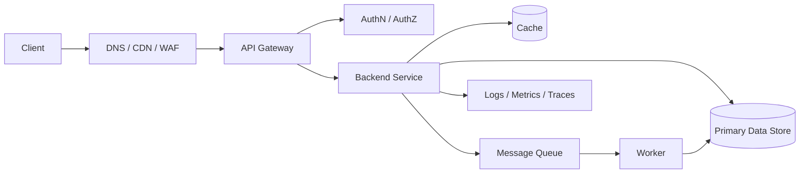

# Backend Sistem Tasarımı

Backend sistem tasarımı, bir isteğin kullanıcıdan veriye, oradan tekrar kullanıcıya güvenilir şekilde dönmesini sağlayan kararlar bütünüdür. Bu bölüm; ölçeklenebilir API'ler, veri tutarlılığı, performans, dayanıklılık, gözlemlenebilirlik, güvenlik ve maliyet dengesini birlikte düşünmek için kalıcı bir başvuru alanıdır.

## Ne Zaman Kullanılır?

- Yeni bir backend servisinin sınırlarını, veri sahipliğini ve API sözleşmesini tasarlarken.
- Var olan sistemde yavaşlık, hata oranı, maliyet artışı veya operasyon karmaşası oluştuğunda.
- Monolith, mikroservis, event-driven yapı, cache, queue, sharding veya multi-region gibi kararların trade-off'larını karşılaştırırken.
- Yapay zeka veya dış kaynak erişimi kısıtlı olduğunda hızlıca temel ilkeleri hatırlamak için.

## Temel Akış

```mermaid
flowchart LR
    Client[Client] --> Edge[DNS / CDN / WAF]
    Edge --> Gateway[API Gateway]
    Gateway --> Auth[AuthN / AuthZ]
    Gateway --> Service[Backend Service]
    Service --> Cache[(Cache)]
    Service --> DB[(Primary Data Store)]
    Service --> Queue[Message Queue]
    Queue --> Worker[Worker]
    Worker --> DB
    Service --> Telemetry[Logs / Metrics / Traces]
```

Bu akışta her kutu ayrı bir karar noktasıdır: gateway merkezi kontrol sağlar ama dar boğaz olabilir; cache gecikmeyi düşürür ama tutarsızlık riski ekler; queue ani yükleri emer ama gecikme ve tekrar işleme ihtimali yaratır.

## Karar Pusulası

| Soru | Önce Bakılacak Yer | Tipik Trade-off |
| --- | --- | --- |
| Tek servis yeterli mi? | [Monolith vs Microservice](./basics/monolith-vs-microservice) | Basit operasyon vs bağımsız ölçekleme |
| API nasıl evrilecek? | [API Versioning](./api/api-versioning) | Geriye uyumluluk vs bakım yükü |
| Okuma yükü nasıl azaltılır? | [Caching](./performance/caching) | Düşük gecikme vs invalidation karmaşıklığı |
| Yazma ve okuma nasıl ölçeklenir? | [Sharding](./performance/sharding), [Replication](./performance/replication) | Kapasite artışı vs veri dağıtım maliyeti |
| Hata yayılımı nasıl sınırlandırılır? | [Circuit Breaker](./reliability/circuit-breaker), [Backpressure](./reliability/backpressure) | Koruma vs daha fazla durum yönetimi |
| Veri ne kadar tutarlı olmalı? | [Strong vs Eventual Consistency](./consistency/strong-vs-eventual), [CAP](./consistency/cap-theorem) | Doğruluk algısı vs erişilebilirlik |
| Sistem nasıl izlenir? | [Logging](./observability/logging), [Metrics](./observability/metrics), [Tracing](./observability/tracing) | Görünürlük vs veri hacmi ve maliyet |
| Sırları ve erişimi nasıl koruruz? | [Auth](./security/auth), [Secret Management](./security/secret-management), [TLS/mTLS](./security/tls) | Güvenlik vs entegrasyon karmaşıklığı |

## Minimum Tasarım Kontrolü

Bir backend tasarımı tamam demeden önce şunları netleştir:

- Problem: Sistem hangi kullanıcı veya iş akışını taşıyor, en kritik hata senaryosu ne?
- Çözüm: Ana bileşenler, veri sahibi servisler ve senkron/asenkron sınırlar belli mi?
- Trade-off: Seçilmeyen alternatifler ve nedenleri açık mı?
- Örnek: En az bir başarılı istek, bir hata ve bir retry/idempotency akışı çizildi mi?
- Ölçüm: Latency, throughput, error rate, saturation ve maliyet sinyalleri tanımlandı mı?
- Güvenlik: Kimlik doğrulama, yetkilendirme, secret, TLS ve audit ihtiyacı karşılandı mı?
- Maliyet: Cache, queue, veri kopyası, observability ve multi-region kararlarının bedeli biliniyor mu?

## Bölüm Haritası

### 1. Temel Kavramlar

- [Monolith vs Microservice](./basics/monolith-vs-microservice)
- [Request-Response Model](./basics/request-response-model)
- [HTTP, REST, gRPC](./basics/protocols)
- [Database Concepts](./basics/database-concepts)
- [Data Structures](./basics/data-structures)

### 2. Performans ve Ölçeklenebilirlik

- [Load Balancing](./performance/load-balancing)
- [Caching](./performance/caching)
- [Sharding and Partitioning](./performance/sharding)
- [Replication](./performance/replication)
- [Async Processing and Message Queues](./performance/async-processing)

### 3. Dayanıklılık ve Tutarlılık

- [Failover](./reliability/failover)
- [Circuit Breaker and Bulkhead](./reliability/circuit-breaker)
- [Health Checks](./reliability/health-checks)
- [Backpressure](./reliability/backpressure)
- [Consistency Models](./consistency/strong-vs-eventual)
- [Consensus Algorithms](./consistency/consensus-algorithms)

### 4. API, Mikroservis ve Veri Akışı

- [API Gateway](./api/api-gateway)
- [Rate Limiting](./api/rate-limiting)
- [GraphQL vs REST vs gRPC](./api/api-comparison)
- [Microservice Communication](./microservices/communication)
- [Service Discovery](./microservices/service-discovery)
- [Event Sourcing](./data-processing/event-sourcing)
- [CQRS](./data-processing/cqrs)
- [Stream Processing](./data-processing/stream-processing)

### 5. Operasyon, Güvenlik ve Coğrafya

- [Observability](./observability/logging)
- [Security](./security/auth)
- [Cloud and Containers](./cloud/containers)
- [SRE](./sre/sli-slo-sla)
- [Operations and Cost](./operations/cost-optimization)
- [Edge and Multi-Region](./edge/multi-region)
- [Continuous Improvement](./improvement/feedback-loops)

## Başlangıç Rotası

Yeni başlıyorsan sırayla [Request-Response Model](./basics/request-response-model), [Protocols](./basics/protocols), [Database Concepts](./basics/database-concepts), [Caching](./performance/caching), [Load Balancing](./performance/load-balancing), [Observability](./observability/logging) ve [Security](./security/auth) sayfalarını oku. Bir sistemi tasarlarken her bölümden yalnızca ihtiyacın olan kararı çek; gereksiz teknoloji eklemek sistem tasarımı değil, bakım borcudur.
