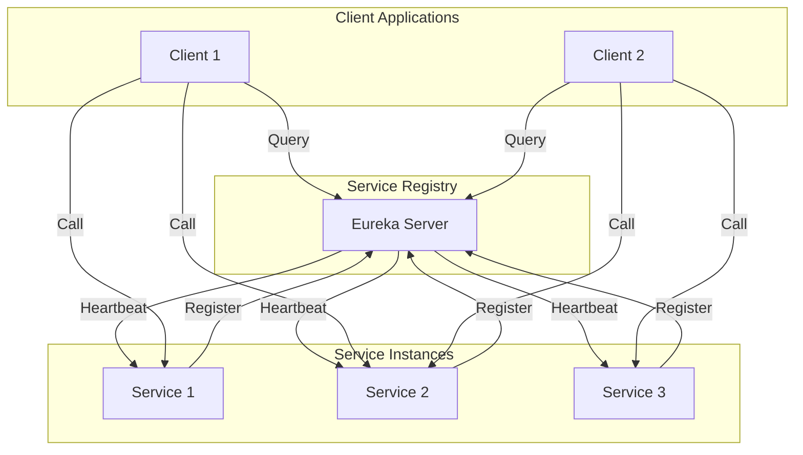
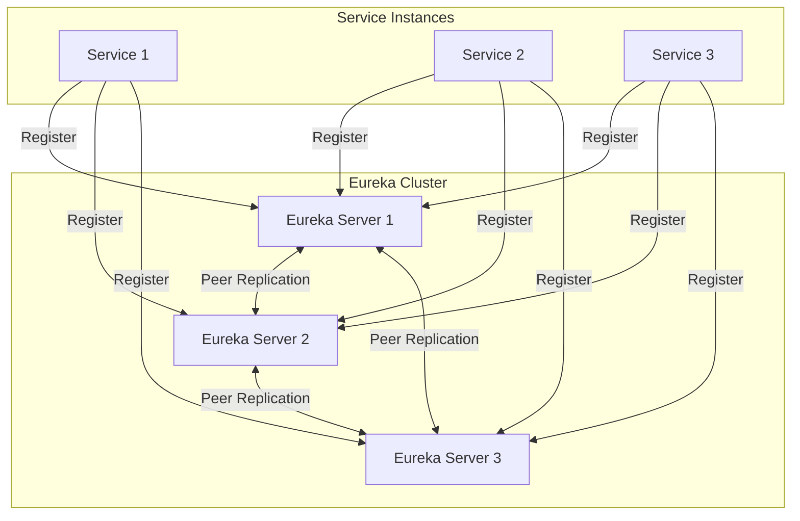
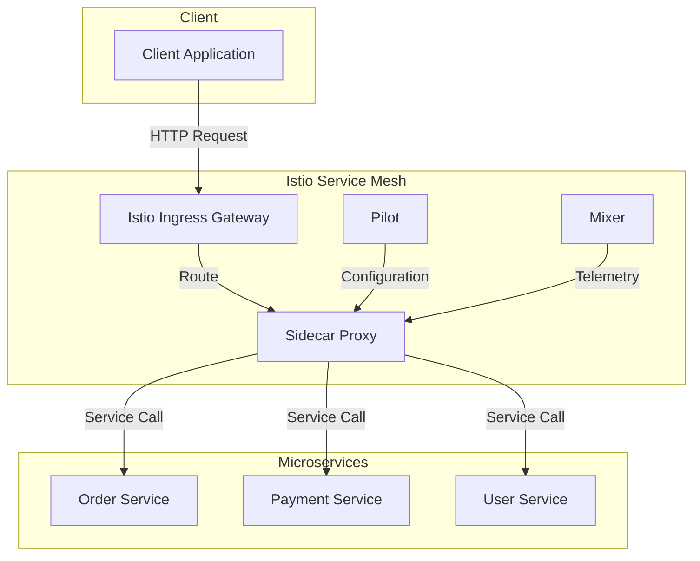

# Service Discovery

Service Discovery, mikroservis mimarisinde servislerin birbirini dinamik olarak bulabilmesi için kritik bir bileşendir. Bu bölümde Spring Cloud Netflix Eureka ve alternatif çözümlerin detaylı implementasyonunu inceleyeceğiz.



## Spring Cloud Eureka

### Eureka Server Configuration

**Server Setup:**

```java
@EnableEurekaServer
@SpringBootApplication
public class EurekaServerApplication {
    public static void main(String[] args) {
        SpringApplication.run(EurekaServerApplication.class, args);
    }
}
```

**Application Properties (eureka-server):**

```yaml
server:
  port: 8761

eureka:
  instance:
    hostname: localhost
    prefer-ip-address: true
    instance-id: ${spring.application.name}:${vcap.application.instance_id:${spring.application.instance_id:${random.value}}}
    lease-renewal-interval-in-seconds: 30
    lease-expiration-duration-in-seconds: 90
    
  client:
    register-with-eureka: false
    fetch-registry: false
    service-url:
      defaultZone: http://${eureka.instance.hostname}:${server.port}/eureka/
    
  server:
    enable-self-preservation: true
    eviction-interval-timer-in-ms: 60000
    renewal-percent-threshold: 0.85
    response-cache-auto-expiration-in-seconds: 180
    response-cache-update-interval-ms: 30000
    
  dashboard:
    enabled: true
    path: /

management:
  endpoints:
    web:
      exposure:
        include: health,info,metrics,prometheus
  endpoint:
    health:
      show-details: always
  metrics:
    export:
      prometheus:
        enabled: true

logging:
  level:
    com.netflix.eureka: DEBUG
    com.netflix.discovery: DEBUG
```

**High Availability Eureka Cluster:**

```yaml
# eureka-server-1 (application-peer1.yml)
server:
  port: 8761

eureka:
  instance:
    hostname: eureka-server-1
    prefer-ip-address: false
  client:
    service-url:
      defaultZone: http://eureka-server-2:8762/eureka/,http://eureka-server-3:8763/eureka/

---
# eureka-server-2 (application-peer2.yml)
server:
  port: 8762

eureka:
  instance:
    hostname: eureka-server-2
    prefer-ip-address: false
  client:
    service-url:
      defaultZone: http://eureka-server-1:8761/eureka/,http://eureka-server-3:8763/eureka/

---
# eureka-server-3 (application-peer3.yml)
server:
  port: 8763

eureka:
  instance:
    hostname: eureka-server-3
    prefer-ip-address: false
  client:
    service-url:
      defaultZone: http://eureka-server-1:8761/eureka/,http://eureka-server-2:8762/eureka/
```



### Eureka Client Configuration

**Client Service Implementation:**

```java
@EnableEurekaClient
@EnableDiscoveryClient
@SpringBootApplication
public class OrderServiceApplication {
    public static void main(String[] args) {
        SpringApplication.run(OrderServiceApplication.class, args);
    }
    
    @Bean
    @LoadBalanced
    public RestTemplate restTemplate() {
        return new RestTemplate();
    }
    
    @Bean
    @LoadBalanced
    public WebClient.Builder webClientBuilder() {
        return WebClient.builder();
    }
}
```

**Client Application Properties:**

```yaml
spring:
  application:
    name: order-service

server:
  port: 0  # Random port

eureka:
  client:
    service-url:
      defaultZone: http://eureka-server-1:8761/eureka/,http://eureka-server-2:8762/eureka/,http://eureka-server-3:8763/eureka/
    fetch-registry: true
    register-with-eureka: true
    registry-fetch-interval-seconds: 30
    instance-info-replication-interval-seconds: 30
    
  instance:
    prefer-ip-address: true
    instance-id: ${spring.application.name}:${random.value}
    lease-renewal-interval-in-seconds: 30
    lease-expiration-duration-in-seconds: 90
    metadata-map:
      version: ${app.version:1.0.0}
      environment: ${spring.profiles.active:development}
      management.context-path: ${management.server.servlet.context-path:/actuator}
      
management:
  endpoints:
    web:
      exposure:
        include: health,info,metrics,refresh
  endpoint:
    health:
      show-details: always
      
  health:
    diskspace:
      enabled: true
    eureka:
      enabled: true

# Custom health indicators
app:
  health:
    database:
      enabled: true
    external-service:
      enabled: true
      timeout: 5000
```

**Advanced Client Configuration:**

```java
@Configuration
public class EurekaClientConfig {
    
    @Bean
    public EurekaInstanceConfigBean eurekaInstanceConfig() {
        EurekaInstanceConfigBean instance = new EurekaInstanceConfigBean();
        instance.setPreferIpAddress(true);
        instance.setLeaseRenewalIntervalInSeconds(30);
        instance.setLeaseExpirationDurationInSeconds(90);
        
        // Custom metadata
        Map<String, String> metadata = new HashMap<>();
        metadata.put("version", getClass().getPackage().getImplementationVersion());
        metadata.put("startup-time", Instant.now().toString());
        metadata.put("zone", System.getProperty("eureka.instance.availability-zone", "default"));
        instance.setMetadataMap(metadata);
        
        return instance;
    }
    
    @Bean
    public DiscoveryClientOptionalArgs discoveryClientOptionalArgs() {
        DiscoveryClientOptionalArgs args = new DiscoveryClientOptionalArgs();
        args.setEventListeners(List.of(new CustomEurekaEventListener()));
        return args;
    }
    
    @Component
    public static class CustomEurekaEventListener implements EurekaEventListener {
        
        @Override
        public void onEvent(EurekaEvent event) {
            if (event instanceof CacheRefreshedEvent) {
                log.info("Eureka cache refreshed");
            } else if (event instanceof StatusChangeEvent) {
                StatusChangeEvent statusEvent = (StatusChangeEvent) event;
                log.info("Instance status changed: {} -> {}", 
                    statusEvent.getPreviousStatus(), statusEvent.getStatus());
            }
        }
    }
}
```

### Load Balancing with Spring Cloud LoadBalancer

**Load Balancer Configuration:**

```java
@Configuration
public class LoadBalancerConfig {
    
    @Bean
    @LoadBalanced
    public WebClient webClient() {
        return WebClient.builder()
            .filter(loadBalancerExchangeFilterFunction())
            .build();
    }
    
    @Bean
    public ReactorLoadBalancerExchangeFilterFunction loadBalancerExchangeFilterFunction() {
        return new ReactorLoadBalancerExchangeFilterFunction(loadBalancerClientFactory());
    }
    
    @Bean
    public LoadBalancerClientFactory loadBalancerClientFactory() {
        LoadBalancerClientFactory factory = new LoadBalancerClientFactory();
        factory.setConfigurations(loadBalancerConfigurations());
        return factory;
    }
    
    private List<LoadBalancerClientSpecification> loadBalancerConfigurations() {
        return List.of(
            new LoadBalancerClientSpecification("user-service", 
                new Class[]{UserServiceLoadBalancerConfig.class}),
            new LoadBalancerClientSpecification("payment-service", 
                new Class[]{PaymentServiceLoadBalancerConfig.class})
        );
    }
}
```

**Custom Load Balancing Strategy:**

```java
@Configuration
public class UserServiceLoadBalancerConfig {
    
    @Bean
    public ReactorServiceInstanceLoadBalancer reactorServiceInstanceLoadBalancer(
            Environment environment,
            LoadBalancerClientFactory loadBalancerClientFactory) {
        String name = environment.getProperty(LoadBalancerClientFactory.PROPERTY_NAME);
        return new WeightedResponseTimeLoadBalancer(
            loadBalancerClientFactory.getLazyProvider(name, ServiceInstanceListSupplier.class),
            name);
    }
}

@Slf4j
public class WeightedResponseTimeLoadBalancer implements ReactorServiceInstanceLoadBalancer {
    
    private final ObjectProvider<ServiceInstanceListSupplier> serviceInstanceListSupplierProvider;
    private final String serviceId;
    private final Map<String, Double> responseTimeWeights = new ConcurrentHashMap<>();
    
    @Override
    public Mono<Response<ServiceInstance>> choose(Request request) {
        ServiceInstanceListSupplier supplier = serviceInstanceListSupplierProvider
            .getIfAvailable(NoopServiceInstanceListSupplier::new);
            
        return supplier.get(request)
            .next()
            .map(serviceInstances -> processInstanceResponse(serviceInstances, request));
    }
    
    private Response<ServiceInstance> processInstanceResponse(
            List<ServiceInstance> instances, Request request) {
        if (instances.isEmpty()) {
            log.warn("No servers available for service: {}", serviceId);
            return new EmptyResponse();
        }
        
        ServiceInstance selectedInstance = selectInstanceByResponseTime(instances);
        return new DefaultResponse(selectedInstance);
    }
    
    private ServiceInstance selectInstanceByResponseTime(List<ServiceInstance> instances) {
        if (responseTimeWeights.isEmpty()) {
            // First request - use round robin
            return instances.get(ThreadLocalRandom.current().nextInt(instances.size()));
        }
        
        // Calculate weighted probabilities based on response times
        double totalWeight = instances.stream()
            .mapToDouble(instance -> {
                String instanceId = instance.getInstanceId();
                Double weight = responseTimeWeights.get(instanceId);
                return weight != null ? 1.0 / weight : 1.0; // Lower response time = higher weight
            })
            .sum();
            
        double random = ThreadLocalRandom.current().nextDouble() * totalWeight;
        double currentWeight = 0;
        
        for (ServiceInstance instance : instances) {
            String instanceId = instance.getInstanceId();
            Double responseTime = responseTimeWeights.get(instanceId);
            currentWeight += responseTime != null ? 1.0 / responseTime : 1.0;
            
            if (random <= currentWeight) {
                return instance;
            }
        }
        
        return instances.get(0); // Fallback
    }
    
    public void updateResponseTime(String instanceId, long responseTimeMs) {
        responseTimeWeights.put(instanceId, (double) responseTimeMs);
    }
}
```

## Alternative Service Discovery Solutions

### Consul Integration

**Consul Configuration:**

```java
@Configuration
@EnableDiscoveryClient
public class ConsulConfig {
    
    @Bean
    public ConsulProperties consulProperties() {
        ConsulProperties properties = new ConsulProperties();
        properties.setHost("consul-server");
        properties.setPort(8500);
        properties.setEnabled(true);
        return properties;
    }
    
    @Bean
    public ConsulDiscoveryProperties consulDiscoveryProperties() {
        ConsulDiscoveryProperties properties = new ConsulDiscoveryProperties();
        properties.setHealthCheckInterval("10s");
        properties.setHealthCheckTimeout("5s");
        properties.setHealthCheckCriticalTimeout("30s");
        properties.setInstanceId("${spring.application.name}-${random.value}");
        properties.setPreferIpAddress(true);
        properties.setTags(Arrays.asList("version=1.0", "environment=prod"));
        return properties;
    }
}
```

**Consul Application Properties:**

```yaml
spring:
  application:
    name: order-service
  cloud:
    consul:
      host: consul-server
      port: 8500
      discovery:
        enabled: true
        register: true
        service-name: ${spring.application.name}
        instance-id: ${spring.application.name}-${random.value}
        health-check-interval: 10s
        health-check-timeout: 5s
        health-check-critical-timeout: 30s
        prefer-ip-address: true
        ip-address: ${spring.cloud.client.ip-address}
        port: ${server.port}
        tags:
          - version=1.0.0
          - environment=${spring.profiles.active:development}
        metadata:
          management.context-path: /actuator
          health.path: /actuator/health
          
      config:
        enabled: true
        prefix: config
        default-context: application
        profile-separator: ","
        format: YAML
        data-key: data
        watch:
          enabled: true
          delay: 1000
```

### Kubernetes Native Discovery

**Kubernetes Service Configuration:**

```yaml
apiVersion: v1
kind: Service
metadata:
  name: order-service
  labels:
    app: order-service
    version: v1
spec:
  selector:
    app: order-service
  ports:
    - name: http
      port: 80
      targetPort: 8080
      protocol: TCP
  type: ClusterIP
  
---
apiVersion: apps/v1
kind: Deployment
metadata:
  name: order-service
  labels:
    app: order-service
    version: v1
spec:
  replicas: 3
  selector:
    matchLabels:
      app: order-service
  template:
    metadata:
      labels:
        app: order-service
        version: v1
    spec:
      containers:
        - name: order-service
          image: order-service:1.0.0
          ports:
            - containerPort: 8080
          env:
            - name: SPRING_PROFILES_ACTIVE
              value: "kubernetes"
          livenessProbe:
            httpGet:
              path: /actuator/health/liveness
              port: 8080
            initialDelaySeconds: 30
            periodSeconds: 10
          readinessProbe:
            httpGet:
              path: /actuator/health/readiness
              port: 8080
            initialDelaySeconds: 5
            periodSeconds: 5
```

**Spring Boot Kubernetes Configuration:**

```java
@Configuration
@Profile("kubernetes")
public class KubernetesDiscoveryConfig {
    
    @Bean
    @ConditionalOnMissingBean
    public KubernetesDiscoveryProperties kubernetesDiscoveryProperties() {
        KubernetesDiscoveryProperties properties = new KubernetesDiscoveryProperties();
        properties.setEnabled(true);
        properties.setAllNamespaces(false);
        properties.setWaitCacheReady(true);
        properties.setCacheLoadingTimeoutSeconds(60);
        return properties;
    }
    
    @Bean
    public KubernetesClient kubernetesClient() {
        return new DefaultKubernetesClient();
    }
}
```

**Application Properties for Kubernetes:**

```yaml
spring:
  application:
    name: order-service
  cloud:
    kubernetes:
      discovery:
        enabled: true
        all-namespaces: false
        wait-cache-ready: true
        cache-loading-timeout-seconds: 60
        service-labels:
          environment: ${ENVIRONMENT:development}
        metadata:
          add-labels: true
          add-annotations: true
          labels-prefix: k8s
          annotations-prefix: k8s
          
management:
  endpoint:
    health:
      probes:
        enabled: true
  health:
    livenessstate:
      enabled: true
    readinessstate:
      enabled: true
```

## Advanced Service Discovery Patterns

### Client-Side Discovery with Custom Registry

```java
@Component
@Slf4j
public class CustomServiceRegistry {
    
    private final Map<String, List<ServiceInstance>> serviceRegistry = new ConcurrentHashMap<>();
    private final Map<String, ServiceHealth> serviceHealthMap = new ConcurrentHashMap<>();
    private final ScheduledExecutorService scheduler = Executors.newScheduledThreadPool(5);
    
    @PostConstruct
    public void initializeHealthChecks() {
        scheduler.scheduleAtFixedRate(this::performHealthChecks, 10, 30, TimeUnit.SECONDS);
    }
    
    public void registerService(String serviceName, ServiceInstance instance) {
        serviceRegistry.computeIfAbsent(serviceName, k -> new CopyOnWriteArrayList<>())
            .add(instance);
        log.info("Registered service instance: {} - {}", serviceName, instance.getInstanceId());
    }
    
    public void deregisterService(String serviceName, String instanceId) {
        List<ServiceInstance> instances = serviceRegistry.get(serviceName);
        if (instances != null) {
            instances.removeIf(instance -> instance.getInstanceId().equals(instanceId));
            log.info("Deregistered service instance: {} - {}", serviceName, instanceId);
        }
    }
    
    public List<ServiceInstance> getHealthyInstances(String serviceName) {
        List<ServiceInstance> instances = serviceRegistry.get(serviceName);
        if (instances == null) {
            return Collections.emptyList();
        }
        
        return instances.stream()
            .filter(this::isInstanceHealthy)
            .collect(Collectors.toList());
    }
    
    private boolean isInstanceHealthy(ServiceInstance instance) {
        ServiceHealth health = serviceHealthMap.get(instance.getInstanceId());
        return health != null && health.isHealthy();
    }
    
    private void performHealthChecks() {
        serviceRegistry.values().stream()
            .flatMap(List::stream)
            .forEach(this::checkInstanceHealth);
    }
    
    private void checkInstanceHealth(ServiceInstance instance) {
        CompletableFuture.supplyAsync(() -> {
            try {
                String healthUrl = "http://" + instance.getHost() + ":" + 
                    instance.getPort() + "/actuator/health";
                    
                ResponseEntity<Map> response = restTemplate.getForEntity(healthUrl, Map.class);
                boolean healthy = response.getStatusCode().is2xxSuccessful() &&
                    "UP".equals(response.getBody().get("status"));
                    
                serviceHealthMap.put(instance.getInstanceId(), 
                    new ServiceHealth(healthy, Instant.now()));
                    
                return healthy;
            } catch (Exception e) {
                log.warn("Health check failed for instance: {}", instance.getInstanceId(), e);
                serviceHealthMap.put(instance.getInstanceId(), 
                    new ServiceHealth(false, Instant.now()));
                return false;
            }
        }).exceptionally(throwable -> {
            log.error("Health check error for instance: {}", instance.getInstanceId(), throwable);
            return false;
        });
    }
    
    @Data
    @AllArgsConstructor
    public static class ServiceHealth {
        private boolean healthy;
        private Instant lastChecked;
    }
}
```

### Service Mesh Integration with Istio

**Istio VirtualService Configuration:**

```yaml
apiVersion: networking.istio.io/v1beta1
kind: VirtualService
metadata:
  name: order-service
spec:
  hosts:
    - order-service
  http:
    - match:
        - headers:
            version:
              exact: v2
      route:
        - destination:
            host: order-service
            subset: v2
    - route:
        - destination:
            host: order-service
            subset: v1
          weight: 90
        - destination:
            host: order-service
            subset: v2
          weight: 10

---
apiVersion: networking.istio.io/v1beta1
kind: DestinationRule
metadata:
  name: order-service
spec:
  host: order-service
  trafficPolicy:
    connectionPool:
      tcp:
        maxConnections: 100
      http:
        http1MaxPendingRequests: 50
        maxRequestsPerConnection: 10
    circuitBreaker:
      consecutiveErrors: 5
      interval: 30s
      baseEjectionTime: 30s
      maxEjectionPercent: 50
  subsets:
    - name: v1
      labels:
        version: v1
    - name: v2
      labels:
        version: v2
```

**Spring Boot Istio Integration:**

```java
@RestController
@RequestMapping("/api/orders")
public class OrderController {
    
    @Autowired
    private OrderService orderService;
    
    @GetMapping("/{orderId}")
    public ResponseEntity<OrderDto> getOrder(@PathVariable Long orderId,
                                           HttpServletRequest request) {
        // Istio injects tracing headers
        String traceId = request.getHeader("x-trace-id");
        String spanId = request.getHeader("x-span-id");
        
        MDC.put("traceId", traceId);
        MDC.put("spanId", spanId);
        
        try {
            OrderDto order = orderService.findById(orderId);
            return ResponseEntity.ok(order);
        } finally {
            MDC.clear();
        }
    }
    
    @PostMapping
    public ResponseEntity<OrderDto> createOrder(@RequestBody CreateOrderRequest request,
                                              HttpServletRequest httpRequest) {
        // Extract user information from Istio JWT
        String userInfo = httpRequest.getHeader("x-user-info");
        if (userInfo != null) {
            // Process JWT claims injected by Istio
            UserInfo user = parseUserInfo(userInfo);
            request.setUserId(user.getId());
        }
        
        OrderDto createdOrder = orderService.createOrder(request);
        return ResponseEntity.status(HttpStatus.CREATED).body(createdOrder);
    }
}
```



### Service Discovery Events and Monitoring

```java
@Component
@Slf4j
public class ServiceDiscoveryEventHandler {
    
    @EventListener
    public void handleInstanceRegistered(InstanceRegisteredEvent event) {
        log.info("Service instance registered: {} - {}", 
            event.getInstanceInfo().getAppName(),
            event.getInstanceInfo().getInstanceId());
            
        // Update load balancer weights
        updateLoadBalancerWeights(event.getInstanceInfo());
        
        // Send notification
        notificationService.notifyInstanceRegistered(event.getInstanceInfo());
    }
    
    @EventListener
    public void handleInstanceCanceled(InstanceCanceledEvent event) {
        log.warn("Service instance canceled: {} - {}", 
            event.getAppName(), event.getServerId());
            
        // Remove from load balancer
        removeFromLoadBalancer(event.getAppName(), event.getServerId());
        
        // Send alert
        alertingService.notifyInstanceDown(event.getAppName(), event.getServerId());
    }
    
    @EventListener
    public void handleServiceDown(ServiceDownEvent event) {
        log.error("Service down: {}", event.getServiceName());
        
        // Trigger failover procedures
        failoverService.triggerFailover(event.getServiceName());
        
        // Send critical alert
        alertingService.sendCriticalAlert("Service Down", 
            "Service " + event.getServiceName() + " is down");
    }
    
    private void updateLoadBalancerWeights(InstanceInfo instanceInfo) {
        String serviceName = instanceInfo.getAppName();
        String instanceId = instanceInfo.getInstanceId();
        
        // Extract custom metadata for weight calculation
        Map<String, String> metadata = instanceInfo.getMetadata();
        int weight = Integer.parseInt(metadata.getOrDefault("weight", "100"));
        
        loadBalancerService.updateInstanceWeight(serviceName, instanceId, weight);
    }
}
```

Bu kapsamlı Service Discovery implementasyonu, Spring Cloud Eureka'dan başlayarak modern alternatiflere kadar tüm çözümleri production-ready örneklerle sunmaktadır. Her yaklaşımın güçlü yanları, kullanım senaryoları ve best practices detaylı olarak ele alınmıştır.
