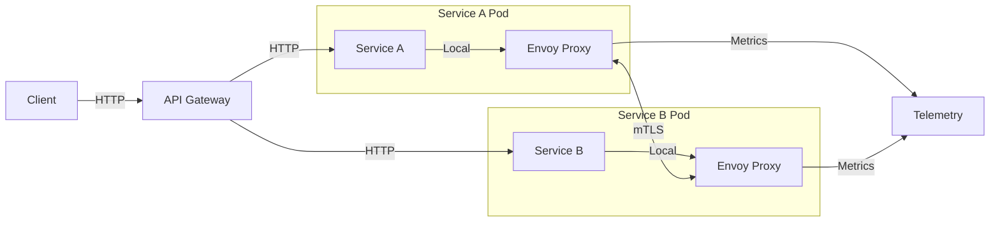
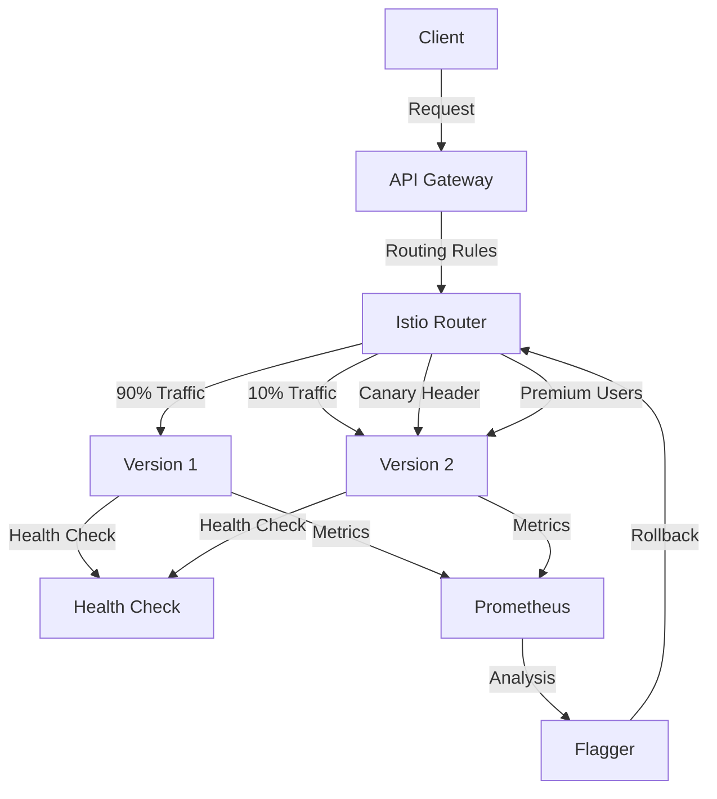
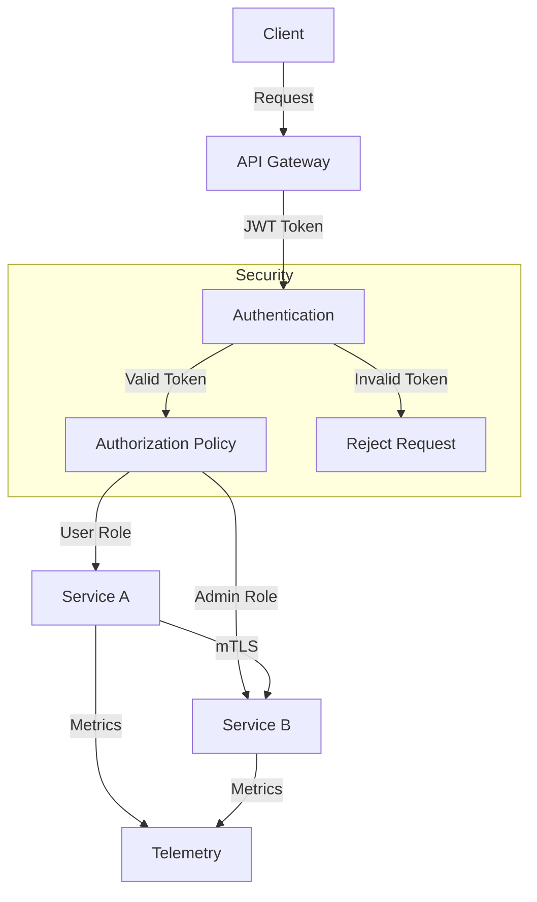

# Servis Mesh

Service Mesh, mikroservis mimarisinde servisler arası iletişimi yönetmek için kullanılan bir altyapı katmanıdır. Bu bölümde Istio ve Spring Boot entegrasyonunu detaylı olarak inceleyeceğiz.

## Istio Servis Mesh

### Sidecar Proxy Deseni



**Envoy Proxy Yapılandırması:**

```yaml
apiVersion: v1
kind: ConfigMap
metadata:
  name: envoy-config
data:
  envoy.yaml: |
    admin:
      access_log_path: /tmp/admin_access.log
      address:
        socket_address:
          protocol: TCP
          address: 127.0.0.1
          port_value: 9901
    static_resources:
      listeners:
      - name: listener_0
        address:
          socket_address:
            protocol: TCP
            address: 0.0.0.0
            port_value: 10000
        filter_chains:
        - filters:
          - name: envoy.filters.network.http_connection_manager
            typed_config:
              "@type": type.googleapis.com/envoy.extensions.filters.network.http_connection_manager.v3.HttpConnectionManager
              stat_prefix: ingress_http
              access_log:
              - name: envoy.access_loggers.stdout
                typed_config:
                  "@type": type.googleapis.com/envoy.extensions.access_loggers.stream.v3.StdoutAccessLog
              http_filters:
              - name: envoy.filters.http.router
                typed_config:
                  "@type": type.googleapis.com/envoy.extensions.filters.http.router.v3.Router
              route_config:
                name: local_route
                virtual_hosts:
                - name: local_service
                  domains: ["*"]
                  routes:
                  - match:
                      prefix: "/"
                    route:
                      cluster: service_cluster
      clusters:
      - name: service_cluster
        connect_timeout: 30s
        type: LOGICAL_DNS
        dns_lookup_family: V4_ONLY
        lb_policy: ROUND_ROBIN
        load_assignment:
          cluster_name: service_cluster
          endpoints:
          - lb_endpoints:
            - endpoint:
                address:
                  socket_address:
                    address: order-service
                    port_value: 8080
```

**Istio Enjeksiyon Yapılandırması:**

```yaml
apiVersion: v1
kind: Namespace
metadata:
  name: microservices
  labels:
    istio-injection: enabled
    
---
apiVersion: apps/v1
kind: Deployment
metadata:
  name: order-service
  namespace: microservices
spec:
  replicas: 3
  selector:
    matchLabels:
      app: order-service
      version: v1
  template:
    metadata:
      labels:
        app: order-service
        version: v1
      annotations:
        sidecar.istio.io/inject: "true"
        sidecar.istio.io/proxyCPU: "100m"
        sidecar.istio.io/proxyMemory: "128Mi"
    spec:
      containers:
      - name: order-service
        image: order-service:1.0.0
        ports:
        - containerPort: 8080
        env:
        - name: SPRING_PROFILES_ACTIVE
          value: "istio"
        resources:
          requests:
            memory: "256Mi"
            cpu: "250m"
          limits:
            memory: "512Mi"
            cpu: "500m"
```

### Trafik Yönetimi



**VirtualService Yapılandırması:**

```yaml
apiVersion: networking.istio.io/v1beta1
kind: VirtualService
metadata:
  name: order-service-vs
  namespace: microservices
spec:
  hosts:
  - order-service
  - order-service.microservices.svc.cluster.local
  gateways:
  - order-gateway
  - mesh
  http:
  # Canary deployment - 10% traffic to v2
  - match:
    - headers:
        canary:
          exact: "true"
    route:
    - destination:
        host: order-service
        subset: v2
  # A/B Testing based on user segment
  - match:
    - headers:
        user-segment:
          exact: "premium"
    route:
    - destination:
        host: order-service
        subset: v2
      weight: 50
    - destination:
        host: order-service
        subset: v1
      weight: 50
  # Default routing with gradual rollout
  - route:
    - destination:
        host: order-service
        subset: v1
      weight: 90
    - destination:
        host: order-service
        subset: v2
      weight: 10
    fault:
      delay:
        percentage:
          value: 0.1
        fixedDelay: 5s
      abort:
        percentage:
          value: 0.01
        httpStatus: 500
    timeout: 30s
    retries:
      attempts: 3
      perTryTimeout: 10s
      retryOn: gateway-error,connect-failure,refused-stream
```

**DestinationRule Yapılandırması:**

```yaml
apiVersion: networking.istio.io/v1beta1
kind: DestinationRule
metadata:
  name: order-service-dr
  namespace: microservices
spec:
  host: order-service
  trafficPolicy:
    connectionPool:
      tcp:
        maxConnections: 100
        connectTimeout: 30s
        tcpKeepalive:
          time: 7200s
          interval: 75s
      http:
        http1MaxPendingRequests: 50
        http2MaxRequests: 100
        maxRequestsPerConnection: 10
        maxRetries: 3
        consecutiveGatewayErrors: 5
        h2UpgradePolicy: UPGRADE
    circuitBreaker:
      consecutiveGatewayErrors: 5
      consecutiveServerErrors: 5
      interval: 30s
      baseEjectionTime: 30s
      maxEjectionPercent: 50
      minHealthPercent: 50
    outlierDetection:
      consecutive5xxErrors: 5
      consecutiveGatewayErrors: 5
      interval: 30s
      baseEjectionTime: 30s
      maxEjectionPercent: 50
      minHealthPercent: 50
  subsets:
  - name: v1
    labels:
      version: v1
    trafficPolicy:
      connectionPool:
        tcp:
          maxConnections: 50
  - name: v2
    labels:
      version: v2
    trafficPolicy:
      connectionPool:
        tcp:
          maxConnections: 100
```

### Güvenlik Özellikleri



**PeerAuthentication Yapılandırması:**

```yaml
apiVersion: security.istio.io/v1beta1
kind: PeerAuthentication
metadata:
  name: default
  namespace: microservices
spec:
  mtls:
    mode: STRICT

---
apiVersion: security.istio.io/v1beta1
kind: PeerAuthentication
metadata:
  name: order-service
  namespace: microservices
spec:
  selector:
    matchLabels:
      app: order-service
  mtls:
    mode: STRICT
  portLevelMtls:
    8080:
      mode: STRICT
```

**AuthorizationPolicy Yapılandırması:**

```yaml
apiVersion: security.istio.io/v1beta1
kind: AuthorizationPolicy
metadata:
  name: order-service-authz
  namespace: microservices
spec:
  selector:
    matchLabels:
      app: order-service
  rules:
  # Allow authenticated users to access orders
  - from:
    - source:
        principals: ["cluster.local/ns/microservices/sa/order-service"]
    to:
    - operation:
        methods: ["GET", "POST", "PUT", "DELETE"]
        paths: ["/api/orders/*"]
    when:
    - key: request.auth.claims[role]
      values: ["user", "admin"]
  
  # Admin-only endpoints
  - from:
    - source:
        principals: ["cluster.local/ns/microservices/sa/admin"]
    to:
    - operation:
        methods: ["GET", "POST", "DELETE"]
        paths: ["/api/admin/*"]
    when:
    - key: request.auth.claims[role]
      values: ["admin"]
  
  # Health checks always allowed
  - to:
    - operation:
        methods: ["GET"]
        paths: ["/actuator/health", "/actuator/ready", "/actuator/live"]

---
apiVersion: security.istio.io/v1beta1
kind: RequestAuthentication
metadata:
  name: order-service-jwt
  namespace: microservices
spec:
  selector:
    matchLabels:
      app: order-service
  jwtRules:
  - issuer: "https://auth.company.com"
    jwksUri: "https://auth.company.com/.well-known/jwks.json"
    audiences:
    - "order-service"
    - "microservices"
    forwardOriginalToken: true
    fromHeaders:
    - name: Authorization
      prefix: "Bearer "
```

## Spring Boot + Istio Entegrasyonu

### Konfigürasyon Yönetimi

**Spring Boot Uygulama Konfigürasyonu:**

```java
@Configuration
@Profile("istio")
public class IstioConfiguration {
    
    @Bean
    public WebMvcConfigurer istioWebMvcConfigurer() {
        return new WebMvcConfigurer() {
            @Override
            public void addInterceptors(InterceptorRegistry registry) {
                registry.addInterceptor(new IstioTracingInterceptor());
                registry.addInterceptor(new IstioSecurityInterceptor());
            }
        };
    }
    
    @Bean
    public FilterRegistrationBean<IstioHeaderFilter> istioHeaderFilter() {
        FilterRegistrationBean<IstioHeaderFilter> registration = new FilterRegistrationBean<>();
        registration.setFilter(new IstioHeaderFilter());
        registration.addUrlPatterns("/api/*");
        registration.setOrder(1);
        return registration;
    }
}
```

**Istio Header İşleme:**

```java
@Component
@Slf4j
public class IstioHeaderFilter implements Filter {
    
    private static final String TRACE_ID_HEADER = "x-trace-id";
    private static final String SPAN_ID_HEADER = "x-span-id";
    private static final String USER_ID_HEADER = "x-user-id";
    private static final String REQUEST_ID_HEADER = "x-request-id";
    
    @Override
    public void doFilter(ServletRequest request, ServletResponse response, 
                        FilterChain chain) throws IOException, ServletException {
        
        HttpServletRequest httpRequest = (HttpServletRequest) request;
        HttpServletResponse httpResponse = (HttpServletResponse) response;
        
        // Extract Istio injected headers
        String traceId = httpRequest.getHeader(TRACE_ID_HEADER);
        String spanId = httpRequest.getHeader(SPAN_ID_HEADER);
        String userId = httpRequest.getHeader(USER_ID_HEADER);
        String requestId = httpRequest.getHeader(REQUEST_ID_HEADER);
        
        // Set MDC for logging
        if (traceId != null) MDC.put("traceId", traceId);
        if (spanId != null) MDC.put("spanId", spanId);
        if (userId != null) MDC.put("userId", userId);
        if (requestId != null) MDC.put("requestId", requestId);
        
        // Set security context
        if (userId != null) {
            SecurityContextHolder.getContext().setAuthentication(
                new PreAuthenticatedAuthenticationToken(userId, null, Collections.emptyList())
            );
        }
        
        try {
            chain.doFilter(request, response);
        } finally {
            MDC.clear();
            SecurityContextHolder.clearContext();
        }
    }
}
```

**Istio ile JWT İşleme:**

```java
@Component
public class IstioJwtProcessor {
    
    @Value("${istio.jwt.header:x-jwt-payload}")
    private String jwtPayloadHeader;
    
    public UserInfo extractUserInfo(HttpServletRequest request) {
        String jwtPayload = request.getHeader(jwtPayloadHeader);
        
        if (jwtPayload == null) {
            throw new SecurityException("JWT payload not found in Istio headers");
        }
        
        try {
            // Istio already validated the JWT, we just need to parse the payload
            String decodedPayload = new String(Base64.getDecoder().decode(jwtPayload));
            ObjectMapper objectMapper = new ObjectMapper();
            JsonNode claims = objectMapper.readTree(decodedPayload);
            
            return UserInfo.builder()
                .id(claims.get("sub").asText())
                .email(claims.get("email").asText())
                .roles(extractRoles(claims.get("roles")))
                .groups(extractGroups(claims.get("groups")))
                .build();
                
        } catch (Exception e) {
            log.error("Failed to process JWT payload from Istio", e);
            throw new SecurityException("Invalid JWT payload");
        }
    }
    
    private List<String> extractRoles(JsonNode rolesNode) {
        if (rolesNode == null || !rolesNode.isArray()) {
            return Collections.emptyList();
        }
        
        List<String> roles = new ArrayList<>();
        rolesNode.forEach(node -> roles.add(node.asText()));
        return roles;
    }
}
```

### Devre Kesici ve Fallback

**Istio Devre Kesici Entegrasyonu:**

```java
@Service
@Slf4j
public class PaymentServiceClient {
    
    private final WebClient webClient;
    private final MeterRegistry meterRegistry;
    private final Counter circuitBreakerActivations;
    
    public PaymentServiceClient(WebClient.Builder webClientBuilder, MeterRegistry meterRegistry) {
        this.webClient = webClientBuilder
            .baseUrl("http://payment-service:8080")
            .build();
        this.meterRegistry = meterRegistry;
        this.circuitBreakerActivations = Counter.builder("circuit_breaker_activations")
            .description("Circuit breaker activations")
            .tag("service", "payment-service")
            .register(meterRegistry);
    }
    
    public Mono<PaymentResult> processPayment(PaymentRequest request) {
        return webClient.post()
            .uri("/api/payments")
            .bodyValue(request)
            .retrieve()
            .onStatus(HttpStatus::is5xxServerError, response -> {
                log.warn("Payment service error, circuit breaker might activate");
                circuitBreakerActivations.increment();
                return Mono.error(new PaymentServiceException("Payment service unavailable"));
            })
            .bodyToMono(PaymentResult.class)
            .timeout(Duration.ofSeconds(10))
            .onErrorMap(WebClientException.class, ex -> {
                log.error("Payment service call failed", ex);
                return new PaymentServiceException("Payment processing failed", ex);
            })
            .doOnSuccess(result -> log.info("Payment processed successfully: {}", result.getPaymentId()))
            .doOnError(error -> log.error("Payment processing failed", error));
    }
    
    public Mono<PaymentResult> processPaymentWithFallback(PaymentRequest request) {
        return processPayment(request)
            .onErrorResume(PaymentServiceException.class, ex -> {
                log.warn("Using fallback for payment processing", ex);
                return Mono.just(createFallbackPaymentResult(request));
            });
    }
    
    private PaymentResult createFallbackPaymentResult(PaymentRequest request) {
        return PaymentResult.builder()
            .paymentId("FALLBACK-" + UUID.randomUUID().toString())
            .orderId(request.getOrderId())
            .status(PaymentStatus.PENDING)
            .message("Payment queued for processing when service is available")
            .timestamp(Instant.now())
            .build();
    }
}
```

### Gözlemlenebilirlik Entegrasyonu

**İzleme ve Metrikler:**

```java
@RestController
@RequestMapping("/api/orders")
@Slf4j
public class OrderController {
    
    private final OrderService orderService;
    private final MeterRegistry meterRegistry;
    private final Timer requestTimer;
    private final Counter requestCounter;
    
    public OrderController(OrderService orderService, MeterRegistry meterRegistry) {
        this.orderService = orderService;
        this.meterRegistry = meterRegistry;
        this.requestTimer = Timer.builder("http_requests_duration")
            .description("HTTP request duration")
            .tag("service", "order-service")
            .register(meterRegistry);
        this.requestCounter = Counter.builder("http_requests_total")
            .description("Total HTTP requests")
            .tag("service", "order-service")
            .register(meterRegistry);
    }
    
    @GetMapping("/{orderId}")
    @Timed(value = "order.get", description = "Get order operation")
    public ResponseEntity<OrderDto> getOrder(@PathVariable Long orderId,
                                           HttpServletRequest request) {
        
        Timer.Sample sample = Timer.start(meterRegistry);
        requestCounter.increment(Tags.of("method", "GET", "endpoint", "/orders/{id}"));
        
        // Extract tracing information from Istio
        String traceId = request.getHeader("x-trace-id");
        String parentSpanId = request.getHeader("x-parent-span-id");
        
        try (MDCCloseable mdcCloseable = MDC.putCloseable("traceId", traceId)) {
            log.info("Processing get order request: orderId={}, traceId={}", orderId, traceId);
            
            OrderDto order = orderService.findById(orderId);
            
            // Add custom span attributes
            Span currentSpan = Span.current();
            currentSpan.setTag("order.id", orderId.toString());
            currentSpan.setTag("order.status", order.getStatus());
            currentSpan.setTag("user.id", order.getUserId().toString());
            
            return ResponseEntity.ok(order);
            
        } catch (OrderNotFoundException e) {
            log.warn("Order not found: orderId={}, traceId={}", orderId, traceId);
            requestCounter.increment(Tags.of("method", "GET", "endpoint", "/orders/{id}", "status", "404"));
            return ResponseEntity.notFound().build();
            
        } catch (Exception e) {
            log.error("Error processing get order request: orderId={}, traceId={}", orderId, traceId, e);
            requestCounter.increment(Tags.of("method", "GET", "endpoint", "/orders/{id}", "status", "500"));
            return ResponseEntity.status(HttpStatus.INTERNAL_SERVER_ERROR).build();
            
        } finally {
            sample.stop(requestTimer.tag("method", "GET").tag("endpoint", "/orders/{id}"));
        }
    }
    
    @PostMapping
    @Timed(value = "order.create", description = "Create order operation")
    public ResponseEntity<OrderDto> createOrder(@RequestBody @Valid CreateOrderRequest request,
                                              HttpServletRequest httpRequest) {
        
        String traceId = httpRequest.getHeader("x-trace-id");
        String userId = httpRequest.getHeader("x-user-id");
        
        try (MDCCloseable mdcCloseable = MDC.putCloseable("traceId", traceId)) {
            log.info("Processing create order request: userId={}, traceId={}", userId, traceId);
            
            // Set user context from Istio headers
            request.setUserId(Long.valueOf(userId));
            
            OrderDto createdOrder = orderService.createOrder(request);
            
            // Add custom metrics
            meterRegistry.counter("orders.created", 
                Tags.of("user.segment", determineUserSegment(userId)))
                .increment();
            
            return ResponseEntity.status(HttpStatus.CREATED).body(createdOrder);
            
        } catch (Exception e) {
            log.error("Error creating order: userId={}, traceId={}", userId, traceId, e);
            return ResponseEntity.status(HttpStatus.INTERNAL_SERVER_ERROR).build();
        }
    }
}
```

### Canary Dağıtımları

**Flagger ile Otomatik Canary Dağıtımı:**

```yaml
apiVersion: flagger.app/v1beta1
kind: Canary
metadata:
  name: order-service
  namespace: microservices
spec:
  targetRef:
    apiVersion: apps/v1
    kind: Deployment
    name: order-service
  progressDeadlineSeconds: 60
  service:
    port: 8080
    targetPort: 8080
    gateways:
    - order-gateway
    hosts:
    - order-service.local
  analysis:
    interval: 30s
    threshold: 5
    maxWeight: 50
    stepWeight: 10
    metrics:
    - name: request-success-rate
      thresholdRange:
        min: 99
      interval: 1m
    - name: request-duration
      thresholdRange:
        max: 500
      interval: 30s
    webhooks:
    - name: acceptance-test
      type: pre-rollout
      url: http://flagger-loadtester.microservices/
      timeout: 30s
      metadata:
        type: bash
        cmd: "curl -sd 'test' http://order-service-canary.microservices:8080/api/health"
    - name: load-test
      url: http://flagger-loadtester.microservices/
      timeout: 5s
      metadata:
        cmd: "hey -z 1m -q 10 -c 2 http://order-service-canary.microservices:8080/api/orders"
```

## Service Mesh vs Uygulama Seviyesi Çözümler

### Karşılaştırma Matrisi

| Özellik | Service Mesh (Istio) | Uygulama Seviyesi (Spring Cloud) |
|---------|---------------------|-----------------------------------|
| **Dil Bağımsız** | ✅ Evet | ❌ Sadece Java/JVM |
| **Altyapı Ayrımı** | ✅ Proxy-tabanlı | ❌ Kütüphane-tabanlı |
| **Operasyon Kontrolü** | ✅ Platform ekibi | ❌ Geliştirme ekibi |
| **Öğrenme Eğrisi** | ⚠️ Dik | ✅ Java geliştiricileri için tanıdık |
| **Hata Ayıklama** | ⚠️ Karmaşık | ✅ IDE desteği ile daha kolay |
| **Kaynak Aşırı Yükü** | ⚠️ Sidecar proxy | ✅ Daha düşük bellek kullanımı |
| **İnce Ayar Kontrolü** | ⚠️ Konfigürasyon-tabanlı | ✅ Kod-tabanlı |
| **Test** | ⚠️ Küme gerektirir | ✅ Birim/Entegrasyon testleri |
| **Satıcı Bağımlılığı** | ⚠️ Istio'ya özgü | ⚠️ Spring'e özgü |

### Hibrit Yaklaşım Uygulaması

```java
@Configuration
@ConditionalOnProperty(name = "servicemesh.enabled", havingValue = "false", matchIfMissing = true)
public class SpringCloudConfig {
    
    @Bean
    @LoadBalanced
    public WebClient.Builder webClientBuilder() {
        return WebClient.builder()
            .filter(circuitBreakerFilter())
            .filter(retryFilter())
            .filter(tracingFilter());
    }
    
    @Bean
    public ExchangeFilterFunction circuitBreakerFilter() {
        return CircuitBreakerFilterFunctions.circuitBreaker("default");
    }
}

@Configuration
@ConditionalOnProperty(name = "servicemesh.enabled", havingValue = "true")
public class ServiceMeshConfig {
    
    @Bean
    public WebClient.Builder webClientBuilder() {
        // Minimal configuration when using service mesh
        return WebClient.builder()
            .filter(headerPropagationFilter());
    }
    
    @Bean
    public ExchangeFilterFunction headerPropagationFilter() {
        return (request, next) -> {
            // Propagate necessary headers for service mesh
            return next.exchange(request);
        };
    }
}
```

### Geçiş Stratejisi

```java
@Component
@Slf4j
public class ServiceMeshMigrationManager {
    
    @Value("${servicemesh.migration.enabled:false}")
    private boolean migrationEnabled;
    
    @Value("${servicemesh.migration.percentage:0}")
    private int migrationPercentage;
    
    public boolean shouldUseServiceMesh(String serviceName) {
        if (!migrationEnabled) {
            return false;
        }
        
        // Gradual migration based on service hash
        int hash = Math.abs(serviceName.hashCode()) % 100;
        boolean useServiceMesh = hash < migrationPercentage;
        
        log.debug("Service mesh decision for {}: {} (hash: {}, percentage: {})",
            serviceName, useServiceMesh, hash, migrationPercentage);
            
        return useServiceMesh;
    }
    
    @Bean
    @ConditionalOnProperty(name = "servicemesh.migration.enabled", havingValue = "true")
    public WebClient adaptiveWebClient() {
        return WebClient.builder()
            .filter((request, next) -> {
                String serviceName = extractServiceName(request.url());
                
                if (shouldUseServiceMesh(serviceName)) {
                    // Use service mesh configuration
                    return next.exchange(request);
                } else {
                    // Use Spring Cloud configuration
                    return applySpringCloudFeatures(request, next);
                }
            })
            .build();
    }
    
    private Mono<ClientResponse> applySpringCloudFeatures(ClientRequest request, 
                                                         ExchangeFunction next) {
        // Apply circuit breaker, retry, load balancing etc.
        return circuitBreakerFilter().filter(request, next);
    }
}
```

Bu kapsamlı Service Mesh uygulaması, Istio'nun tüm özelliklerini Spring Boot uygulamaları ile entegre etmenin yanı sıra geçiş stratejileri ve hibrit yaklaşımları da içermektedir. Üretime hazır örneklerle birlikte her konunun detaylı açıklaması sunulmuştur.
