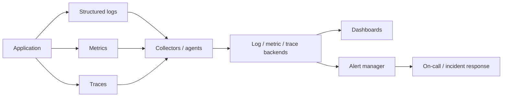

# Observability Stack

Observability, sistemin dışarıdan görülen çıktılarından iç durumunu anlamayı sağlar. Logging, metrics ve tracing birbirinin alternatifi değildir; farklı soruları cevaplar ve birlikte korele edilmelidir.

## Hızlı Karar

| Soru | Sinyal | Örnek cevap |
| --- | --- | --- |
| Ne oldu? | Structured logs | Hangi request hangi hatayı üretti? |
| Ne kadar oldu? | Metrics | Error rate veya queue depth arttı mı? |
| Nerede yavaşladı? | Traces | Hangi hop latency budget'ı tüketti? |
| Kullanıcı etkileniyor mu? | SLI/SLO | Başarı oranı ve p95 hedefte mi? |
| Ne zaman müdahale etmeli? | Alerting | Error budget tüketimi kritik mi? |

## Üretim Kontrol Listesi

- Her request ve async message için correlation/trace ID var mı?
- Log, metric ve trace aynı service, endpoint, region ve version bilgisiyle ilişkilendirilebiliyor mu?
- Latency histogram, throughput, error rate ve saturation birlikte izleniyor mu?
- Alert'ler semptom ve kullanıcı etkisine göre action-oriented mı?
- Cardinality, retention, sampling ve PII maliyeti kontrol altında mı?

## Stack Mimarisi



Collector ve backend seçimi vendor'dan bağımsızdır. Üretim sistemi için ingestion backpressure, disk doluluğu, sampling ve telemetry backend arızasında uygulamanın etkilenmemesi ayrıca tasarlanır.

## Logging

Structured log alanları en azından timestamp, level, service, environment, version, request ID, trace ID, route, status, duration ve error code içermelidir. Secret, token ve gereksiz PII loglanmamalıdır.

Log seviyesi incident sırasında artırılabilir; kalıcı olarak DEBUG üretmek storage, indexing ve network maliyetini yükseltir. Log correlation, tek bir isteğin gateway'den database'e kadar izlenebilmesini sağlar.

## Metrics

Temel metrikler:

- **Latency:** p50/p95/p99 histogramı ve timeout oranı
- **Throughput:** request/message sayısı ve başarılı işleme hızı
- **Errors:** status, exception ve business failure oranı
- **Saturation:** CPU, memory, connection pool, queue depth, consumer lag ve disk

Counter, gauge, histogram ve summary türleri doğru anlamla seçilmelidir. Label cardinality sınırsız user ID veya request ID ile patlatılmamalıdır.

## Tracing

Trace, bir request veya message journey'sini span'lere böler. Gateway, service, cache, database, queue publish ve consumer span'leri latency budget'ın nerede tüketildiğini gösterir. Async sınırlarında trace context message header'ına taşınmalıdır.

Her isteğin tamamını sample etmek pahalı olabilir. Error ve yavaş trace'ler için tail-based veya adaptive sampling, normal trafik için düşük oranlı sampling kullanılabilir.

## Monitoring ve Alerting

Dashboard, sistemi keşfetmek içindir; alert, insanın aksiyon almasını gerektiren bir durumu bildirir. Alert şunları içermelidir:

```text
Signal: Hangi metriğin hangi koşulu?
Impact: Hangi kullanıcı veya SLO etkileniyor?
Window: Ne kadar süre devam ederse gerçek problem?
Action: İlk kontrol ve mitigation nedir?
Owner: Kim müdahale eder?
```

CPU tek başına iyi bir user-impact alert değildir. Örneğin API availability, p99 latency, error budget burn rate, queue age veya replication lag daha anlamlı olabilir. Flapping'i azaltmak için duration, hysteresis ve aggregation kullanılır.

## SLI, SLO ve Error Budget

SLI gerçek kullanıcı deneyimini ölçer; SLO hedefi tanımlar; error budget izin verilen başarısızlık payıdır. SLO örnekleri:

- başarılı API isteklerinin aylık oranı,
- p95 ve p99 latency,
- queue mesajlarının belirli sürede tamamlanma oranı,
- stream consumer lag'in eşik altında kaldığı süre.

Alert, yalnızca kaynak kullanımını değil SLO'nun ne kadar hızlı tüketildiğini de dikkate almalıdır. Ayrıntılı tanımlar için [SLI/SLO/SLA](../sre/sli-slo-sla) sayfasına bakılabilir.

## Maliyet, Gizlilik ve Güvenilirlik

Telemetry de üretim trafiği taşır. Sampling, retention, compression, downsampling ve tiered storage maliyeti kontrol eder. PII masking ve access control observability verisine de uygulanır.

Collector veya telemetry backend arızası ana request path'i durdurmamalıdır. Bounded buffer, drop policy ve health metric ile “sistemi izlerken sistemi bozma” riski sınırlandırılır.
