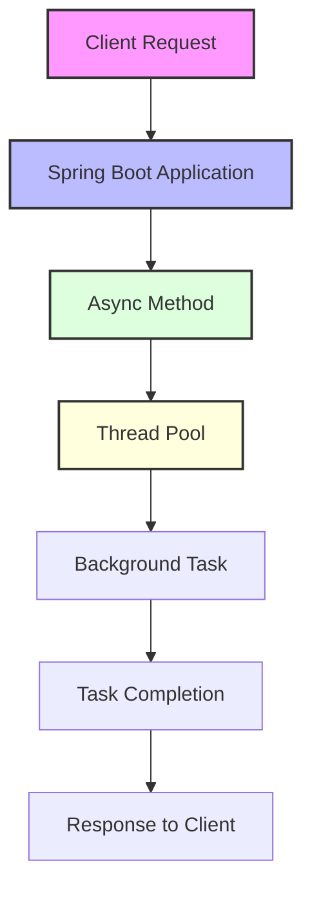
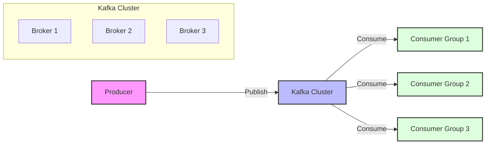
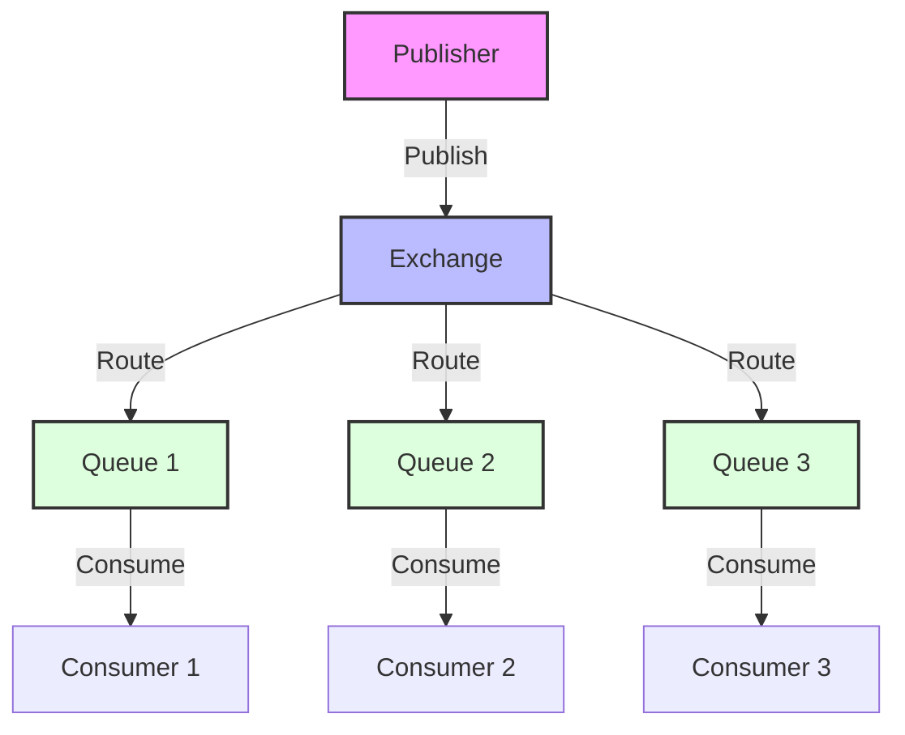

# Asenkron İşlemler ve Message Queues - Spring Boot Ecosystem

Asenkron işlemler ve message queue'lar, modern backend sistemlerinin temel taşlarıdır. Bu teknolojiler, sistemler arası gevşek bağlantı (loose coupling), yüksek throughput, fault tolerance ve scalability sağlar. Spring Boot ekosistemi, enterprise seviyesinde event-driven architecture için kapsamlı araçlar sunar.

## Asenkron İşlemlerin Avantajları

**Neden Asenkron İşlemler Kullanmalıyız?**
- **Decoupling**: Sistemler arası bağımlılığı azaltır
- **Scalability**: Yüksek yük altında sistem performansını korur
- **Resilience**: Hata durumlarında sistem stabilitesi sağlar
- **User Experience**: Non-blocking operations ile daha iyi kullanıcı deneyimi
- **Resource Optimization**: Thread pool'ları ve connection'ları optimize eder

**Message Queue Avantajları:**
- **Reliability**: Message persistence ile veri kaybını önler
- **Load Balancing**: İş yükünü consumer'lar arasında dağıtır
- **Buffering**: Peak load'ları absorbe eder
- **Monitoring**: Message flow'ları görüntülenebilir ve ölçülebilir

## Asenkron İşlem Mimarileri

### Spring Boot Async Processing



Spring Boot'un asenkron işlem desteği, blocking operations'ları background thread'lerde çalıştırarak application'ın responsiveness'ini artırır. Bu yaklaşım, özellikle I/O intensive işlemler için kritiktir.

**@Async Annotation Özellikleri:**
- **Thread Pool Management**: Custom thread pool konfigürasyonu
- **Exception Handling**: Asenkron method'larda hata yönetimi  
- **Return Types**: void, Future, CompletableFuture return types
- **Transaction Context**: Transaction propagation davranışları
- **Security Context**: Security context propagation

**CompletableFuture Advanced Features:**
- **Chaining**: thenApply, thenCompose, thenCombine operations
- **Error Handling**: exceptionally, handle, whenComplete
- **Timeouts**: orTimeout, completeOnTimeout
- **Combining**: allOf, anyOf multiple futures

#### @Async ile Temel Asenkron İşlemler
```java
@Service
@EnableAsync
public class EmailService {
    
    @Async("taskExecutor")
    public CompletableFuture<String> sendEmailAsync(String to, String subject, String body) {
        try {
            // Email gönderme işlemi
            mailSender.send(createMimeMessage(to, subject, body));
            return CompletableFuture.completedFuture("Email sent successfully");
        } catch (Exception e) {
            return CompletableFuture.failedFuture(e);
        }
    }
}

@Configuration
@EnableAsync
public class AsyncConfig implements AsyncConfigurer {
    
    @Bean("taskExecutor")
    public TaskExecutor taskExecutor() {
        ThreadPoolTaskExecutor executor = new ThreadPoolTaskExecutor();
        executor.setCorePoolSize(10);
        executor.setMaxPoolSize(20);
        executor.setQueueCapacity(500);
        executor.setThreadNamePrefix("async-");
        executor.setRejectedExecutionHandler(new CallerRunsPolicy());
        executor.initialize();
        return executor;
    }
}
```

#### CompletableFuture ile İleri Düzey Asenkron İşlemler
```java
@Service
public class OrderProcessingService {
    
    public CompletableFuture<OrderResult> processOrder(Order order) {
        return CompletableFuture
            .supplyAsync(() -> validateOrder(order))
            .thenCompose(validated -> inventoryService.checkStock(validated))
            .thenCompose(stockChecked -> paymentService.processPayment(stockChecked))
            .thenCompose(paid -> shippingService.arrangeShipping(paid))
            .thenApply(this::finalizeOrder)
            .exceptionally(this::handleOrderFailure);
    }
    
    @Async
    public CompletableFuture<Void> sendNotifications(Order order) {
        List<CompletableFuture<Void>> notifications = List.of(
            emailService.sendOrderConfirmation(order),
            smsService.sendOrderNotification(order),
            pushService.sendPushNotification(order)
        );
        
        return CompletableFuture.allOf(notifications.toArray(new CompletableFuture[0]));
    }
}
```

## Message Queue Sistemleri

### Apache Kafka ile Event-Driven Architecture



#### Kafka Producer Configuration
```java
@Configuration
@EnableKafka
public class KafkaProducerConfig {
    
    @Bean
    public ProducerFactory<String, Object> producerFactory() {
        Map<String, Object> configProps = new HashMap<>();
        configProps.put(ProducerConfig.BOOTSTRAP_SERVERS_CONFIG, "localhost:9092");
        configProps.put(ProducerConfig.KEY_SERIALIZER_CLASS_CONFIG, StringSerializer.class);
        configProps.put(ProducerConfig.VALUE_SERIALIZER_CLASS_CONFIG, JsonSerializer.class);
        configProps.put(ProducerConfig.ACKS_CONFIG, "all");
        configProps.put(ProducerConfig.RETRIES_CONFIG, 3);
        configProps.put(ProducerConfig.ENABLE_IDEMPOTENCE_CONFIG, true);
        return new DefaultKafkaProducerFactory<>(configProps);
    }
    
    @Bean
    public KafkaTemplate<String, Object> kafkaTemplate() {
        return new KafkaTemplate<>(producerFactory());
    }
}

@Service
public class EventPublisher {
    
    @Autowired
    private KafkaTemplate<String, Object> kafkaTemplate;
    
    public void publishOrderEvent(OrderEvent event) {
        kafkaTemplate.send("order-events", event.getOrderId(), event)
            .addCallback(
                result -> log.info("Order event sent successfully: {}", event),
                failure -> log.error("Failed to send order event: {}", event, failure)
            );
    }
}
```

#### Kafka Consumer Configuration
```java
@Configuration
@EnableKafka
public class KafkaConsumerConfig {
    
    @Bean
    public ConsumerFactory<String, OrderEvent> orderEventConsumerFactory() {
        Map<String, Object> props = new HashMap<>();
        props.put(ConsumerConfig.BOOTSTRAP_SERVERS_CONFIG, "localhost:9092");
        props.put(ConsumerConfig.GROUP_ID_CONFIG, "order-processing-group");
        props.put(ConsumerConfig.KEY_DESERIALIZER_CLASS_CONFIG, StringDeserializer.class);
        props.put(ConsumerConfig.VALUE_DESERIALIZER_CLASS_CONFIG, JsonDeserializer.class);
        props.put(ConsumerConfig.AUTO_OFFSET_RESET_CONFIG, "earliest");
        props.put(ConsumerConfig.ENABLE_AUTO_COMMIT_CONFIG, false);
        props.put(JsonDeserializer.TRUSTED_PACKAGES, "*");
        return new DefaultKafkaConsumerFactory<>(props);
    }
    
    @Bean
    public ConcurrentKafkaListenerContainerFactory<String, OrderEvent> 
           orderEventKafkaListenerContainerFactory() {
        ConcurrentKafkaListenerContainerFactory<String, OrderEvent> factory =
            new ConcurrentKafkaListenerContainerFactory<>();
        factory.setConsumerFactory(orderEventConsumerFactory());
        factory.setConcurrency(3); // Paralel consumer sayısı
        factory.getContainerProperties().setAckMode(ContainerProperties.AckMode.MANUAL_IMMEDIATE);
        return factory;
    }
}

@Component
public class OrderEventConsumer {
    
    @KafkaListener(topics = "order-events", 
                   containerFactory = "orderEventKafkaListenerContainerFactory")
    public void handleOrderEvent(OrderEvent event, Acknowledgment ack) {
        try {
            processOrderEvent(event);
            ack.acknowledge(); // Manuel acknowledgment
        } catch (Exception e) {
            log.error("Error processing order event: {}", event, e);
            // Error handling strategy (DLQ, retry, etc.)
        }
    }
}
```

### RabbitMQ ile Message Queue Patterns



#### RabbitMQ Configuration
```java
@Configuration
@EnableRabbit
public class RabbitMQConfig {
    
    public static final String ORDERS_QUEUE = "orders.queue";
    public static final String ORDERS_EXCHANGE = "orders.exchange";
    public static final String ORDERS_ROUTING_KEY = "orders.created";
    
    @Bean
    public Queue ordersQueue() {
        return QueueBuilder.durable(ORDERS_QUEUE)
            .withArgument("x-dead-letter-exchange", "orders.dlx")
            .withArgument("x-dead-letter-routing-key", "orders.failed")
            .build();
    }
    
    @Bean
    public TopicExchange ordersExchange() {
        return new TopicExchange(ORDERS_EXCHANGE);
    }
    
    @Bean
    public Binding ordersBinding() {
        return BindingBuilder
            .bind(ordersQueue())
            .to(ordersExchange())
            .with(ORDERS_ROUTING_KEY);
    }
    
    @Bean
    public RabbitTemplate rabbitTemplate(ConnectionFactory connectionFactory) {
        RabbitTemplate template = new RabbitTemplate(connectionFactory);
        template.setMessageConverter(new Jackson2JsonMessageConverter());
        template.setMandatory(true);
        template.setConfirmCallback((correlationData, ack, cause) -> {
            if (!ack) {
                log.error("Message not delivered: {}", cause);
            }
        });
        return template;
    }
}
```

#### Publisher-Subscriber Pattern
```java
@Service
public class OrderEventPublisher {
    
    @Autowired
    private RabbitTemplate rabbitTemplate;
    
    public void publishOrderCreated(Order order) {
        OrderCreatedEvent event = new OrderCreatedEvent(order);
        rabbitTemplate.convertAndSend(
            RabbitMQConfig.ORDERS_EXCHANGE,
            RabbitMQConfig.ORDERS_ROUTING_KEY,
            event
        );
    }
}

@RabbitListener(queues = RabbitMQConfig.ORDERS_QUEUE)
@Component
public class OrderEventHandler {
    
    public void handleOrderCreated(OrderCreatedEvent event) {
        // Inventory güncelleme
        inventoryService.decreaseStock(event.getItems());
        
        // Email gönderme
        emailService.sendOrderConfirmation(event.getCustomerEmail());
        
        // Analytics event'i
        analyticsService.trackOrderCreated(event);
    }
}
```

### Work Queue Pattern (Task Distribution)
```java
@Service
public class TaskDistributor {
    
    @Autowired
    private RabbitTemplate rabbitTemplate;
    
    public void distributeImageProcessingTask(ImageProcessingTask task) {
        rabbitTemplate.convertAndSend("image.processing.queue", task);
    }
}

@RabbitListener(queues = "image.processing.queue", concurrency = "3-10")
@Component
public class ImageProcessingWorker {
    
    public void processImage(ImageProcessingTask task) {
        // CPU-intensive image processing
        BufferedImage processed = imageProcessor.process(task.getImageData());
        
        // S3'e upload
        s3Service.uploadProcessedImage(processed, task.getOutputPath());
        
        // Completion event
        eventPublisher.publishImageProcessed(task.getTaskId());
    }
}
```

## Redis ile Asenkron Processing

### Redis Streams ile Event Processing
```java
@Configuration
public class RedisStreamConfig {
    
    @Bean
    public RedisTemplate<String, Object> redisTemplate(RedisConnectionFactory factory) {
        RedisTemplate<String, Object> template = new RedisTemplate<>();
        template.setConnectionFactory(factory);
        template.setKeySerializer(new StringRedisSerializer());
        template.setValueSerializer(new GenericJackson2JsonRedisSerializer());
        return template;
    }
    
    @Bean
    public StreamMessageListenerContainer<String, ObjectRecord<String, Object>> 
           streamMessageListenerContainer(RedisConnectionFactory factory) {
        StreamMessageListenerContainer.StreamMessageListenerContainerOptions<String, ObjectRecord<String, Object>> options =
            StreamMessageListenerContainer.StreamMessageListenerContainerOptions
                .builder()
                .batchSize(10)
                .targetType(OrderEvent.class)
                .build();
                
        return StreamMessageListenerContainer.create(factory, options);
    }
}

@Service
public class RedisStreamProducer {
    
    @Autowired
    private RedisTemplate<String, Object> redisTemplate;
    
    public void publishOrderEvent(OrderEvent event) {
        ObjectRecord<String, OrderEvent> record = StreamRecords.objectBacked(event)
            .withStreamKey("order-stream");
        redisTemplate.opsForStream().add(record);
    }
}

@Component
public class RedisStreamConsumer {
    
    @StreamListener("order-stream")
    public void handleOrderEvent(OrderEvent event) {
        // Event processing logic
        orderProcessingService.processOrderEvent(event);
    }
}
```

### Redis Pub/Sub ile Real-time Notifications
```java
@Configuration
public class RedisPubSubConfig {
    
    @Bean
    public RedisMessageListenerContainer redisMessageListenerContainer(
            RedisConnectionFactory factory) {
        RedisMessageListenerContainer container = new RedisMessageListenerContainer();
        container.setConnectionFactory(factory);
        container.addMessageListener(new NotificationListener(), "notifications");
        return container;
    }
}

@Component
public class NotificationPublisher {
    
    @Autowired
    private RedisTemplate<String, Object> redisTemplate;
    
    public void publishNotification(Notification notification) {
        redisTemplate.convertAndSend("notifications", notification);
    }
}

@Component
public class NotificationListener implements MessageListener {
    
    @Override
    public void onMessage(Message message, byte[] pattern) {
        // WebSocket ile client'lara notification gönder
        webSocketHandler.broadcastNotification(message.getBody());
    }
}
```

## Performance Optimization Strategies

### Batch Processing
```java
@Service
public class BatchOrderProcessor {
    
    @Scheduled(fixedDelay = 30000) // 30 saniyede bir
    public void processPendingOrders() {
        List<Order> pendingOrders = orderRepository.findPendingOrders();
        
        if (!pendingOrders.isEmpty()) {
            List<CompletableFuture<Void>> futures = pendingOrders.stream()
                .map(this::processOrderAsync)
                .collect(Collectors.toList());
                
            CompletableFuture.allOf(futures.toArray(new CompletableFuture[0]))
                .join();
        }
    }
    
    @Async
    private CompletableFuture<Void> processOrderAsync(Order order) {
        return CompletableFuture.runAsync(() -> {
            orderProcessingService.processOrder(order);
        });
    }
}
```

### Circuit Breaker Pattern ile Resilience
```java
@Component
public class ResilientMessageProcessor {
    
    @CircuitBreaker(name = "message-processor", fallbackMethod = "fallbackProcess")
    @Retry(name = "message-processor")
    @TimeLimiter(name = "message-processor")
    public CompletableFuture<String> processMessage(Message message) {
        return CompletableFuture.supplyAsync(() -> {
            // Message processing logic
            return externalService.processMessage(message);
        });
    }
    
    public CompletableFuture<String> fallbackProcess(Message message, Exception e) {
        // Fallback strategy - queue for later processing
        deadLetterQueueService.sendToDeadLetterQueue(message);
        return CompletableFuture.completedFuture("Queued for retry");
    }
}
```

## Monitoring ve Observability

### Message Queue Metrics
```java
@Component
public class MessageQueueMetrics {
    
    private final MeterRegistry meterRegistry;
    private final Counter messagesProcessed;
    private final Timer processingTime;
    
    public MessageQueueMetrics(MeterRegistry meterRegistry) {
        this.meterRegistry = meterRegistry;
        this.messagesProcessed = Counter.builder("messages.processed")
            .tag("queue", "orders")
            .register(meterRegistry);
        this.processingTime = Timer.builder("message.processing.time")
            .register(meterRegistry);
    }
    
    public void recordMessageProcessed(String queueName) {
        messagesProcessed.increment(Tags.of("queue", queueName));
    }
    
    public void recordProcessingTime(Duration duration) {
        processingTime.record(duration);
    }
}
```

### Health Checks
```java
@Component
public class MessageQueueHealthIndicator implements HealthIndicator {
    
    @Autowired
    private KafkaTemplate<String, Object> kafkaTemplate;
    
    @Override
    public Health health() {
        try {
            kafkaTemplate.send("health-check", "ping").get(5, TimeUnit.SECONDS);
            return Health.up()
                .withDetail("kafka", "Available")
                .build();
        } catch (Exception e) {
            return Health.down()
                .withDetail("kafka", "Unavailable")
                .withException(e)
                .build();
        }
    }
}
```

## Production Best Practices

### Error Handling ve Dead Letter Queues
```java
@Component
public class DeadLetterQueueHandler {
    
    @KafkaListener(topics = "orders.dlq")
    public void handleDeadLetterMessage(OrderEvent event, 
                                      @Header("kafka_exception_message") String error) {
        log.error("Processing failed order event: {} with error: {}", event, error);
        
        // Manual investigation için database'e kaydet
        deadLetterRepository.save(new DeadLetterRecord(event, error));
        
        // Alert gönder
        alertService.sendDeadLetterAlert(event, error);
    }
}
```

### Message Deduplication
```java
@Service
public class DeduplicationService {
    
    @Autowired
    private RedisTemplate<String, String> redisTemplate;
    
    public boolean isMessageProcessed(String messageId) {
        return redisTemplate.hasKey("processed:" + messageId);
    }
    
    public void markMessageAsProcessed(String messageId) {
        redisTemplate.opsForValue().set(
            "processed:" + messageId, 
            "true", 
            Duration.ofHours(24)
        );
    }
}
```

### Backpressure Handling
```java
@Service
public class BackpressureAwareProcessor {
    
    private final Semaphore semaphore = new Semaphore(100); // Max 100 concurrent
    
    @KafkaListener(topics = "high-volume-events")
    public void processHighVolumeEvent(Event event) {
        if (semaphore.tryAcquire()) {
            try {
                processEvent(event);
            } finally {
                semaphore.release();
            }
        } else {
            // Backpressure - reject or queue
            log.warn("Rejecting event due to backpressure: {}", event.getId());
            throw new BackpressureException("System overloaded");
        }
    }
}
```

## Container ve Cloud Deployment

### Docker Compose ile Development Setup
```yaml
version: '3.8'
services:
  kafka:
    image: confluentinc/cp-kafka:latest
    environment:
      KAFKA_ZOOKEEPER_CONNECT: zookeeper:2181
      KAFKA_ADVERTISED_LISTENERS: PLAINTEXT://localhost:9092
      KAFKA_OFFSETS_TOPIC_REPLICATION_FACTOR: 1
    ports:
      - "9092:9092"
      
  redis:
    image: redis:alpine
    ports:
      - "6379:6379"
      
  rabbitmq:
    image: rabbitmq:3-management
    ports:
      - "5672:5672"
      - "15672:15672"
```

### Kubernetes Deployment
```yaml
apiVersion: apps/v1
kind: Deployment
metadata:
  name: order-processor
spec:
  replicas: 3
  selector:
    matchLabels:
      app: order-processor
  template:
    metadata:
      labels:
        app: order-processor
    spec:
      containers:
      - name: order-processor
        image: order-processor:latest
        env:
        - name: KAFKA_BROKERS
          value: "kafka-service:9092"
        - name: REDIS_URL
          value: "redis-service:6379"
        resources:
          limits:
            memory: "512Mi"
            cpu: "500m"
          requests:
            memory: "256Mi"
            cpu: "250m"
```

Bu asenkron işlemler ve message queue yapıları, sistem performansını artırır, scalability sağlar ve fault tolerance özelliklerini geliştirir. Spring Boot ecosystem'i ile birlikte production-ready çözümler sunar.

## Spring Boot Event-Driven Architecture - İleri Düzey Entegrasyon

### Spring Cloud Stream Ecosystem

#### Binder Implementations
Spring Cloud Stream, farklı message broker'lar için binder implementasyonları sunar:

**Apache Kafka Binder** - Yüksek hacimli senaryolar için:
```yaml
spring:
  cloud:
    stream:
      kafka:
        binder:
          brokers: localhost:9092
          auto-create-topics: true
          configuration:
            compression.type: gzip
            batch.size: 16384
            linger.ms: 5
            retries: 3
        bindings:
          output:
            producer:
              configuration:
                acks: all
                enable.idempotence: true
```

**RabbitMQ Binder** - Düşük gecikme mesajlaşma için:
```yaml
spring:
  cloud:
    stream:
      rabbit:
        binder:
          connection-name-prefix: stream-
        bindings:
          input:
            consumer:
              acknowledge-mode: manual
              durability: true
              prefetch: 10
```

#### Functional Programming Model

**Message Production** - Supplier<> kullanımı:
```java
@Component
public class EventProducer {
    
    @Bean
    public Supplier<Flux<OrderEvent>> orderEventSupplier() {
        return () -> Flux.interval(Duration.ofSeconds(1))
            .map(sequence -> OrderEvent.builder()
                .orderId(UUID.randomUUID().toString())
                .timestamp(Instant.now())
                .status(OrderStatus.CREATED)
                .build());
    }
}
```

**Message Consumption** - Consumer<> kullanımı:
```java
@Component
public class EventConsumer {
    
    @Bean
    public Consumer<OrderEvent> orderEventProcessor() {
        return orderEvent -> {
            log.info("Processing order: {}", orderEvent.getOrderId());
            // Order processing logic
            processOrder(orderEvent);
        };
    }
    
    @Bean
    public Consumer<PaymentEvent> paymentEventProcessor() {
        return paymentEvent -> {
            log.info("Processing payment: {}", paymentEvent.getPaymentId());
            updateOrderStatus(paymentEvent.getOrderId(), OrderStatus.PAID);
        };
    }
}
```

**Message Transformation** - Function<> kullanımı:
```java
@Component
public class EventTransformer {
    
    @Bean
    public Function<OrderEvent, PaymentRequest> orderToPaymentFunction() {
        return orderEvent -> PaymentRequest.builder()
            .orderId(orderEvent.getOrderId())
            .amount(orderEvent.getTotalAmount())
            .customerId(orderEvent.getCustomerId())
            .build();
    }
}
```

#### Message Routing ve Error Handling

**Dynamic Destination Routing**:
```java
@Component
public class DynamicRouter {
    
    @Bean
    public Function<Message<OrderEvent>, Message<OrderEvent>> orderRouter() {
        return message -> {
            OrderEvent event = message.getPayload();
            String destination = determineDestination(event);
            
            return MessageBuilder
                .withPayload(event)
                .setHeader("spring.cloud.stream.sendto.destination", destination)
                .build();
        };
    }
    
    private String determineDestination(OrderEvent event) {
        return switch (event.getOrderType()) {
            case PREMIUM -> "premium-orders";
            case STANDARD -> "standard-orders";
            case BULK -> "bulk-orders";
        };
    }
}
```

**Error Handling ve Dead Letter Queues**:
```yaml
spring:
  cloud:
    stream:
      bindings:
        orderProcessor-in-0:
          consumer:
            max-attempts: 3
            back-off-initial-interval: 1000
            back-off-max-interval: 10000
            back-off-multiplier: 2
          destination: orders
        orderProcessor-in-0.errors:
          destination: orders.dlq
```

```java
@Component
public class ErrorHandler {
    
    @ServiceActivator(inputChannel = "orders.dlq")
    public void handleError(Message<OrderEvent> failedMessage) {
        log.error("Message failed after all retries: {}", failedMessage);
        
        // Dead letter message processing
        ErrorEvent errorEvent = ErrorEvent.builder()
            .originalMessage(failedMessage.getPayload())
            .error(getErrorFromHeaders(failedMessage))
            .timestamp(Instant.now())
            .build();
            
        errorEventRepository.save(errorEvent);
        notificationService.sendAlert(errorEvent);
    }
}
```

### Apache Kafka Integration - İleri Düzey

#### Spring Kafka Advanced Configuration

**Producer Configuration**:
```java
@Configuration
public class KafkaProducerConfig {
    
    @Bean
    public ProducerFactory<String, Object> producerFactory() {
        Map<String, Object> props = new HashMap<>();
        props.put(ProducerConfig.BOOTSTRAP_SERVERS_CONFIG, "localhost:9092");
        props.put(ProducerConfig.KEY_SERIALIZER_CLASS_CONFIG, StringSerializer.class);
        props.put(ProducerConfig.VALUE_SERIALIZER_CLASS_CONFIG, JsonSerializer.class);
        
        // Idempotent producer for exactly-once semantics
        props.put(ProducerConfig.ENABLE_IDEMPOTENCE_CONFIG, true);
        props.put(ProducerConfig.ACKS_CONFIG, "all");
        props.put(ProducerConfig.RETRIES_CONFIG, Integer.MAX_VALUE);
        props.put(ProducerConfig.MAX_IN_FLIGHT_REQUESTS_PER_CONNECTION, 5);
        
        // Performance optimization
        props.put(ProducerConfig.BATCH_SIZE_CONFIG, 16384);
        props.put(ProducerConfig.LINGER_MS_CONFIG, 5);
        props.put(ProducerConfig.COMPRESSION_TYPE_CONFIG, "gzip");
        
        return new DefaultKafkaProducerFactory<>(props);
    }
    
    @Bean
    public KafkaTemplate<String, Object> kafkaTemplate() {
        KafkaTemplate<String, Object> template = new KafkaTemplate<>(producerFactory());
        template.setDefaultTopic("default-topic");
        
        // Transaction support
        template.setTransactionIdPrefix("tx-");
        
        return template;
    }
}
```

**Transactional Producer Example**:
```java
@Service
@Transactional
public class TransactionalEventPublisher {
    
    @Autowired
    private KafkaTemplate<String, Object> kafkaTemplate;
    
    @Autowired
    private OrderRepository orderRepository;
    
    @KafkaTransactional
    public void publishOrderEvent(Order order) {
        // Database operation
        Order savedOrder = orderRepository.save(order);
        
        // Kafka message publishing
        OrderEvent event = OrderEvent.from(savedOrder);
        kafkaTemplate.send("orders", event.getOrderId(), event);
        
        // Additional message
        AuditEvent auditEvent = AuditEvent.builder()
            .entityId(savedOrder.getId())
            .action("ORDER_CREATED")
            .timestamp(Instant.now())
            .build();
        kafkaTemplate.send("audit", auditEvent);
    }
}
```

#### Consumer Groups ve Partition Management

**Advanced Consumer Configuration**:
```java
@Configuration
public class KafkaConsumerConfig {
    
    @Bean
    public ConsumerFactory<String, OrderEvent> orderConsumerFactory() {
        Map<String, Object> props = new HashMap<>();
        props.put(ConsumerConfig.BOOTSTRAP_SERVERS_CONFIG, "localhost:9092");
        props.put(ConsumerConfig.GROUP_ID_CONFIG, "order-processing-group");
        props.put(ConsumerConfig.KEY_DESERIALIZER_CLASS_CONFIG, StringDeserializer.class);
        props.put(ConsumerConfig.VALUE_DESERIALIZER_CLASS_CONFIG, JsonDeserializer.class);
        
        // Partition assignment strategy
        props.put(ConsumerConfig.PARTITION_ASSIGNMENT_STRATEGY_CONFIG, 
                  Arrays.asList(StickyAssignor.class, RangeAssignor.class));
        
        // Offset management
        props.put(ConsumerConfig.AUTO_OFFSET_RESET_CONFIG, "earliest");
        props.put(ConsumerConfig.ENABLE_AUTO_COMMIT_CONFIG, false);
        
        // Performance tuning
        props.put(ConsumerConfig.FETCH_MIN_BYTES_CONFIG, 1024);
        props.put(ConsumerConfig.FETCH_MAX_WAIT_MS_CONFIG, 500);
        props.put(ConsumerConfig.MAX_POLL_RECORDS_CONFIG, 100);
        
        return new DefaultKafkaConsumerFactory<>(props);
    }
    
    @Bean
    public ConcurrentKafkaListenerContainerFactory<String, OrderEvent> 
           orderKafkaListenerContainerFactory() {
        
        ConcurrentKafkaListenerContainerFactory<String, OrderEvent> factory =
            new ConcurrentKafkaListenerContainerFactory<>();
        factory.setConsumerFactory(orderConsumerFactory());
        
        // Concurrency configuration
        factory.setConcurrency(3);
        
        // Manual acknowledgment
        factory.getContainerProperties().setAckMode(ContainerProperties.AckMode.MANUAL);
        
        // Error handling
        factory.setCommonErrorHandler(new DefaultErrorHandler(
            new FixedBackOff(1000L, 3)));
        
        return factory;
    }
}
```

**Consumer Implementation with Manual Offset Management**:
```java
@Component
public class OrderEventConsumer {
    
    @KafkaListener(topics = "orders", groupId = "order-processing-group")
    public void processOrder(OrderEvent orderEvent, 
                           @Header(KafkaHeaders.RECEIVED_PARTITION_ID) int partition,
                           @Header(KafkaHeaders.OFFSET) long offset,
                           Acknowledgment acknowledgment) {
        try {
            log.info("Processing order {} from partition {} at offset {}", 
                    orderEvent.getOrderId(), partition, offset);
            
            // Business logic
            processOrderBusinessLogic(orderEvent);
            
            // Manual acknowledgment
            acknowledgment.acknowledge();
            
        } catch (Exception e) {
            log.error("Error processing order {}: {}", orderEvent.getOrderId(), e.getMessage());
            // Error handling logic
            handleProcessingError(orderEvent, e);
        }
    }
    
    @KafkaListener(topics = "orders.dlq", groupId = "dlq-processing-group")
    public void processDLQ(OrderEvent failedOrder, Acknowledgment ack) {
        log.warn("Processing failed order from DLQ: {}", failedOrder.getOrderId());
        
        // DLQ processing logic
        processFailedOrder(failedOrder);
        ack.acknowledge();
    }
}
```

#### Kafka Streams Integration

**Stream Processing Configuration**:
```java
@Configuration
@EnableKafkaStreams
public class KafkaStreamsConfig {
    
    @Bean(name = KafkaStreamsDefaultConfiguration.DEFAULT_STREAMS_CONFIG_BEAN_NAME)
    public KafkaStreamsConfiguration kStreamsConfig() {
        Map<String, Object> props = new HashMap<>();
        props.put(StreamsConfig.APPLICATION_ID_CONFIG, "order-stream-processor");
        props.put(StreamsConfig.BOOTSTRAP_SERVERS_CONFIG, "localhost:9092");
        props.put(StreamsConfig.DEFAULT_KEY_SERDE_CLASS_CONFIG, Serdes.String().getClass());
        props.put(StreamsConfig.DEFAULT_VALUE_SERDE_CLASS_CONFIG, JsonSerde.class);
        
        // Exactly-once processing
        props.put(StreamsConfig.PROCESSING_GUARANTEE_CONFIG, StreamsConfig.EXACTLY_ONCE_V2);
        
        return new KafkaStreamsConfiguration(props);
    }
}
```

**Stream Processing Topology**:
```java
@Component
public class OrderStreamProcessor {
    
    @Autowired
    private StreamsBuilder streamsBuilder;
    
    @PostConstruct
    public void buildTopology() {
        KStream<String, OrderEvent> orderStream = streamsBuilder.stream("orders");
        
        // Order validation stream
        KStream<String, OrderEvent> validOrders = orderStream
            .filter((key, order) -> order.getAmount().compareTo(BigDecimal.ZERO) > 0)
            .filter((key, order) -> order.getCustomerId() != null);
        
        // Order aggregation by customer
        KTable<String, CustomerOrderSummary> customerSummary = validOrders
            .groupBy((key, order) -> order.getCustomerId())
            .aggregate(
                CustomerOrderSummary::new,
                (customerId, order, summary) -> summary.addOrder(order),
                Materialized.<String, CustomerOrderSummary, KeyValueStore<Bytes, byte[]>>as("customer-summary")
                    .withKeySerde(Serdes.String())
                    .withValueSerde(new JsonSerde<>(CustomerOrderSummary.class))
            );
        
        // High-value orders detection
        KStream<String, OrderEvent> highValueOrders = validOrders
            .filter((key, order) -> order.getAmount().compareTo(new BigDecimal("1000")) > 0);
        
        highValueOrders.to("high-value-orders");
        
        // Windowed aggregation for real-time analytics
        KTable<Windowed<String>, Long> orderCountByTimeWindow = validOrders
            .groupByKey()
            .windowedBy(TimeWindows.of(Duration.ofMinutes(5)))
            .count(Materialized.as("order-counts-by-window"));
        
        // Convert windowed KTable to stream for downstream processing
        orderCountByTimeWindow.toStream()
            .map((windowedKey, count) -> KeyValue.pair(
                windowedKey.key() + "@" + windowedKey.window().start(),
                new WindowedOrderCount(windowedKey.key(), windowedKey.window(), count)
            ))
            .to("order-analytics");
    }
}
```

### RabbitMQ Advanced Features

#### Advanced AMQP Configuration

**Connection Factory with SSL/TLS**:
```java
@Configuration
public class RabbitConfig {
    
    @Bean
    public ConnectionFactory connectionFactory() {
        CachingConnectionFactory factory = new CachingConnectionFactory();
        factory.setHost("rabbitmq.example.com");
        factory.setPort(5672);
        factory.setUsername("app-user");
        factory.setPassword("secure-password");
        
        // SSL Configuration
        factory.getRabbitConnectionFactory().useSslProtocol();
        factory.setConnectionTimeout(30000);
        
        // Connection pooling
        factory.setChannelCacheSize(25);
        factory.setConnectionCacheSize(3);
        
        return factory;
    }
    
    @Bean
    public RabbitTemplate rabbitTemplate(ConnectionFactory connectionFactory) {
        RabbitTemplate template = new RabbitTemplate(connectionFactory);
        template.setMessageConverter(new Jackson2JsonMessageConverter());
        
        // Publisher confirms
        template.setConfirmCallback((correlationData, ack, cause) -> {
            if (ack) {
                log.info("Message confirmed: {}", correlationData);
            } else {
                log.error("Message rejected: {} - {}", correlationData, cause);
            }
        });
        
        // Return callback for unroutable messages
        template.setReturnsCallback(returned -> {
            log.warn("Returned message: {} - {}", returned.getMessage(), returned.getReplyText());
        });
        
        return template;
    }
}
```

#### Exchange Types ve Routing

**Complex Routing Configuration**:
```java
@Configuration
public class RabbitTopologyConfig {
    
    // Topic Exchange for flexible routing
    @Bean
    public TopicExchange orderTopicExchange() {
        return ExchangeBuilder.topicExchange("order.topic")
            .durable(true)
            .build();
    }
    
    // Headers Exchange for complex routing
    @Bean
    public HeadersExchange notificationHeadersExchange() {
        return ExchangeBuilder.headersExchange("notification.headers")
            .durable(true)
            .build();
    }
    
    // Queues with TTL and DLX
    @Bean
    public Queue priorityOrderQueue() {
        return QueueBuilder.durable("priority.orders")
            .withArgument("x-message-ttl", 300000) // 5 minutes TTL
            .withArgument("x-dead-letter-exchange", "order.dlx")
            .withArgument("x-dead-letter-routing-key", "priority.failed")
            .build();
    }
    
    @Bean
    public Queue standardOrderQueue() {
        return QueueBuilder.durable("standard.orders")
            .withArgument("x-message-ttl", 600000) // 10 minutes TTL
            .withArgument("x-dead-letter-exchange", "order.dlx")
            .build();
    }
    
    // Dead Letter Exchange
    @Bean
    public DirectExchange deadLetterExchange() {
        return ExchangeBuilder.directExchange("order.dlx")
            .durable(true)
            .build();
    }
    
    @Bean
    public Queue deadLetterQueue() {
        return QueueBuilder.durable("order.dlq").build();
    }
    
    // Bindings
    @Bean
    public Binding priorityOrderBinding() {
        return BindingBuilder
            .bind(priorityOrderQueue())
            .to(orderTopicExchange())
            .with("order.priority.*");
    }
    
    @Bean
    public Binding standardOrderBinding() {
        return BindingBuilder
            .bind(standardOrderQueue())
            .to(orderTopicExchange())
            .with("order.standard.*");
    }
    
    @Bean
    public Binding deadLetterBinding() {
        return BindingBuilder
            .bind(deadLetterQueue())
            .to(deadLetterExchange())
            .with("priority.failed");
    }
}
```

**Advanced Message Publisher**:
```java
@Service
public class AdvancedMessagePublisher {
    
    @Autowired
    private RabbitTemplate rabbitTemplate;
    
    public void publishOrderEvent(OrderEvent orderEvent) {
        String routingKey = determineRoutingKey(orderEvent);
        
        MessageProperties properties = new MessageProperties();
        properties.setDeliveryMode(MessageDeliveryMode.PERSISTENT);
        properties.setPriority(orderEvent.getPriority());
        properties.setExpiration("300000"); // 5 minutes
        
        // Headers for headers exchange routing
        properties.setHeader("customer_type", orderEvent.getCustomerType());
        properties.setHeader("order_value", orderEvent.getTotalAmount());
        properties.setHeader("region", orderEvent.getRegion());
        
        Message message = new Message(serialize(orderEvent), properties);
        
        rabbitTemplate.send("order.topic", routingKey, message);
    }
    
    private String determineRoutingKey(OrderEvent event) {
        if (event.isPriority()) {
            return "order.priority." + event.getRegion();
        } else {
            return "order.standard." + event.getRegion();
        }
    }
}
```

### Design Patterns ve Best Practices

#### Saga Pattern Implementation

**Orchestration-based Saga**:
```java
@Component
public class OrderSagaOrchestrator {
    
    @Autowired
    private PaymentService paymentService;
    
    @Autowired
    private InventoryService inventoryService;
    
    @Autowired
    private ShippingService shippingService;
    
    @SagaOrchestrationStart
    public void processOrder(OrderEvent orderEvent) {
        SagaTransaction saga = SagaTransaction.builder()
            .sagaId(UUID.randomUUID().toString())
            .orderEvent(orderEvent)
            .build();
        
        try {
            // Step 1: Reserve Inventory
            InventoryReservation reservation = inventoryService.reserveItems(orderEvent);
            saga.addCompensation(() -> inventoryService.releaseReservation(reservation));
            
            // Step 2: Process Payment
            PaymentResult payment = paymentService.processPayment(orderEvent);
            saga.addCompensation(() -> paymentService.refundPayment(payment));
            
            // Step 3: Arrange Shipping
            ShippingArrangement shipping = shippingService.arrangeShipping(orderEvent);
            saga.addCompensation(() -> shippingService.cancelShipping(shipping));
            
            // Success - Mark order as completed
            completeOrder(orderEvent);
            
        } catch (Exception e) {
            // Compensate all completed steps
            saga.compensate();
            failOrder(orderEvent, e);
        }
    }
}
```

**Choreography-based Saga**:
```java
@Component
public class OrderChoreographyHandler {
    
    @EventHandler
    public void on(OrderCreatedEvent event) {
        // Publish inventory reservation request
        InventoryReservationRequest request = InventoryReservationRequest.builder()
            .orderId(event.getOrderId())
            .items(event.getItems())
            .sagaId(event.getSagaId())
            .build();
            
        eventPublisher.publish("inventory.reserve", request);
    }
    
    @EventHandler
    public void on(InventoryReservedEvent event) {
        // Publish payment processing request
        PaymentProcessingRequest request = PaymentProcessingRequest.builder()
            .orderId(event.getOrderId())
            .amount(event.getAmount())
            .sagaId(event.getSagaId())
            .build();
            
        eventPublisher.publish("payment.process", request);
    }
    
    @EventHandler
    public void on(PaymentProcessedEvent event) {
        // Publish shipping arrangement request
        ShippingRequest request = ShippingRequest.builder()
            .orderId(event.getOrderId())
            .address(event.getShippingAddress())
            .sagaId(event.getSagaId())
            .build();
            
        eventPublisher.publish("shipping.arrange", request);
    }
    
    @EventHandler
    public void on(PaymentFailedEvent event) {
        // Compensate inventory reservation
        InventoryReleaseRequest request = InventoryReleaseRequest.builder()
            .orderId(event.getOrderId())
            .sagaId(event.getSagaId())
            .build();
            
        eventPublisher.publish("inventory.release", request);
    }
}
```

#### Event Sourcing Implementation

**Event Store**:
```java
@Entity
@Table(name = "event_store")
public class EventStore {
    @Id
    private String eventId;
    private String aggregateId;
    private String eventType;
    private String eventData;
    private Long version;
    private Instant timestamp;
    
    // getters, setters, builders
}

@Repository
public interface EventStoreRepository extends JpaRepository<EventStore, String> {
    List<EventStore> findByAggregateIdOrderByVersionAsc(String aggregateId);
    List<EventStore> findByAggregateIdAndVersionGreaterThanOrderByVersionAsc(
        String aggregateId, Long version);
}
```

**Aggregate with Event Sourcing**:
```java
@Component
public class OrderAggregate {
    private String orderId;
    private OrderStatus status;
    private List<OrderItem> items;
    private BigDecimal totalAmount;
    private Long version = 0L;
    
    private List<DomainEvent> uncommittedEvents = new ArrayList<>();
    
    public void createOrder(CreateOrderCommand command) {
        OrderCreatedEvent event = OrderCreatedEvent.builder()
            .orderId(command.getOrderId())
            .customerId(command.getCustomerId())
            .items(command.getItems())
            .timestamp(Instant.now())
            .build();
            
        apply(event);
        uncommittedEvents.add(event);
    }
    
    public void markAsPaid(MarkAsPaidCommand command) {
        if (status != OrderStatus.PENDING) {
            throw new IllegalStateException("Order must be pending to mark as paid");
        }
        
        OrderPaidEvent event = OrderPaidEvent.builder()
            .orderId(this.orderId)
            .paymentId(command.getPaymentId())
            .timestamp(Instant.now())
            .build();
            
        apply(event);
        uncommittedEvents.add(event);
    }
    
    // Event application methods
    private void apply(OrderCreatedEvent event) {
        this.orderId = event.getOrderId();
        this.status = OrderStatus.PENDING;
        this.items = event.getItems();
        this.totalAmount = calculateTotal(event.getItems());
        this.version++;
    }
    
    private void apply(OrderPaidEvent event) {
        this.status = OrderStatus.PAID;
        this.version++;
    }
    
    // Rebuild from events
    public static OrderAggregate fromEvents(List<DomainEvent> events) {
        OrderAggregate aggregate = new OrderAggregate();
        events.forEach(aggregate::apply);
        return aggregate;
    }
    
    public List<DomainEvent> getUncommittedEvents() {
        return new ArrayList<>(uncommittedEvents);
    }
    
    public void markEventsAsCommitted() {
        uncommittedEvents.clear();
    }
}
```

#### Outbox Pattern Implementation

**Outbox Event Entity**:
```java
@Entity
@Table(name = "outbox_events")
public class OutboxEvent {
    @Id
    private String id;
    private String aggregateId;
    private String eventType;
    private String eventData;
    private Instant createdAt;
    private boolean processed;
    
    // getters, setters, builders
}
```

**Transactional Outbox Service**:
```java
@Service
@Transactional
public class OutboxService {
    
    @Autowired
    private OutboxEventRepository outboxRepository;
    
    @Autowired
    private OrderRepository orderRepository;
    
    public void processOrderWithOutbox(Order order) {
        // 1. Save business entity
        Order savedOrder = orderRepository.save(order);
        
        // 2. Save outbox event in same transaction
        OutboxEvent outboxEvent = OutboxEvent.builder()
            .id(UUID.randomUUID().toString())
            .aggregateId(savedOrder.getId())
            .eventType("OrderCreated")
            .eventData(serialize(OrderCreatedEvent.from(savedOrder)))
            .createdAt(Instant.now())
            .processed(false)
            .build();
            
        outboxRepository.save(outboxEvent);
    }
}
```

**Outbox Event Publisher**:
```java
@Component
public class OutboxEventPublisher {
    
    @Autowired
    private OutboxEventRepository outboxRepository;
    
    @Autowired
    private KafkaTemplate<String, Object> kafkaTemplate;
    
    @Scheduled(fixedDelay = 5000) // Every 5 seconds
    public void publishPendingEvents() {
        List<OutboxEvent> pendingEvents = outboxRepository
            .findByProcessedFalseOrderByCreatedAtAsc();
            
        for (OutboxEvent event : pendingEvents) {
            try {
                // Publish to message broker
                kafkaTemplate.send(
                    determineTopicName(event.getEventType()),
                    event.getAggregateId(),
                    deserialize(event.getEventData())
                );
                
                // Mark as processed
                event.setProcessed(true);
                outboxRepository.save(event);
                
            } catch (Exception e) {
                log.error("Failed to publish outbox event {}: {}", 
                         event.getId(), e.getMessage());
            }
        }
    }
}
```

### Monitoring ve Performance Optimization

#### Comprehensive Metrics Collection

**Micrometer Integration**:
```java
@Component
public class MessageProcessingMetrics {
    
    private final Counter messagesSent;
    private final Counter messagesReceived;
    private final Timer processingTime;
    private final Gauge queueDepth;
    
    public MessageProcessingMetrics(MeterRegistry meterRegistry) {
        this.messagesSent = Counter.builder("messages.sent.total")
            .description("Total messages sent")
            .tag("type", "order")
            .register(meterRegistry);
            
        this.messagesReceived = Counter.builder("messages.received.total")
            .description("Total messages received")
            .tag("type", "order")
            .register(meterRegistry);
            
        this.processingTime = Timer.builder("message.processing.duration")
            .description("Message processing time")
            .register(meterRegistry);
            
        this.queueDepth = Gauge.builder("queue.depth")
            .description("Current queue depth")
            .register(meterRegistry, this, MessageProcessingMetrics::getQueueDepth);
    }
    
    public void recordMessageSent() {
        messagesSent.increment();
    }
    
    public void recordMessageReceived() {
        messagesReceived.increment();
    }
    
    public Timer.Sample startProcessingTimer() {
        return Timer.start();
    }
    
    public void recordProcessingTime(Timer.Sample sample) {
        sample.stop(processingTime);
    }
    
    private double getQueueDepth() {
        // Implementation to get actual queue depth
        return getCurrentQueueDepth();
    }
}
```

#### Distributed Tracing

**Sleuth Configuration**:
```java
@Configuration
public class TracingConfig {
    
    @Bean
    public Sender sender() {
        return OkHttpSender.create("http://jaeger:14268/api/traces");
    }
    
    @Bean
    public AsyncReporter<Span> spanReporter() {
        return AsyncReporter.create(sender());
    }
    
    @Bean
    public Sampler alwaysSampler() {
        return Sampler.create(1.0f); // 100% sampling for demo
    }
}
```

**Custom Tracing**:
```java
@Component
public class TracedMessageProcessor {
    
    @Autowired
    private Tracer tracer;
    
    @KafkaListener(topics = "orders")
    public void processOrder(OrderEvent orderEvent) {
        Span span = tracer.nextSpan()
            .name("order-processing")
            .tag("order.id", orderEvent.getOrderId())
            .tag("customer.id", orderEvent.getCustomerId())
            .start();
            
        try (Tracer.SpanInScope ws = tracer.withSpanInScope(span)) {
            // Business logic
            processOrderBusinessLogic(orderEvent);
            
            span.tag("processing.result", "success");
        } catch (Exception e) {
            span.tag("processing.result", "error");
            span.tag("error.message", e.getMessage());
            throw e;
        } finally {
            span.end();
        }
    }
}
```

#### Performance Tuning Strategies

**Connection Pool Optimization**:
```yaml
spring:
  kafka:
    producer:
      properties:
        connections.max.idle.ms: 300000
        metadata.max.age.ms: 300000
    consumer:
      properties:
        connections.max.idle.ms: 300000
        heartbeat.interval.ms: 3000
        session.timeout.ms: 30000

  rabbitmq:
    connection-timeout: 30000
    requested-heartbeat: 60
    cache:
      connection:
        size: 3
      channel:
        size: 25
```

**Backpressure Handling**:
```java
@Component
public class BackpressureHandler {
    
    private final Semaphore processingPermits = new Semaphore(100);
    
    @KafkaListener(topics = "orders")
    public void processOrderWithBackpressure(OrderEvent orderEvent) throws InterruptedException {
        // Acquire permit for processing
        processingPermits.acquire();
        
        try {
            // Process order
            processOrder(orderEvent);
        } finally {
            // Release permit
            processingPermits.release();
        }
    }
    
    @Scheduled(fixedRate = 10000)
    public void reportAvailableCapacity() {
        int available = processingPermits.availablePermits();
        log.info("Available processing capacity: {}", available);
        
        // Publish capacity metrics
        Metrics.gauge("processing.capacity.available", available);
    }
}
```
