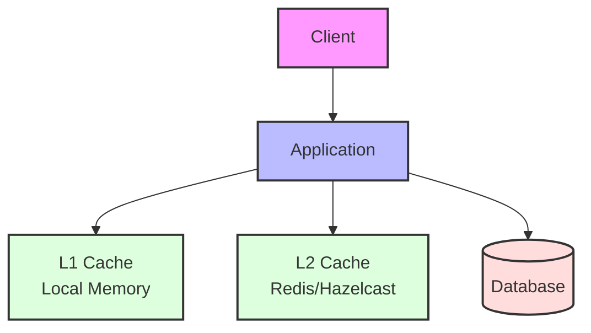
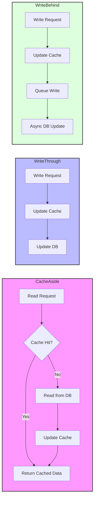
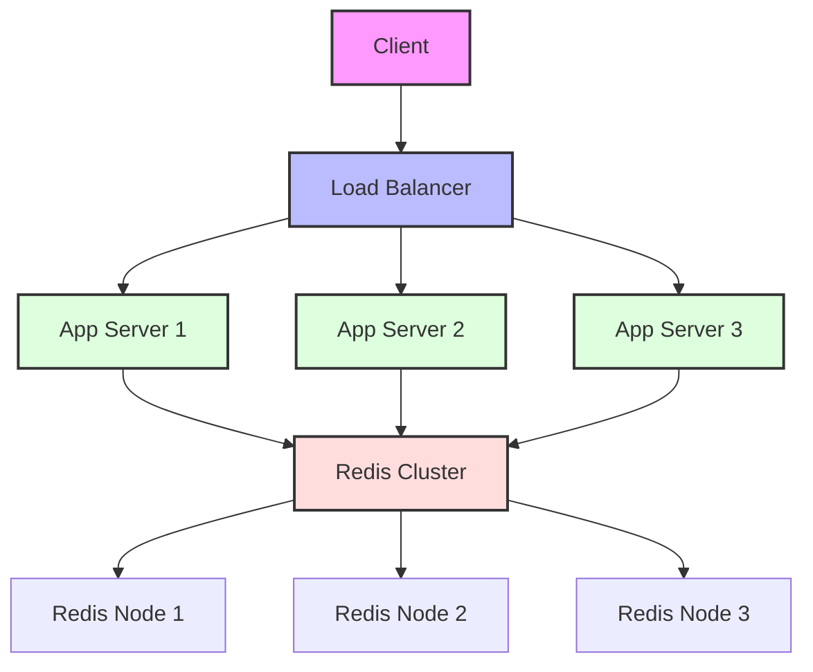
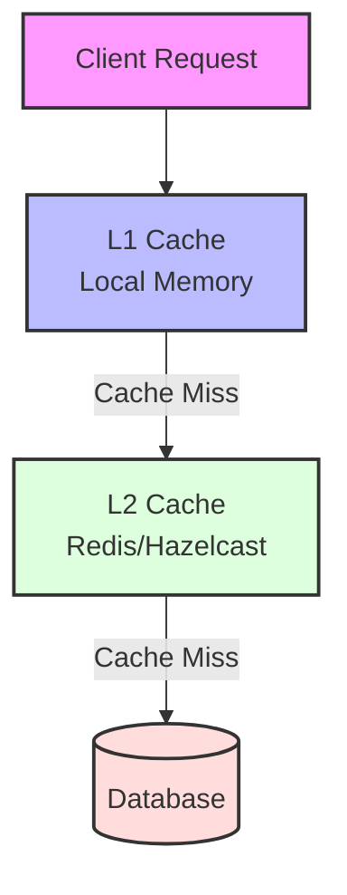
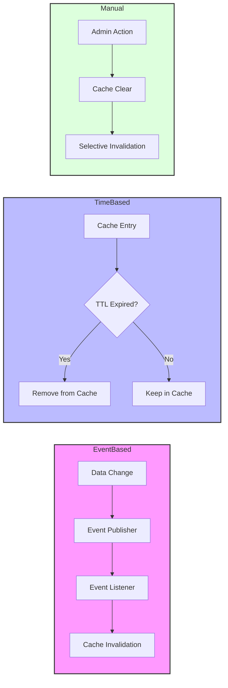

# Caching (Önbellekleme) - Spring Boot Multi-Layer Approach

Caching, sistemlerin performansını dramtik olarak artıran en etkili optimizasyon tekniklerinden biridir. Verileri geçici olarak hızlı erişilebilir konumlarda saklayarak, pahalı hesaplama ve I/O işlemlerini minimize eder. Spring Boot, çok katmanlı caching stratejileri için kapsamlı destek sunar.

## Cache Architecture Overview



## Cache Patterns



### Cache Pattern Açıklamaları

1. **Cache-Aside (Lazy Loading)**
   - Uygulama cache'i manuel olarak yönetir
   - Cache miss durumunda otomatik data loading
   - Selective caching imkanı

2. **Write-Through**
   - Cache ve database'e eşzamanlı yazma
   - Veri tutarlılığı garanti edilir
   - Her yazma işlemi için iki operasyon gerekir

3. **Write-Behind (Write-Back)**
   - Cache'e hemen yazma, database'e asenkron yazma
   - Yüksek performans sağlar
   - Veri kaybı riski vardır

## Distributed Cache Architecture



## Application-Level Caching

### Spring Cache Abstraction

Spring Cache Abstraction, caching işlemlerini declarative annotations aracılığıyla yönetmeyi sağlar. Bu yaklaşım, business logic'ten caching concern'lerini ayırarak clean code prensiplerini destekler.

**Temel Özellikler:**
- **@Cacheable**: Methodların sonuçlarını cache'ler
- **@CacheEvict**: Cache'den veri silmeye yarar
- **@CachePut**: Her çağrıda cache'i günceller
- **@Caching**: Birden fazla cache annotation'ını grup halinde kullanır
- **Conditional caching**: Şartlı cache'leme imkanı

**Cache Providers Karşılaştırması:**
- **Redis**: Distributed caching için ideal, persistence desteği
- **Hazelcast**: In-memory data grid, clustering yetenekleri
- **Caffeine**: High-performance local cache, Guava'nın gelişmiş versiyonu
- **EhCache**: Hem local hem distributed cache desteği

### Basic Cache Configuration
```java
@Configuration
@EnableCaching
public class CacheConfig {
    
    @Bean
    public CacheManager cacheManager() {
        RedisCacheManager.Builder builder = RedisCacheManager
            .RedisCacheManagerBuilder
            .fromConnectionFactory(redisConnectionFactory())
            .cacheDefaults(cacheConfiguration());
        
        return builder.build();
    }
    
    @Bean
    public RedisCacheConfiguration cacheConfiguration() {
        return RedisCacheConfiguration.defaultCacheConfig()
            .entryTtl(Duration.ofMinutes(10))
            .serializeKeysWith(RedisSerializationContext.SerializationPair
                .fromSerializer(new StringRedisSerializer()))
            .serializeValuesWith(RedisSerializationContext.SerializationPair
                .fromSerializer(new GenericJackson2JsonRedisSerializer()));
    }
}
```

### Cache Annotations
```java
@Service
public class UserService {
    
    @Cacheable(value = "users", key = "#userId")
    public User getUserById(Long userId) {
        log.info("Fetching user from database: {}", userId);
        return userRepository.findById(userId).orElse(null);
    }
    
    @CachePut(value = "users", key = "#user.id")
    public User updateUser(User user) {
        User updatedUser = userRepository.save(user);
        log.info("User updated and cached: {}", updatedUser.getId());
        return updatedUser;
    }
    
    @CacheEvict(value = "users", key = "#userId")
    public void deleteUser(Long userId) {
        userRepository.deleteById(userId);
        log.info("User deleted and evicted from cache: {}", userId);
    }
    
    @CacheEvict(value = "users", allEntries = true)
    public void clearAllUsers() {
        log.info("All users evicted from cache");
    }
}
```

## Distributed Caching (Redis ile)

Distributed caching, multiple application instance'lar arasında paylaşılan cache verilerini yönetir. Redis, yüksek performanslı, in-memory veri yapıları sunarak distributed caching için ideal bir çözümdür.

### Redis'in Avantajları

**Neden Redis Kullanmalıyız?**
- **High Performance**: In-memory operations ile microsecond düzeyinde response time
- **Data Structures**: String, Hash, List, Set, Sorted Set gibi zengin veri yapıları
- **Persistence**: RDB ve AOF ile veri dayanıklılığı
- **Replication**: Master-slave replication ile high availability
- **Clustering**: Horizontal scaling için Redis Cluster desteği
- **Pub/Sub**: Real-time messaging capabilities

**Redis Deployment Options:**
- **Redis Standalone**: Tek instance, development için uygun
- **Redis Sentinel**: Automatic failover ve monitoring
- **Redis Cluster**: Horizontal partitioning ve sharding
- **Redis Streams**: Event sourcing ve real-time analytics

### Spring Data Redis Integration

Spring Data Redis, Redis operations için comprehensive abstraction sağlar. RedisTemplate ve ReactiveRedisTemplate ile blocking ve non-blocking operations desteklenir.

**Connection Factory Seçenekleri:**
- **Lettuce**: Netty-based, reactive support, connection pooling
- **Jedis**: Traditional blocking client, thread-safe connection pooling

### Redis Configuration
```java
@Configuration
public class RedisConfig {
    
    @Bean
    public LettuceConnectionFactory redisConnectionFactory() {
        RedisStandaloneConfiguration config = new RedisStandaloneConfiguration();
        config.setHostName("localhost");
        config.setPort(6379);
        config.setPassword("password");
        
        LettuceClientConfiguration clientConfig = LettuceClientConfiguration.builder()
            .commandTimeout(Duration.ofSeconds(5))
            .poolConfig(connectionPoolConfig())
            .build();
            
        return new LettuceConnectionFactory(config, clientConfig);
    }
    
    @Bean
    public RedisTemplate<String, Object> redisTemplate() {
        RedisTemplate<String, Object> template = new RedisTemplate<>();
        template.setConnectionFactory(redisConnectionFactory());
        
        // JSON serialization
        GenericJackson2JsonRedisSerializer serializer = new GenericJackson2JsonRedisSerializer();
        template.setKeySerializer(new StringRedisSerializer());
        template.setValueSerializer(serializer);
        template.setHashKeySerializer(new StringRedisSerializer());
        template.setHashValueSerializer(serializer);
        
        return template;
    }
    
    private GenericObjectPoolConfig<?> connectionPoolConfig() {
        GenericObjectPoolConfig<?> config = new GenericObjectPoolConfig<>();
        config.setMaxTotal(20);
        config.setMaxIdle(10);
        config.setMinIdle(5);
        return config;
    }
}
```

### Manual Cache Operations
```java
@Service
public class CacheService {
    
    @Autowired
    private RedisTemplate<String, Object> redisTemplate;
    
    public void cacheObject(String key, Object value, Duration ttl) {
        redisTemplate.opsForValue().set(key, value, ttl);
    }
    
    public <T> T getCachedObject(String key, Class<T> type) {
        Object cached = redisTemplate.opsForValue().get(key);
        return type.cast(cached);
    }
    
    public void evictFromCache(String key) {
        redisTemplate.delete(key);
    }
    
    public void cacheList(String key, List<Object> list, Duration ttl) {
        redisTemplate.opsForList().rightPushAll(key, list.toArray());
        redisTemplate.expire(key, ttl);
    }
    
    public Set<Object> getCachedSet(String key) {
        return redisTemplate.opsForSet().members(key);
    }
}
```

## Cache Patterns ve Best Practices

Cache patterns, farklı use case'ler için optimize edilmiş caching stratejileridir. Her pattern'in kendine özgü avantaj ve dezavantajları vardır.

### Cache Hierarchies

**Multi-Level Cache Architecture:**
- **L1 (Local Cache)**: Application memory'de, en hızlı erişim
- **L2 (Distributed Cache)**: Redis/Hazelcast, cluster-wide paylaşım
- **L3 (Database)**: Son çare olarak database'den okuma

**Cache Coherence Strategies:**
- **Write-through**: Tüm cache level'lara eşzamanlı yazma
- **Write-behind**: Async yazma ile performance optimizasyonu
- **Cache invalidation**: Event-driven cache temizleme
- **TTL-based expiration**: Zaman bazlı otomatik temizleme

### Cache-Aside Pattern

Cache-Aside (Lazy Loading) pattern'de, uygulama cache'i manuel olarak yönetir. Bu en yaygın kullanılan cache pattern'idir.

**Avantajlar:**
- Application'ın cache kontrolü tam elinde
- Cache miss durumunda otomatik data loading
- Selective caching imkanı

**Dezavantajlar:**
- Cache logic business code'a karışır
- Manual cache invalidation gerekir
- Potential inconsistency riski
```java
@Service
public class ProductService {
    
    @Autowired
    private ProductRepository productRepository;
    
    @Autowired
    private RedisTemplate<String, Object> redisTemplate;
    
    public Product getProduct(Long productId) {
        String cacheKey = "product:" + productId;
        
        // Cache'den kontrol et
        Product cachedProduct = (Product) redisTemplate.opsForValue().get(cacheKey);
        if (cachedProduct != null) {
            return cachedProduct;
        }
        
        // Database'den getir
        Product product = productRepository.findById(productId).orElse(null);
        if (product != null) {
            // Cache'e ekle
            redisTemplate.opsForValue().set(cacheKey, product, Duration.ofMinutes(30));
        }
        
        return product;
    }
    
    public Product updateProduct(Product product) {
        // Database'i güncelle
        Product updatedProduct = productRepository.save(product);
        
        // Cache'i güncelle
        String cacheKey = "product:" + product.getId();
        redisTemplate.opsForValue().set(cacheKey, updatedProduct, Duration.ofMinutes(30));
        
        return updatedProduct;
    }
}
```

### Write-Through Pattern
```java
@Service
public class WriteThoughCacheService {
    
    @Autowired
    private UserRepository userRepository;
    
    @Autowired
    private RedisTemplate<String, Object> redisTemplate;
    
    public User saveUser(User user) {
        // Database'e yaz
        User savedUser = userRepository.save(user);
        
        // Cache'e yaz (write-through)
        String cacheKey = "user:" + savedUser.getId();
        redisTemplate.opsForValue().set(cacheKey, savedUser, Duration.ofHours(1));
        
        return savedUser;
    }
}
```

### Write-Behind (Write-Back) Pattern
```java
@Service
public class WriteBehindCacheService {
    
    @Autowired
    private RedisTemplate<String, Object> redisTemplate;
    
    @Autowired
    private UserRepository userRepository;
    
    private final Queue<User> writeQueue = new ConcurrentLinkedQueue<>();
    
    public User updateUser(User user) {
        // Cache'i hemen güncelle
        String cacheKey = "user:" + user.getId();
        redisTemplate.opsForValue().set(cacheKey, user, Duration.ofHours(1));
        
        // Database yazma işlemini queue'ya ekle
        writeQueue.offer(user);
        
        return user;
    }
    
    @Scheduled(fixedDelay = 5000) // 5 saniyede bir
    public void flushToDatabase() {
        List<User> usersToWrite = new ArrayList<>();
        User user;
        
        while ((user = writeQueue.poll()) != null) {
            usersToWrite.add(user);
        }
        
        if (!usersToWrite.isEmpty()) {
            userRepository.saveAll(usersToWrite);
            log.info("Flushed {} users to database", usersToWrite.size());
        }
    }
}
```

## Multi-Level Caching



### Multi-Level Cache Özellikleri

1. **L1 Cache (Local Memory)**
   - En hızlı erişim süresi
   - Uygulama instance'ına özel
   - Sınırlı bellek kapasitesi

2. **L2 Cache (Distributed)**
   - Cluster-wide paylaşım
   - Daha yüksek kapasite
   - Network latency etkisi

3. **Database**
   - Son çare olarak kullanılır
   - Tam veri tutarlılığı
   - En yavaş erişim süresi

## Cache Invalidation Strategies



### Cache Invalidation Stratejileri

1. **Event-Based Invalidation**
   - Veri değişikliğinde otomatik tetiklenme
   - Event-driven mimari ile entegrasyon
   - Seçici cache temizleme

2. **Time-Based Invalidation**
   - TTL (Time-To-Live) bazlı temizleme
   - Otomatik cache yenileme
   - Basit ve etkili yönetim

3. **Manual Invalidation**
   - Admin kontrolü
   - Acil durum müdahalesi
   - Seçici cache yönetimi

## CDN Integration

### Static Content Caching
```java
@RestController
public class StaticContentController {
    
    @GetMapping(value = "/images/{filename}", produces = MediaType.APPLICATION_OCTET_STREAM_VALUE)
    public ResponseEntity<Resource> getImage(@PathVariable String filename) {
        try {
            Resource resource = resourceLoader.getResource("classpath:static/images/" + filename);
            
            return ResponseEntity.ok()
                .cacheControl(CacheControl.maxAge(Duration.ofDays(7))) // 7 gün cache
                .eTag(calculateETag(resource))
                .body(resource);
        } catch (Exception e) {
            return ResponseEntity.notFound().build();
        }
    }
    
    @GetMapping("/api/products/{id}")
    public ResponseEntity<Product> getProduct(@PathVariable Long id) {
        Product product = productService.getProduct(id);
        
        return ResponseEntity.ok()
            .cacheControl(CacheControl.maxAge(Duration.ofMinutes(10)))
            .eTag(String.valueOf(product.getLastModified().hashCode()))
            .body(product);
    }
}
```

### API Response Caching
```java
@RestController
public class CachedApiController {
    
    @GetMapping("/api/popular-products")
    @Cacheable(value = "popular-products", unless = "#result.isEmpty()")
    public ResponseEntity<List<Product>> getPopularProducts() {
        List<Product> products = productService.getPopularProducts();
        
        return ResponseEntity.ok()
            .cacheControl(CacheControl.maxAge(Duration.ofMinutes(15)))
            .body(products);
    }
    
    @GetMapping("/api/categories")
    public ResponseEntity<List<Category>> getCategories(HttpServletRequest request) {
        String etag = categoryService.getCategoriesETag();
        
        // ETag kontrolü
        if (request.getHeader("If-None-Match") != null && 
            request.getHeader("If-None-Match").equals(etag)) {
            return ResponseEntity.status(HttpStatus.NOT_MODIFIED).build();
        }
        
        List<Category> categories = categoryService.getAllCategories();
        
        return ResponseEntity.ok()
            .eTag(etag)
            .cacheControl(CacheControl.maxAge(Duration.ofHours(1)))
            .body(categories);
    }
}
```

## Performance Monitoring

### Cache Metrics
```java
@Component
public class CacheMetrics {
    
    private final MeterRegistry meterRegistry;
    private final Counter cacheHits;
    private final Counter cacheMisses;
    private final Timer cacheLoadTime;
    
    public CacheMetrics(MeterRegistry meterRegistry) {
        this.meterRegistry = meterRegistry;
        this.cacheHits = Counter.builder("cache.hits")
            .tag("cache", "users")
            .register(meterRegistry);
        this.cacheMisses = Counter.builder("cache.misses")
            .tag("cache", "users")
            .register(meterRegistry);
        this.cacheLoadTime = Timer.builder("cache.load.time")
            .register(meterRegistry);
    }
    
    public void recordCacheHit(String cacheName) {
        cacheHits.increment(Tags.of("cache", cacheName));
    }
    
    public void recordCacheMiss(String cacheName) {
        cacheMisses.increment(Tags.of("cache", cacheName));
    }
    
    public void recordCacheLoadTime(Duration duration) {
        cacheLoadTime.record(duration);
    }
}
```

### Cache Health Monitoring
```java
@Component
public class CacheHealthIndicator implements HealthIndicator {
    
    @Autowired
    private RedisTemplate<String, Object> redisTemplate;
    
    @Override
    public Health health() {
        try {
            redisTemplate.opsForValue().set("health-check", "ping", Duration.ofSeconds(10));
            String response = (String) redisTemplate.opsForValue().get("health-check");
            
            if ("ping".equals(response)) {
                return Health.up()
                    .withDetail("redis", "Available")
                    .withDetail("responseTime", measureResponseTime() + "ms")
                    .build();
            } else {
                return Health.down()
                    .withDetail("redis", "Invalid response")
                    .build();
            }
        } catch (Exception e) {
            return Health.down()
                .withDetail("redis", "Unavailable")
                .withException(e)
                .build();
        }
    }
    
    private long measureResponseTime() {
        long start = System.currentTimeMillis();
        redisTemplate.opsForValue().get("health-check");
        return System.currentTimeMillis() - start;
    }
}
```

## Production Best Practices

### Cache Warming
```java
@Component
public class CacheWarmupService {
    
    @Autowired
    private ProductService productService;
    
    @Autowired
    private UserService userService;
    
    @EventListener(ApplicationReadyEvent.class)
    public void warmupCache() {
        log.info("Starting cache warmup...");
        
        CompletableFuture.runAsync(this::warmupPopularProducts);
        CompletableFuture.runAsync(this::warmupFrequentlyAccessedUsers);
        
        log.info("Cache warmup initiated");
    }
    
    private void warmupPopularProducts() {
        List<Long> popularProductIds = getPopularProductIds();
        popularProductIds.forEach(productService::getProduct);
        log.info("Warmed up {} popular products", popularProductIds.size());
    }
    
    private void warmupFrequentlyAccessedUsers() {
        List<Long> frequentUserIds = getFrequentlyAccessedUserIds();
        frequentUserIds.forEach(userService::getUserById);
        log.info("Warmed up {} frequently accessed users", frequentUserIds.size());
    }
}
```

### Cache Disaster Recovery
```java
@Service
public class CacheDisasterRecoveryService {
    
    @Autowired
    private RedisTemplate<String, Object> primaryRedis;
    
    @Autowired
    private RedisTemplate<String, Object> backupRedis;
    
    @Retryable(value = Exception.class, maxAttempts = 3)
    public Object getCachedValue(String key) {
        try {
            return primaryRedis.opsForValue().get(key);
        } catch (Exception e) {
            log.warn("Primary Redis failed, trying backup: {}", e.getMessage());
            return backupRedis.opsForValue().get(key);
        }
    }
    
    @Async
    public void syncCaches() {
        Set<String> keys = primaryRedis.keys("*");
        for (String key : keys) {
            try {
                Object value = primaryRedis.opsForValue().get(key);
                Long ttl = primaryRedis.getExpire(key);
                
                if (ttl > 0) {
                    backupRedis.opsForValue().set(key, value, Duration.ofSeconds(ttl));
                }
            } catch (Exception e) {
                log.error("Failed to sync cache key {}: {}", key, e.getMessage());
            }
        }
    }
}
```

Bu caching stratejileri, sistem performansını önemli ölçüde artırır ve database yükünü azaltır. Redis ile distributed caching, multi-level cache yapıları ve proper invalidation stratejileri ile production-ready caching solutions sağlar.
