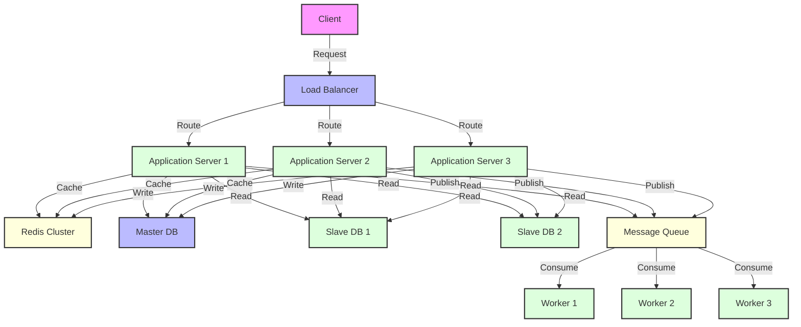

# Performans ve Ölçeklenebilirlik

Modern backend sistemlerinin başarısı, yüksek performans ve etkili ölçeklenebilirlik stratejilerine dayanır. Bu bölüm, Spring Boot ekosistemi kullanarak enterprise seviyesinde performans optimizasyonları ve ölçeklenebilirlik çözümleri sunar.



## Performans Optimizasyonunun Önemi

**Performans optimizasyonu neden kritiktir?**
- **Kullanıcı deneyimi**: Hızlı yanıt süreleri kullanıcı memnuniyetini artırır
- **Maliyet optimizasyonu**: Verimli kaynak kullanımı operational costs'ları düşürür
- **Rekabet avantajı**: Performanslı sistemler pazar avantajı sağlar
- **Ölçeklenebilirlik**: Artan yük altında sistem stabilitesi
- **SLA compliance**: Service Level Agreement gereksinimlerini karşılama

## İçindekiler

### ✅ [Load Balancing (Yük Dengeleme)](./load-balancing.md)

Yük dengeleme, gelen istekleri birden fazla sunucu arasında dağıtarak sistem kapasitesini artırır ve tek nokta arızalarını önler.

**Kapsadığı Konular:**
- **Application-Level Load Balancing**: Spring Cloud LoadBalancer ile client-side yük dengeleme
- **Load Balancing Algorithms**: Round Robin (default), Random, Weighted Response Time, Zone Aware strategies
- **Service Discovery Integration**: Eureka/Consul ile dynamic service registration ve health check-based routing  
- **Circuit Breaker Integration**: Resilience4j ile unhealthy instances'ları bypass etme ve fail-fast behavior
- **Infrastructure-Level Solutions**: NGINX/HAProxy reverse proxy, Cloud Load Balancers (AWS ALB/NLB, Azure LB)
- **Monitoring ve Optimization**: Micrometer metrics, health checks, auto-scaling strategies

### ✅ [Caching (Önbellekleme)](./caching.md) 

Caching stratejileri, pahalı hesaplama ve I/O işlemlerini minimize ederek sistem performansını dramatik olarak artırır.

**Multi-Layer Caching Approach:**
- **Application-Level Caching**: Spring Cache abstraction (@Cacheable, @CacheEvict, @CachePut annotations)
- **Cache Providers**: Redis (distributed), Hazelcast (in-memory grid), Caffeine (local cache), EhCache
- **Distributed Caching**: Spring Data Redis ile RedisTemplate, ReactiveRedisTemplate, Redis Cluster/Sentinel
- **HTTP Caching**: ETag support, Last-Modified headers, reverse proxy caching, CDN integration
- **Cache Patterns**: Cache-aside, write-through, write-behind, refresh-ahead strategies
- **Performance Tuning**: Connection pooling, pipeline operations, compression, monitoring

### ✅ [Database Sharding ve Partitioning](./sharding.md)

Veri hacmi arttıkça veritabanı performansını korumak için horizontal ve vertical sharding stratejileri.

**Comprehensive Sharding Solutions:**
- **Horizontal Sharding**: User ID, geographic region, tenant ID based sharding strategies
- **Shard Key Selection**: Hash-based vs range-based partitioning, consistent hashing algorithms
- **Spring Data JPA Integration**: @Entity with custom sharding, AbstractRoutingDataSource implementations
- **Database Partitioning Types**: Range, Hash, List, Composite partitioning (PostgreSQL/MySQL)
- **Cross-Shard Operations**: Distributed queries, saga pattern for transactions, eventual consistency
- **Monitoring**: Shard utilization balance, query performance metrics, connection pool monitoring

### ✅ [Database Replication](./replication.md)

High availability ve read scalability için database replication stratejileri ve Spring Boot entegrasyonu.

**Multi-DataSource Architecture:**
- **Master-Slave Configuration**: Multiple DataSource beans, @Primary/@Qualifier annotations
- **Transaction Routing**: @Transactional(readOnly = true) otomatik routing, custom transaction advisors
- **Connection Pooling**: Separate HikariCP pools, connection lifecycle management
- **Replication Types**: Synchronous (strong consistency), Asynchronous (better performance), Semi-synchronous
- **Advanced Patterns**: Read-write splitting, geographic distribution, multi-master setups
- **Monitoring**: Replication lag tracking, custom health indicators, automated failover

### ✅ [Asenkron İşlemler ve Message Queues](./async-processing.md)

Event-driven architecture ve message-based communication ile system decoupling ve scalability.

**Spring Boot Event-Driven Architecture:**
- **Spring Cloud Stream Ecosystem**: Kafka/RabbitMQ binders, functional programming model (Supplier/Consumer/Function)
- **Apache Kafka Integration**: @KafkaListener, KafkaTemplate, exactly-once semantics, transaction support
- **Producer Configuration**: Idempotent producers, compression strategies, batch optimization
- **Consumer Groups**: Parallel processing, partition assignment strategies, offset management
- **Advanced Patterns**: Saga pattern (orchestration/choreography), Event Sourcing, Outbox pattern, Bulkhead pattern
- **Monitoring**: Micrometer integration, distributed tracing, backpressure handling, performance tuning
- Message deduplication
- Backpressure handling

## Performans Metrikleri

### Temel Metrikler
- **Throughput**: İşlenen request sayısı/saniye
- **Latency**: Request-response süresi
- **Error Rate**: Hatalı request oranı
- **Resource Utilization**: CPU, Memory, Network kullanımı

### Spring Boot Actuator ile Monitoring
```java
@Component
public class PerformanceMetrics {
    
    private final MeterRegistry meterRegistry;
    
    @EventListener
    public void handleRequest(RequestEvent event) {
        Timer.Sample sample = Timer.start(meterRegistry);
        sample.stop(Timer.builder("request.duration")
            .tag("endpoint", event.getEndpoint())
            .register(meterRegistry));
    }
}
```

Bu bölümdeki stratejiler, yüksek performanslı ve ölçeklenebilir sistemler tasarlamak için temel yapı taşlarını oluşturur.
