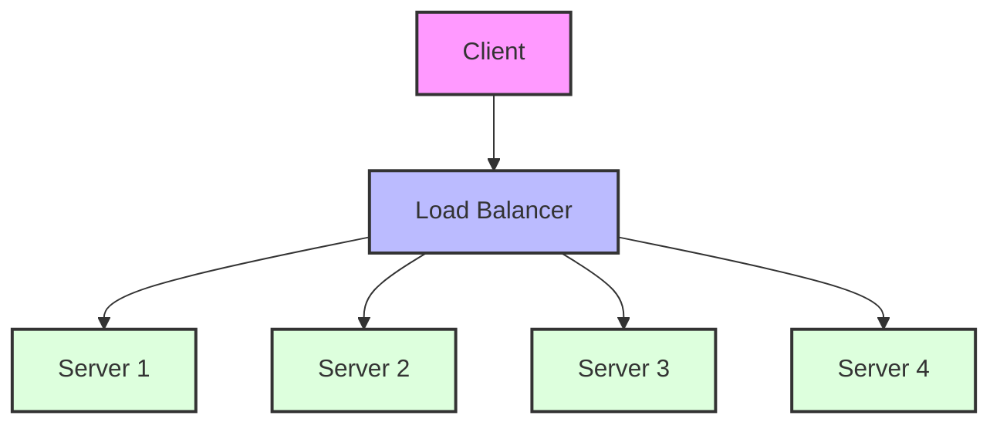
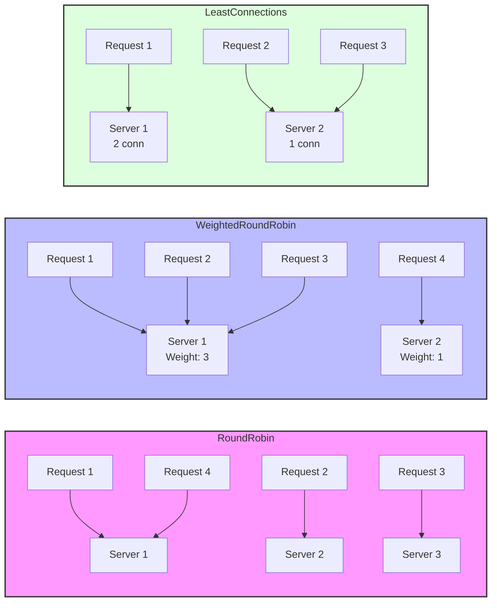
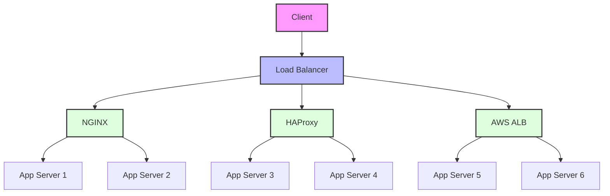

# Load Balancing (Yük Dengeleme) - Spring Boot Ecosystem

Load balancing, gelen istekleri birden fazla sunucu arasında dağıtarak sistem performansını ve kullanılabilirliğini artıran kritik bir tekniktir. Spring Boot ekosistemi, hem uygulama seviyesinde hem de altyapı seviyesinde çeşitli load balancing stratejileri sunar.

## Load Balancing Overview



## Load Balancing Algorithms



## Infrastructure Components



## Application-Level Load Balancing

### Spring Cloud LoadBalancer

Spring Cloud LoadBalancer, Netflix Ribbon'ın yerini alan modern bir client-side load balancing çözümüdür. Microservice mimarilerinde, servisler arası iletişimde otomatik yük dengeleme sağlar.

**Temel Özellikler:**
- **Client-side load balancing**: İstemci tarafında yük dengeleme yaparak merkezi load balancer ihtiyacını ortadan kaldırır
- **Reactive support**: Spring WebFlux ile tam entegrasyon, non-blocking operations
- **Service Discovery Integration**: Eureka, Consul gibi service discovery araçları ile dinamik servis keşfi
- **Health check-based routing**: Sağlıksız servis instance'larını otomatik olarak devre dışı bırakır
- **Configurable algorithms**: Farklı yük dengeleme algoritmaları arasında seçim yapabilme

### Load Balancing Algorithms

Load balancing algoritmaları, isteklerin sunucular arasında nasıl dağıtılacağını belirler. Her algoritmanın kendine özgü avantaj ve dezavantajları vardır.

#### Round Robin (Default)

Round Robin algoritması, istekleri sırayla her sunucuya göndererek eşit dağılım sağlar. En basit ve yaygın kullanılan algoritmadır.

```java
@Configuration
public class LoadBalancerConfiguration {
    
    @Bean
    public ReactorLoadBalancer<ServiceInstance> reactorServiceInstanceLoadBalancer(
            Environment environment,
            LoadBalancerClientFactory loadBalancerClientFactory) {
        String name = environment.getProperty(LoadBalancerClientFactory.PROPERTY_NAME);
        return new RoundRobinLoadBalancer(
            loadBalancerClientFactory.getLazyProvider(name, ServiceInstanceListSupplier.class),
            name);
    }
}
```

#### Weighted Response Time

Bu algoritma, sunucuların yanıt sürelerine göre dinamik ağırlıklandırma yapar. Daha hızlı yanıt veren sunucular daha fazla istek alır.

**Avantajlar:**
- Performans farklılıklarını otomatik olarak telafi eder
- Yavaş sunucuları korur
- Sistem performansını optimize eder

**Kullanım Senaryoları:**
- Heterojen sunucu konfigürasyonları
- Değişken iş yükü koşulları
- Performance-sensitive uygulamalar
- Yavaş instance'lar daha az request alır
- Adaptive load balancing

#### Zone Aware Load Balancing
- Multi-AZ deployment'larda zone tercihli routing
- Network latency optimizasyonu
- Disaster recovery senaryoları

### Circuit Breaker Integration

#### Resilience4j ile Entegrasyon
```java
@Service
public class UserService {
    
    @CircuitBreaker(name = "user-service", fallbackMethod = "fallbackUser")
    @LoadBalanced
    public User getUser(Long id) {
        return restTemplate.getForObject("/users/{id}", User.class, id);
    }
    
    public User fallbackUser(Long id, Exception ex) {
        return User.builder()
            .id(id)
            .name("Fallback User")
            .build();
    }
}
```

#### Unhealthy Instance Bypass
- **Fail-fast behavior** - Hızlı hata tespiti
- **Health indicator** entegrasyonu
- **Automatic recovery** - Sağlık durumu iyileştiğinde otomatik dönüş

## Infrastructure-Level Load Balancing

Infrastructure-level load balancing, ağ seviyesinde yapılan yük dengeleme stratejileridir. Bu yaklaşım, uygulama kodundan bağımsız olarak çalışır ve daha yüksek performans sağlar.

### NGINX/HAProxy Configuration

**NGINX ve HAProxy**, production ortamlarında en yaygın kullanılan reverse proxy ve load balancer çözümleridir. Spring Boot uygulamalarının önünde konumlandırılarak SSL termination, compression ve caching gibi ek özellikler sunarlar.

**NGINX'in Avantajları:**
- Yüksek performans ve düşük memory footprint
- SSL/TLS termination desteği
- Static content serving
- Request rate limiting
- Gzip compression

**HAProxy'nin Avantajları:**
- Layer 4 ve Layer 7 load balancing
- Advanced health checking
- Session persistence
- Real-time monitoring
- High availability desteği

#### NGINX Upstream Configuration
```nginx
upstream spring-boot-backend {
    least_conn;
    server backend1.example.com:8080 weight=3;
    server backend2.example.com:8080 weight=2;
    server backend3.example.com:8080 backup;
    
    # Health checks
    health_check interval=30s fails=3 passes=2;
}

server {
    listen 80;
    
    location / {
        proxy_pass http://spring-boot-backend;
        proxy_set_header Host $host;
        proxy_set_header X-Real-IP $remote_addr;
        proxy_set_header X-Forwarded-For $proxy_add_x_forwarded_for;
        
        # Connection keep-alive
        proxy_http_version 1.1;
        proxy_set_header Connection "";
    }
}
```

#### HAProxy Configuration
```haproxy
backend spring-boot-servers
    balance roundrobin
    option httpchk GET /actuator/health
    server web1 192.168.1.10:8080 check
    server web2 192.168.1.11:8080 check
    server web3 192.168.1.12:8080 check backup
```

### Cloud Load Balancers

#### AWS Application Load Balancer (ALB)
- **Layer 7 routing** - HTTP/HTTPS traffic
- **Target groups** ile health checks
- **Auto Scaling integration** - Dynamic instance management
- **SSL termination** ve certificate management

#### AWS Network Load Balancer (NLB)
- **Layer 4 routing** - TCP/UDP traffic
- **Ultra-high performance** - Millions of requests per second
- **Static IP support** - Fixed endpoint addresses
- **Cross-zone load balancing**

#### Azure Load Balancer
- **Public/Internal** load balancers
- **Health probes** ile availability monitoring
- **Load balancing rules** ve NAT rules
- **Backend pool** management

#### GCP Cloud Load Balancing
- **Global load balancing** - Cross-region traffic distribution
- **Anycast IP** - Single IP for global access
- **CDN integration** - Static content caching
- **Auto-scaling integration**

### Kubernetes Ingress

#### NGINX Ingress Controller
```yaml
apiVersion: networking.k8s.io/v1
kind: Ingress
metadata:
  name: spring-boot-ingress
  annotations:
    nginx.ingress.kubernetes.io/rewrite-target: /
    nginx.ingress.kubernetes.io/load-balance: "round_robin"
    nginx.ingress.kubernetes.io/upstream-keepalive-connections: "50"
spec:
  rules:
  - host: api.example.com
    http:
      paths:
      - path: /api
        pathType: Prefix
        backend:
          service:
            name: spring-boot-service
            port:
              number: 8080
```

#### Istio Service Mesh
- **Advanced traffic management** - Canary deployments
- **Circuit breaking** ve retry policies
- **Distributed tracing** ile observability
- **Security policies** - mTLS encryption

### Session Affinity

#### Sticky Sessions vs Stateless Design
```java
// Stateless approach (Preferred)
@RestController
public class SessionController {
    
    @Autowired
    private SessionRepository sessionRepository;
    
    @PostMapping("/api/session")
    public ResponseEntity<String> createSession(@RequestBody SessionRequest request) {
        String sessionId = UUID.randomUUID().toString();
        sessionRepository.save(sessionId, request.getData());
        return ResponseEntity.ok(sessionId);
    }
}
```

#### Spring Session ile Distributed Session Management
```java
@Configuration
@EnableRedisHttpSession
public class SessionConfig {
    
    @Bean
    public LettuceConnectionFactory connectionFactory() {
        return new LettuceConnectionFactory(
            new RedisStandaloneConfiguration("localhost", 6379)
        );
    }
}
```

## Monitoring ve Optimization

### Micrometer Metrics

#### Load Balancer Metrics
```java
@Component
public class LoadBalancerMetrics {
    
    private final Counter requestCounter;
    private final Timer responseTimer;
    private final MeterRegistry meterRegistry;
    
    public LoadBalancerMetrics(MeterRegistry meterRegistry) {
        this.meterRegistry = meterRegistry;
        this.requestCounter = Counter.builder("loadbalancer.requests")
            .tag("instance", "backend")
            .register(meterRegistry);
        this.responseTimer = Timer.builder("loadbalancer.response.time")
            .register(meterRegistry);
    }
    
    public void recordRequest(String instance) {
        requestCounter.increment(Tags.of("instance", instance));
    }
    
    public void recordResponseTime(Duration duration) {
        responseTimer.record(duration);
    }
}
```

### Health Checks

#### Spring Boot Actuator
```java
@Component
public class LoadBalancerHealthIndicator implements HealthIndicator {
    
    @Autowired
    private LoadBalancerClient loadBalancerClient;
    
    @Override
    public Health health() {
        try {
            ServiceInstance instance = loadBalancerClient.choose("user-service");
            if (instance != null) {
                return Health.up()
                    .withDetail("instance", instance.getUri())
                    .withDetail("status", "UP")
                    .build();
            } else {
                return Health.down()
                    .withDetail("reason", "No healthy instances available")
                    .build();
            }
        } catch (Exception e) {
            return Health.down()
                .withDetail("error", e.getMessage())
                .build();
        }
    }
}
```

### Performance Tuning

#### Connection Pooling Configuration
```properties
# HikariCP Configuration
spring.datasource.hikari.maximum-pool-size=20
spring.datasource.hikari.minimum-idle=5
spring.datasource.hikari.connection-timeout=30000
spring.datasource.hikari.idle-timeout=600000
spring.datasource.hikari.max-lifetime=1800000

# HTTP Client Configuration
spring.cloud.loadbalancer.ribbon.http.client.connection-timeout=5000
spring.cloud.loadbalancer.ribbon.http.client.read-timeout=10000
```

#### Keep-alive Settings
```java
@Configuration
public class RestTemplateConfig {
    
    @Bean
    @LoadBalanced
    public RestTemplate restTemplate() {
        RestTemplate restTemplate = new RestTemplate();
        
        HttpComponentsClientHttpRequestFactory factory = 
            new HttpComponentsClientHttpRequestFactory();
        
        CloseableHttpClient httpClient = HttpClientBuilder.create()
            .setMaxConnTotal(100)
            .setMaxConnPerRoute(20)
            .setConnectionTimeToLive(30, TimeUnit.SECONDS)
            .setKeepAliveStrategy((response, context) -> 30 * 1000)
            .build();
            
        factory.setHttpClient(httpClient);
        restTemplate.setRequestFactory(factory);
        
        return restTemplate;
    }
}
```

### Auto-scaling

#### CPU/Memory Metrics Bazlı Scaling
```yaml
# Kubernetes HPA
apiVersion: autoscaling/v2
kind: HorizontalPodAutoscaler
metadata:
  name: spring-boot-hpa
spec:
  scaleTargetRef:
    apiVersion: apps/v1
    kind: Deployment
    name: spring-boot-app
  minReplicas: 2
  maxReplicas: 10
  metrics:
  - type: Resource
    resource:
      name: cpu
      target:
        type: Utilization
        averageUtilization: 70
  - type: Resource
    resource:
      name: memory
      target:
        type: Utilization
        averageUtilization: 80
```

#### Predictive Scaling
- **Machine learning** ile traffic pattern analizi
- **Proactive scaling** - Peak zamanları öncesi scaling
- **Cost optimization** - Gereksiz resource'ları minimize etme
- **Custom metrics** - Business metrics bazlı scaling

## Load Balancing Strategies Comparison

| Strateji | Avantajlar | Dezavantajlar | Kullanım Alanı |
|----------|------------|---------------|-----------------|
| Round Robin | Basit, eşit dağılım | Server kapasitesi farkını dikkate almaz | Homojen server'lar |
| Weighted Round Robin | Kapasite bazlı dağılım | Manuel weight ayarlaması | Heterojen server'lar |
| Least Connections | Aktif connection sayısı bazlı | Connection state tracking gerekir | Long-running connections |
| IP Hash | Client affinity | Uneven distribution riski | Session-based apps |
| Weighted Response Time | Performance bazlı | Sürekli monitoring gerekir | Performance critical apps |

## Best Practices

### High Availability
- **Multiple AZ deployment** - Geographic redundancy
- **Health check intervals** - Optimal frequency
- **Graceful shutdown** - Zero-downtime deployments
- **Circuit breaker thresholds** - Appropriate failure limits

### Security
- **SSL termination** - Load balancer seviyesinde
- **DDoS protection** - Rate limiting ve filtering
- **IP whitelisting** - Access control
- **Header manipulation** - Security headers ekleme

### Performance
- **Connection keep-alive** - TCP connection reuse
- **HTTP/2 support** - Multiplexing benefits
- **Compression** - Bandwidth optimization
- **Caching headers** - Browser caching support
