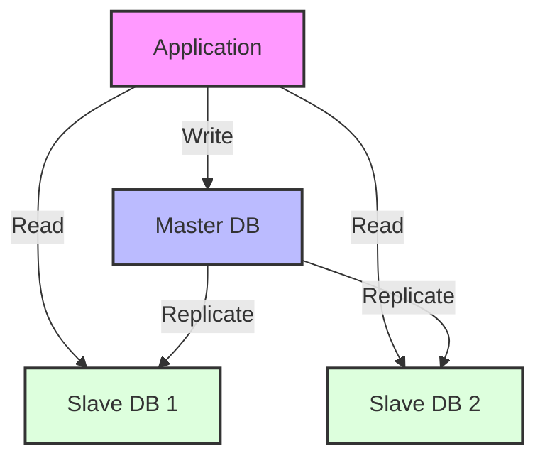
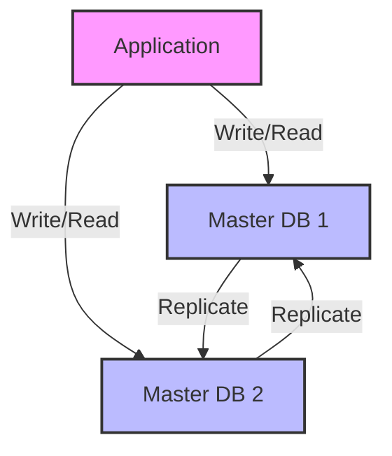
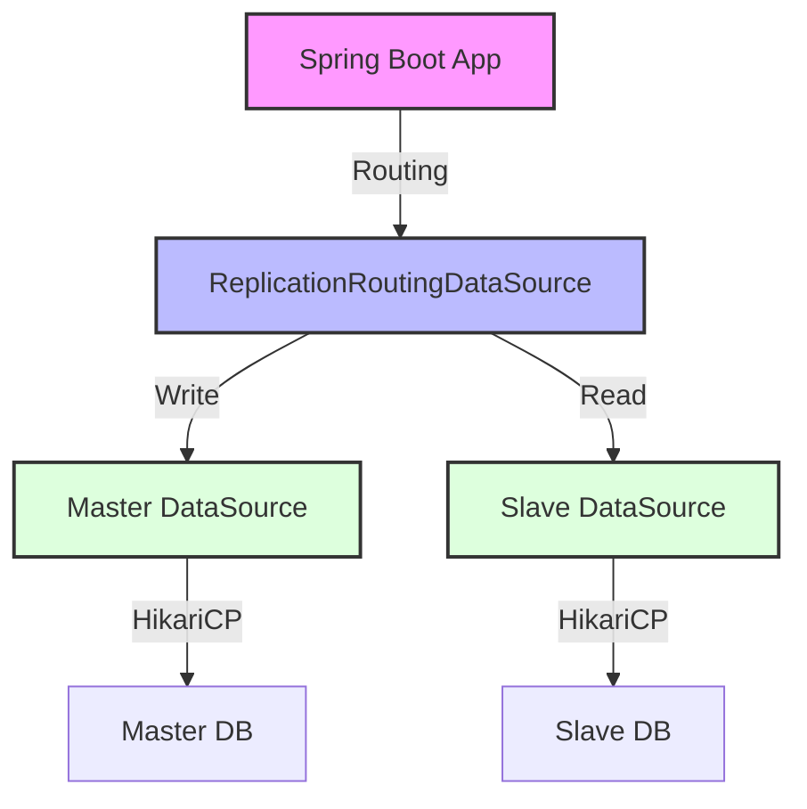
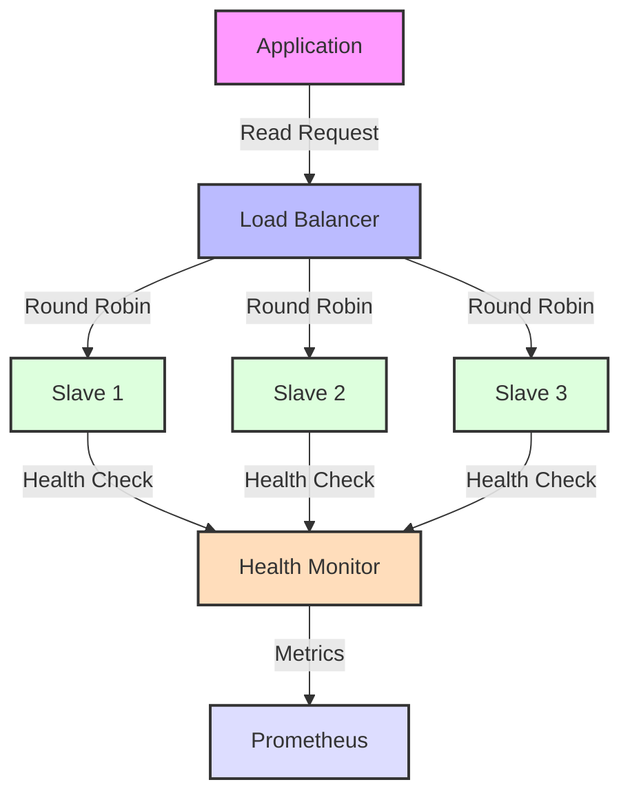
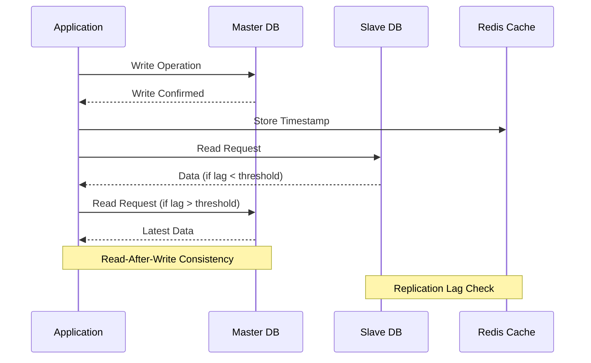
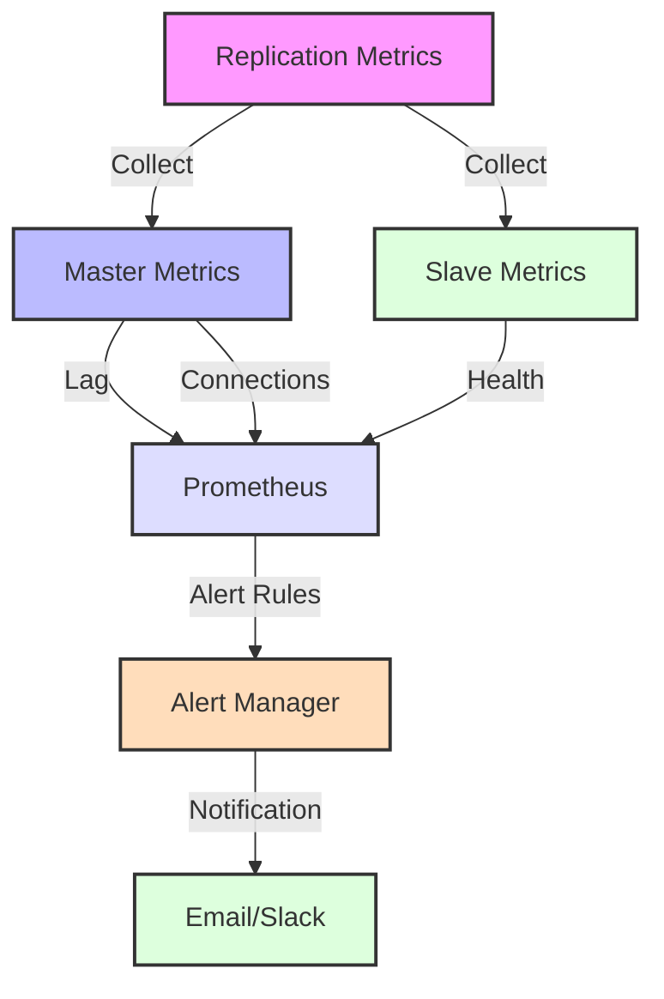

# Database Replication - Spring Boot Multi-DataSource Architecture

Database replication, veritabanı sistemlerinin güvenilirliğini, performansını ve ölçeklenebilirliğini artıran temel bir tekniktir. Verilerin birden fazla sunucuda kopyalanması yoluyla high availability, disaster recovery ve read scalability sağlar.

## Master-Slave Configuration



Master-slave replication, en yaygın kullanılan replication modelidir. Bu modelde, bir master (birincil) veritabanı tüm write işlemlerini yönetirken, slave (ikincil) veritabanları read işlemlerini destekler.

**Master-Slave Avantajları:**
- **Read scalability**: Read işlemleri birden fazla slave'e dağıtılabilir
- **High availability**: Master failure durumunda slave'ler devreye girebilir
- **Backup operations**: Slave'ler üzerinde backup alınarak master etkilenmez
- **Analytics queries**: Ağır analytical işlemler slave'lerde çalıştırılabilir

**Spring Boot Setup Yaklaşımı:**
- **Multiple DataSource beans**: @Primary master, @Qualifier slave'ler için
- **@Transactional(readOnly = true)**: Otomatik read replica routing
- **Connection pooling**: Master ve slave'ler için ayrı HikariCP pool'ları
- **Failover mechanisms**: Circuit breaker ve retry logic entegrasyonu

```yaml
# Master-Slave Configuration
replication:
  topology: master-slave
  master:
    host: master-db.company.com
    port: 5432
    write_operations: true
    read_operations: true
  
  slaves:
    - host: slave1-db.company.com
      port: 5432
      read_operations: true
      lag_threshold: 100ms
    - host: slave2-db.company.com
      port: 5432
      read_operations: true
      lag_threshold: 100ms
```

### 2. Master-Master Replication



```yaml
# Master-Master Configuration
replication:
  topology: master-master
  nodes:
    - host: master1-db.company.com
      port: 5432
      write_operations: true
      read_operations: true
      conflict_resolution: timestamp
    - host: master2-db.company.com
      port: 5432
      write_operations: true
      read_operations: true
      conflict_resolution: timestamp
```

## Spring Boot ile Replication Setup



### 1. Multiple DataSource Configuration

```java
@Configuration
public class DatabaseReplicationConfiguration {
    
    @Bean
    @Primary
    @ConfigurationProperties("spring.datasource.master")
    public DataSource masterDataSource() {
        return DataSourceBuilder.create()
                .type(HikariDataSource.class)
                .build();
    }
    
    @Bean
    @ConfigurationProperties("spring.datasource.slave")
    public DataSource slaveDataSource() {
        return DataSourceBuilder.create()
                .type(HikariDataSource.class)
                .build();
    }
    
    @Bean
    public DataSource routingDataSource(
            @Qualifier("masterDataSource") DataSource masterDataSource,
            @Qualifier("slaveDataSource") DataSource slaveDataSource) {
        
        ReplicationRoutingDataSource routingDataSource = new ReplicationRoutingDataSource();
        
        Map<Object, Object> dataSourceMap = new HashMap<>();
        dataSourceMap.put(DatabaseType.MASTER, masterDataSource);
        dataSourceMap.put(DatabaseType.SLAVE, slaveDataSource);
        
        routingDataSource.setTargetDataSources(dataSourceMap);
        routingDataSource.setDefaultTargetDataSource(masterDataSource);
        
        return routingDataSource;
    }
    
    @Bean
    @Primary
    public JdbcTemplate jdbcTemplate(@Qualifier("routingDataSource") DataSource dataSource) {
        return new JdbcTemplate(dataSource);
    }
}
```

### 2. Dynamic DataSource Routing

```java
public class ReplicationRoutingDataSource extends AbstractRoutingDataSource {
    
    @Override
    protected Object determineCurrentLookupKey() {
        return DatabaseContextHolder.getDatabaseType();
    }
}

public enum DatabaseType {
    MASTER, SLAVE
}

public class DatabaseContextHolder {
    
    private static final ThreadLocal<DatabaseType> contextHolder = new ThreadLocal<>();
    
    public static void setDatabaseType(DatabaseType databaseType) {
        contextHolder.set(databaseType);
    }
    
    public static DatabaseType getDatabaseType() {
        return contextHolder.get();
    }
    
    public static void clearDatabaseType() {
        contextHolder.remove();
    }
}
```

### 3. Read/Write Splitting Service

```java
@Service
@Transactional
public class UserService {
    
    private final UserRepository userRepository;
    private final LoadBalancedSlaveSelector slaveSelector;
    
    public UserService(UserRepository userRepository, 
                      LoadBalancedSlaveSelector slaveSelector) {
        this.userRepository = userRepository;
        this.slaveSelector = slaveSelector;
    }
    
    // Write operations go to master
    @WriteOperation
    public User createUser(CreateUserRequest request) {
        DatabaseContextHolder.setDatabaseType(DatabaseType.MASTER);
        
        try {
            User user = new User();
            user.setUsername(request.getUsername());
            user.setEmail(request.getEmail());
            user.setCreatedAt(LocalDateTime.now());
            
            return userRepository.save(user);
        } finally {
            DatabaseContextHolder.clearDatabaseType();
        }
    }
    
    @WriteOperation
    public User updateUser(Long userId, UpdateUserRequest request) {
        DatabaseContextHolder.setDatabaseType(DatabaseType.MASTER);
        
        try {
            User user = userRepository.findById(userId)
                .orElseThrow(() -> new UserNotFoundException(userId));
            
            user.setEmail(request.getEmail());
            user.setUpdatedAt(LocalDateTime.now());
            
            return userRepository.save(user);
        } finally {
            DatabaseContextHolder.clearDatabaseType();
        }
    }
    
    // Read operations can go to slaves
    @ReadOperation
    @Transactional(readOnly = true)
    public User findById(Long userId) {
        String selectedSlave = slaveSelector.selectSlave();
        DatabaseContextHolder.setDatabaseType(DatabaseType.SLAVE);
        
        try {
            return userRepository.findById(userId)
                .orElseThrow(() -> new UserNotFoundException(userId));
        } finally {
            DatabaseContextHolder.clearDatabaseType();
        }
    }
    
    @ReadOperation
    @Transactional(readOnly = true)
    public Page<User> findUsers(Pageable pageable) {
        DatabaseContextHolder.setDatabaseType(DatabaseType.SLAVE);
        
        try {
            return userRepository.findAll(pageable);
        } finally {
            DatabaseContextHolder.clearDatabaseType();
        }
    }
}
```

### 4. Aspect-Based Routing

```java
@Aspect
@Component
@Order(1)
public class DatabaseRoutingAspect {
    
    private final LoadBalancedSlaveSelector slaveSelector;
    
    @Before("@annotation(readOperation)")
    public void routeToSlave(JoinPoint joinPoint, ReadOperation readOperation) {
        if (TransactionSynchronizationManager.isCurrentTransactionReadOnly()) {
            String selectedSlave = slaveSelector.selectSlave();
            DatabaseContextHolder.setDatabaseType(DatabaseType.SLAVE);
            
            log.debug("Routing read operation to slave: {}", selectedSlave);
        }
    }
    
    @Before("@annotation(writeOperation)")
    public void routeToMaster(JoinPoint joinPoint, WriteOperation writeOperation) {
        DatabaseContextHolder.setDatabaseType(DatabaseType.MASTER);
        log.debug("Routing write operation to master");
    }
    
    @After("@annotation(readOperation) || @annotation(writeOperation)")
    public void clearRoutingContext() {
        DatabaseContextHolder.clearDatabaseType();
    }
}

@Target(ElementType.METHOD)
@Retention(RetentionPolicy.RUNTIME)
public @interface ReadOperation {
    String value() default "";
}

@Target(ElementType.METHOD)
@Retention(RetentionPolicy.RUNTIME)
public @interface WriteOperation {
    String value() default "";
}
```

## Load Balanced Slave Selection



### 1. Round Robin Selector

```java
@Component
public class RoundRobinSlaveSelector implements LoadBalancedSlaveSelector {
    
    private final List<String> slaveNodes;
    private final AtomicInteger currentIndex = new AtomicInteger(0);
    
    public RoundRobinSlaveSelector(@Value("${database.slaves}") List<String> slaves) {
        this.slaveNodes = new ArrayList<>(slaves);
    }
    
    @Override
    public String selectSlave() {
        if (slaveNodes.isEmpty()) {
            throw new IllegalStateException("No slave nodes available");
        }
        
        int index = currentIndex.getAndIncrement() % slaveNodes.size();
        return slaveNodes.get(index);
    }
}
```

### 2. Weighted Slave Selection

```java
@Component
public class WeightedSlaveSelector implements LoadBalancedSlaveSelector {
    
    private final List<WeightedSlave> weightedSlaves;
    private final Random random = new Random();
    
    public WeightedSlaveSelector(@Value("${database.slaves.weighted}") 
                                Map<String, Integer> slaveWeights) {
        this.weightedSlaves = slaveWeights.entrySet().stream()
            .map(entry -> new WeightedSlave(entry.getKey(), entry.getValue()))
            .collect(Collectors.toList());
    }
    
    @Override
    public String selectSlave() {
        int totalWeight = weightedSlaves.stream()
            .mapToInt(WeightedSlave::getWeight)
            .sum();
        
        int randomWeight = random.nextInt(totalWeight);
        int currentWeight = 0;
        
        for (WeightedSlave slave : weightedSlaves) {
            currentWeight += slave.getWeight();
            if (randomWeight < currentWeight) {
                return slave.getHost();
            }
        }
        
        return weightedSlaves.get(0).getHost(); // Fallback
    }
}
```

### 3. Health-Aware Slave Selection

```java
@Component
public class HealthAwareSlaveSelector implements LoadBalancedSlaveSelector {
    
    private final SlaveHealthMonitor healthMonitor;
    private final RoundRobinSlaveSelector fallbackSelector;
    
    @Override
    public String selectSlave() {
        List<String> healthySlaves = healthMonitor.getHealthySlaves();
        
        if (healthySlaves.isEmpty()) {
            log.warn("No healthy slaves available, falling back to round-robin");
            return fallbackSelector.selectSlave();
        }
        
        // Select least loaded healthy slave
        return healthySlaves.stream()
            .min(Comparator.comparing(healthMonitor::getSlaveLoad))
            .orElse(fallbackSelector.selectSlave());
    }
}

@Component
public class SlaveHealthMonitor {
    
    private final Map<String, SlaveHealth> slaveHealthMap = new ConcurrentHashMap<>();
    private final MeterRegistry meterRegistry;
    
    @Scheduled(fixedRate = 10000) // 10 seconds
    public void checkSlaveHealth() {
        slaveHealthMap.forEach((slave, health) -> {
            try {
                Connection connection = getConnectionToSlave(slave);
                boolean isHealthy = connection.isValid(5);
                
                health.setHealthy(isHealthy);
                health.setLastChecked(LocalDateTime.now());
                
                if (isHealthy) {
                    // Check replication lag
                    long lag = checkReplicationLag(connection);
                    health.setReplicationLag(lag);
                    
                    meterRegistry.gauge("database.slave.lag", 
                        Tags.of("slave", slave), lag);
                }
                
                meterRegistry.gauge("database.slave.health", 
                    Tags.of("slave", slave), isHealthy ? 1.0 : 0.0);
                
            } catch (Exception e) {
                log.error("Health check failed for slave: {}", slave, e);
                slaveHealthMap.get(slave).setHealthy(false);
            }
        });
    }
    
    private long checkReplicationLag(Connection connection) throws SQLException {
        try (Statement stmt = connection.createStatement()) {
            ResultSet rs = stmt.executeQuery(
                "SELECT EXTRACT(EPOCH FROM (now() - pg_last_xact_replay_timestamp()))");
            if (rs.next()) {
                return rs.getLong(1);
            }
        }
        return -1;
    }
}
```

## Replication Lag Handling



### 1. Read-After-Write Consistency

```java
@Service
public class ConsistentReadService {
    
    private final RedisTemplate<String, String> redisTemplate;
    private final UserService userService;
    
    public User createUserWithConsistentRead(CreateUserRequest request) {
        // Write to master
        User createdUser = userService.createUser(request);
        
        // Store timestamp for read-after-write consistency
        String key = "user:created:" + createdUser.getId();
        redisTemplate.opsForValue().set(key, 
            String.valueOf(System.currentTimeMillis()), 
            Duration.ofMinutes(5));
        
        return createdUser;
    }
    
    public User findByIdConsistent(Long userId) {
        String key = "user:created:" + userId;
        String createdTimestamp = redisTemplate.opsForValue().get(key);
        
        if (createdTimestamp != null) {
            long created = Long.parseLong(createdTimestamp);
            long now = System.currentTimeMillis();
            
            // If created recently, read from master to avoid replication lag
            if (now - created < Duration.ofMinutes(2).toMillis()) {
                DatabaseContextHolder.setDatabaseType(DatabaseType.MASTER);
                try {
                    return userService.findById(userId);
                } finally {
                    DatabaseContextHolder.clearDatabaseType();
                }
            }
        }
        
        // Safe to read from slave
        return userService.findById(userId);
    }
}
```

### 2. Retry Logic for Lag

```java
@Component
public class ReplicationLagRetryService {
    
    private final RetryTemplate retryTemplate;
    
    @PostConstruct
    public void setupRetryTemplate() {
        retryTemplate = RetryTemplate.builder()
            .maxAttempts(3)
            .fixedBackoff(100)
            .retryOn(ReplicationLagException.class)
            .build();
    }
    
    public User findUserWithRetry(Long userId, LocalDateTime minTimestamp) {
        return retryTemplate.execute(context -> {
            User user = userService.findById(userId);
            
            if (user == null || user.getUpdatedAt().isBefore(minTimestamp)) {
                throw new ReplicationLagException("Data not yet replicated");
            }
            
            return user;
        });
    }
}
```

## PostgreSQL Streaming Replication Setup

### 1. Master Configuration

```bash
# postgresql.conf
wal_level = replica
max_wal_senders = 3
max_replication_slots = 3
synchronous_commit = on
synchronous_standby_names = 'slave1,slave2'

# pg_hba.conf
host replication replicator 10.0.0.0/24 md5
```

### 2. Slave Configuration

```bash
# recovery.conf (PostgreSQL < 12) or postgresql.conf (PostgreSQL >= 12)
standby_mode = 'on'
primary_conninfo = 'host=master-db port=5432 user=replicator password=replica_pass'
primary_slot_name = 'slave1_slot'
```

### 3. Docker Compose Replication Setup

```yaml
version: '3.8'
services:
  master-db:
    image: postgres:15
    environment:
      POSTGRES_DB: myapp
      POSTGRES_USER: postgres
      POSTGRES_PASSWORD: master_pass
      POSTGRES_REPLICATION_USER: replicator
      POSTGRES_REPLICATION_PASSWORD: replica_pass
    volumes:
      - ./master-init.sql:/docker-entrypoint-initdb.d/master-init.sql
      - master_data:/var/lib/postgresql/data
    ports:
      - "5432:5432"
    command: |
      postgres -c wal_level=replica 
               -c max_wal_senders=3 
               -c max_replication_slots=3
               -c synchronous_commit=on
    networks:
      - db-network

  slave1-db:
    image: postgres:15
    environment:
      POSTGRES_USER: postgres
      POSTGRES_PASSWORD: slave_pass
      PGUSER: postgres
      POSTGRES_MASTER_SERVICE: master-db
      POSTGRES_REPLICATION_USER: replicator
      POSTGRES_REPLICATION_PASSWORD: replica_pass
    volumes:
      - ./slave-setup.sh:/docker-entrypoint-initdb.d/slave-setup.sh
      - slave1_data:/var/lib/postgresql/data
    ports:
      - "5433:5432"
    depends_on:
      - master-db
    networks:
      - db-network

  slave2-db:
    image: postgres:15
    environment:
      POSTGRES_USER: postgres
      POSTGRES_PASSWORD: slave_pass
      PGUSER: postgres
      POSTGRES_MASTER_SERVICE: master-db
      POSTGRES_REPLICATION_USER: replicator
      POSTGRES_REPLICATION_PASSWORD: replica_pass
    volumes:
      - ./slave-setup.sh:/docker-entrypoint-initdb.d/slave-setup.sh
      - slave2_data:/var/lib/postgresql/data
    ports:
      - "5434:5432"
    depends_on:
      - master-db
    networks:
      - db-network

  application:
    build: .
    ports:
      - "8080:8080"
    environment:
      SPRING_DATASOURCE_MASTER_URL: jdbc:postgresql://master-db:5432/myapp
      SPRING_DATASOURCE_SLAVE_URL: jdbc:postgresql://slave1-db:5432/myapp
      SPRING_DATASOURCE_USERNAME: postgres
      SPRING_DATASOURCE_PASSWORD: master_pass
    depends_on:
      - master-db
      - slave1-db
      - slave2-db
    networks:
      - db-network

volumes:
  master_data:
  slave1_data:
  slave2_data:

networks:
  db-network:
    driver: bridge
```

## Monitoring ve Metrics



### 1. Replication Health Metrics

```java
@Component
public class ReplicationMetrics {
    
    private final MeterRegistry meterRegistry;
    private final JdbcTemplate masterTemplate;
    private final JdbcTemplate slaveTemplate;
    
    @Scheduled(fixedRate = 30000)
    public void collectReplicationMetrics() {
        try {
            // Check replication lag
            Long lag = slaveTemplate.queryForObject(
                "SELECT EXTRACT(EPOCH FROM (now() - pg_last_xact_replay_timestamp()))",
                Long.class);
            
            meterRegistry.gauge("database.replication.lag", lag != null ? lag : -1);
            
            // Check replication status
            Boolean isReplaying = slaveTemplate.queryForObject(
                "SELECT pg_is_in_recovery()", Boolean.class);
            
            meterRegistry.gauge("database.replication.status", 
                isReplaying != null && isReplaying ? 1.0 : 0.0);
            
            // Master write load
            Long masterConnections = masterTemplate.queryForObject(
                "SELECT count(*) FROM pg_stat_activity WHERE state = 'active'",
                Long.class);
            
            meterRegistry.gauge("database.master.active_connections", 
                masterConnections != null ? masterConnections : 0);
            
        } catch (Exception e) {
            log.error("Failed to collect replication metrics", e);
        }
    }
}
```

### 2. Alert Configuration

```yaml
# Prometheus Alert Rules
groups:
  - name: database_replication
    rules:
      - alert: HighReplicationLag
        expr: database_replication_lag > 10
        for: 2m
        labels:
          severity: warning
        annotations:
          summary: "High replication lag detected"
          description: "Replication lag is {{ $value }} seconds"
      
      - alert: ReplicationBroken
        expr: database_replication_status == 0
        for: 1m
        labels:
          severity: critical
        annotations:
          summary: "Database replication is broken"
          description: "Slave is not receiving updates from master"
```

## Best Practices

### 1. Connection Pool Configuration
```properties
# Master Pool (Writes)
spring.datasource.master.hikari.maximum-pool-size=20
spring.datasource.master.hikari.minimum-idle=5
spring.datasource.master.hikari.connection-timeout=20000

# Slave Pool (Reads)
spring.datasource.slave.hikari.maximum-pool-size=30
spring.datasource.slave.hikari.minimum-idle=10
spring.datasource.slave.hikari.connection-timeout=15000
```

### 2. Graceful Degradation
- Slave failure durumunda master'a fallback
- Master failure durumunda read-only mode
- Circuit breaker pattern kullanımı

### 3. Security Considerations
- Replication user'ları için minimal permissions
- SSL/TLS encrypted replication
- Network segmentation

Database replication, high availability ve scalability için kritik bir pattern'dir, ancak complexity ve operational overhead ekler.
