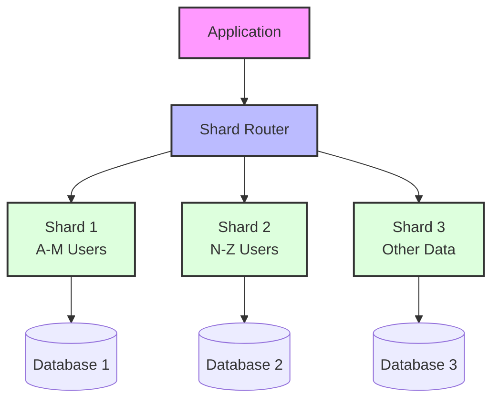
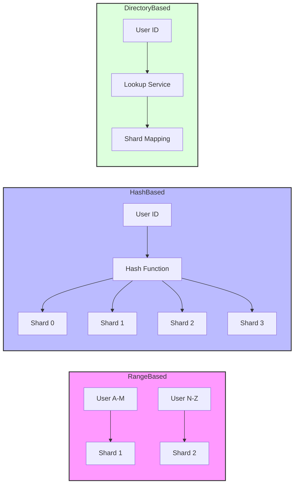
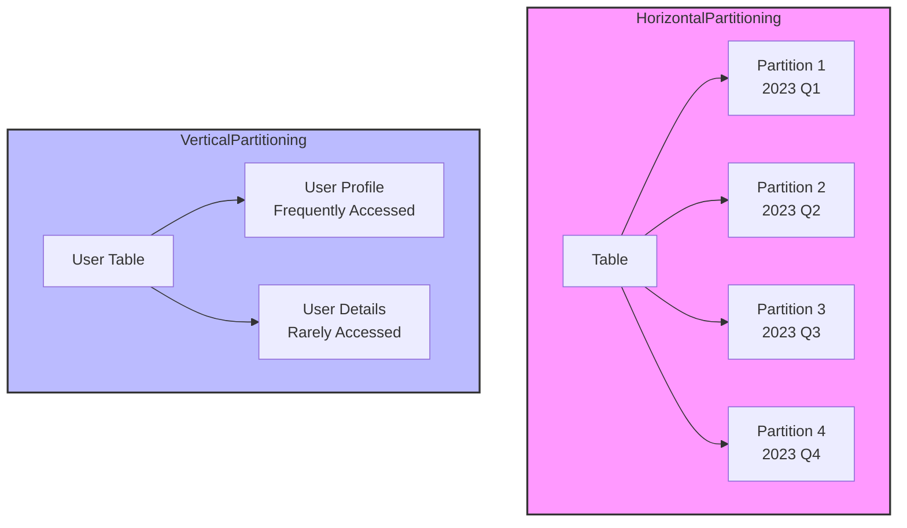
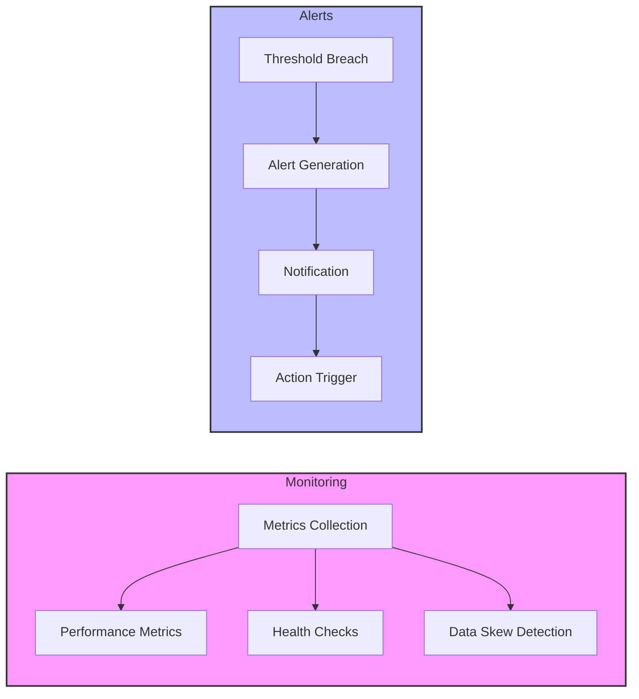

# Database Sharding ve Partitioning - Spring Boot Data Management

Database sharding ve partitioning, büyük ölçekli uygulamalarda veri yönetimini optimize etmek için kullanılan kritik tekniktlerdir. Bu yaklaşımlar, veritabanı performansını artırır, ölçeklenebilirlik sağlar ve sistem dayanıklılığını güçlendirir.

## Sharding Overview



## Sharding Strategies



## Partitioning Types



## Horizontal Sharding Strategies

Horizontal sharding, tabloları satır bazında farklı veritabanlarına bölme işlemidir. Bu strateji, veri hacmi arttıkça performansın korunmasını sağlar.

### Shard Key Selection

Shard key seçimi, sharding stratejisinin başarısını belirleyen en kritik faktördür. Doğru shard key, verilerin eşit dağılımını ve cross-shard query'lerin minimizasyonunu sağlar.

**Shard Key Kriterleri:**
- **User ID**: Kullanıcı bazlı veri izolasyonu
- **Geographic region**: Coğrafi bölge bazlı sharding
- **Tenant ID**: Multi-tenant uygulamalar için
- **Hash-based**: Eşit dağılım garantisi
- **Range-based**: Zaman serileri için uygun

**Spring Data JPA ile Sharding:**
- **@Entity annotations**: Shard-aware entity tasarımı
- **@Table(schema = "shard_1")**: Statik shard assignment
- **AbstractRoutingDataSource**: Dinamik shard routing
- **Custom repository implementations**: Shard-aware data access

### Temel Kavramlar

```yaml
# Sharding Stratejileri
strategies:
  range_based:
    - key_range: "A-M"
      shard: "shard_1"
    - key_range: "N-Z"
      shard: "shard_2"
  
  hash_based:
    - hash_function: "user_id % 4"
      shards: ["shard_0", "shard_1", "shard_2", "shard_3"]
  
  directory_based:
    - lookup_service: "shard_coordinator"
      mapping: "user_id -> shard_id"
```

## Spring Boot ile Sharding Implementasyonu

### 1. Custom Sharding Configuration

```java
@Configuration
@EnableJpaRepositories(
    basePackages = "com.example.sharding.repository",
    repositoryFactoryBeanClass = ShardingRepositoryFactoryBean.class
)
public class ShardingConfiguration {
    
    @Bean
    @Primary
    public ShardingDataSource shardingDataSource() {
        Map<String, DataSource> dataSourceMap = new HashMap<>();
        
        // Shard 1 - Users A-M
        dataSourceMap.put("shard1", createDataSource(
            "jdbc:postgresql://shard1-db:5432/users",
            "shard1_user", "shard1_pass"
        ));
        
        // Shard 2 - Users N-Z
        dataSourceMap.put("shard2", createDataSource(
            "jdbc:postgresql://shard2-db:5432/users",
            "shard2_user", "shard2_pass"
        ));
        
        return new ShardingDataSource(dataSourceMap);
    }
    
    private DataSource createDataSource(String url, String username, String password) {
        HikariConfig config = new HikariConfig();
        config.setJdbcUrl(url);
        config.setUsername(username);
        config.setPassword(password);
        config.setMaximumPoolSize(20);
        config.setMinimumIdle(5);
        config.setConnectionTimeout(30000);
        config.setIdleTimeout(600000);
        config.setMaxLifetime(1800000);
        return new HikariDataSource(config);
    }
}
```

### 2. Sharding Strategy Interface

```java
public interface ShardingStrategy {
    String determineShard(Object shardingKey);
}

@Component
public class UserIdHashShardingStrategy implements ShardingStrategy {
    
    private static final int SHARD_COUNT = 4;
    
    @Override
    public String determineShard(Object shardingKey) {
        if (shardingKey instanceof Long) {
            Long userId = (Long) shardingKey;
            int shardIndex = Math.abs(userId.hashCode() % SHARD_COUNT);
            return "shard" + shardIndex;
        }
        throw new IllegalArgumentException("Invalid sharding key type");
    }
}

@Component
public class UserNameRangeShardingStrategy implements ShardingStrategy {
    
    @Override
    public String determineShard(Object shardingKey) {
        if (shardingKey instanceof String) {
            String username = (String) shardingKey;
            char firstChar = Character.toLowerCase(username.charAt(0));
            
            if (firstChar >= 'a' && firstChar <= 'm') {
                return "shard1";
            } else {
                return "shard2";
            }
        }
        throw new IllegalArgumentException("Invalid sharding key type");
    }
}
```

### 3. Sharding Aware Repository

```java
@Repository
public class ShardedUserRepository {
    
    private final Map<String, JdbcTemplate> shardTemplates;
    private final ShardingStrategy shardingStrategy;
    
    public ShardedUserRepository(
            ShardingDataSource shardingDataSource,
            @Qualifier("userIdHashShardingStrategy") ShardingStrategy shardingStrategy) {
        this.shardingStrategy = shardingStrategy;
        this.shardTemplates = new HashMap<>();
        
        shardingDataSource.getDataSources().forEach((shardName, dataSource) -> {
            shardTemplates.put(shardName, new JdbcTemplate(dataSource));
        });
    }
    
    public User findById(Long userId) {
        String shardName = shardingStrategy.determineShard(userId);
        JdbcTemplate template = shardTemplates.get(shardName);
        
        try {
            return template.queryForObject(
                "SELECT * FROM users WHERE id = ?",
                new Object[]{userId},
                new UserRowMapper()
            );
        } catch (EmptyResultDataAccessException e) {
            return null;
        }
    }
    
    public void save(User user) {
        String shardName = shardingStrategy.determineShard(user.getId());
        JdbcTemplate template = shardTemplates.get(shardName);
        
        template.update(
            "INSERT INTO users (id, username, email, created_at) VALUES (?, ?, ?, ?)",
            user.getId(), user.getUsername(), user.getEmail(), user.getCreatedAt()
        );
    }
    
    public List<User> findAll() {
        List<User> allUsers = new ArrayList<>();
        
        // Parallel execution across shards
        List<CompletableFuture<List<User>>> futures = shardTemplates.entrySet()
            .stream()
            .map(entry -> CompletableFuture.supplyAsync(() -> {
                return entry.getValue().query(
                    "SELECT * FROM users ORDER BY created_at DESC",
                    new UserRowMapper()
                );
            }))
            .collect(Collectors.toList());
        
        futures.forEach(future -> {
            try {
                allUsers.addAll(future.get());
            } catch (Exception e) {
                log.error("Error fetching from shard", e);
            }
        });
        
        return allUsers.stream()
            .sorted(Comparator.comparing(User::getCreatedAt).reversed())
            .collect(Collectors.toList());
    }
}
```

## Partitioning Stratejileri

### 1. Horizontal Partitioning (Sharding)

```sql
-- Range-based partitioning
CREATE TABLE users_2023 (
    id BIGSERIAL PRIMARY KEY,
    username VARCHAR(50) NOT NULL,
    created_at TIMESTAMP DEFAULT CURRENT_TIMESTAMP
) PARTITION BY RANGE (created_at);

CREATE TABLE users_2023_q1 PARTITION OF users_2023
    FOR VALUES FROM ('2023-01-01') TO ('2023-04-01');

CREATE TABLE users_2023_q2 PARTITION OF users_2023
    FOR VALUES FROM ('2023-04-01') TO ('2023-07-01');
```

### 2. Vertical Partitioning

```java
// User temel bilgileri
@Entity
@Table(name = "user_profiles")
public class UserProfile {
    @Id
    private Long userId;
    private String username;
    private String email;
    private LocalDateTime createdAt;
}

// User detay bilgileri (az erişilen)
@Entity
@Table(name = "user_details")
public class UserDetail {
    @Id
    private Long userId;
    private String bio;
    private String preferences;
    private byte[] profileImage;
}
```

## Advanced Sharding Patterns

### 1. Consistent Hashing

```java
@Component
public class ConsistentHashingStrategy implements ShardingStrategy {
    
    private final TreeMap<Long, String> ring = new TreeMap<>();
    private final int virtualNodes = 100;
    
    @PostConstruct
    public void initializeRing() {
        List<String> shards = Arrays.asList("shard1", "shard2", "shard3", "shard4");
        
        for (String shard : shards) {
            for (int i = 0; i < virtualNodes; i++) {
                String virtualNode = shard + ":" + i;
                long hash = hashFunction(virtualNode);
                ring.put(hash, shard);
            }
        }
    }
    
    @Override
    public String determineShard(Object shardingKey) {
        long hash = hashFunction(shardingKey.toString());
        
        Map.Entry<Long, String> entry = ring.ceilingEntry(hash);
        if (entry == null) {
            entry = ring.firstEntry();
        }
        
        return entry.getValue();
    }
    
    private long hashFunction(String input) {
        return Hashing.murmur3_128().hashString(input, StandardCharsets.UTF_8)
                .asLong();
    }
}
```

### 2. Shard Coordinator Service

```java
@Service
public class ShardCoordinatorService {
    
    private final RedisTemplate<String, String> redisTemplate;
    private final Map<String, DataSource> shardDataSources;
    
    public String getShardForUser(Long userId) {
        String cacheKey = "user:shard:" + userId;
        String cachedShard = redisTemplate.opsForValue().get(cacheKey);
        
        if (cachedShard != null) {
            return cachedShard;
        }
        
        // Fallback to calculation
        String shard = calculateShard(userId);
        redisTemplate.opsForValue().set(cacheKey, shard, Duration.ofHours(24));
        
        return shard;
    }
    
    public void reshardUser(Long userId, String fromShard, String toShard) {
        try {
            // Start transaction
            User user = fetchUserFromShard(userId, fromShard);
            saveUserToShard(user, toShard);
            deleteUserFromShard(userId, fromShard);
            
            // Update cache
            String cacheKey = "user:shard:" + userId;
            redisTemplate.opsForValue().set(cacheKey, toShard);
            
            log.info("Successfully resharded user {} from {} to {}", 
                    userId, fromShard, toShard);
        } catch (Exception e) {
            log.error("Failed to reshard user {}", userId, e);
            throw new ShardingException("Resharding failed", e);
        }
    }
}
```

## Resharding Stratejisi

```mermaid
graph TB
    subgraph ReshardingProcess
        R1[Başlangıç] --> R2[Yeni Shard Ekleme]
        R2 --> R3[Veri Migrasyonu]
        R3 --> R4[Veri Doğrulama]
        R4 --> R5[Traffic Yönlendirme]
        R5 --> R6[Eski Shard Kaldırma]
    end
    
    subgraph ZeroDowntime
        Z1[Canlı Sistem] --> Z2[Yeni Shard]
        Z2 --> Z3[Paralel Yazma]
        Z3 --> Z4[Veri Senkronizasyonu]
        Z4 --> Z5[Traffic Switch]
    end
    
    style ReshardingProcess fill:#f9f,stroke:#333,stroke-width:2px
    style ZeroDowntime fill:#bbf,stroke:#333,stroke-width:2px
```



## Monitoring ve Health Checks



## Best Practices

```mermaid
graph TB
    subgraph ShardKeySelection
        S1[Uniform Distribution] --> S2[Immutable Fields]
        S2 --> S3[Minimize Cross-Shard]
    end
    
    subgraph Monitoring
        M1[Shard Metrics] --> M2[Query Performance]
        M2 --> M3[Data Skew]
    end
    
    subgraph Resharding
        R1[Gradual Migration] --> R2[Zero-Downtime]
        R2 --> R3[Rollback Plan]
    end
    
    style ShardKeySelection fill:#f9f,stroke:#333,stroke-width:2px
    style Monitoring fill:#bbf,stroke:#333,stroke-width:2px
    style Resharding fill:#dfd,stroke:#333,stroke-width:2px
```



Sharding, büyük ölçekli sistemlerde kaçınılmaz bir gereksinimdir, ancak complexity ekler. Doğru strateji ve implementasyon ile sistem performansını büyük ölçüde artırabilir.
