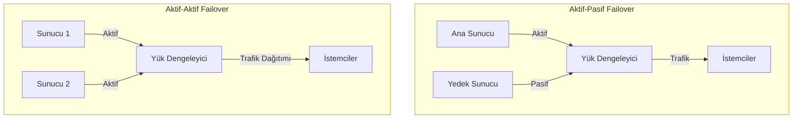
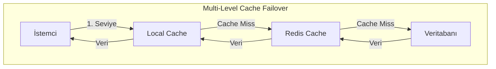
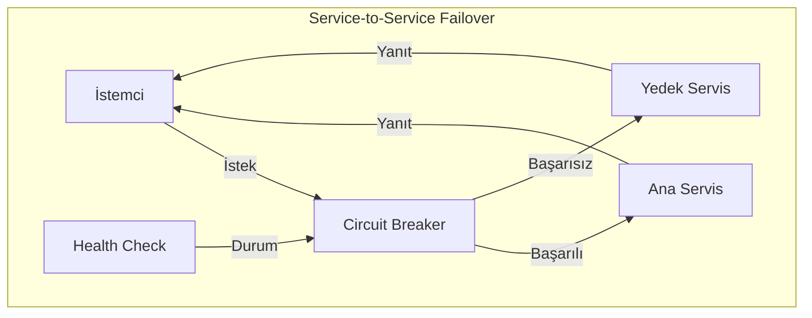

# Failover Mekanizmaları

**Tanım**: Sistemdeki bir bileşenin başarısız olması durumunda trafiği başka bir bileşene yönlendirme sürecidir.

## Failover Türleri

### Aktif-Pasif (Hot Standby)
- Yedek bileşen sürekli hazır durumda bekler
- Veri senkronizasyonu gerçek zamanlı yapılır
- Failover süresi minimum seviyededir
- Örnek: PostgreSQL streaming replication

### Aktif-Aktif (Active-Active)
- Birden fazla bileşen aynı anda trafik yönetir
- Yük dengeleme ile birlikte kullanılır
- Veri tutarlılığı için özel mekanizmalar gerekir
- Örnek: Redis Cluster, MongoDB Replica Set

### Warm Standby
- Yedek bileşen hazır ama tam senkronize değil
- Failover süresi daha uzundur
- Maliyet açısından daha uygundur
- Örnek: AWS RDS Multi-AZ deployment







## Failover Stratejileri

### Otomatik Failover
- Sistem otomatik olarak yedek bileşene geçiş yapar
- Health check mekanizmaları ile tetiklenir
- Minimum insan müdahalesi gerektirir

### Manuel Failover
- Operatör kontrolünde geçiş yapılır
- Planlı bakım için kullanılır
- Risk yönetimi daha kolaydır

## Spring Boot Implementasyonları

### Database Failover

#### Multi-DataSource Configuration
```java
@Configuration
public class DatabaseFailoverConfig {
    
    @Primary
    @Bean("primaryDataSource")
    @ConfigurationProperties("spring.datasource.primary")
    public DataSource primaryDataSource() {
        return DataSourceBuilder.create().build();
    }
    
    @Bean("secondaryDataSource")
    @ConfigurationProperties("spring.datasource.secondary")
    public DataSource secondaryDataSource() {
        return DataSourceBuilder.create().build();
    }
    
    @Bean
    public DataSource routingDataSource() {
        RoutingDataSource routingDataSource = new RoutingDataSource();
        
        Map<Object, Object> dataSourceMap = new HashMap<>();
        dataSourceMap.put("primary", primaryDataSource());
        dataSourceMap.put("secondary", secondaryDataSource());
        
        routingDataSource.setTargetDataSources(dataSourceMap);
        routingDataSource.setDefaultTargetDataSource(primaryDataSource());
        
        return routingDataSource;
    }
}

public class RoutingDataSource extends AbstractRoutingDataSource {
    
    @Override
    protected Object determineCurrentLookupKey() {
        return DatabaseContextHolder.getDatabase();
    }
}

@Component
public class DatabaseContextHolder {
    
    private static final ThreadLocal<String> contextHolder = new ThreadLocal<>();
    
    public static void setDatabase(String database) {
        contextHolder.set(database);
    }
    
    public static String getDatabase() {
        return contextHolder.get();
    }
    
    public static void clearDatabase() {
        contextHolder.remove();
    }
}
```

#### Database Health Monitoring
```java
@Component
@Slf4j
public class DatabaseFailoverService {
    
    private final DataSource primaryDataSource;
    private final DataSource secondaryDataSource;
    private volatile boolean primaryHealthy = true;
    
    @Scheduled(fixedDelay = 5000)
    public void checkDatabaseHealth() {
        try {
            checkPrimaryDatabase();
            if (!primaryHealthy) {
                log.info("Primary database recovered, switching back");
                DatabaseContextHolder.setDatabase("primary");
                primaryHealthy = true;
            }
        } catch (Exception e) {
            if (primaryHealthy) {
                log.warn("Primary database failed, switching to secondary", e);
                DatabaseContextHolder.setDatabase("secondary");
                primaryHealthy = false;
            }
        }
    }
    
    private void checkPrimaryDatabase() throws SQLException {
        try (Connection connection = primaryDataSource.getConnection()) {
            connection.createStatement().execute("SELECT 1");
        }
    }
}
```

### Service-to-Service Failover

#### Resilience4j Circuit Breaker ile Failover
```java
@Configuration
public class CircuitBreakerConfig {
    
    @Bean
    public CircuitBreaker userServiceCircuitBreaker() {
        return CircuitBreaker.ofDefaults("user-service");
    }
    
    @Bean
    public TimeLimiter userServiceTimeLimiter() {
        return TimeLimiter.of(Duration.ofSeconds(3));
    }
}

@Service
public class UserService {
    
    @CircuitBreaker(name = "user-service", fallbackMethod = "fallbackGetUser")
    @TimeLimiter(name = "user-service")
    @Retry(name = "user-service")
    public CompletableFuture<User> getUser(Long userId) {
        return CompletableFuture.supplyAsync(() -> {
            return primaryUserServiceClient.getUser(userId);
        });
    }
    
    // Fallback: Secondary service'e geç
    public CompletableFuture<User> fallbackGetUser(Long userId, Exception e) {
        log.warn("Primary user service failed, using secondary: {}", e.getMessage());
        return CompletableFuture.supplyAsync(() -> {
            return secondaryUserServiceClient.getUser(userId);
        });
    }
    
    // Son çare: Cache'den döndür
    public CompletableFuture<User> cacheFallbackGetUser(Long userId, Exception e) {
        log.warn("All user services failed, trying cache: {}", e.getMessage());
        return CompletableFuture.supplyAsync(() -> {
            User cachedUser = userCacheService.getUser(userId);
            if (cachedUser != null) {
                return cachedUser;
            }
            throw new UserNotFoundException("User not found in any source");
        });
    }
}
```

#### Service Discovery ile Automatic Failover
```java
@Configuration
@EnableDiscoveryClient
public class ServiceDiscoveryConfig {
    
    @Bean
    @LoadBalanced
    public RestTemplate restTemplate() {
        return new RestTemplate();
    }
    
    @Bean
    public DiscoveryClient discoveryClient() {
        return new EurekaDiscoveryClient();
    }
}

@Service
public class FailoverAwareServiceClient {
    
    @Autowired
    private DiscoveryClient discoveryClient;
    
    @Autowired
    @LoadBalanced
    private RestTemplate restTemplate;
    
    public ResponseEntity<String> callService(String serviceName, String endpoint) {
        List<ServiceInstance> instances = discoveryClient.getInstances(serviceName);
        
        for (ServiceInstance instance : instances) {
            try {
                String url = instance.getUri() + endpoint;
                return restTemplate.getForEntity(url, String.class);
            } catch (Exception e) {
                log.warn("Service instance {} failed: {}", instance.getUri(), e.getMessage());
                // Bir sonraki instance'ı dene
                continue;
            }
        }
        
        throw new ServiceUnavailableException("All instances of " + serviceName + " are down");
    }
}
```

### Application Server Failover

#### Spring Boot ile Health Check Endpoints
```java
@Component
public class CustomHealthIndicator implements HealthIndicator {
    
    @Autowired
    private DatabaseHealthService databaseHealthService;
    
    @Autowired
    private ExternalServiceHealthService externalServiceHealthService;
    
    @Override
    public Health health() {
        boolean isDatabaseHealthy = databaseHealthService.isHealthy();
        boolean areExternalServicesHealthy = externalServiceHealthService.areHealthy();
        
        if (isDatabaseHealthy && areExternalServicesHealthy) {
            return Health.up()
                .withDetail("database", "UP")
                .withDetail("external-services", "UP")
                .build();
        } else {
            return Health.down()
                .withDetail("database", isDatabaseHealthy ? "UP" : "DOWN")
                .withDetail("external-services", areExternalServicesHealthy ? "UP" : "DOWN")
                .build();
        }
    }
}

@RestController
public class HealthController {
    
    @Autowired
    private HealthEndpoint healthEndpoint;
    
    @GetMapping("/health/ready")
    public ResponseEntity<Map<String, Object>> readiness() {
        Health health = healthEndpoint.health();
        
        if (health.getStatus() == Status.UP) {
            return ResponseEntity.ok(Map.of("status", "ready"));
        } else {
            return ResponseEntity.status(HttpStatus.SERVICE_UNAVAILABLE)
                .body(Map.of("status", "not-ready", "details", health.getDetails()));
        }
    }
    
    @GetMapping("/health/live")
    public ResponseEntity<Map<String, Object>> liveness() {
        // Basit liveness check - uygulama çalışıyor mu?
        return ResponseEntity.ok(Map.of("status", "alive"));
    }
}
```

## Load Balancer Integration

### NGINX ile Health Check ve Failover
```nginx
upstream backend_servers {
    server app1.example.com:8080 max_fails=3 fail_timeout=30s;
    server app2.example.com:8080 max_fails=3 fail_timeout=30s;
    server app3.example.com:8080 backup; # Backup server
}

server {
    listen 80;
    
    location /health {
        access_log off;
        return 200 "healthy\n";
        add_header Content-Type text/plain;
    }
    
    location / {
        proxy_pass http://backend_servers;
        proxy_next_upstream error timeout invalid_header http_500 http_502 http_503;
        proxy_connect_timeout 5s;
        proxy_send_timeout 10s;
        proxy_read_timeout 10s;
        
        # Health check headers
        proxy_set_header Host $host;
        proxy_set_header X-Real-IP $remote_addr;
        proxy_set_header X-Forwarded-For $proxy_add_x_forwarded_for;
    }
}
```

### AWS Application Load Balancer ile Failover
```yaml
# ALB Target Group Health Check
TargetGroup:
  Type: AWS::ElasticLoadBalancingV2::TargetGroup
  Properties:
    HealthCheckEnabled: true
    HealthCheckIntervalSeconds: 30
    HealthCheckPath: /actuator/health
    HealthCheckPort: 8080
    HealthCheckProtocol: HTTP
    HealthCheckTimeoutSeconds: 5
    HealthyThresholdCount: 2
    UnhealthyThresholdCount: 3
    Matcher:
      HttpCode: 200
    Port: 8080
    Protocol: HTTP
    VpcId: !Ref VPC
```

## Cache Failover Strategies

### Redis Cluster Failover
```java
@Configuration
public class RedisFailoverConfig {
    
    @Bean
    public LettuceConnectionFactory redisConnectionFactory() {
        RedisClusterConfiguration clusterConfig = new RedisClusterConfiguration();
        clusterConfig.clusterNode("redis-1.example.com", 6379);
        clusterConfig.clusterNode("redis-2.example.com", 6379);
        clusterConfig.clusterNode("redis-3.example.com", 6379);
        
        LettuceClientConfiguration clientConfig = LettuceClientConfiguration.builder()
            .commandTimeout(Duration.ofSeconds(2))
            .build();
            
        return new LettuceConnectionFactory(clusterConfig, clientConfig);
    }
    
    @Bean
    public RedisTemplate<String, Object> redisTemplate() {
        RedisTemplate<String, Object> template = new RedisTemplate<>();
        template.setConnectionFactory(redisConnectionFactory());
        template.setDefaultSerializer(new GenericJackson2JsonRedisSerializer());
        return template;
    }
}

@Service
public class CacheFailoverService {
    
    @Autowired
    private RedisTemplate<String, Object> redisTemplate;
    
    @Cacheable(value = "users", unless = "#result == null")
    public User getUser(Long userId) {
        try {
            return redisTemplate.opsForValue().get("user:" + userId);
        } catch (Exception e) {
            log.warn("Redis cache failed, falling back to database: {}", e.getMessage());
            return userRepository.findById(userId).orElse(null);
        }
    }
}
```

### Multi-Level Cache Failover
```java
@Service
public class MultiLevelCacheService {
    
    @Autowired
    private RedisTemplate<String, Object> redisTemplate;
    
    private final ConcurrentHashMap<String, Object> localCache = new ConcurrentHashMap<>();
    
    public User getUser(Long userId) {
        String key = "user:" + userId;
        
        // Level 1: Local cache
        User user = (User) localCache.get(key);
        if (user != null) {
            return user;
        }
        
        // Level 2: Redis cache
        try {
            user = (User) redisTemplate.opsForValue().get(key);
            if (user != null) {
                localCache.put(key, user);
                return user;
            }
        } catch (Exception e) {
            log.warn("Redis cache failed: {}", e.getMessage());
        }
        
        // Level 3: Database
        user = userRepository.findById(userId).orElse(null);
        if (user != null) {
            // Cache'lere geri yaz
            localCache.put(key, user);
            try {
                redisTemplate.opsForValue().set(key, user, Duration.ofMinutes(10));
            } catch (Exception e) {
                log.warn("Failed to update Redis cache: {}", e.getMessage());
            }
        }
        
        return user;
    }
}
```

## Monitoring ve Alerting

### Spring Boot Actuator Metrics
```java
@Component
public class FailoverMetrics {
    
    private final MeterRegistry meterRegistry;
    private final Counter failoverCounter;
    
    public FailoverMetrics(MeterRegistry meterRegistry) {
        this.meterRegistry = meterRegistry;
        this.failoverCounter = Counter.builder("failover.events")
            .description("Number of failover events")
            .register(meterRegistry);
    }
    
    public void recordFailover(String component, String reason) {
        failoverCounter.increment(
            Tags.of(
                "component", component,
                "reason", reason
            )
        );
    }
}
```

Failover mekanizmaları, sistem güvenilirliğinin temel taşlarından biridir. Proper configuration ve monitoring ile minimum downtime sağlanabilir.
