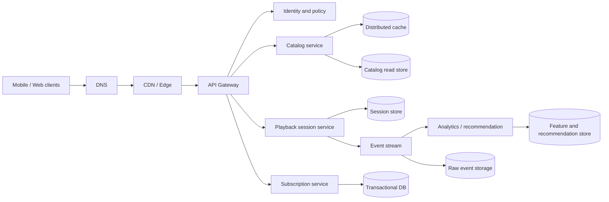

# Büyük Ölçekli Sistem Tasarımı: Spotify-Scale Senaryo

Bu bölüm, gerçek Spotify'ın gizli iç mimarisini iddia etmeden, Spotify ölçeğinde varsayımsal bir müzik platformunu tasarlama egzersizidir. Amaç teknoloji listesi değil; gereksinimden kapasiteye, request path'ten failure recovery'ye kadar uçtan uca düşünmektir.

## Hızlı Karar

| Problem | İlk karar | Neden |
| --- | --- | --- |
| 1B kayıtlı kullanıcı | Domain bazlı stateless servisler | Kullanıcı sayısı tek başına aktif trafik değildir |
| 10M eşzamanlı playback | CDN ve edge delivery | Medya origin'den servis edilmez |
| 200 ms kontrol-plane p95 | Cache, kısa request path, async yan işler | Media transfer latency'den ayrılır |
| Global katalog | Read-heavy replicated store | Okuma ölçeği ve region latency |
| Dinleme olayları | Append-only event stream | Analytics ve recommendation ayrıştırılır |
| Ödeme/abonelik | Strong consistency ve idempotency | İş doğruluğu playback'ten farklıdır |

## Üretim Kontrol Listesi

- Registered user, DAU, concurrent session ve request rate birbirinden ayrılmış mı?
- 200 ms hedefinin hangi endpoint ve hangi percentile için geçerli olduğu yazılı mı?
- Media plane ile control plane farklı ölçekleme ve caching stratejilerine sahip mi?
- Her data store'un owner'ı, consistency modeli ve recovery yöntemi belli mi?
- Region kaybı, CDN miss storm, hot artist ve recommendation backlog test edildi mi?

## Varsayımlar ve Kapsam

```text
1B registered users
100M daily active users
10M concurrent playback sessions
Playback heartbeat: 30 saniye
Control-plane API p95: 200 ms
Media segmentleri CDN üzerinden dağıtılır
```

10M playback session'ın 30 saniyede bir heartbeat gönderdiğini varsayarsak:

```text
Heartbeat ortalama RPS = 10.000.000 / 30 ≈ 333.000 RPS
```

Bu trafik, kullanıcı login veya katalog aramasıyla aynı request path'e konulmamalıdır. Heartbeat aggregation, edge batching veya ayrı ingestion yolu ile işlenebilir.

## Uçtan Uca Mimari



## Plane Ayrımı

### Control Plane

Login, catalog metadata, search, playlist, recommendation metadata, subscription ve playback token gibi API'ler control plane'dedir. 200 ms hedefi öncelikle bu request'ler için tanımlanır.

### Media Plane

Audio segmentleri object storage ve CDN üzerinden servis edilir. Origin shield, signed URL, adaptive bitrate ve regional cache kullanılır. Medya gövdesini API gateway üzerinden geçirmek gereksiz latency ve maliyet üretir.

### Event Plane

Play, pause, skip, search ve impression event'leri append-only stream'e yazılır. Recommendation ve analytics consumer'ları ayrı consumer group'larda çalışır; kullanıcı request'i bu işlerin tamamlanmasını beklemez.

## Component Deep-Dive

### API Gateway

TLS, authentication, quota, request ID, routing ve coarse-grained rate limit sağlar. Gateway business query çalıştırmaz; servis timeout'ları toplam latency budget içine sığar.

### Catalog

Sanatçı, albüm, parça ve hak bilgileri read-heavy'dir. Cache-aside, versioned metadata, read replicas ve region'a yakın read store kullanılabilir. Hak/territory filtresi cache key'in parçası olmalıdır.

### Playback Session

Playback token ve session state için düşük latency'li, TTL destekli bir store uygundur. Heartbeat idempotent olmalı; geç gelen veya duplicate heartbeat session'ı geriye taşımamalıdır.

### Subscription ve Billing

Abonelik ve ödeme state'i transactional source of truth'ta tutulur. Webhook duplicate'leri idempotency key ile işlenir. Playback entitlement cache'lenebilir ancak ödeme gerçeği cache değildir.

### Event Stream

Event key'i kullanıcı veya session bazında seçilerek gerekli ordering korunur. Partition sayısı, retention, consumer lag ve hot key dağılımı kapasite planına dahil edilir.

## Latency Budget

200 ms control-plane p95 için örnek bütçe:

```text
DNS/TLS/edge       25 ms
Gateway/auth       20 ms
Service logic      45 ms
Cache/database     70 ms
Serialization      15 ms
Headroom           25 ms
Total             200 ms
```

Bir endpoint üç downstream çağrı yapıyorsa toplam timeout'lar paralellik ve tail latency ile birlikte hesaplanır. Retry yalnızca budget ve idempotency uygunsa yapılır.

## Veri ve Tutarlılık

| Veri | Store yaklaşımı | Tutarlılık |
| --- | --- | --- |
| Katalog metadata | Replicated read store + cache | Eventual kabul edilebilir |
| Playlist değişikliği | User-owned transactional store | Read-your-writes gerekebilir |
| Subscription/payment | Relational transactional DB | Strong ve audit edilebilir |
| Playback heartbeat | TTL session store | Latest-write veya monotonic state |
| Listening events | Append-only stream + raw lake | At-least-once ve dedup |

Her projection, source event version'ını taşımalı ve yeniden üretilebilir olmalıdır.

## Failure ve Degrade Senaryoları

- **CDN miss storm:** Origin shield, request coalescing, prewarm ve stale asset.
- **Catalog store yavaş:** Cache'den stale metadata; arama sonuçlarında kontrollü eksiltme.
- **Recommendation backlog:** Son bilinen recommendation veya popüler içerik fallback'i.
- **Event broker lag:** Playback request'i bloklanmaz; lag alert ve tüketici autoscaling devreye girer.
- **Region kaybı:** DNS/traffic routing, read failover ve write ownership politikası.
- **Billing dependency down:** Yeni entitlement değişikliği durur; mevcut güvenli session politikası uygulanır.

Retry storm'u önlemek için exponential backoff, jitter, circuit breaker ve bulkhead birlikte kullanılır.

## Güvenlik ve Gizlilik

Identity token doğrulama, device/session binding, signed media URL, entitlement kontrolü, tenant/user authorization, secret rotation ve audit log gerekir. Listening history ve payment verisi ayrı erişim politikaları ve retention kurallarıyla tutulur.

## Gözlemlenebilirlik

Dashboard'lar en azından API p95/p99, CDN hit rate, origin egress, cache hit rate, heartbeat RPS, playback start success, event lag, billing error rate, database saturation ve error budget burn rate göstermelidir. Trace context API'den event stream consumer'ına taşınır.

## Tasarım Sonucu

Bu senaryoda “daha fazla instance” tek cevap değildir. Media plane CDN ile, control plane cache ve stateless servislerle, event plane partition ve consumer group'larla, billing ise transaction ve idempotency ile ölçeklenir. Her katman kendi failure mode'u ve SLO'su ile değerlendirilir.
