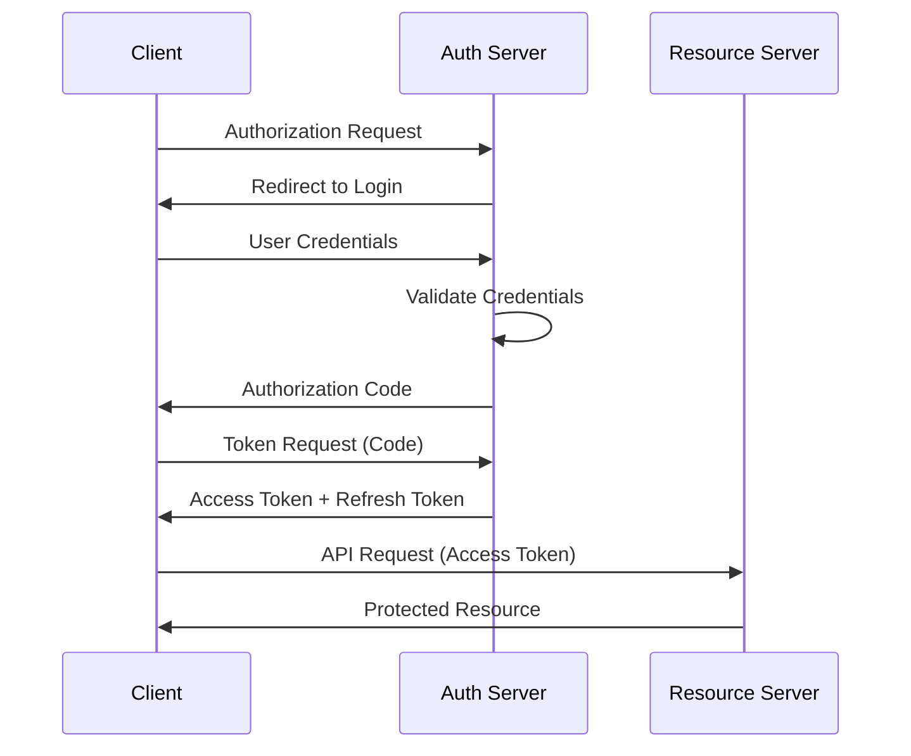
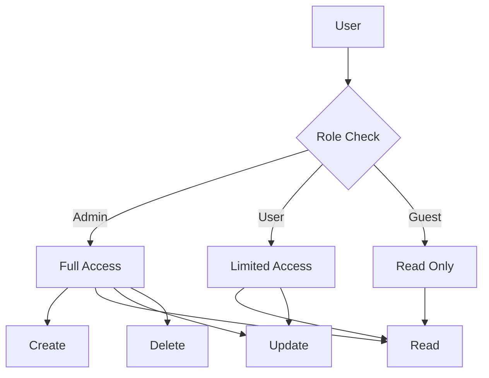

# Authentication vs Authorization

## Giriş

Kimlik doğrulama (Authentication) ve yetkilendirme (Authorization), güvenli uygulamaların temel taşlarıdır. Spring Security ile OAuth2, JWT ve method-level security implementasyonları kapsamlı güvenlik çözümleri sunar.

## OAuth2 Implementation (Spring Boot)

### 1. Authorization Server

**Spring Authorization Server** (eski Spring Security OAuth2) ile özelleştirilebilir token generation:



**Client Management** ve scope yapılandırması:

```java
@Service
public class ClientDetailsServiceImpl implements ClientDetailsService {
    
    @Autowired
    private ClientRepository clientRepository;
    
    @Override
    public ClientDetails loadClientByClientId(String clientId) throws ClientRegistrationException {
        Client client = clientRepository.findByClientId(clientId)
                .orElseThrow(() -> new ClientRegistrationException("Client not found"));
        
        return BaseClientDetails.valueOf(
                String.format("client_id:%s,client_secret:%s,scope:%s,grant_types:%s",
                        client.getClientId(),
                        client.getClientSecret(),
                        String.join(",", client.getScopes()),
                        String.join(",", client.getGrantTypes())
                )
        );
    }
}
```

**Token endpoint customization** ve rate limiting:

```java
@Component
public class CustomTokenEndpoint {
    
    @Autowired
    private RateLimitService rateLimitService;
    
    @PostMapping("/oauth/token")
    public ResponseEntity<OAuth2AccessToken> postAccessToken(
            @RequestParam Map<String, String> parameters,
            HttpServletRequest request) throws HttpRequestMethodNotSupportedException {
        
        String clientId = parameters.get("client_id");
        
        // Rate limiting check
        if (!rateLimitService.tryAcquire(clientId)) {
            throw new OAuth2Exception("Rate limit exceeded");
        }
        
        // Token generation logic
        return tokenEndpoint.postAccessToken(principal, parameters);
    }
}
```

### 2. Resource Server

**@EnableResourceServer** annotation ile OAuth2 protection:

```java
@Configuration
@EnableResourceServer
public class ResourceServerConfig extends ResourceServerConfigurerAdapter {
    
    @Override
    public void configure(HttpSecurity http) throws Exception {
        http.requestMatchers()
                .antMatchers("/api/**")
                .and()
                .authorizeRequests()
                .antMatchers("/api/public/**").permitAll()
                .antMatchers("/api/admin/**").hasRole("ADMIN")
                .antMatchers("/api/**").authenticated()
                .and()
                .oauth2ResourceServer()
                .jwt();
    }
    
    @Override
    public void configure(ResourceServerSecurityConfigurer resources) throws Exception {
        resources
                .tokenStore(tokenStore())
                .resourceId("resource-server-id")
                .stateless(true);
    }
}
```

**JWT token validation** ve custom validators:

```java
@Component
public class CustomJwtValidator implements OAuth2TokenValidator<Jwt> {
    
    @Override
    public OAuth2TokenValidatorResult validate(Jwt jwt) {
        if (jwt.getExpiresAt().isBefore(Instant.now())) {
            return OAuth2TokenValidatorResult.failure("Token expired");
        }
        
        if (!jwt.getClaimAsString("iss").equals("expected-issuer")) {
            return OAuth2TokenValidatorResult.failure("Invalid issuer");
        }
        
        return OAuth2TokenValidatorResult.success();
    }
}

@Configuration
public class JwtConfig {
    
    @Bean
    public JwtDecoder jwtDecoder() {
        NimbusJwtDecoder jwtDecoder = NimbusJwtDecoder
                .withJwkSetUri("https://auth-server/.well-known/jwks.json")
                .build();
        
        jwtDecoder.setJwtValidator(new DelegatingOAuth2TokenValidator<>(
                new JwtTimestampValidator(),
                new CustomJwtValidator()
        ));
        
        return jwtDecoder;
    }
}
```

### 3. OAuth2 Flows

**Authorization Code flow** PKCE ile:

```java
@Bean
public OAuth2AuthorizationRequestResolver authorizationRequestResolver(
        ClientRegistrationRepository clientRegistrationRepository) {
    return new CustomAuthorizationRequestResolver(
            clientRegistrationRepository, "/oauth2/authorization");
}

public class CustomAuthorizationRequestResolver implements OAuth2AuthorizationRequestResolver {
    
    private final OAuth2AuthorizationRequestResolver defaultResolver;
    
    public CustomAuthorizationRequestResolver(
            ClientRegistrationRepository clientRegistrationRepository,
            String authorizationRequestBaseUri) {
        this.defaultResolver = new DefaultOAuth2AuthorizationRequestResolver(
                clientRegistrationRepository, authorizationRequestBaseUri);
    }
    
    @Override
    public OAuth2AuthorizationRequest resolve(HttpServletRequest request) {
        OAuth2AuthorizationRequest authorizationRequest = defaultResolver.resolve(request);
        
        if (authorizationRequest != null) {
            // Add PKCE parameters
            Map<String, Object> additionalParameters = new HashMap<>(
                    authorizationRequest.getAdditionalParameters());
            
            String codeVerifier = generateCodeVerifier();
            String codeChallenge = generateCodeChallenge(codeVerifier);
            
            additionalParameters.put("code_challenge", codeChallenge);
            additionalParameters.put("code_challenge_method", "S256");
            
            return OAuth2AuthorizationRequest.from(authorizationRequest)
                    .additionalParameters(additionalParameters)
                    .build();
        }
        
        return authorizationRequest;
    }
}
```

**Client Credentials flow** service-to-service communication için:

```java
@Service
public class ClientCredentialsService {
    
    @Value("${oauth2.client.client-id}")
    private String clientId;
    
    @Value("${oauth2.client.client-secret}")
    private String clientSecret;
    
    @Value("${oauth2.client.token-uri}")
    private String tokenUri;
    
    public String getAccessToken() {
        RestTemplate restTemplate = new RestTemplate();
        
        HttpHeaders headers = new HttpHeaders();
        headers.setContentType(MediaType.APPLICATION_FORM_URLENCODED);
        headers.setBasicAuth(clientId, clientSecret);
        
        MultiValueMap<String, String> body = new LinkedMultiValueMap<>();
        body.add("grant_type", "client_credentials");
        body.add("scope", "read write");
        
        HttpEntity<MultiValueMap<String, String>> request = new HttpEntity<>(body, headers);
        
        TokenResponse response = restTemplate.postForObject(tokenUri, request, TokenResponse.class);
        return response != null ? response.getAccessToken() : null;
    }
}
```

### 4. Sosyal Giriş (Social Login) Entegrasyonu

**OAuth2 ile giriş** başlıca sağlayıcılarla:

```yaml
spring:
  security:
    oauth2:
      client:
        registration:
          google:
            client-id: ${GOOGLE_CLIENT_ID}
            client-secret: ${GOOGLE_CLIENT_SECRET}
            scope:
              - email
              - profile
            redirect-uri: "{baseUrl}/login/oauth2/code/{registrationId}"
          github:
            client-id: ${GITHUB_CLIENT_ID}
            client-secret: ${GITHUB_CLIENT_SECRET}
            scope:
              - read:user
              - user:email
        provider:
          google:
            authorization-uri: https://accounts.google.com/o/oauth2/auth
            token-uri: https://oauth2.googleapis.com/token
            user-info-uri: https://www.googleapis.com/oauth2/v3/userinfo
            user-name-attribute: sub
```

**Custom OAuth2 provider** implementation:

```java
@Service
public class CustomOAuth2UserService extends DefaultOAuth2UserService {
    
    @Autowired
    private UserRepository userRepository;
    
    @Override
    public OAuth2User loadUser(OAuth2UserRequest userRequest) throws OAuth2AuthenticationException {
        OAuth2User oauth2User = super.loadUser(userRequest);
        
        String registrationId = userRequest.getClientRegistration().getRegistrationId();
        String userNameAttributeName = userRequest.getClientRegistration()
                .getProviderDetails()
                .getUserInfoEndpoint()
                .getUserNameAttributeName();
        
        // Process OAuth2 user info and map to local user
        User user = processOAuth2User(oauth2User, registrationId);
        
        return new CustomOAuth2User(oauth2User.getAuthorities(), 
                oauth2User.getAttributes(), userNameAttributeName, user);
    }
    
    private User processOAuth2User(OAuth2User oauth2User, String registrationId) {
        OAuth2UserInfo userInfo = OAuth2UserInfoFactory.getOAuth2UserInfo(registrationId, oauth2User.getAttributes());
        
        if (userInfo.getEmail().isEmpty()) {
            throw new OAuth2AuthenticationException("Email not found from OAuth2 provider");
        }
        
        Optional<User> userOptional = userRepository.findByEmail(userInfo.getEmail());
        User user;
        
        if (userOptional.isPresent()) {
            user = userOptional.get();
            if (!user.getProvider().equals(AuthProvider.valueOf(registrationId.toUpperCase()))) {
                throw new OAuth2AuthenticationException("Email already signed up");
            }
            user = updateExistingUser(user, userInfo);
        } else {
            user = registerNewUser(userInfo, registrationId);
        }
        
        return userRepository.save(user);
    }
}
```

## JWT Token Management

### 1. Token Structure

**Header, Payload, Signature** yapılandırması:

```mermaid
graph TD
    A[JWT Token] --> B[Header]
    A --> C[Payload]
    A --> D[Signature]
    
    B --> B1[alg: HS256]
    B --> B2[typ: JWT]
    
    C --> C1[sub: user123]
    C --> C2[exp: 1516239022]
    C --> C3[roles: [ADMIN,USER]]
    
    D --> D1[HMACSHA256]
    D --> D2[Base64Url]
```

### 2. Token Refresh Implementation

**Refresh token rotation** güvenlik için:

```java
@Service
public class TokenRefreshService {
    
    @Autowired
    private RefreshTokenRepository refreshTokenRepository;
    
    @Autowired
    private JwtTokenService jwtTokenService;
    
    public TokenResponse refreshToken(String refreshToken) {
        RefreshToken refreshTokenEntity = refreshTokenRepository.findByToken(refreshToken)
                .orElseThrow(() -> new TokenRefreshException("Refresh token not found"));
        
        if (refreshTokenEntity.getExpiryDate().isBefore(Instant.now())) {
            refreshTokenRepository.delete(refreshTokenEntity);
            throw new TokenRefreshException("Refresh token expired");
        }
        
        User user = refreshTokenEntity.getUser();
        
        // Generate new access token
        String newAccessToken = jwtTokenService.generateToken(new CustomUserDetails(user));
        
        // Rotate refresh token
        String newRefreshToken = generateNewRefreshToken(user);
        refreshTokenRepository.delete(refreshTokenEntity);
        
        return TokenResponse.builder()
                .accessToken(newAccessToken)
                .refreshToken(newRefreshToken)
                .tokenType("Bearer")
                .expiresIn(jwtExpiration)
                .build();
    }
    
    private String generateNewRefreshToken(User user) {
        RefreshToken refreshToken = new RefreshToken();
        refreshToken.setUser(user);
        refreshToken.setToken(UUID.randomUUID().toString());
        refreshToken.setExpiryDate(Instant.now().plusMillis(refreshTokenDurationMs));
        
        refreshToken = refreshTokenRepository.save(refreshToken);
        return refreshToken.getToken();
    }
}
```

**Secure token storage** HttpOnly cookies ile:

```java
@Component
public class CookieUtils {
    
    public static void addCookie(HttpServletResponse response, String name, String value, int maxAge) {
        Cookie cookie = new Cookie(name, value);
        cookie.setPath("/");
        cookie.setHttpOnly(true);
        cookie.setSecure(true);
        cookie.setMaxAge(maxAge);
        response.addCookie(cookie);
    }
    
    public static String getCookie(HttpServletRequest request, String name) {
        Cookie[] cookies = request.getCookies();
        if (cookies != null) {
            for (Cookie cookie : cookies) {
                if (cookie.getName().equals(name)) {
                    return cookie.getValue();
                }
            }
        }
        return null;
    }
    
    public static void deleteCookie(HttpServletRequest request, HttpServletResponse response, String name) {
        Cookie[] cookies = request.getCookies();
        if (cookies != null) {
            for (Cookie cookie : cookies) {
                if (cookie.getName().equals(name)) {
                    cookie.setValue("");
                    cookie.setPath("/");
                    cookie.setMaxAge(0);
                    response.addCookie(cookie);
                }
            }
        }
    }
}
```

## Method-Level Security

### 1. @PreAuthorize/@PostAuthorize

**Expression-based access control**:



```java
@Service
public class UserService {
    
    @PreAuthorize("hasRole('ADMIN') or #user.id == authentication.principal.id")
    public User updateUser(User user) {
        return userRepository.save(user);
    }
    
    @PreAuthorize("hasRole('ADMIN') or @userService.isOwner(#userId, authentication.principal.id)")
    public void deleteUser(Long userId) {
        userRepository.deleteById(userId);
    }
    
    @PostAuthorize("returnObject.owner == authentication.principal.username or hasRole('ADMIN')")
    public Document getDocument(Long documentId) {
        return documentRepository.findById(documentId).orElse(null);
    }
    
    @PreAuthorize("@permissionEvaluator.hasPermission(authentication, #document, 'WRITE')")
    public Document saveDocument(Document document) {
        return documentRepository.save(document);
    }
    
    public boolean isOwner(Long userId, Long currentUserId) {
        return userId.equals(currentUserId);
    }
}
```

**Custom security expressions**:

```java
@Component("customSecurityExpressionRoot")
public class CustomSecurityExpressionRoot extends SecurityExpressionRoot implements MethodSecurityExpressionOperations {
    
    private Object filterObject;
    private Object returnObject;
    
    public CustomSecurityExpressionRoot(Authentication authentication) {
        super(authentication);
    }
    
    public boolean hasAccessToCompany(Long companyId) {
        CustomUserDetails userDetails = (CustomUserDetails) this.getPrincipal();
        return userDetails.getCompanyId().equals(companyId);
    }
    
    public boolean isBusinessHours() {
        LocalTime now = LocalTime.now();
        return now.isAfter(LocalTime.of(9, 0)) && now.isBefore(LocalTime.of(17, 0));
    }
    
    @Override
    public void setFilterObject(Object filterObject) {
        this.filterObject = filterObject;
    }
    
    @Override
    public Object getFilterObject() {
        return filterObject;
    }
    
    @Override
    public void setReturnObject(Object returnObject) {
        this.returnObject = returnObject;
    }
    
    @Override
    public Object getReturnObject() {
        return returnObject;
    }
    
    @Override
    public Object getThis() {
        return this;
    }
}
```

### 2. Role-Based Access Control (RBAC)

**@Secured annotation** role-based access için:

```java
@Service
public class AdminService {
    
    @Secured({"ROLE_ADMIN", "ROLE_SUPER_ADMIN"})
    public void deleteUser(Long userId) {
        userRepository.deleteById(userId);
    }
    
    @Secured("ROLE_MANAGER")
    public List<User> getTeamMembers(Long teamId) {
        return userRepository.findByTeamId(teamId);
    }
    
    @RolesAllowed({"ADMIN", "MANAGER"})
    public void approveRequest(Long requestId) {
        requestService.approve(requestId);
    }
}
```

**Hierarchical roles** inheritance ile:

```java
@Configuration
@EnableGlobalMethodSecurity(prePostEnabled = true, securedEnabled = true, jsr250Enabled = true)
public class MethodSecurityConfig extends GlobalMethodSecurityConfiguration {
    
    @Bean
    public RoleHierarchy roleHierarchy() {
        RoleHierarchyImpl roleHierarchy = new RoleHierarchyImpl();
        String hierarchy = "ROLE_SUPER_ADMIN > ROLE_ADMIN \n" +
                          "ROLE_ADMIN > ROLE_MANAGER \n" +
                          "ROLE_MANAGER > ROLE_USER";
        roleHierarchy.setHierarchy(hierarchy);
        return roleHierarchy;
    }
    
    @Bean
    public DefaultWebSecurityExpressionHandler webSecurityExpressionHandler() {
        DefaultWebSecurityExpressionHandler expressionHandler = new DefaultWebSecurityExpressionHandler();
        expressionHandler.setRoleHierarchy(roleHierarchy());
        return expressionHandler;
    }
    
    @Override
    protected MethodSecurityExpressionHandler createExpressionHandler() {
        DefaultMethodSecurityExpressionHandler expressionHandler = new DefaultMethodSecurityExpressionHandler();
        expressionHandler.setRoleHierarchy(roleHierarchy());
        return expressionHandler;
    }
}
```

## Spring Security Configuration

### Security Filter Chain

**Custom authentication filters** ve CORS configuration:

```java
@Configuration
@EnableWebSecurity
public class SecurityConfig extends WebSecurityConfigurerAdapter {
    
    @Autowired
    private JwtAuthenticationEntryPoint jwtAuthenticationEntryPoint;
    
    @Autowired
    private JwtRequestFilter jwtRequestFilter;
    
    @Override
    protected void configure(HttpSecurity http) throws Exception {
        http
            .cors().configurationSource(corsConfigurationSource())
            .and()
            .csrf().disable()
            .authorizeRequests()
                .antMatchers("/api/auth/**").permitAll()
                .antMatchers("/api/public/**").permitAll()
                .antMatchers(HttpMethod.GET, "/api/posts/**").permitAll()
                .antMatchers("/api/admin/**").hasRole("ADMIN")
                .anyRequest().authenticated()
            .and()
            .exceptionHandling().authenticationEntryPoint(jwtAuthenticationEntryPoint)
            .and()
            .sessionManagement().sessionCreationPolicy(SessionCreationPolicy.STATELESS)
            .and()
            .addFilterBefore(jwtRequestFilter, UsernamePasswordAuthenticationFilter.class);
    }
    
    @Bean
    public CorsConfigurationSource corsConfigurationSource() {
        CorsConfiguration configuration = new CorsConfiguration();
        configuration.setAllowedOriginPatterns(Arrays.asList("*"));
        configuration.setAllowedMethods(Arrays.asList("GET", "POST", "PUT", "DELETE", "OPTIONS"));
        configuration.setAllowedHeaders(Arrays.asList("*"));
        configuration.setAllowCredentials(true);
        
        UrlBasedCorsConfigurationSource source = new UrlBasedCorsConfigurationSource();
        source.registerCorsConfiguration("/**", configuration);
        return source;
    }
    
    @Bean
    public PasswordEncoder passwordEncoder() {
        return new BCryptPasswordEncoder(12);
    }
    
    @Bean
    @Override
    public AuthenticationManager authenticationManagerBean() throws Exception {
        return super.authenticationManagerBean();
    }
}
```

Bu kapsamlı Authentication ve Authorization implementasyonu, Spring Security ile güvenli uygulama geliştirme için gereken tüm bileşenleri sağlar.
