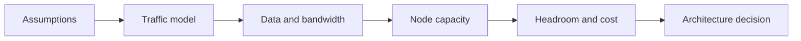

# Back-of-the-Envelope Estimation

Back-of-the-envelope estimation builds a quick, reasonable capacity model with incomplete information. The goal is not false precision; it is to catch assumptions that would place the architecture at the wrong scale.

## Quick Decision

| Estimate | Simple formula | Design decision |
| --- | --- | --- |
| Average RPS | Daily requests / 86,400 | API and worker capacity |
| Peak RPS | Average RPS × peak factor | Autoscaling and buffering |
| Concurrency | RPS × latency in seconds | Threads, connections, and workers |
| Storage | Users × records × record size | Database, partitioning, retention |
| Bandwidth | RPS × request/response size | CDN, compression, network |
| Availability | Uptime ratio | Error budget and failover |

## Production Checklist

- Is the source or assumption for every number documented?
- Are average, peak, and growth factors separate?
- Are binary and decimal units kept consistent?
- Is per-instance capacity bounded by a benchmark and safety margin?
- Is the result interpreted alongside latency budget, queue depth, and cost?

## Estimation Sequence

1. Estimate users, tenants, or devices.
2. Assume active ratios and operations per user.
3. Divide daily volume by seconds per day for average RPS.
4. Apply a peak-to-average factor.
5. Calculate bandwidth from request and response sizes.
6. Add data retention, replication, and index overhead.
7. Divide by per-node capacity and reserve headroom.



## Traffic Estimation

Example assumptions:

```text
10,000,000 daily active users
20 API requests per user per day
Peak factor: 5
```

```text
Daily requests = 10,000,000 × 20 = 200,000,000
Average RPS = 200,000,000 / 86,400 ≈ 2,315
Peak RPS ≈ 2,315 × 5 = 11,575
```

This does not mean one API tier must carry 11,575 RPS directly. CDN hit rate, cache hit rate, queued work, and endpoint mix must be included.

## Storage and Bandwidth

```text
Daily new data = daily operations × record size
Total storage = daily data × retention days × replication factor
Bandwidth = RPS × average payload size
```

For example, a 2,000-byte response at 10,000 peak RPS produces about 20 MB/s of application egress. Leave additional capacity for headers, TLS, compression, retries, and replica traffic.

Storage is not only the raw payload. Include indexes, metadata, WAL, snapshots, backups, and compaction space.

## Concurrency and Little's Law

Little's Law:

```text
L = λ × W
```

- `L`: Work concurrently in the system
- `λ`: Throughput in work/second
- `W`: Average time in the system in seconds

For 10,000 RPS and 200 ms average latency:

```text
Concurrency = 10,000 × 0.2 = 2,000 active requests
```

This is not a thread count. Connection pools, event loops, queues, and downstream concurrency limits must be modeled separately.

## Latency Budget

A 200 ms target is not assigned to one service:

```text
Client/network       40 ms
DNS/TLS/edge          20 ms
Gateway/auth          20 ms
Application           50 ms
Database/cache        50 ms
Headroom              20 ms
Total                200 ms
```

A 500 ms downstream timeout is a design error when the total target is 200 ms. Timeouts should fit inside the parent latency budget and be calculated with the retry budget.

## Capacity and Headroom

If a benchmark shows 1,000 RPS per instance, production capacity is not automatically 1,000. Reserve room for GC, deployment, zone loss, and uneven traffic; a 50–70% utilization target can be a useful starting assumption.

```text
Required instances = peak RPS / (instance capacity × target utilization)
```

Check the result against the SLO after losing at least one failure domain.

## Common Errors

- Confusing average RPS with peak traffic.
- Assuming a 100% cache hit rate.
- Forgetting fan-out, retry, and replication traffic.
- Counting only the JSON body as payload size.
- Planning capacity without headroom.
- Presenting an estimate as a fact instead of an assumption range.

Record the result as a range with a sensitivity note. Turn the assumption that changes the result most into a measurement plan.
