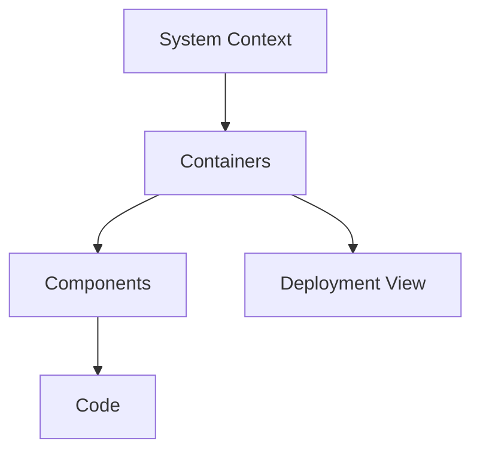

# Requirements, Trade-offs, and the C4 Model

Good system design clarifies the problem and success criteria before drawing the solution. Requirements make user value, operational limits, and the reasons behind architecture decisions visible.

## Quick Decision

| Situation | Tool | Output |
| --- | --- | --- |
| Problem is unclear | Stakeholder interviews and user journeys | Problem statement and scope |
| Behavior must be defined | Functional requirements | Use case, API, or event contract |
| Quality limits must be set | Non-functional requirements | SLI/SLO, latency, capacity, and security targets |
| Architecture must be explained | C4 model | Context, container, component, and deployment views |
| Alternatives compete | Trade-off record | Decision, rejected option, and reversal condition |

## Production Checklist

- Are requirement owners, priorities, and validation methods explicit?
- Are functional and non-functional requirements kept separate?
- Are latency, availability, throughput, retention, and security targets numeric?
- Do C4 diagrams use the same system boundary and naming?
- Does every trade-off cover cost, performance, complexity, and failure modes?

## Functional and Non-Functional Requirements

A **functional requirement** says what the system does: “A user can create a playlist” or “A successful payment publishes an order event.”

A **non-functional requirement** says with which quality and limits it does so:

| Area | Example |
| --- | --- |
| Latency | API p95 stays below 200 ms |
| Availability | Monthly success rate is 99.9% |
| Throughput | 50,000 orders during the peak hour |
| Durability | A successful payment must not be lost |
| Security | Sensitive data is encrypted and auditable |
| Operability | Critical failures are detected within five minutes |
| Compliance | Data remains in an approved region |

If an NFR cannot be measured, the design decision and its test result remain ambiguous.

## Requirements Gathering and Documentation

Start with these questions:

1. Who is the user and which flow are they trying to complete?
2. How are success and failure recognized?
3. What are traffic, data volume, growth, and peak behavior?
4. Which data is critical, who owns it, and how long is it retained?
5. What latency, error, and consistency are acceptable?
6. What security, regulatory, and operational constraints apply?

A simple requirements record can contain:

```text
Problem: What user problem exists?
Actors: Users, systems, and owners
Functional scope: Behaviors to implement
Quality targets: p95, availability, throughput, durability
Data: Entities, source of truth, retention, privacy
Failure behavior: Timeout, retry, duplicate, degradation
Acceptance: Measurable test and observation conditions
Open decisions: Assumptions and owners
```

## Trade-off Analysis

Use the same questions for every alternative:

| Dimension | Question |
| --- | --- |
| Cost | What are infrastructure, operations, and data-transfer costs? |
| Performance | Which latency or throughput target improves? |
| Complexity | How many new components, contracts, and failure modes appear? |
| Consistency | Are stale or duplicate results acceptable? |
| Operability | How do deploy, debug, backup, and incident response change? |
| Reversibility | How difficult is it to undo the decision? |

The cheapest or fastest option is not automatically the best one. Record the choice with requirement weights and reversal conditions.

## The C4 Model

C4 explains the same architecture at different zoom levels:

1. **Context:** Users, the system, and external systems.
2. **Container:** Deployable applications, databases, queues, or workers.
3. **Component:** Modules and responsibilities inside a container.
4. **Code:** Class or function detail when it is useful.
5. **Deployment:** Nodes, regions, clusters, and network placement.



Each diagram should make scope, naming, relationship direction, and data flow clear. Do not fill a container diagram with component detail or a component diagram with every class.

## Design Document Order

Recommended order: problem and requirements → traffic/data assumptions → context → containers → critical components → data and communication decisions → failure/observability → trade-offs and rollout.
