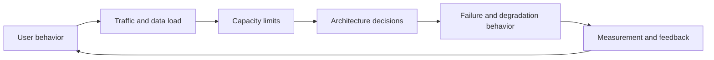

# Highload Systems and Systems Thinking

This page treats a backend as a system of user behavior, traffic, data flow, capacity limits, failure domains, and operating cost—not as a list of technology choices.

## Quick Decision

| Question | Starting point | When to change it |
| --- | --- | --- |
| Is traffic small or uncertain? | Modular monolith and one data owner | When team, deployment, or capacity boundaries diverge |
| Is the workload read-heavy? | Cache, indexes, and read replicas | When data size or a hot key stresses one node |
| Is work long-running? | Queue and workers | When the user should not wait for completion |
| Is data approaching a node limit? | Partitioning or sharding | When one primary or disk reaches its limit |
| Is a dependency slowing down? | Timeout, bulkhead, and circuit breaker | When retries and wait chains affect user traffic |

## Production Checklist

- Are users, traffic shape, data ownership, and critical outcomes explicit?
- Are reliability, scalability, and maintainability targets measurable?
- Are p95/p99 latency, peak throughput, and saturation tracked instead of averages alone?
- Is the cost, failure mode, and rollback path of every new layer documented?
- Can the system degrade in a controlled way when one dependency is slow?

## The Nature of Highload and Data-Intensive Systems

Highload does not simply mean many users. Capacity is determined by traffic distribution over time, work per request, data growth, and how many users contend for the same data.

In data-intensive systems, common bottlenecks before raw CPU include:

- disk and network I/O,
- database connection pools and lock contention,
- cache hot keys or a single partition,
- queue backlog and consumer lag,
- cross-region latency and replication cost.

Use this feedback loop when evaluating a system:

## Scaling from Zero to Millions of Users

Scaling means removing the most expensive bottleneck at each stage, not growing the same architecture forever.

1. **Start:** Simple service, one primary database, strong observability, and correct indexes.
2. **Early growth:** Stateless application instances, load balancing, connection-pool limits, and a basic cache.
3. **Read growth:** CDN, cache-aside, read replicas, and query optimization.
4. **Spiky load:** Queues, workers, idempotent jobs, and backpressure.
5. **Data growth:** Partitioning, archiving, read/write separation, and sharding when needed.
6. **Team growth:** Modular-monolith boundaries, domain ownership, contract tests, and independent deployment.
7. **Geographic growth:** Region selection, latency budgets, data residency, and multi-region failover.

Splitting into microservices early adds network hops, deployment, tracing, and consistency costs. Keeping a monolith forever creates ownership and independent-scaling problems. The trigger should be measured bottlenecks and team boundaries, not technology fashion.

## Reliability, Scalability, and Maintainability

- **Reliability:** The system produces the right result and recovers within an acceptable time after failure.
- **Scalability:** Capacity can be increased predictably as traffic, data, or tenant count grows.
- **Maintainability:** A change affects a limited set of components and can be measured and rolled back.

These goals can conflict. More replicas can improve availability while adding consistency and cost concerns. More abstraction can increase, rather than reduce, the cost of understanding a system.

## Latency, Throughput, and Availability

- **Latency:** Time to complete one operation; p50, p95, and p99 should be considered together.
- **Throughput:** Requests, messages, or records processed per unit of time.
- **Availability:** The proportion of time the service is successful and usable.

A system can have high throughput and poor per-request latency. Availability is not only whether a process is running; the critical operation must also complete correctly and on time.

## System Thinking for Architects

For every design decision, ask:

1. What problem does this component solve?
2. What is its capacity limit?
3. What do upstream and downstream systems see when it fails?
4. If data is copied, where is the source of truth?
5. Which metric will validate the decision?
6. Are the cost and operational burden acceptable?

An architecture diagram should show the request path, data ownership, asynchronous boundaries, retry behavior, and observability signals—not just boxes.

## Design Outcome

A decision becomes an architectural decision when its assumptions, measurements, trade-offs, failure modes, and rollback path are recorded. Otherwise it is only a technology list.
