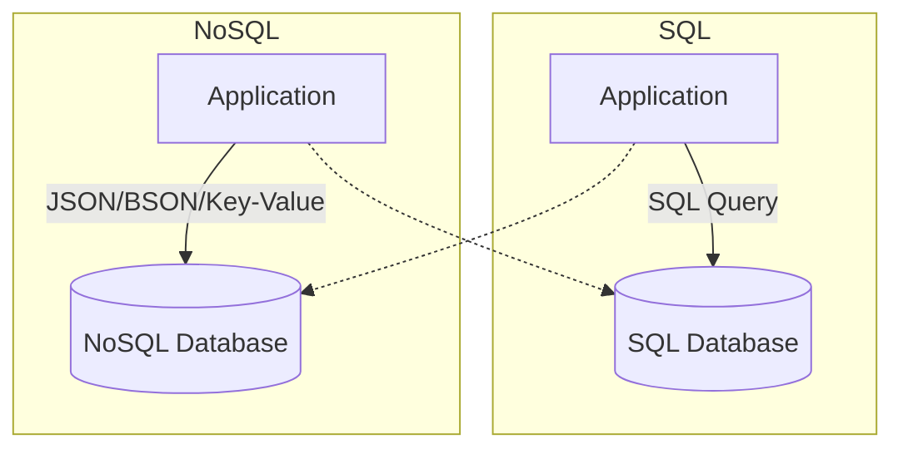

# Core Database Concepts

## Database Architecture Diagram

# Basic Database Concepts

## SQL Databases (with Spring Boot)

### Spring Data JPA
- **Hibernate ORM** for entity mapping
- `@Entity`/`@Table` annotations for schema mapping

### Repository Pattern
- `JpaRepository<Entity, ID>` for CRUD operations
- Custom query methods (`@Query` annotation)

### Transaction Management
- `@Transactional` annotation for declarative transaction management
- Isolation levels
- Propagation behaviors

### Connection Pooling
- **HikariCP** for production-ready connection pooling
- Connection leak detection

### Database Migration
- **Flyway/Liquibase** for schema versioning
- Baseline migrations
- Repeatable scripts

### PostgreSQL
- JSON/JSONB support
- Advanced indexing
- Full-text search
- Horizontal scaling with CitusDB

### MySQL
- Master-slave replication
- InnoDB storage engine
- Partitioning strategies

## NoSQL Databases (with Spring Boot)

### MongoDB
- **Spring Data MongoDB** for document-based storage
- `@Document` annotation
- Reactive support

### Redis
- **Spring Data Redis** for caching layer
- RedisTemplate/StringRedisTemplate
- Pub/sub messaging

### Elasticsearch
- **Spring Data Elasticsearch** for full-text search
- Aggregations
- Real-time analytics

### Cassandra
- **Spring Data Cassandra** for wide-column store
- Eventual consistency
- High availability

## Database Design Patterns

### Domain-Driven Design
- Aggregate boundaries
- Entity vs value objects
- Repository per aggregate

### Event Sourcing
- Event store as single source of truth
- Projection views
- Replay capability

### CQRS
- Command Query Responsibility Segregation
- Separate read/write models
- Eventual consistency

### Database per Service
- Microservices pattern
- Data ownership
- Distributed transactions challenges

## Indexing - Spring Boot Perspective

### JPA Index Annotations
- `@Index` annotation for entity-level index definitions
- `@Table(indexes = {...})` for composite indices

### Database-Specific Indices
- **PostgreSQL JSONB indices**
- **MySQL full-text indices**
- **Spatial indices** for geographic data

### Performance Monitoring
- Spring Boot Actuator for slow query detection
- Hibernate statistics
- Connection pool metrics

### Index Strategy
- Cardinality analysis
- Covering indices for query performance
- Partial indices for storage optimization

### B-tree Implementation
- Balanced tree structure
- O(log n) search complexity
- Range queries support
- Write performance trade-offs

## Normalization and Denormalization - Spring Boot Context

### Normalization (3NF/BCNF)
- JPA `@OneToMany`/`@ManyToOne` relationships with foreign key constraints
- `@JoinColumn` for relationship mapping

### Denormalization Strategies
- `@Formula` annotation for computed fields
- `@SecondaryTable` for table splitting
- Read-optimized views

### Event-Driven Denormalization
- Domain events for derived data synchronization
- Eventual consistency patterns

### Materialized Views
- Database-level precomputed aggregations
- Spring scheduled tasks for view refresh

### Trade-offs
- Write complexity vs read performance
- Storage cost vs query speed
- Consistency vs availability

## Performance Optimization

### Indexing Strategies
- **B-tree indices**: Default index type, good for equality and range queries
- **Partial indices**: Index only specific rows, reduces index size
- **Composite indices**: Multiple columns, order matters
- **Covering indices**: Include all needed columns, avoid table lookup

### Query Optimization
- **EXPLAIN PLAN** analysis
- **N+1 query problem** (`@EntityGraph`, `@BatchSize`)

### Caching Layers
- **Second-level cache** (Hibernate)
- **Query result cache**
- **Distributed cache** (Redis)

### Read Replicas
- Master-slave replication
- Read-write splitting
- Eventual consistency handling

## Distributed Database Patterns

### Sharding Strategies
- **Horizontal partitioning**
- **Consistent hashing**
- **Range-based sharding**
- **Directory-based sharding**

### Replication
- **Master-slave**: Single write node, multiple read replicas
- **Multi-master**: Multiple write nodes, conflict resolution
- **Eventual consistency**: Updates propagate asynchronously

### CAP Theorem
- **Consistency**: All nodes see same data simultaneously
- **Availability**: System remains operational
- **Partition tolerance**: System continues despite network failures

### Database Federation
- Cross-database queries
- Data virtualization
- Service-oriented data access

### Polyglot Persistence
- Right tool for right job
- Hybrid storage strategies
- Data synchronization challenges

## SQL vs NoSQL Comparison

| Feature | SQL | NoSQL |
|---------|-----|-------|
| Schema | Fixed | Flexible |
| ACID | ✅ | Varies |
| Scalability | Vertical | Horizontal |
| Complex Queries | ✅ | Limited |
| Consistency | Strong | Eventual |
| Maturity | High | Varies |

## Database Selection Criteria

### Use SQL Databases
- Complex relationships
- ACID compliance required
- Complex queries and analytics
- Strong consistency needs
- Mature ecosystem requirements

### Use NoSQL Databases
- Horizontal scaling needs
- Flexible schema requirements
- High availability priorities
- Simple query patterns
- Rapid development cycles

## Monitoring & Performance

### Database Metrics
- Query execution time
- Connection pool usage
- Index utilization
- Lock contention
- Replication lag

### Optimization Techniques
- Query performance tuning
- Index optimization
- Connection pool tuning
- Partitioning strategies
- Caching implementations
