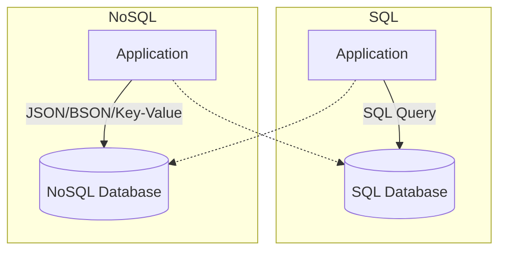
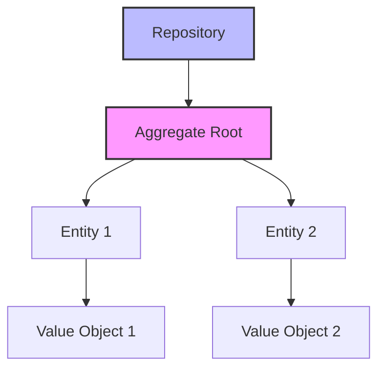
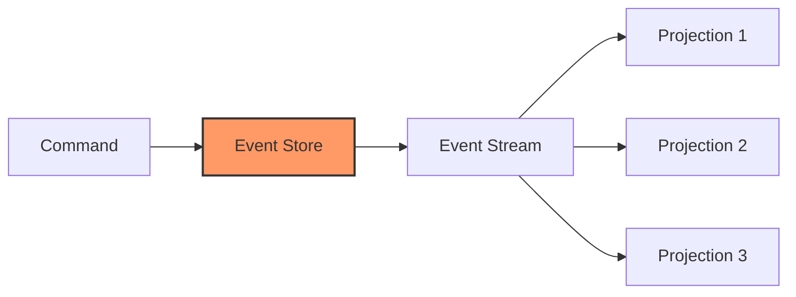
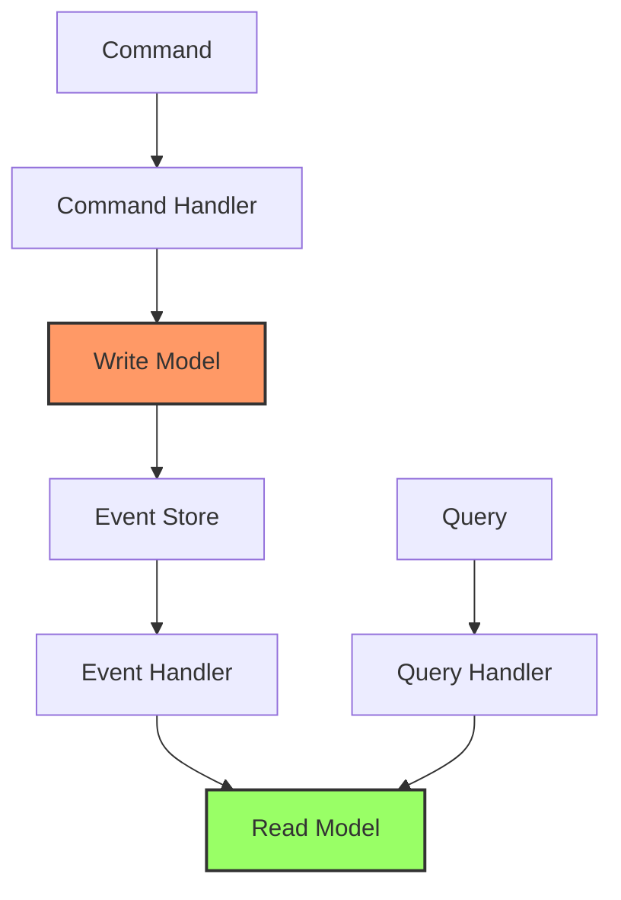
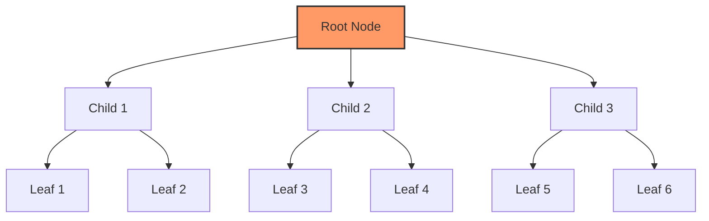
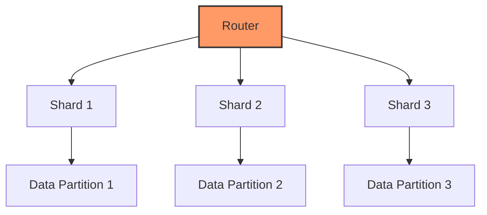
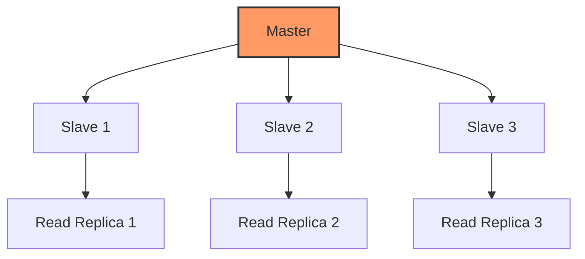
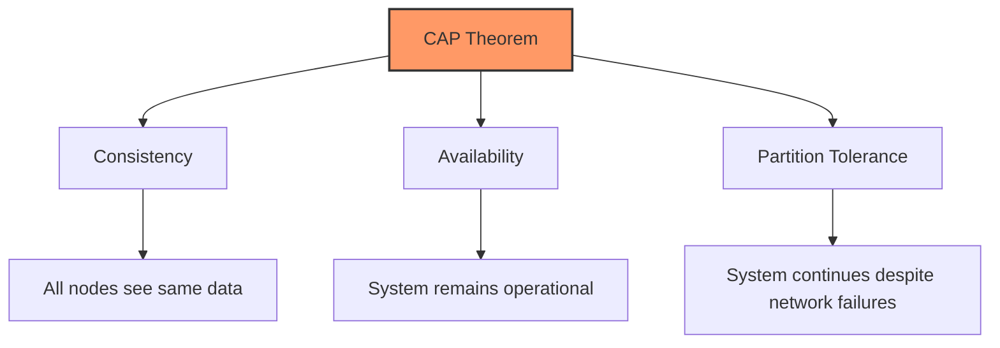

# Core Database Concepts

Database choice is not just SQL vs NoSQL; the data model, query shape, consistency expectation, operational load, and cost must be evaluated together. The best database is the one that carries the system's most critical access pattern with the least complexity.

## Quick Decision

| Need | Starting Choice | Watch Out |
| --- | --- | --- |
| Strong transactions and relational model | PostgreSQL / MySQL | Schema evolution and index maintenance |
| Flexible document shape | MongoDB-like document DB | Losing query discipline |
| Low-latency temporary data | Redis | Memory cost and persistence expectations |
| Large-scale search | Elasticsearch/OpenSearch | Resource usage and eventual consistency |

## Production Checklist

- Problem: Which queries are optimized, and which queries are intentionally allowed to stay expensive?
- Solution: Are primary keys, indexes, transaction boundaries, migrations, and backups clear?
- Trade-off: Normalization improves consistency; denormalization improves reads but adds synchronization debt.
- Failure mode: Lock waits, slow queries, connection pool exhaustion, replication lag, and migration rollback need plans.
- Measurement: Track query latency, index hit ratio, connection pool usage, disk I/O, replication lag, and storage growth.
- Security/cost: PII fields, encryption, access roles, and retention policy should be designed early; indexes and replicas increase cost.

## Database Architecture Diagram

```mermaid
graph TD
    subgraph SQL
        SQLApp[Application]
        SQLDB[(SQL Database)]
        SQLApp -- SQL Query --> SQLDB
    end
    subgraph NoSQL
        NoSQLApp[Application]
        NoSQLDB[(NoSQL Database)]
        NoSQLApp -- JSON/BSON/Key-Value --> NoSQLDB
    end
    SQLApp -.-> NoSQLDB
    NoSQLApp -.-> SQLDB
```

## Basic Database Concepts

## SQL Databases (with Spring Boot)

### Spring Data JPA
- **Hibernate ORM** for entity mapping
- `@Entity`/`@Table` annotations for schema mapping

### Repository Pattern
- `JpaRepository<Entity, ID>` for CRUD operations
- Custom query methods (`@Query` annotation)

### Transaction Management
- `@Transactional` annotation for declarative transaction management
- Isolation levels
- Propagation behaviors

### Connection Pooling
- **HikariCP** for production-ready connection pooling
- Connection leak detection

### Database Migration
- **Flyway/Liquibase** for schema versioning
- Baseline migrations
- Repeatable scripts

### PostgreSQL
- JSON/JSONB support
- Advanced indexing
- Full-text search
- Horizontal scaling with CitusDB

### MySQL
- Master-slave replication
- InnoDB storage engine
- Partitioning strategies

## NoSQL Databases (with Spring Boot)

### MongoDB
- **Spring Data MongoDB** for document-based storage
- `@Document` annotation
- Reactive support

### Redis
- **Spring Data Redis** for caching layer
- RedisTemplate/StringRedisTemplate
- Pub/sub messaging

### Elasticsearch
- **Spring Data Elasticsearch** for full-text search
- Aggregations
- Real-time analytics

### Cassandra
- **Spring Data Cassandra** for wide-column store
- Eventual consistency
- High availability

## Database Design Patterns

### Domain-Driven Design

```mermaid
graph TD
    A[Aggregate Root] --> B[Entity 1]
    A --> C[Entity 2]
    B --> D[Value Object 1]
    C --> E[Value Object 2]
    F[Repository] --> A
    style A fill:#f9f,stroke:#333,stroke-width:2px
    style F fill:#bbf,stroke:#333,stroke-width:2px
```

### Event Sourcing

```mermaid
graph LR
    A[Command] --> B[Event Store]
    B --> C[Event Stream]
    C --> D[Projection 1]
    C --> E[Projection 2]
    C --> F[Projection 3]
    style B fill:#f96,stroke:#333,stroke-width:2px
```

### CQRS

```mermaid
graph TD
    A[Command] --> B[Command Handler]
    B --> C[Write Model]
    C --> D[Event Store]
    D --> E[Event Handler]
    E --> F[Read Model]
    G[Query] --> H[Query Handler]
    H --> F
    style C fill:#f96,stroke:#333,stroke-width:2px
    style F fill:#9f6,stroke:#333,stroke-width:2px
```

### Database per Service
- Microservices pattern
- Data ownership
- Distributed transactions challenges

## Indexing - Spring Boot Perspective

### JPA Index Annotations
- `@Index` annotation for entity-level index definitions
- `@Table(indexes = {...})` for composite indices

### Database-Specific Indices
- **PostgreSQL JSONB indices**
- **MySQL full-text indices**
- **Spatial indices** for geographic data

### Performance Monitoring
- Spring Boot Actuator for slow query detection
- Hibernate statistics
- Connection pool metrics

### Index Strategy
- Cardinality analysis
- Covering indices for query performance
- Partial indices for storage optimization

### B-tree Implementation

```mermaid
graph TD
    A[Root Node] --> B[Child 1]
    A --> C[Child 2]
    A --> D[Child 3]
    B --> E[Leaf 1]
    B --> F[Leaf 2]
    C --> G[Leaf 3]
    C --> H[Leaf 4]
    D --> I[Leaf 5]
    D --> J[Leaf 6]
    style A fill:#f96,stroke:#333,stroke-width:2px
```

## Normalization and Denormalization - Spring Boot Context

### Normalization (3NF/BCNF)
- JPA `@OneToMany`/`@ManyToOne` relationships with foreign key constraints
- `@JoinColumn` for relationship mapping

### Denormalization Strategies
- `@Formula` annotation for computed fields
- `@SecondaryTable` for table splitting
- Read-optimized views

### Event-Driven Denormalization
- Domain events for derived data synchronization
- Eventual consistency patterns

### Materialized Views
- Database-level precomputed aggregations
- Spring scheduled tasks for view refresh

### Trade-offs
- Write complexity vs read performance
- Storage cost vs query speed
- Consistency vs availability

## Performance Optimization

### Indexing Strategies
- **B-tree indices**: Default index type, good for equality and range queries
- **Partial indices**: Index only specific rows, reduces index size
- **Composite indices**: Multiple columns, order matters
- **Covering indices**: Include all needed columns, avoid table lookup

### Query Optimization
- **EXPLAIN PLAN** analysis
- **N+1 query problem** (`@EntityGraph`, `@BatchSize`)

### Caching Layers
- **Second-level cache** (Hibernate)
- **Query result cache**
- **Distributed cache** (Redis)

### Read Replicas
- Master-slave replication
- Read-write splitting
- Eventual consistency handling

## Distributed Database Patterns

### Sharding Strategies

```mermaid
graph TD
    A[Router] --> B[Shard 1]
    A --> C[Shard 2]
    A --> D[Shard 3]
    B --> E[Data Partition 1]
    C --> F[Data Partition 2]
    D --> G[Data Partition 3]
    style A fill:#f96,stroke:#333,stroke-width:2px
```

### Replication

```mermaid
graph TD
    A[Master] --> B[Slave 1]
    A --> C[Slave 2]
    A --> D[Slave 3]
    B --> E[Read Replica 1]
    C --> F[Read Replica 2]
    D --> G[Read Replica 3]
    style A fill:#f96,stroke:#333,stroke-width:2px
```

### CAP Theorem

```mermaid
graph TD
    A[CAP Theorem] --> B[Consistency]
    A --> C[Availability]
    A --> D[Partition Tolerance]
    B --> E[All nodes see same data]
    C --> F[System remains operational]
    D --> G[System continues despite network failures]
    style A fill:#f96,stroke:#333,stroke-width:2px
```

### Database Federation
- Cross-database queries
- Data virtualization
- Service-oriented data access

### Polyglot Persistence
- Right tool for right job
- Hybrid storage strategies
- Data synchronization challenges

## SQL vs NoSQL Comparison

| Feature | SQL | NoSQL |
|---------|-----|-------|
| Schema | Fixed | Flexible |
| ACID | ✅ | Varies |
| Scalability | Vertical | Horizontal |
| Complex Queries | ✅ | Limited |
| Consistency | Strong | Eventual |
| Maturity | High | Varies |

## Database Selection Criteria

### Use SQL Databases
- Complex relationships
- ACID compliance required
- Complex queries and analytics
- Strong consistency needs
- Mature ecosystem requirements

### Use NoSQL Databases
- Horizontal scaling needs
- Flexible schema requirements
- High availability priorities
- Simple query patterns
- Rapid development cycles

## Monitoring & Performance

### Database Metrics
- Query execution time
- Connection pool usage
- Index utilization
- Lock contention
- Replication lag

### Optimization Techniques
- Query performance tuning
- Index optimization
- Connection pool tuning
- Partitioning strategies
- Caching implementations

## Data Modeling and Store Selection

SQL/NoSQL is not enough to choose a database. First document access patterns, cardinality, read/write ratio, ordering, retention, and consistency needs.

| Store type | Strong at | Typical risk |
| --- | --- | --- |
| Relational | Relationships, transactions, constraints, joins | Horizontal growth and write contention |
| Document | Flexible aggregate-oriented schemas | Cross-document transactions and joins |
| Key-value/cache | Fast key lookup, sessions, hot data | Limited query flexibility and eviction |
| Graph | Nodes, edges, and traversals | General reporting and operational cost |
| Time-series | Time-ordered measurements, retention, downsampling | General transaction/query flexibility |

In a document model, an aggregate read together can live in one document; frequently updated or independently owned data can be separated. Graph stores are valuable when relationships are the query center. In time-series stores, event time, high-cardinality labels, and retention are part of the model.

## Data Modeling Approach

1. List the most important reads and writes first.
2. Define aggregate boundaries and data ownership.
3. Choose primary keys, partition keys, and indexes from access patterns.
4. Compare normalization for update correctness with denormalization for read cost.
5. Document retention, archive, backup, and migration plans early.

SQL query languages are strong for joins, transactions, and ad-hoc analysis. Document/key-value queries are often optimized for known keys and indexes. Graph queries emphasize relationship traversal; time-series queries emphasize windows, aggregation, and downsampling. Query-language convenience does not fix a bad access pattern.

## Storage Selection Decision

| Question | Effect on the choice |
| --- | --- |
| What is the most critical query? | Index, partition, and model |
| Where is the transaction boundary? | Relational or local transaction |
| How quickly does data grow? | Partitioning, retention, and tiering |
| Are stale reads acceptable? | Replica/cache usage |
| Is traversal or aggregation central? | Graph or document choice |
| Is the data time-series shaped? | Time-series retention and rollups |

Polyglot persistence is useful only when every store has an owner, backup, migration, monitoring, and source of truth.
