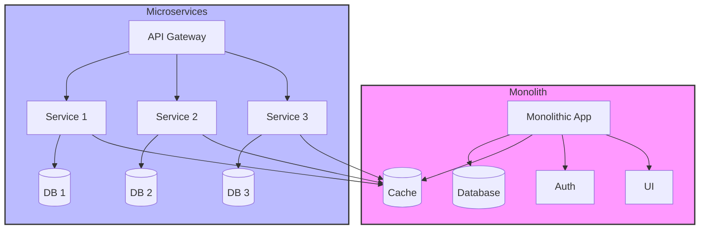

# Monolith vs. Microservice Architecture

## Architecture Comparison

## Monolithic Architecture (with Spring Boot)

### Single Application Approach
In Spring Boot, all business logic, data access layers, and web layers are packaged into a single JAR file.

### Spring Boot Advantages
- **Auto-configuration** for rapid startup
- **Embedded server** (Tomcat/Jetty) for easy deployment
- Leverage all features of Spring Framework

### Development Process
- Rapid configuration with Spring Boot starter dependencies
- Database operations with Spring Data JPA
- Security with Spring Security
- Integration testing with Spring Test

### Limitations
- Startup time increases as application grows
- Technology stack changes are difficult
- Merge conflicts increase in large teams

### Suitable Scenarios
- Small-medium scale projects
- Prototype development
- Teams with few developers
- Projects requiring rapid time-to-market

## Microservice Architecture (Spring Boot + Spring Cloud)

### Service-Oriented Approach
Each microservice is developed as a separate Spring Boot application with its own database.

### Spring Cloud Ecosystem
- **Service Discovery** (Eureka)
- **API Gateway** (Spring Cloud Gateway)
- **Circuit Breaker** (Hystrix/Resilience4j)
- **Distributed Configuration** (Spring Cloud Config)

### Communication Models
- **REST APIs** with Spring WebMVC/WebFlux
- **Async messaging** with Spring Cloud Stream + RabbitMQ/Kafka
- **Inter-service communication** with OpenFeign client

### Data Management
- Each service has its own PostgreSQL/MongoDB instance
- Saga pattern for distributed transactions
- Event sourcing with Spring Cloud Stream

### Deployment
- Each service in separate Docker container
- Kubernetes orchestration
- Health checks with Spring Boot actuator
- Git-based deployment pipeline

### Organizational Advantages
- **Conway's Law**: Team structure reflects service architecture
- Different teams can use different technology stacks
- Independent release cycles

### Operational Complexity
- Service mesh (Istio)
- Distributed tracing (Sleuth + Zipkin)
- Centralized logging (ELK stack)
- Monitoring (Micrometer + Prometheus)

## Hybrid Architecture Approach

### Strangler Fig Pattern
Strategy for gradually transforming monolithic applications to microservices

### Modular Monolith
- Modular structure with domain-driven design
- Ease of transition to microservices in the future

### Bounded Context
- Each module has its own data model and business logic
- Loose coupling

### Shared Kernel
- Management of commonly used code
- Versioning strategy

### Anti-Corruption Layer
Translation layer between old and new systems

## Decision Criteria

| Criteria | Monolithic | Microservices |
|----------|-----------|---------------|
| Team Size | < 10 people | > 10 people |
| Deployment Frequency | Weekly/Monthly | Daily/Hourly |
| System Complexity | Simple-Medium | Complex |
| Performance Requirements | Medium | High |
| Operational Experience | Limited | Advanced |

## Best Practices

### For Monolithic
- Use modular design
- Loose coupling with dependency injection
- Comprehensive testing strategy
- CI/CD pipeline setup

### For Microservices
- Domain-driven design approach
- API-first development
- Robust monitoring and observability
- Failure isolation and resilience patterns
