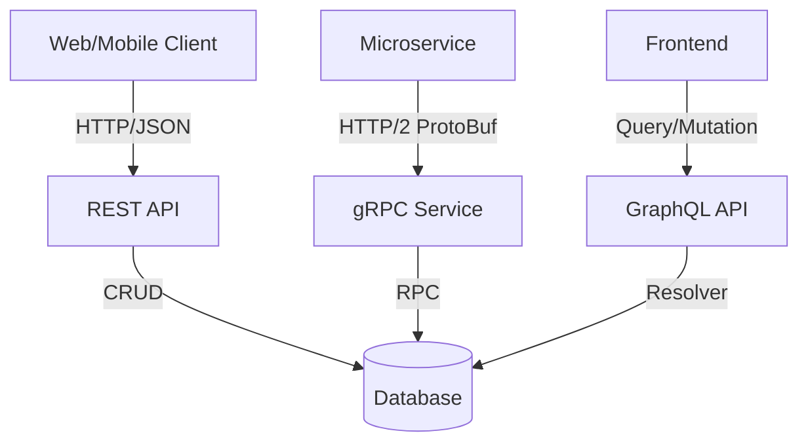
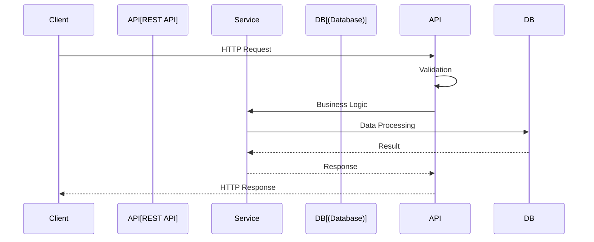
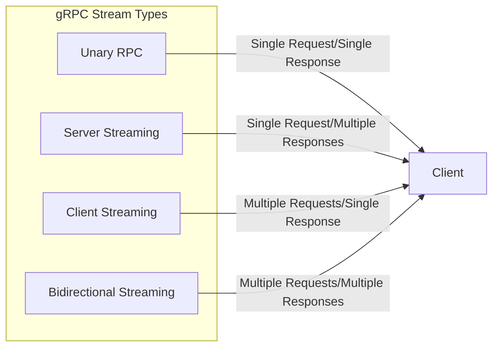
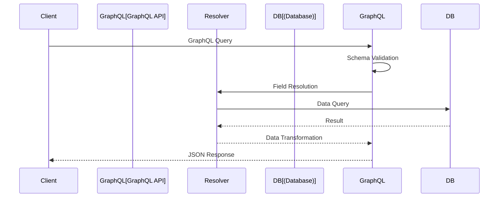
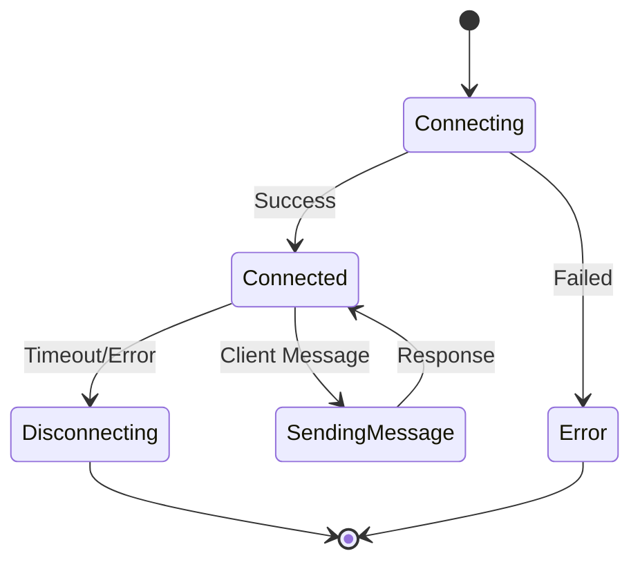
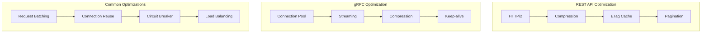

# HTTP, REST, gRPC Protocols

## Protocol Interaction



## REST API Lifecycle



## gRPC Stream Types



## REST API Development with Spring Boot

### Spring WebMVC
- Traditional servlet-based approach
- Blocking I/O model
- Widely adopted and mature

### Spring WebFlux
- Reactive programming model
- Non-blocking I/O
- Mono/Flux types for async streams

### Content Negotiation
- `@RequestMapping(produces/consumes)` for MediaType handling
- JSON/XML/Protocol Buffers support

### Validation
- Bean Validation (`@Valid`, `@NotNull`, `@Size`) for request validation
- MethodValidationInterceptor for method-level validation

### Error Handling
- `@ControllerAdvice` for global exception handling
- ResponseEntity for custom HTTP status codes

## REST API Best Practices (with Spring Boot)

### Richardson Maturity Model
- **Level 0**: HTTP as transport
- **Level 1**: Resources
- **Level 2**: HTTP Verbs
- **Level 3**: HATEOAS support with Spring HATEOAS library

### Versioning Strategies
- **URL versioning** (`/api/v1/`)
- **Header-based versioning**
- **Content negotiation**

### Documentation
- **SpringDoc OpenAPI** (Swagger) for automatic API documentation
- `@Operation` and `@Schema` annotations

### Security
- **Spring Security** for JWT token validation
- **OAuth2 Resource Server** configuration

## gRPC Integration (with Spring Boot)

### gRPC Starters
- `spring-boot-starter-grpc-server`/`client` dependencies

### Protobuf Code Generation
- `protobuf-maven-plugin` for Java class generation

### Service Implementation
- `@GrpcService` annotation for service implementation
- Blocking/non-blocking stubs

### Interceptors
- gRPC interceptors for authentication, logging, metrics collection

### Performance Benefits
- 30-50% less bandwidth with binary serialization
- HTTP/2 multiplexing
- Bi-directional streaming

## Protocol Selection Criteria

### REST
- ✅ Public APIs
- ✅ Browser-based clients
- ✅ Human-readable requirements
- ✅ Caching support
- ❌ High-performance scenarios

### gRPC
- ✅ High-performance internal services
- ✅ Polyglot microservices
- ✅ Real-time streaming requirements
- ✅ Type safety
- ❌ Browser support

### GraphQL
- ✅ Complex query requirements
- ✅ Mobile clients with bandwidth optimization
- ✅ Frontend-driven development
- ❌ Caching complexity

## GraphQL Integration

### Spring GraphQL
- Schema-first approach
- Type definitions

### DataFetcher
- Custom resolver implementations
- N+1 problem solution

### Batching & Caching
- DataLoader pattern
- Field-level caching

### Security
- Field-level authorization
- Depth limiting

### Performance Monitoring
- Query complexity analysis
- Execution time tracking

## WebSocket & Server-Sent Events

### Spring WebSocket
- STOMP protocol
- Message broker integration

### Real-time Updates
- Pub/sub pattern
- Topic-based messaging

### Connection Management
- Heartbeat mechanism
- Reconnection strategy

### Scalability
- WebSocket clustering
- Sticky sessions

### Security
- CSRF protection
- Origin validation

## Protocol Comparison

| Feature | REST | gRPC | GraphQL |
|---------|------|------|---------|
| Performance | Medium | High | Medium |
| Browser Support | ✅ | ❌ | ✅ |
| Streaming | ❌ | ✅ | ✅ |
| Type Safety | ❌ | ✅ | ✅ |
| Caching | ✅ | ❌ | Complex |
| Learning Curve | Low | Medium | High |

## Implementation Examples

### REST Endpoint
```java
@RestController
@RequestMapping("/api/v1/users")
public class UserController {
    
    @GetMapping("/{id}")
    public ResponseEntity<User> getUser(@PathVariable Long id) {
        User user = userService.findById(id);
        return ResponseEntity.ok(user);
    }
    
    @PostMapping
    public ResponseEntity<User> createUser(@Valid @RequestBody CreateUserRequest request) {
        User user = userService.create(request);
        return ResponseEntity.status(CREATED).body(user);
    }
}
```

### gRPC Service
```java
@GrpcService
public class UserGrpcService extends UserServiceGrpc.UserServiceImplBase {
    
    @Override
    public void getUser(GetUserRequest request, StreamObserver<UserResponse> responseObserver) {
        User user = userService.findById(request.getId());
        UserResponse response = UserResponse.newBuilder()
            .setUser(convertToProto(user))
            .build();
        
        responseObserver.onNext(response);
        responseObserver.onCompleted();
    }
}
```

## Performance Optimization

### REST API Optimization
- HTTP/2 support
- Response compression
- ETag caching
- Pagination
- Field selection

### gRPC Optimization
- Connection pooling
- Streaming for large datasets
- Compression algorithms
- Keep-alive settings

### Common Optimizations
- Request batching
- Connection reuse
- Circuit breaker pattern
- Load balancing
- Health checks

## GraphQL Query Flow



## WebSocket Connection Lifecycle



## Performance Optimization Flow


