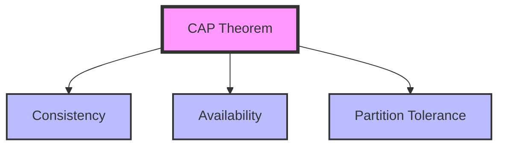
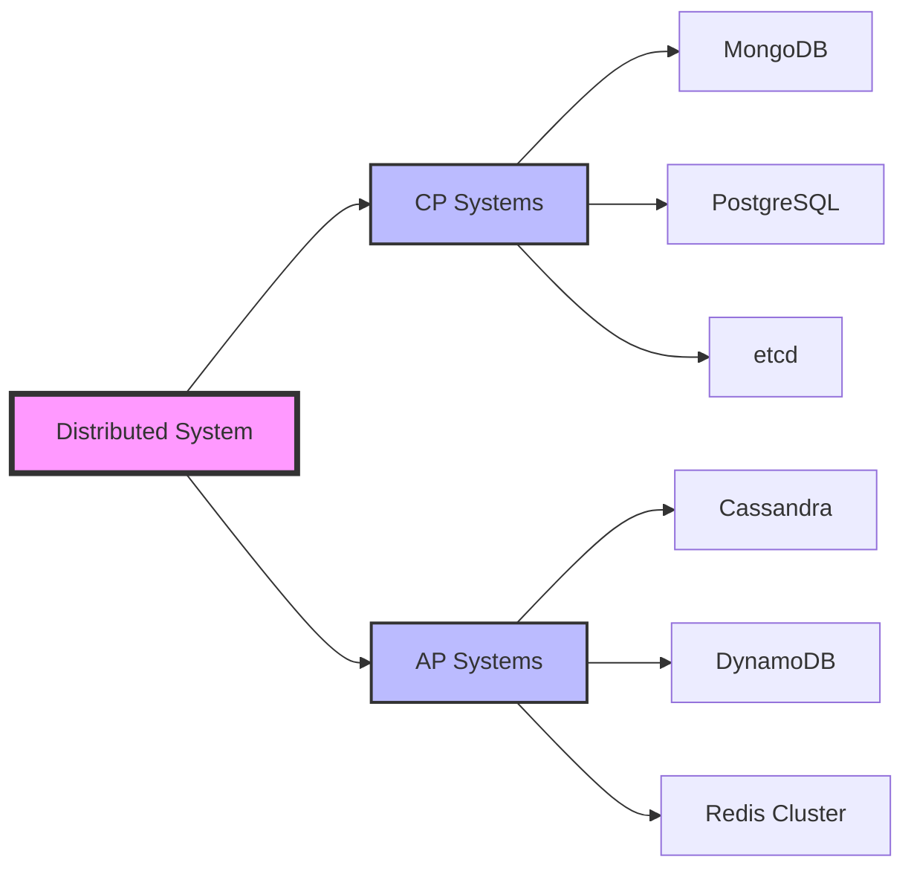
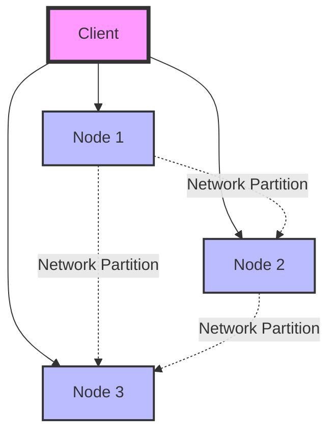
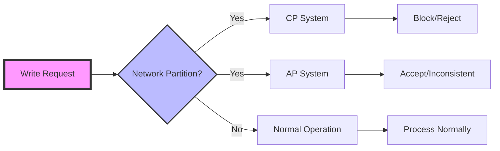

# CAP Theorem

The CAP Theorem, proposed by Eric Brewer, states that in distributed systems, you can only guarantee two out of three properties: Consistency, Availability, and Partition tolerance. This fundamental theorem shapes how we design and architect distributed systems.

## Understanding CAP Properties

### Consistency (C)
- All nodes see the same data simultaneously
- Strong consistency guarantee
- ACID properties

### Availability (A)
- System remains operational and responsive
- Always serves requests
- High uptime guarantee

### Partition Tolerance (P)
- System continues to function despite network failures
- Handles network splits and communication failures
- Essential for distributed systems

## CAP Theorem Diagrams

### CAP Triangle


### CP vs AP Systems


### Network Partition Scenario


### Consistency vs Availability Trade-off


## CP Systems (Consistency + Partition Tolerance)

CP systems prioritize consistency and partition tolerance over availability. During network partitions, they may become unavailable to maintain consistency.

### Spring Boot Implementation with MongoDB (CP System)

#### MongoDB Configuration for Strong Consistency
```java
@Configuration
@EnableMongoRepositories
public class MongoDBCPConfig {
    
    @Bean
    public MongoClient mongoClient() {
        ConnectionString connectionString = new ConnectionString(
            "mongodb://mongo1:27017,mongo2:27017,mongo3:27017/myapp?replicaSet=rs0"
        );
        
        MongoClientSettings settings = MongoClientSettings.builder()
            .applyConnectionString(connectionString)
            .readPreference(ReadPreference.primary()) // Ensure consistency
            .readConcern(ReadConcern.MAJORITY) // Read from majority
            .writeConcern(WriteConcern.MAJORITY.withJournal(true)) // Write to majority
            .retryWrites(true)
            .retryReads(true)
            .build();
            
        return MongoClients.create(settings);
    }
    
    @Bean
    public MongoTemplate mongoTemplate(MongoClient mongoClient) {
        MongoTemplate template = new MongoTemplate(mongoClient, "myapp");
        template.setWriteResultChecking(WriteResultChecking.EXCEPTION);
        return template;
    }
    
    @Bean
    public MongoTransactionManager transactionManager(MongoClient mongoClient) {
        return new MongoTransactionManager(new SimpleMongoClientDbFactory(mongoClient, "myapp"));
    }
}

@Service
@Transactional
@Slf4j
public class ConsistentOrderService {
    
    @Autowired
    private MongoTemplate mongoTemplate;
    
    @Autowired
    private OrderRepository orderRepository;
    
    @Autowired
    private InventoryRepository inventoryRepository;
    
    public Order createOrderWithConsistency(CreateOrderRequest request) {
        log.info("Creating order with strong consistency for user: {}", request.getUserId());
        
        // Start MongoDB transaction (CP system behavior)
        Order order = Order.builder()
            .orderId(UUID.randomUUID().toString())
            .userId(request.getUserId())
            .items(request.getItems())
            .status(OrderStatus.PENDING)
            .createdAt(Instant.now())
            .build();
        
        // Validate inventory with strong consistency
        for (OrderItem item : request.getItems()) {
            Inventory inventory = inventoryRepository.findByProductIdWithLock(item.getProductId())
                .orElseThrow(() -> new ProductNotFoundException("Product not found: " + item.getProductId()));
            
            if (inventory.getQuantity() < item.getQuantity()) {
                throw new InsufficientStockException("Insufficient stock for product: " + item.getProductId());
            }
            
            // Reserve inventory atomically
            inventory.setQuantity(inventory.getQuantity() - item.getQuantity());
            inventory.setReserved(inventory.getReserved() + item.getQuantity());
            inventoryRepository.save(inventory);
        }
        
        // Save order
        order.setStatus(OrderStatus.CONFIRMED);
        Order savedOrder = orderRepository.save(order);
        
        log.info("Order created with strong consistency: {}", savedOrder.getOrderId());
        return savedOrder;
    }
    
    public void cancelOrderWithConsistency(String orderId) {
        log.info("Cancelling order with strong consistency: {}", orderId);
        
        Order order = orderRepository.findById(orderId)
            .orElseThrow(() -> new OrderNotFoundException("Order not found: " + orderId));
        
        if (order.getStatus() == OrderStatus.CANCELLED) {
            throw new OrderAlreadyCancelledException("Order already cancelled: " + orderId);
        }
        
        // Restore inventory atomically
        for (OrderItem item : order.getItems()) {
            Inventory inventory = inventoryRepository.findByProductIdWithLock(item.getProductId())
                .orElseThrow(() -> new ProductNotFoundException("Product not found: " + item.getProductId()));
            
            inventory.setQuantity(inventory.getQuantity() + item.getQuantity());
            inventory.setReserved(inventory.getReserved() - item.getQuantity());
            inventoryRepository.save(inventory);
        }
        
        // Update order status
        order.setStatus(OrderStatus.CANCELLED);
        order.setCancelledAt(Instant.now());
        orderRepository.save(order);
        
        log.info("Order cancelled with strong consistency: {}", orderId);
    }
}

@Repository
public interface OrderRepository extends MongoRepository<Order, String> {
    
    @Query("{'userId': ?0, 'status': {'$in': ?1}}")
    List<Order> findByUserIdAndStatusIn(String userId, List<OrderStatus> statuses);
    
    @Query("{'createdAt': {'$gte': ?0, '$lt': ?1}}")
    List<Order> findByCreatedAtBetween(Instant start, Instant end);
}

@Repository
public interface InventoryRepository extends MongoRepository<Inventory, String> {
    
    @Query("{'productId': ?0}")
    Optional<Inventory> findByProductId(String productId);
    
    // Simulating pessimistic locking behavior in MongoDB
    default Optional<Inventory> findByProductIdWithLock(String productId) {
        // In real implementation, you'd use MongoDB's findAndModify or transactions
        return findByProductId(productId);
    }
}
```

#### PostgreSQL Configuration for ACID Compliance
```java
@Configuration
public class PostgreSQLCPConfig {
    
    @Bean
    @Primary
    public DataSource primaryDataSource() {
        HikariConfig config = new HikariConfig();
        config.setJdbcUrl("jdbc:postgresql://primary-postgres:5432/app");
        config.setUsername("${DB_USER}");
        config.setPassword("${DB_PASSWORD}");
        config.setMaximumPoolSize(20);
        config.setMinimumIdle(5);
        config.setConnectionTimeout(30000);
        config.setIdleTimeout(600000);
        config.setMaxLifetime(1800000);
        config.setIsolateInternalQueries(true);
        config.setTransactionIsolation("TRANSACTION_SERIALIZABLE");
        return new HikariDataSource(config);
    }
    
    @Bean
    public DataSource secondaryDataSource() {
        HikariConfig config = new HikariConfig();
        config.setJdbcUrl("jdbc:postgresql://secondary-postgres:5432/app");
        config.setUsername("${DB_USER}");
        config.setPassword("${DB_PASSWORD}");
        config.setMaximumPoolSize(15);
        config.setReadOnly(true); // Read-only replica
        return new HikariDataSource(config);
    }
    
    @Bean
    @Primary
    public JdbcTemplate primaryJdbcTemplate(@Qualifier("primaryDataSource") DataSource dataSource) {
        return new JdbcTemplate(dataSource);
    }
    
    @Bean
    public JdbcTemplate secondaryJdbcTemplate(@Qualifier("secondaryDataSource") DataSource dataSource) {
        return new JdbcTemplate(dataSource);
    }
}

@Service
@Transactional(isolation = Isolation.SERIALIZABLE)
@Slf4j
public class PostgreSQLConsistentService {
    
    @Autowired
    @Qualifier("primaryJdbcTemplate")
    private JdbcTemplate primaryJdbcTemplate;
    
    @Autowired
    @Qualifier("secondaryJdbcTemplate")
    private JdbcTemplate secondaryJdbcTemplate;
    
    public void performConsistentTransfer(String fromAccount, String toAccount, BigDecimal amount) {
        log.info("Performing consistent transfer: {} -> {}, amount: {}", fromAccount, toAccount, amount);
        
        try {
            // Lock accounts in order to prevent deadlock
            String lockQuery = "SELECT balance FROM accounts WHERE account_id = ? FOR UPDATE";
            
            BigDecimal fromBalance = primaryJdbcTemplate.queryForObject(
                lockQuery, BigDecimal.class, fromAccount);
            BigDecimal toBalance = primaryJdbcTemplate.queryForObject(
                lockQuery, BigDecimal.class, toAccount);
            
            if (fromBalance.compareTo(amount) < 0) {
                throw new InsufficientFundsException("Insufficient balance in account: " + fromAccount);
            }
            
            // Update balances atomically
            primaryJdbcTemplate.update(
                "UPDATE accounts SET balance = balance - ?, updated_at = CURRENT_TIMESTAMP WHERE account_id = ?",
                amount, fromAccount);
            
            primaryJdbcTemplate.update(
                "UPDATE accounts SET balance = balance + ?, updated_at = CURRENT_TIMESTAMP WHERE account_id = ?",
                amount, toAccount);
            
            // Log transaction
            primaryJdbcTemplate.update(
                "INSERT INTO transaction_log (transaction_id, from_account, to_account, amount, status, created_at) " +
                "VALUES (?, ?, ?, ?, 'COMPLETED', CURRENT_TIMESTAMP)",
                UUID.randomUUID().toString(), fromAccount, toAccount, amount);
            
            log.info("Transfer completed successfully with ACID compliance");
            
        } catch (Exception e) {
            log.error("Transfer failed, transaction will be rolled back", e);
            throw e;
        }
    }
    
    @Transactional(readOnly = true, isolation = Isolation.REPEATABLE_READ)
    public AccountBalance getConsistentBalance(String accountId) {
        // Read from primary for strong consistency
        String query = "SELECT account_id, balance, updated_at FROM accounts WHERE account_id = ?";
        
        return primaryJdbcTemplate.queryForObject(query, (rs, rowNum) -> 
            AccountBalance.builder()
                .accountId(rs.getString("account_id"))
                .balance(rs.getBigDecimal("balance"))
                .lastUpdated(rs.getTimestamp("updated_at").toInstant())
                .build(), accountId);
    }
}
```

#### etcd Integration for Distributed Configuration
```java
@Configuration
public class EtcdCPConfig {
    
    @Bean
    public EtcdClient etcdClient() {
        return Client.builder()
            .endpoints("http://etcd-1:2379", "http://etcd-2:2379", "http://etcd-3:2379")
            .build();
    }
}

@Service
@Slf4j
public class EtcdConsistentConfigService {
    
    @Autowired
    private EtcdClient etcdClient;
    
    public void setConfigWithConsistency(String key, String value) {
        try {
            ByteSequence keySeq = ByteSequence.from(key, StandardCharsets.UTF_8);
            ByteSequence valueSeq = ByteSequence.from(value, StandardCharsets.UTF_8);
            
            // Put with strong consistency (linearizable)
            CompletableFuture<PutResponse> putFuture = etcdClient.getKVClient()
                .put(keySeq, valueSeq);
            
            PutResponse response = putFuture.get(5, TimeUnit.SECONDS);
            log.info("Config set with strong consistency: {} = {}, revision: {}", 
                key, value, response.getHeader().getRevision());
                
        } catch (Exception e) {
            log.error("Failed to set config with consistency", e);
            throw new ConfigurationException("Failed to set configuration", e);
        }
    }
    
    public String getConfigWithConsistency(String key) {
        try {
            ByteSequence keySeq = ByteSequence.from(key, StandardCharsets.UTF_8);
            
            // Get with linearizable read
            CompletableFuture<GetResponse> getFuture = etcdClient.getKVClient()
                .get(keySeq, GetOption.newBuilder().withSerializable(false).build());
            
            GetResponse response = getFuture.get(5, TimeUnit.SECONDS);
            
            if (response.getKvs().isEmpty()) {
                return null;
            }
            
            String value = response.getKvs().get(0).getValue().toString(StandardCharsets.UTF_8);
            log.debug("Config retrieved with strong consistency: {} = {}", key, value);
            
            return value;
            
        } catch (Exception e) {
            log.error("Failed to get config with consistency", e);
            throw new ConfigurationException("Failed to get configuration", e);
        }
    }
    
    public boolean compareAndSwapConfig(String key, String expectedValue, String newValue) {
        try {
            ByteSequence keySeq = ByteSequence.from(key, StandardCharsets.UTF_8);
            ByteSequence expectedSeq = ByteSequence.from(expectedValue, StandardCharsets.UTF_8);
            ByteSequence newSeq = ByteSequence.from(newValue, StandardCharsets.UTF_8);
            
            // Atomic compare-and-swap
            Txn txn = etcdClient.getKVClient().txn()
                .If(new Cmp(keySeq, Cmp.Op.EQUAL, CmpTarget.value(expectedSeq)))
                .Then(Op.put(keySeq, newSeq, PutOption.DEFAULT))
                .Else(Op.get(keySeq, GetOption.DEFAULT));
            
            CompletableFuture<TxnResponse> txnFuture = etcdClient.getKVClient().commit(txn);
            TxnResponse response = txnFuture.get(5, TimeUnit.SECONDS);
            
            boolean success = response.isSucceeded();
            log.info("Compare-and-swap operation: {} - {}", key, success ? "SUCCESS" : "FAILED");
            
            return success;
            
        } catch (Exception e) {
            log.error("Compare-and-swap failed", e);
            return false;
        }
    }
}
```

## AP Systems (Availability + Partition Tolerance)

AP systems prioritize availability and partition tolerance over consistency. They remain available during network partitions but may serve stale or inconsistent data.

### Spring Boot Implementation with Cassandra (AP System)

#### Cassandra Configuration for High Availability
```java
@Configuration
@EnableCassandraRepositories
public class CassandraAPConfig {
    
    @Bean
    public CassandraClusterFactoryBean cluster() {
        CassandraClusterFactoryBean cluster = new CassandraClusterFactoryBean();
        cluster.setContactPoints("cassandra-1,cassandra-2,cassandra-3");
        cluster.setPort(9042);
        cluster.setKeyspaceName("myapp");
        
        // AP system configuration
        PoolingOptions poolingOptions = new PoolingOptions();
        poolingOptions.setConnectionsPerHost(HostDistance.LOCAL, 8, 32);
        poolingOptions.setConnectionsPerHost(HostDistance.REMOTE, 2, 8);
        cluster.setPoolingOptions(poolingOptions);
        
        QueryOptions queryOptions = new QueryOptions();
        queryOptions.setConsistencyLevel(ConsistencyLevel.ONE); // Eventual consistency
        queryOptions.setDefaultIdempotence(true);
        cluster.setQueryOptions(queryOptions);
        
        SocketOptions socketOptions = new SocketOptions();
        socketOptions.setConnectTimeoutMillis(5000);
        socketOptions.setReadTimeoutMillis(12000);
        cluster.setSocketOptions(socketOptions);
        
        return cluster;
    }
    
    @Bean
    public CassandraMappingContext cassandraMappingContext() {
        return new CassandraMappingContext();
    }
    
    @Bean
    public CassandraConverter cassandraConverter(CassandraMappingContext mappingContext) {
        return new MappingCassandraConverter(mappingContext);
    }
    
    @Bean
    public CassandraSessionFactoryBean session(CassandraClusterFactoryBean cluster) {
        CassandraSessionFactoryBean session = new CassandraSessionFactoryBean();
        session.setCluster(cluster.getObject());
        session.setKeyspaceName("myapp");
        session.setSchemaAction(SchemaAction.CREATE_IF_NOT_EXISTS);
        return session;
    }
    
    @Bean
    public CassandraOperations cassandraTemplate(Session session, CassandraConverter converter) {
        return new CassandraTemplate(session, converter);
    }
}

@Service
@Slf4j
public class EventuallyConsistentUserService {
    
    @Autowired
    private CassandraOperations cassandraOperations;
    
    @Autowired
    private UserEventRepository userEventRepository;
    
    public void updateUserProfile(String userId, UserProfile profile) {
        log.info("Updating user profile with eventual consistency: {}", userId);
        
        try {
            // Primary update - may succeed on some nodes
            UserProfileEntity entity = UserProfileEntity.builder()
                .userId(userId)
                .email(profile.getEmail())
                .firstName(profile.getFirstName())
                .lastName(profile.getLastName())
                .updatedAt(Instant.now())
                .version(UUID.randomUUID())
                .build();
            
            cassandraOperations.insert(entity);
            
            // Create event for eventual consistency across all nodes
            UserProfileEvent event = UserProfileEvent.builder()
                .eventId(UUID.randomUUID().toString())
                .userId(userId)
                .eventType("PROFILE_UPDATED")
                .profileData(profile)
                .timestamp(Instant.now())
                .build();
            
            userEventRepository.save(event);
            
            log.info("User profile update initiated, will be eventually consistent across all nodes");
            
        } catch (Exception e) {
            log.error("Failed to update user profile", e);
            // In AP system, we might still accept the update and retry later
            scheduleRetry(userId, profile);
        }
    }
    
    public UserProfile getUserProfile(String userId) {
        log.debug("Retrieving user profile: {}", userId);
        
        try {
            // Try to read from any available node (eventual consistency)
            UserProfileEntity entity = cassandraOperations.selectOneById(userId, UserProfileEntity.class);
            
            if (entity == null) {
                throw new UserNotFoundException("User profile not found: " + userId);
            }
            
            return UserProfile.builder()
                .email(entity.getEmail())
                .firstName(entity.getFirstName())
                .lastName(entity.getLastName())
                .build();
                
        } catch (Exception e) {
            log.warn("Failed to retrieve user profile from Cassandra: {}", userId, e);
            
            // Fallback to cached version or return partial data (AP characteristic)
            return getUserProfileFromCache(userId);
        }
    }
    
    public List<UserProfile> getUsersByRegion(String region) {
        // Query that can return partial results during partition
        try {
            String cql = "SELECT * FROM user_profiles WHERE region = ? ALLOW FILTERING";
            List<UserProfileEntity> entities = cassandraOperations.select(cql, UserProfileEntity.class, region);
            
            return entities.stream()
                .map(this::convertToProfile)
                .collect(Collectors.toList());
                
        } catch (Exception e) {
            log.warn("Partial failure retrieving users by region: {}", region, e);
            // Return partial results or empty list (remain available)
            return Collections.emptyList();
        }
    }
    
    private UserProfile convertToProfile(UserProfileEntity entity) {
        return UserProfile.builder()
            .email(entity.getEmail())
            .firstName(entity.getFirstName())
            .lastName(entity.getLastName())
            .build();
    }
    
    private UserProfile getUserProfileFromCache(String userId) {
        // Fallback implementation for high availability
        return UserProfile.builder()
            .email("cached@example.com")
            .firstName("Cached")
            .lastName("User")
            .build();
    }
    
    private void scheduleRetry(String userId, UserProfile profile) {
        // Schedule retry for failed operations
        log.info("Scheduled retry for user profile update: {}", userId);
    }
}

@Table("user_profiles")
@Data
@Builder
@NoArgsConstructor
@AllArgsConstructor
public class UserProfileEntity {
    
    @PrimaryKey
    private String userId;
    
    private String email;
    
    @Column("first_name")
    private String firstName;
    
    @Column("last_name")
    private String lastName;
    
    private String region;
    
    @Column("updated_at")
    private Instant updatedAt;
    
    private UUID version;
}
```

### DynamoDB Implementation (AP System)
```java
@Configuration
public class DynamoDBAPConfig {
    
    @Bean
    public AmazonDynamoDB amazonDynamoDB() {
        return AmazonDynamoDBClientBuilder.standard()
            .withRegion(Regions.US_EAST_1)
            .withClientConfiguration(new ClientConfiguration()
                .withMaxConnections(50)
                .withRequestTimeout(10000)
                .withClientExecutionTimeout(30000)
                .withRetryPolicy(PredefinedRetryPolicies.DYNAMODB_DEFAULT))
            .build();
    }
    
    @Bean
    public DynamoDBMapper dynamoDBMapper(AmazonDynamoDB amazonDynamoDB) {
        DynamoDBMapperConfig config = DynamoDBMapperConfig.builder()
            .withConsistentReads(DynamoDBMapperConfig.ConsistentReads.EVENTUAL) // AP system
            .withSaveBehavior(DynamoDBMapperConfig.SaveBehavior.UPDATE_SKIP_NULL_ATTRIBUTES)
            .build();
        
        return new DynamoDBMapper(amazonDynamoDB, config);
    }
}

@Service
@Slf4j
public class DynamoDBEventuallyConsistentService {
    
    @Autowired
    private DynamoDBMapper dynamoDBMapper;
    
    @Autowired
    private AmazonDynamoDB amazonDynamoDB;
    
    public void saveProductWithEventualConsistency(Product product) {
        log.info("Saving product with eventual consistency: {}", product.getProductId());
        
        try {
            ProductEntity entity = ProductEntity.builder()
                .productId(product.getProductId())
                .name(product.getName())
                .price(product.getPrice())
                .category(product.getCategory())
                .description(product.getDescription())
                .updatedAt(Instant.now().toString())
                .version(System.currentTimeMillis())
                .build();
            
            // Eventually consistent write to DynamoDB
            dynamoDBMapper.save(entity);
            
            // Also write to global secondary index for quick access
            saveToGSI(entity);
            
            log.info("Product saved successfully, will be eventually consistent across all regions");
            
        } catch (Exception e) {
            log.error("Failed to save product", e);
            // In AP system, we might queue for retry rather than failing
            queueForRetry(product);
        }
    }
    
    public Product getProductWithEventualConsistency(String productId) {
        log.debug("Retrieving product with eventual consistency: {}", productId);
        
        try {
            // Eventually consistent read (default in DynamoDB)
            ProductEntity entity = dynamoDBMapper.load(ProductEntity.class, productId);
            
            if (entity == null) {
                log.warn("Product not found (may not be eventually consistent yet): {}", productId);
                return null;
            }
            
            return convertToProduct(entity);
            
        } catch (Exception e) {
            log.warn("Failed to retrieve product, may be network partition: {}", productId, e);
            // Try to serve from cache or return null (remain available)
            return getProductFromCache(productId);
        }
    }
    
    public List<Product> getProductsByCategory(String category) {
        log.debug("Querying products by category: {}", category);
        
        try {
            // Query Global Secondary Index
            DynamoDBQueryExpression<ProductEntity> queryExpression = 
                new DynamoDBQueryExpression<ProductEntity>()
                    .withIndexName("CategoryIndex")
                    .withConsistentRead(false) // Eventually consistent
                    .withKeyConditionExpression("category = :category")
                    .withExpressionAttributeValues(Map.of(":category", new AttributeValue().withS(category)));
            
            PaginatedQueryList<ProductEntity> results = dynamoDBMapper.query(ProductEntity.class, queryExpression);
            
            return results.stream()
                .map(this::convertToProduct)
                .collect(Collectors.toList());
                
        } catch (Exception e) {
            log.warn("Partial failure querying products by category: {}", category, e);
            // Return partial results or cached results
            return getProductsFromCache(category);
        }
    }
    
    public void batchUpdateProducts(List<Product> products) {
        log.info("Batch updating {} products with eventual consistency", products.size());
        
        try {
            List<DynamoDBMapper.FailedBatch> failedBatches = new ArrayList<>();
            
            // Batch write with eventual consistency
            for (int i = 0; i < products.size(); i += 25) { // DynamoDB batch limit
                List<Product> batch = products.subList(i, Math.min(i + 25, products.size()));
                
                List<ProductEntity> entities = batch.stream()
                    .map(this::convertToEntity)
                    .collect(Collectors.toList());
                
                List<DynamoDBMapper.FailedBatch> batchResult = dynamoDBMapper.batchSave(entities);
                failedBatches.addAll(batchResult);
            }
            
            if (!failedBatches.isEmpty()) {
                log.warn("Some batches failed, will retry: {}", failedBatches.size());
                // In AP system, retry failed batches
                retryFailedBatches(failedBatches);
            }
            
        } catch (Exception e) {
            log.error("Batch update failed", e);
            // Queue entire batch for retry
            queueBatchForRetry(products);
        }
    }
    
    private void saveToGSI(ProductEntity entity) {
        // Additional writes to Global Secondary Indexes
        // This happens asynchronously and eventually consistent
    }
    
    private Product convertToProduct(ProductEntity entity) {
        return Product.builder()
            .productId(entity.getProductId())
            .name(entity.getName())
            .price(entity.getPrice())
            .category(entity.getCategory())
            .description(entity.getDescription())
            .build();
    }
    
    private ProductEntity convertToEntity(Product product) {
        return ProductEntity.builder()
            .productId(product.getProductId())
            .name(product.getName())
            .price(product.getPrice())
            .category(product.getCategory())
            .description(product.getDescription())
            .updatedAt(Instant.now().toString())
            .version(System.currentTimeMillis())
            .build();
    }
    
    private Product getProductFromCache(String productId) {
        // Fallback cache implementation
        return null;
    }
    
    private List<Product> getProductsFromCache(String category) {
        // Fallback cache implementation
        return Collections.emptyList();
    }
    
    private void queueForRetry(Product product) {
        // Queue for background retry
    }
    
    private void queueBatchForRetry(List<Product> products) {
        // Queue batch for background retry
    }
    
    private void retryFailedBatches(List<DynamoDBMapper.FailedBatch> failedBatches) {
        // Retry logic for failed batches
    }
}

@DynamoDBTable(tableName = "Products")
@Data
@Builder
@NoArgsConstructor
@AllArgsConstructor
public class ProductEntity {
    
    @DynamoDBHashKey
    private String productId;
    
    @DynamoDBAttribute
    private String name;
    
    @DynamoDBAttribute
    private BigDecimal price;
    
    @DynamoDBIndexHashKey(globalSecondaryIndexName = "CategoryIndex")
    private String category;
    
    @DynamoDBAttribute
    private String description;
    
    @DynamoDBAttribute
    private String updatedAt;
    
    @DynamoDBVersionAttribute
    private Long version;
}
```

### Redis Cluster Implementation (AP System)
```java
@Configuration
public class RedisClusterAPConfig {
    
    @Bean
    public LettuceConnectionFactory redisConnectionFactory() {
        RedisClusterConfiguration clusterConfig = new RedisClusterConfiguration(
            Arrays.asList("redis-1:6379", "redis-2:6379", "redis-3:6379"));
        clusterConfig.setMaxRedirects(3);
        
        LettuceClientConfiguration clientConfig = LettuceClientConfiguration.builder()
            .commandTimeout(Duration.ofMillis(2000))
            .shutdownTimeout(Duration.ofMillis(100))
            .build();
        
        return new LettuceConnectionFactory(clusterConfig, clientConfig);
    }
    
    @Bean
    public RedisTemplate<String, Object> redisTemplate(LettuceConnectionFactory connectionFactory) {
        RedisTemplate<String, Object> template = new RedisTemplate<>();
        template.setConnectionFactory(connectionFactory);
        template.setKeySerializer(new StringRedisSerializer());
        template.setValueSerializer(new GenericJackson2JsonRedisSerializer());
        template.setHashKeySerializer(new StringRedisSerializer());
        template.setHashValueSerializer(new GenericJackson2JsonRedisSerializer());
        template.setDefaultSerializer(new StringRedisSerializer());
        return template;
    }
}

@Service
@Slf4j
public class RedisEventuallyConsistentCacheService {
    
    @Autowired
    private RedisTemplate<String, Object> redisTemplate;
    
    public void cacheUserSession(String sessionId, UserSession session) {
        try {
            // Write to Redis cluster (eventually consistent)
            redisTemplate.opsForValue().set(
                "session:" + sessionId, 
                session, 
                Duration.ofMinutes(30)
            );
            
            log.debug("User session cached: {}", sessionId);
            
        } catch (Exception e) {
            log.warn("Failed to cache user session, system remains available: {}", sessionId, e);
            // In AP system, continue without caching rather than failing
        }
    }
    
    public UserSession getUserSession(String sessionId) {
        try {
            Object cached = redisTemplate.opsForValue().get("session:" + sessionId);
            
            if (cached instanceof UserSession) {
                return (UserSession) cached;
            }
            
            return null;
            
        } catch (Exception e) {
            log.warn("Failed to retrieve session from cache, proceeding without cache: {}", sessionId, e);
            // Return null and let application handle missing cache gracefully
            return null;
        }
    }
    
    public void updateUserActivityScore(String userId, int scoreIncrement) {
        try {
            // Increment score across cluster (eventually consistent)
            String key = "user:activity:" + userId;
            redisTemplate.opsForValue().increment(key, scoreIncrement);
            redisTemplate.expire(key, Duration.ofDays(7));
            
            log.debug("User activity score updated: {} +{}", userId, scoreIncrement);
            
        } catch (Exception e) {
            log.warn("Failed to update activity score, continuing: {}", userId, e);
            // In AP system, we don't fail the request for cache update failures
        }
    }
    
    public Map<String, Object> getClusterInfo() {
        try {
            RedisClusterConnection clusterConnection = redisTemplate.getConnectionFactory()
                .getClusterConnection();
            
            Iterable<RedisClusterNode> nodes = clusterConnection.clusterGetNodes();
            Map<String, Object> clusterInfo = new HashMap<>();
            
            for (RedisClusterNode node : nodes) {
                Map<String, Object> nodeInfo = new HashMap<>();
                nodeInfo.put("id", node.getId());
                nodeInfo.put("host", node.getHost());
                nodeInfo.put("port", node.getPort());
                nodeInfo.put("master", node.isMaster());
                nodeInfo.put("connected", node.isConnected());
                
                clusterInfo.put(node.getHost() + ":" + node.getPort(), nodeInfo);
            }
            
            return clusterInfo;
            
        } catch (Exception e) {
            log.error("Failed to get cluster info", e);
            return Collections.emptyMap();
        }
    }
}
```

## Configuration and Best Practices

### Application Properties
```yaml
# application.yml for CP System
spring:
  data:
    mongodb:
      host: mongo-replica-set
      port: 27017
      database: myapp
      auto-index-creation: true
      # CP Configuration
      read-preference: primary
      read-concern: majority
      write-concern: 
        w: majority
        journal: true
        
  datasource:
    primary:
      url: jdbc:postgresql://primary-db:5432/app
      hikari:
        transaction-isolation: TRANSACTION_SERIALIZABLE
        auto-commit: false

etcd:
  endpoints: 
    - http://etcd-1:2379
    - http://etcd-2:2379
    - http://etcd-3:2379
  timeout: 5000

---
# application.yml for AP System
spring:
  data:
    cassandra:
      contact-points: cassandra-1,cassandra-2,cassandra-3
      port: 9042
      keyspace-name: myapp
      # AP Configuration
      consistency-level: ONE
      read-timeout: 12000
      connect-timeout: 5000
      
  redis:
    cluster:
      nodes:
        - redis-1:6379
        - redis-2:6379
        - redis-3:6379
      max-redirects: 3
    timeout: 2000

aws:
  dynamodb:
    region: us-east-1
    # AP Configuration
    consistent-reads: false
    max-connections: 50
```

The CAP theorem forces architectural decisions in distributed systems. CP systems provide strong consistency but may sacrifice availability during partitions, while AP systems remain available but may serve inconsistent data. Choose based on business requirements and acceptable trade-offs.
