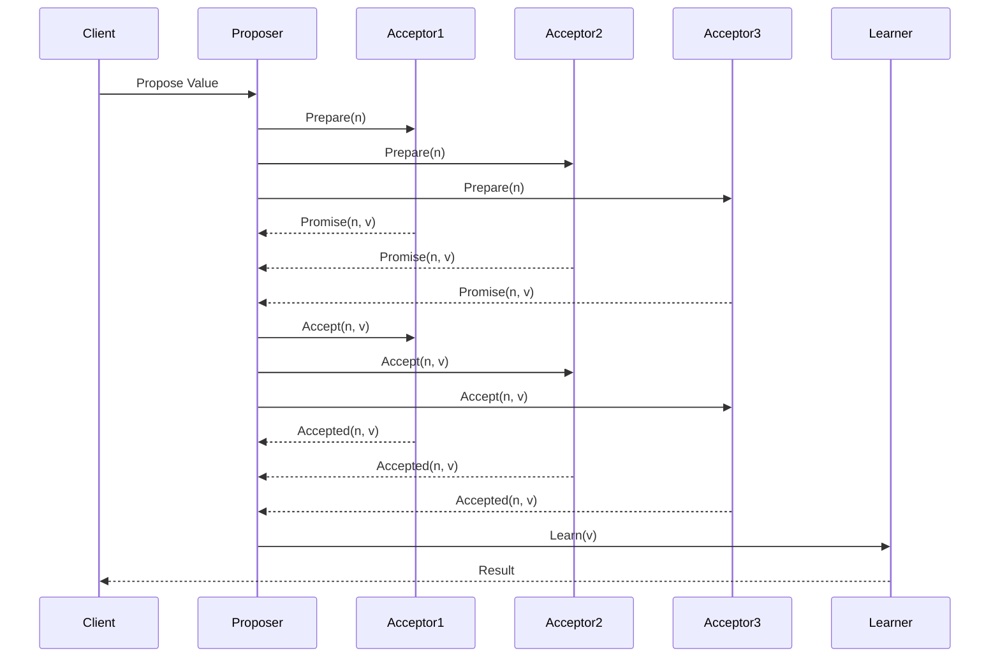
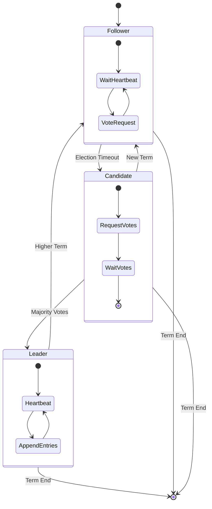

# Consensus Algorithms

Consensus algorithms are fundamental protocols that enable multiple nodes in a distributed system to agree on a single value or decision, even in the presence of failures. They are crucial for maintaining consistency and coordinating actions across distributed systems.

## Paxos Algorithm

Paxos is a family of protocols for solving consensus in an asynchronous network of unreliable processors. It ensures that a single value is chosen among proposed values, even when some participants fail.



### Paxos Phases
1. **Prepare Phase**: Proposer sends prepare requests with proposal numbers
2. **Promise Phase**: Acceptors respond with promises and previously accepted values
3. **Accept Phase**: Proposer sends accept requests with chosen value
4. **Accepted Phase**: Acceptors accept the proposal and notify learners

### Spring Boot Paxos Implementation

#### Paxos Node Configuration
```java
@Configuration
@EnableScheduling
public class PaxosConfig {
    
    @Value("${paxos.node.id}")
    private String nodeId;
    
    @Value("${paxos.cluster.nodes}")
    private List<String> clusterNodes;
    
    @Bean
    public PaxosNode paxosNode() {
        return PaxosNode.builder()
            .nodeId(nodeId)
            .clusterNodes(clusterNodes)
            .build();
    }
    
    @Bean
    public RestTemplate restTemplate() {
        RestTemplate template = new RestTemplate();
        template.setRequestFactory(new HttpComponentsClientHttpRequestFactory());
        return template;
    }
}

@Component
@Slf4j
public class PaxosProposer {
    
    @Autowired
    private PaxosNode node;
    
    @Autowired
    private RestTemplate restTemplate;
    
    @Autowired
    private PaxosStateRepository stateRepository;
    
    private final AtomicLong proposalNumber = new AtomicLong(0);
    
    public CompletableFuture<Boolean> propose(String key, String value) {
        long proposalId = generateProposalNumber();
        
        log.info("Starting Paxos proposal: {} -> {} with proposal ID: {}", key, value, proposalId);
        
        return CompletableFuture
            .supplyAsync(() -> preparePhase(key, proposalId))
            .thenCompose(prepareResult -> {
                if (prepareResult.isSuccessful()) {
                    String finalValue = selectValue(value, prepareResult.getPromises());
                    return acceptPhase(key, proposalId, finalValue);
                } else {
                    return CompletableFuture.completedFuture(false);
                }
            });
    }
    
    private PrepareResult preparePhase(String key, long proposalId) {
        log.debug("Phase 1: Prepare for key {} with proposal {}", key, proposalId);
        
        PrepareRequest request = PrepareRequest.builder()
            .key(key)
            .proposalId(proposalId)
            .proposerId(node.getNodeId())
            .build();
        
        List<CompletableFuture<PrepareResponse>> futures = new ArrayList<>();
        
        for (String nodeUrl : node.getClusterNodes()) {
            if (!nodeUrl.equals(node.getNodeId())) {
                CompletableFuture<PrepareResponse> future = sendPrepareRequest(nodeUrl, request);
                futures.add(future);
            }
        }
        
        // Wait for majority responses
        List<PrepareResponse> responses = new ArrayList<>();
        int majority = (node.getClusterNodes().size() / 2) + 1;
        
        try {
            for (CompletableFuture<PrepareResponse> future : futures) {
                PrepareResponse response = future.get(5, TimeUnit.SECONDS);
                if (response.isPromise()) {
                    responses.add(response);
                    if (responses.size() >= majority) {
                        break;
                    }
                }
            }
        } catch (Exception e) {
            log.error("Prepare phase failed", e);
        }
        
        boolean successful = responses.size() >= majority;
        log.debug("Prepare phase result: {} (received {} of {} required promises)", 
            successful, responses.size(), majority);
        
        return PrepareResult.builder()
            .successful(successful)
            .promises(responses)
            .build();
    }
    
    private CompletableFuture<Boolean> acceptPhase(String key, long proposalId, String value) {
        log.debug("Phase 2: Accept for key {} with proposal {} and value {}", key, proposalId, value);
        
        AcceptRequest request = AcceptRequest.builder()
            .key(key)
            .proposalId(proposalId)
            .value(value)
            .proposerId(node.getNodeId())
            .build();
        
        List<CompletableFuture<AcceptResponse>> futures = new ArrayList<>();
        
        for (String nodeUrl : node.getClusterNodes()) {
            if (!nodeUrl.equals(node.getNodeId())) {
                CompletableFuture<AcceptResponse> future = sendAcceptRequest(nodeUrl, request);
                futures.add(future);
            }
        }
        
        // Wait for majority accepts
        AtomicInteger acceptCount = new AtomicInteger(0);
        int majority = (node.getClusterNodes().size() / 2) + 1;
        
        try {
            for (CompletableFuture<AcceptResponse> future : futures) {
                AcceptResponse response = future.get(5, TimeUnit.SECONDS);
                if (response.isAccepted()) {
                    acceptCount.incrementAndGet();
                }
            }
        } catch (Exception e) {
            log.error("Accept phase failed", e);
        }
        
        boolean consensus = acceptCount.get() >= majority;
        
        if (consensus) {
            // Store the agreed value
            PaxosState state = PaxosState.builder()
                .key(key)
                .value(value)
                .proposalId(proposalId)
                .timestamp(Instant.now())
                .build();
            stateRepository.save(state);
            
            log.info("Consensus reached for key {}: {} (proposal {})", key, value, proposalId);
        } else {
            log.warn("Failed to reach consensus for key {} (got {} accepts, needed {})", 
                key, acceptCount.get(), majority);
        }
        
        return CompletableFuture.completedFuture(consensus);
    }
    
    private CompletableFuture<PrepareResponse> sendPrepareRequest(String nodeUrl, PrepareRequest request) {
        return CompletableFuture.supplyAsync(() -> {
            try {
                ResponseEntity<PrepareResponse> response = restTemplate.postForEntity(
                    nodeUrl + "/paxos/prepare", request, PrepareResponse.class);
                return response.getBody();
            } catch (Exception e) {
                log.warn("Failed to send prepare request to {}", nodeUrl, e);
                return PrepareResponse.builder().promise(false).build();
            }
        });
    }
    
    private CompletableFuture<AcceptResponse> sendAcceptRequest(String nodeUrl, AcceptRequest request) {
        return CompletableFuture.supplyAsync(() -> {
            try {
                ResponseEntity<AcceptResponse> response = restTemplate.postForEntity(
                    nodeUrl + "/paxos/accept", request, AcceptResponse.class);
                return response.getBody();
            } catch (Exception e) {
                log.warn("Failed to send accept request to {}", nodeUrl, e);
                return AcceptResponse.builder().accepted(false).build();
            }
        });
    }
    
    private long generateProposalNumber() {
        // Generate globally unique, increasing proposal numbers
        long timestamp = System.currentTimeMillis();
        long nodeHash = node.getNodeId().hashCode() & 0xFFFF;
        return (timestamp << 16) | nodeHash;
    }
    
    private String selectValue(String proposedValue, List<PrepareResponse> promises) {
        // Select value with highest proposal number from promises, or use proposed value
        return promises.stream()
            .filter(p -> p.getAcceptedValue() != null)
            .max(Comparator.comparing(PrepareResponse::getAcceptedProposalId))
            .map(PrepareResponse::getAcceptedValue)
            .orElse(proposedValue);
    }
}

@Component
@Slf4j
public class PaxosAcceptor {
    
    @Autowired
    private PaxosStateRepository stateRepository;
    
    private final Map<String, Long> promisedProposals = new ConcurrentHashMap<>();
    private final Map<String, AcceptedValue> acceptedValues = new ConcurrentHashMap<>();
    
    public PrepareResponse handlePrepare(PrepareRequest request) {
        String key = request.getKey();
        long proposalId = request.getProposalId();
        
        log.debug("Handling prepare request for key {} with proposal {}", key, proposalId);
        
        Long currentPromise = promisedProposals.get(key);
        
        if (currentPromise == null || proposalId > currentPromise) {
            // Promise to this proposal
            promisedProposals.put(key, proposalId);
            
            AcceptedValue acceptedValue = acceptedValues.get(key);
            
            PrepareResponse response = PrepareResponse.builder()
                .promise(true)
                .acceptedProposalId(acceptedValue != null ? acceptedValue.getProposalId() : null)
                .acceptedValue(acceptedValue != null ? acceptedValue.getValue() : null)
                .build();
            
            log.debug("Promised proposal {} for key {}", proposalId, key);
            return response;
        } else {
            log.debug("Rejected prepare for key {} (proposal {} <= current promise {})", 
                key, proposalId, currentPromise);
            return PrepareResponse.builder().promise(false).build();
        }
    }
    
    public AcceptResponse handleAccept(AcceptRequest request) {
        String key = request.getKey();
        long proposalId = request.getProposalId();
        String value = request.getValue();
        
        log.debug("Handling accept request for key {} with proposal {} and value {}", 
            key, proposalId, value);
        
        Long currentPromise = promisedProposals.get(key);
        
        if (currentPromise != null && proposalId >= currentPromise) {
            // Accept this proposal
            AcceptedValue acceptedValue = AcceptedValue.builder()
                .proposalId(proposalId)
                .value(value)
                .timestamp(Instant.now())
                .build();
            
            acceptedValues.put(key, acceptedValue);
            
            // Persist the accepted value
            PaxosState state = PaxosState.builder()
                .key(key)
                .value(value)
                .proposalId(proposalId)
                .timestamp(Instant.now())
                .build();
            stateRepository.save(state);
            
            log.debug("Accepted proposal {} for key {} with value {}", proposalId, key, value);
            return AcceptResponse.builder().accepted(true).build();
        } else {
            log.debug("Rejected accept for key {} (proposal {} < promised {})", 
                key, proposalId, currentPromise);
            return AcceptResponse.builder().accepted(false).build();
        }
    }
}

@RestController
@RequestMapping("/paxos")
@Slf4j
public class PaxosController {
    
    @Autowired
    private PaxosAcceptor acceptor;
    
    @Autowired
    private PaxosProposer proposer;
    
    @PostMapping("/prepare")
    public ResponseEntity<PrepareResponse> prepare(@RequestBody PrepareRequest request) {
        PrepareResponse response = acceptor.handlePrepare(request);
        return ResponseEntity.ok(response);
    }
    
    @PostMapping("/accept")
    public ResponseEntity<AcceptResponse> accept(@RequestBody AcceptRequest request) {
        AcceptResponse response = acceptor.handleAccept(request);
        return ResponseEntity.ok(response);
    }
    
    @PostMapping("/propose")
    public ResponseEntity<ProposeResponse> propose(@RequestBody ProposeRequest request) {
        CompletableFuture<Boolean> result = proposer.propose(request.getKey(), request.getValue());
        
        try {
            boolean success = result.get(10, TimeUnit.SECONDS);
            return ResponseEntity.ok(ProposeResponse.builder()
                .success(success)
                .message(success ? "Consensus reached" : "Failed to reach consensus")
                .build());
        } catch (Exception e) {
            return ResponseEntity.ok(ProposeResponse.builder()
                .success(false)
                .message("Proposal timeout or failed: " + e.getMessage())
                .build());
        }
    }
}
```

#### Paxos Data Models
```java
@Entity
@Table(name = "paxos_state")
@Data
@Builder
@NoArgsConstructor
@AllArgsConstructor
public class PaxosState {
    
    @Id
    private String key;
    
    @Column(name = "agreed_value")
    private String value;
    
    @Column(name = "proposal_id")
    private Long proposalId;
    
    @CreationTimestamp
    private Instant timestamp;
}

@Data
@Builder
@AllArgsConstructor
@NoArgsConstructor
public class PrepareRequest {
    private String key;
    private Long proposalId;
    private String proposerId;
}

@Data
@Builder
@AllArgsConstructor
@NoArgsConstructor
public class PrepareResponse {
    private boolean promise;
    private Long acceptedProposalId;
    private String acceptedValue;
}

@Data
@Builder
@AllArgsConstructor
@NoArgsConstructor
public class AcceptRequest {
    private String key;
    private Long proposalId;
    private String value;
    private String proposerId;
}

@Data
@Builder
@AllArgsConstructor
@NoArgsConstructor
public class AcceptResponse {
    private boolean accepted;
}

@Data
@Builder
@AllArgsConstructor
@NoArgsConstructor
public class AcceptedValue {
    private Long proposalId;
    private String value;
    private Instant timestamp;
}

@Data
@Builder
@AllArgsConstructor
@NoArgsConstructor
public class PrepareResult {
    private boolean successful;
    private List<PrepareResponse> promises;
}
```

## Raft Algorithm

Raft is a consensus algorithm designed to be more understandable than Paxos while providing the same safety guarantees. It uses leader election and log replication to achieve consensus.

### Raft Components
1. **Leader Election**: Elects a single leader to manage log replication
2. **Log Replication**: Leader receives client requests and replicates to followers
3. **Safety**: Ensures that committed entries are durable and consistent



### Spring Boot Raft Implementation

#### Raft Node Implementation
```java
@Component
@Slf4j
public class RaftNode {
    
    @Value("${raft.node.id}")
    private String nodeId;
    
    @Value("${raft.cluster.nodes}")
    private List<String> clusterNodes;
    
    @Autowired
    private RaftLogRepository logRepository;
    
    @Autowired
    private RaftStateRepository stateRepository;
    
    @Autowired
    private RestTemplate restTemplate;
    
    // Raft state
    private volatile RaftState state = RaftState.FOLLOWER;
    private volatile String currentLeader;
    private volatile long currentTerm = 0;
    private volatile String votedFor;
    private volatile long commitIndex = 0;
    private volatile long lastApplied = 0;
    
    // Leader state
    private final Map<String, Long> nextIndex = new ConcurrentHashMap<>();
    private final Map<String, Long> matchIndex = new ConcurrentHashMap<>();
    
    // Election timing
    private volatile long lastHeartbeat = System.currentTimeMillis();
    private final Random random = new Random();
    
    @PostConstruct
    public void initialize() {
        loadPersistedState();
        startElectionTimer();
        startHeartbeatTimer();
    }
    
    @Scheduled(fixedDelay = 50) // Check every 50ms
    public void electionTimeoutCheck() {
        if (state == RaftState.FOLLOWER || state == RaftState.CANDIDATE) {
            long electionTimeout = 150 + random.nextInt(150); // 150-300ms
            
            if (System.currentTimeMillis() - lastHeartbeat > electionTimeout) {
                startElection();
            }
        }
    }
    
    @Scheduled(fixedDelay = 50) // Send heartbeats every 50ms
    public void leaderHeartbeat() {
        if (state == RaftState.LEADER) {
            sendHeartbeats();
        }
    }
    
    private void startElection() {
        log.info("Starting election for term {}", currentTerm + 1);
        
        state = RaftState.CANDIDATE;
        currentTerm++;
        votedFor = nodeId;
        lastHeartbeat = System.currentTimeMillis();
        
        persistState();
        
        // Vote for self
        AtomicInteger voteCount = new AtomicInteger(1);
        int majority = (clusterNodes.size() / 2) + 1;
        
        // Request votes from other nodes
        List<CompletableFuture<VoteResponse>> voteRequests = new ArrayList<>();
        
        for (String node : clusterNodes) {
            if (!node.equals(nodeId)) {
                CompletableFuture<VoteResponse> voteRequest = requestVote(node);
                voteRequests.add(voteRequest);
            }
        }
        
        // Count votes
        CompletableFuture.allOf(voteRequests.toArray(new CompletableFuture[0]))
            .whenComplete((result, throwable) -> {
                for (CompletableFuture<VoteResponse> request : voteRequests) {
                    try {
                        VoteResponse response = request.get();
                        if (response.isVoteGranted()) {
                            voteCount.incrementAndGet();
                        }
                    } catch (Exception e) {
                        log.warn("Vote request failed", e);
                    }
                }
                
                if (voteCount.get() >= majority && state == RaftState.CANDIDATE) {
                    becomeLeader();
                } else {
                    becomeFollower(currentTerm, null);
                }
            });
    }
    
    private CompletableFuture<VoteResponse> requestVote(String targetNode) {
        return CompletableFuture.supplyAsync(() -> {
            try {
                long lastLogIndex = getLastLogIndex();
                long lastLogTerm = getLastLogTerm();
                
                VoteRequest request = VoteRequest.builder()
                    .term(currentTerm)
                    .candidateId(nodeId)
                    .lastLogIndex(lastLogIndex)
                    .lastLogTerm(lastLogTerm)
                    .build();
                
                ResponseEntity<VoteResponse> response = restTemplate.postForEntity(
                    targetNode + "/raft/vote", request, VoteResponse.class);
                
                return response.getBody();
            } catch (Exception e) {
                log.warn("Failed to request vote from {}", targetNode, e);
                return VoteResponse.builder().voteGranted(false).term(currentTerm).build();
            }
        });
    }
    
    private void becomeLeader() {
        log.info("Became leader for term {}", currentTerm);
        
        state = RaftState.LEADER;
        currentLeader = nodeId;
        
        // Initialize leader state
        long lastLogIndex = getLastLogIndex();
        for (String node : clusterNodes) {
            if (!node.equals(nodeId)) {
                nextIndex.put(node, lastLogIndex + 1);
                matchIndex.put(node, 0L);
            }
        }
        
        // Send initial heartbeats
        sendHeartbeats();
    }
    
    private void becomeFollower(long term, String leader) {
        log.debug("Became follower for term {}, leader: {}", term, leader);
        
        state = RaftState.FOLLOWER;
        currentTerm = term;
        currentLeader = leader;
        votedFor = null;
        lastHeartbeat = System.currentTimeMillis();
        
        persistState();
    }
    
    private void sendHeartbeats() {
        for (String node : clusterNodes) {
            if (!node.equals(nodeId)) {
                sendAppendEntries(node, Collections.emptyList());
            }
        }
    }
    
    public CompletableFuture<Boolean> appendEntry(String command) {
        if (state != RaftState.LEADER) {
            return CompletableFuture.completedFuture(false);
        }
        
        // Create log entry
        RaftLogEntry entry = RaftLogEntry.builder()
            .term(currentTerm)
            .index(getLastLogIndex() + 1)
            .command(command)
            .timestamp(Instant.now())
            .build();
        
        logRepository.save(entry);
        log.info("Leader appended entry: {} at index {}", command, entry.getIndex());
        
        // Replicate to followers
        return replicateEntry(entry);
    }
    
    private CompletableFuture<Boolean> replicateEntry(RaftLogEntry entry) {
        List<CompletableFuture<Boolean>> replicationFutures = new ArrayList<>();
        
        for (String node : clusterNodes) {
            if (!node.equals(nodeId)) {
                CompletableFuture<Boolean> future = sendAppendEntries(node, List.of(entry));
                replicationFutures.add(future);
            }
        }
        
        return CompletableFuture.allOf(replicationFutures.toArray(new CompletableFuture[0]))
            .thenApply(v -> {
                // Count successful replications
                long successCount = replicationFutures.stream()
                    .mapToLong(f -> {
                        try {
                            return f.get() ? 1 : 0;
                        } catch (Exception e) {
                            return 0;
                        }
                    })
                    .sum();
                
                // Include leader's own copy
                successCount++;
                
                int majority = (clusterNodes.size() / 2) + 1;
                boolean committed = successCount >= majority;
                
                if (committed) {
                    commitIndex = entry.getIndex();
                    log.info("Entry committed at index {}: {}", entry.getIndex(), entry.getCommand());
                }
                
                return committed;
            });
    }
    
    private CompletableFuture<Boolean> sendAppendEntries(String targetNode, List<RaftLogEntry> entries) {
        return CompletableFuture.supplyAsync(() -> {
            try {
                long prevLogIndex = nextIndex.get(targetNode) - 1;
                long prevLogTerm = getLogTerm(prevLogIndex);
                
                AppendEntriesRequest request = AppendEntriesRequest.builder()
                    .term(currentTerm)
                    .leaderId(nodeId)
                    .prevLogIndex(prevLogIndex)
                    .prevLogTerm(prevLogTerm)
                    .entries(entries)
                    .leaderCommit(commitIndex)
                    .build();
                
                ResponseEntity<AppendEntriesResponse> response = restTemplate.postForEntity(
                    targetNode + "/raft/append", request, AppendEntriesResponse.class);
                
                AppendEntriesResponse responseBody = response.getBody();
                
                if (responseBody.isSuccess()) {
                    if (!entries.isEmpty()) {
                        nextIndex.put(targetNode, entries.get(entries.size() - 1).getIndex() + 1);
                        matchIndex.put(targetNode, entries.get(entries.size() - 1).getIndex());
                    }
                    return true;
                } else {
                    // Decrement nextIndex and retry
                    nextIndex.put(targetNode, Math.max(1, nextIndex.get(targetNode) - 1));
                    return false;
                }
                
            } catch (Exception e) {
                log.warn("Failed to send append entries to {}", targetNode, e);
                return false;
            }
        });
    }
    
    public VoteResponse handleVoteRequest(VoteRequest request) {
        if (request.getTerm() > currentTerm) {
            becomeFollower(request.getTerm(), null);
        }
        
        boolean voteGranted = request.getTerm() == currentTerm &&
            (votedFor == null || votedFor.equals(request.getCandidateId())) &&
            isLogUpToDate(request.getLastLogIndex(), request.getLastLogTerm());
        
        if (voteGranted) {
            votedFor = request.getCandidateId();
            lastHeartbeat = System.currentTimeMillis();
            persistState();
        }
        
        log.debug("Vote request from {}: {} (term {}, my term {})", 
            request.getCandidateId(), voteGranted ? "GRANTED" : "DENIED", 
            request.getTerm(), currentTerm);
        
        return VoteResponse.builder()
            .term(currentTerm)
            .voteGranted(voteGranted)
            .build();
    }
    
    public AppendEntriesResponse handleAppendEntries(AppendEntriesRequest request) {
        if (request.getTerm() > currentTerm) {
            becomeFollower(request.getTerm(), request.getLeaderId());
        }
        
        if (request.getTerm() == currentTerm) {
            becomeFollower(currentTerm, request.getLeaderId());
        }
        
        // Check log consistency
        if (request.getPrevLogIndex() > 0) {
            if (getLastLogIndex() < request.getPrevLogIndex() ||
                getLogTerm(request.getPrevLogIndex()) != request.getPrevLogTerm()) {
                
                return AppendEntriesResponse.builder()
                    .term(currentTerm)
                    .success(false)
                    .build();
            }
        }
        
        // Append entries
        if (!request.getEntries().isEmpty()) {
            for (RaftLogEntry entry : request.getEntries()) {
                logRepository.save(entry);
            }
        }
        
        // Update commit index
        if (request.getLeaderCommit() > commitIndex) {
            commitIndex = Math.min(request.getLeaderCommit(), getLastLogIndex());
        }
        
        return AppendEntriesResponse.builder()
            .term(currentTerm)
            .success(true)
            .build();
    }
    
    private long getLastLogIndex() {
        return logRepository.findTopByOrderByIndexDesc()
            .map(RaftLogEntry::getIndex)
            .orElse(0L);
    }
    
    private long getLastLogTerm() {
        return logRepository.findTopByOrderByIndexDesc()
            .map(RaftLogEntry::getTerm)
            .orElse(0L);
    }
    
    private long getLogTerm(long index) {
        if (index == 0) return 0;
        return logRepository.findByIndex(index)
            .map(RaftLogEntry::getTerm)
            .orElse(0L);
    }
    
    private boolean isLogUpToDate(long lastLogIndex, long lastLogTerm) {
        long myLastLogTerm = getLastLogTerm();
        long myLastLogIndex = getLastLogIndex();
        
        return lastLogTerm > myLastLogTerm || 
               (lastLogTerm == myLastLogTerm && lastLogIndex >= myLastLogIndex);
    }
    
    private void persistState() {
        RaftNodeState nodeState = RaftNodeState.builder()
            .nodeId(nodeId)
            .currentTerm(currentTerm)
            .votedFor(votedFor)
            .build();
        stateRepository.save(nodeState);
    }
    
    private void loadPersistedState() {
        stateRepository.findByNodeId(nodeId).ifPresent(state -> {
            this.currentTerm = state.getCurrentTerm();
            this.votedFor = state.getVotedFor();
        });
    }
    
    // Getters
    public RaftState getState() { return state; }
    public String getCurrentLeader() { return currentLeader; }
    public long getCurrentTerm() { return currentTerm; }
}

@RestController
@RequestMapping("/raft")
@Slf4j
public class RaftController {
    
    @Autowired
    private RaftNode raftNode;
    
    @PostMapping("/vote")
    public ResponseEntity<VoteResponse> vote(@RequestBody VoteRequest request) {
        VoteResponse response = raftNode.handleVoteRequest(request);
        return ResponseEntity.ok(response);
    }
    
    @PostMapping("/append")
    public ResponseEntity<AppendEntriesResponse> appendEntries(@RequestBody AppendEntriesRequest request) {
        AppendEntriesResponse response = raftNode.handleAppendEntries(request);
        return ResponseEntity.ok(response);
    }
    
    @PostMapping("/command")
    public ResponseEntity<CommandResponse> submitCommand(@RequestBody CommandRequest request) {
        if (raftNode.getState() != RaftState.LEADER) {
            return ResponseEntity.status(HttpStatus.REDIRECT)
                .header("Location", raftNode.getCurrentLeader() + "/raft/command")
                .body(CommandResponse.builder()
                    .success(false)
                    .message("Not leader, redirect to: " + raftNode.getCurrentLeader())
                    .build());
        }
        
        CompletableFuture<Boolean> result = raftNode.appendEntry(request.getCommand());
        
        try {
            boolean success = result.get(5, TimeUnit.SECONDS);
            return ResponseEntity.ok(CommandResponse.builder()
                .success(success)
                .message(success ? "Command committed" : "Failed to commit command")
                .build());
        } catch (Exception e) {
            return ResponseEntity.ok(CommandResponse.builder()
                .success(false)
                .message("Command timeout: " + e.getMessage())
                .build());
        }
    }
    
    @GetMapping("/status")
    public ResponseEntity<RaftStatus> getStatus() {
        RaftStatus status = RaftStatus.builder()
            .nodeId(raftNode.getCurrentLeader())
            .state(raftNode.getState().toString())
            .term(raftNode.getCurrentTerm())
            .leader(raftNode.getCurrentLeader())
            .build();
        
        return ResponseEntity.ok(status);
    }
}
```

#### Raft Data Models
```java
@Entity
@Table(name = "raft_log")
@Data
@Builder
@NoArgsConstructor
@AllArgsConstructor
public class RaftLogEntry {
    
    @Id
    private Long index;
    
    private Long term;
    
    @Column(columnDefinition = "TEXT")
    private String command;
    
    @CreationTimestamp
    private Instant timestamp;
}

@Entity
@Table(name = "raft_state")
@Data
@Builder
@NoArgsConstructor
@AllArgsConstructor
public class RaftNodeState {
    
    @Id
    private String nodeId;
    
    private Long currentTerm;
    
    private String votedFor;
    
    @UpdateTimestamp
    private Instant updatedAt;
}

public enum RaftState {
    FOLLOWER, CANDIDATE, LEADER
}

@Data
@Builder
@AllArgsConstructor
@NoArgsConstructor
public class VoteRequest {
    private Long term;
    private String candidateId;
    private Long lastLogIndex;
    private Long lastLogTerm;
}

@Data
@Builder
@AllArgsConstructor
@NoArgsConstructor
public class VoteResponse {
    private Long term;
    private boolean voteGranted;
}

@Data
@Builder
@AllArgsConstructor
@NoArgsConstructor
public class AppendEntriesRequest {
    private Long term;
    private String leaderId;
    private Long prevLogIndex;
    private Long prevLogTerm;
    private List<RaftLogEntry> entries;
    private Long leaderCommit;
}

@Data
@Builder
@AllArgsConstructor
@NoArgsConstructor
public class AppendEntriesResponse {
    private Long term;
    private boolean success;
}
```

## Configuration and Best Practices

### Application Properties
```yaml
# application.yml for Paxos
paxos:
  node:
    id: "node-1"
  cluster:
    nodes:
      - "http://node-1:8080"
      - "http://node-2:8080" 
      - "http://node-3:8080"
  timeout: 5000
  retry:
    max-attempts: 3
    backoff: 1000

---
# application.yml for Raft  
raft:
  node:
    id: "node-1"
  cluster:
    nodes:
      - "http://node-1:8080"
      - "http://node-2:8080"
      - "http://node-3:8080"
  election:
    timeout-min: 150
    timeout-max: 300
  heartbeat:
    interval: 50

spring:
  datasource:
    url: jdbc:h2:mem:consensus
    driver-class-name: org.h2.Driver
  
  jpa:
    hibernate:
      ddl-auto: create-drop
    show-sql: false
```

Consensus algorithms like Paxos and Raft are essential for building reliable distributed systems. Paxos provides strong theoretical foundations but can be complex to implement correctly. Raft offers a more understandable alternative while maintaining the same safety guarantees. Both algorithms ensure that distributed systems can reach agreement even in the presence of failures.
