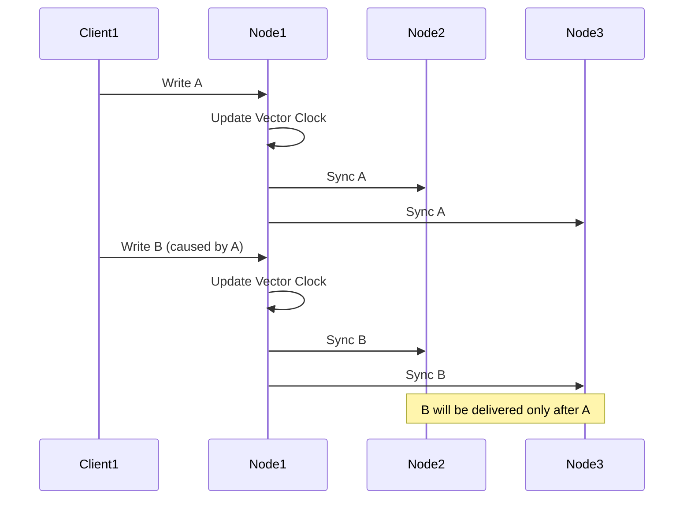
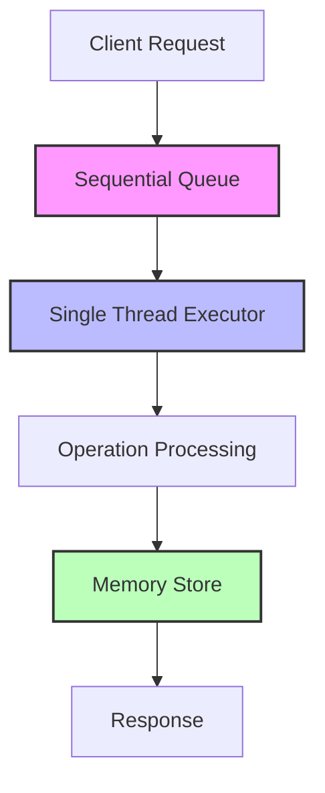
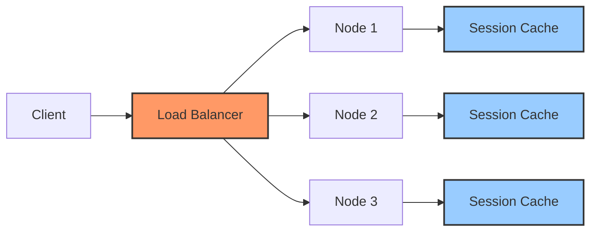
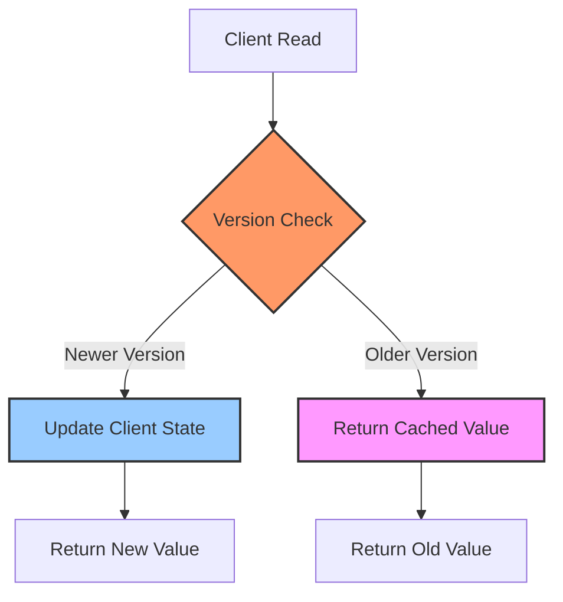

# Other Consistency Models

In distributed systems, beyond Strong and Eventual Consistency, various consistency models offer different trade-offs between performance and consistency guarantees. These models provide partial ordering guarantees and are suitable for specific use cases.

## Causal Consistency

### Definition and Characteristics
- Preserves the order of causally related operations
- Partial ordering guarantee
- Vector clocks usage
- Conflict-free Replicated Data Types (CRDTs)



### Spring Boot Causal Consistency Implementation

#### Vector Clock Service
```java
@Component
@Slf4j
public class VectorClockService {
    
    private final Map<String, AtomicLong> vectorClock = new ConcurrentHashMap<>();
    private final String nodeId;
    
    public VectorClockService(@Value("${app.node.id}") String nodeId) {
        this.nodeId = nodeId;
        vectorClock.put(nodeId, new AtomicLong(0));
    }
    
    public VectorClock incrementAndGet() {
        vectorClock.get(nodeId).incrementAndGet();
        return getCurrentVectorClock();
    }
    
    public VectorClock getCurrentVectorClock() {
        Map<String, Long> clockMap = vectorClock.entrySet().stream()
            .collect(Collectors.toMap(
                Map.Entry::getKey, 
                entry -> entry.getValue().get()
            ));
        return new VectorClock(clockMap);
    }
    
    public void updateVectorClock(VectorClock receivedClock) {
        for (Map.Entry<String, Long> entry : receivedClock.getClocks().entrySet()) {
            String node = entry.getKey();
            Long timestamp = entry.getValue();
            
            vectorClock.computeIfAbsent(node, k -> new AtomicLong(0))
                .accumulateAndGet(timestamp, Long::max);
        }
        
        // Increment own timestamp
        vectorClock.get(nodeId).incrementAndGet();
    }
    
    public boolean happensBefore(VectorClock clock1, VectorClock clock2) {
        boolean atLeastOneLess = false;
        
        for (String node : clock1.getClocks().keySet()) {
            Long time1 = clock1.getClocks().get(node);
            Long time2 = clock2.getClocks().getOrDefault(node, 0L);
            
            if (time1 > time2) {
                return false;
            }
            if (time1 < time2) {
                atLeastOneLess = true;
            }
        }
        
        return atLeastOneLess;
    }
}

@Data
@AllArgsConstructor
@NoArgsConstructor
public class VectorClock {
    private Map<String, Long> clocks = new HashMap<>();
    
    public boolean isConcurrent(VectorClock other) {
        return !this.happensBefore(other) && !other.happensBefore(this);
    }
    
    private boolean happensBefore(VectorClock other) {
        boolean atLeastOneLess = false;
        
        for (Map.Entry<String, Long> entry : this.clocks.entrySet()) {
            String node = entry.getKey();
            Long thisTime = entry.getValue();
            Long otherTime = other.clocks.getOrDefault(node, 0L);
            
            if (thisTime > otherTime) {
                return false;
            }
            if (thisTime < otherTime) {
                atLeastOneLess = true;
            }
        }
        
        return atLeastOneLess;
    }
}
```

#### Causal Ordering Event Store
```java
@Entity
@Table(name = "causal_events")
@Data
@NoArgsConstructor
@AllArgsConstructor
public class CausalEvent {
    
    @Id
    private String eventId;
    
    @Column(columnDefinition = "TEXT")
    private String eventData;
    
    @Column(columnDefinition = "TEXT")
    private String vectorClockJson;
    
    private String causedBy;
    
    @CreationTimestamp
    private LocalDateTime createdAt;
    
    @Transient
    private VectorClock vectorClock;
    
    @PostLoad
    private void deserializeVectorClock() {
        try {
            ObjectMapper mapper = new ObjectMapper();
            this.vectorClock = mapper.readValue(vectorClockJson, VectorClock.class);
        } catch (Exception e) {
            log.error("Failed to deserialize vector clock", e);
        }
    }
    
    @PrePersist
    @PreUpdate
    private void serializeVectorClock() {
        try {
            ObjectMapper mapper = new ObjectMapper();
            this.vectorClockJson = mapper.writeValueAsString(vectorClock);
        } catch (Exception e) {
            log.error("Failed to serialize vector clock", e);
        }
    }
}

@Service
@Transactional
@Slf4j
public class CausalConsistencyService {
    
    @Autowired
    private CausalEventRepository eventRepository;
    
    @Autowired
    private VectorClockService vectorClockService;
    
    private final ConcurrentLinkedQueue<CausalEvent> pendingEvents = new ConcurrentLinkedQueue<>();
    
    public void publishEvent(String eventData, String causedBy) {
        VectorClock currentClock = vectorClockService.incrementAndGet();
        
        CausalEvent event = new CausalEvent();
        event.setEventId(UUID.randomUUID().toString());
        event.setEventData(eventData);
        event.setVectorClock(currentClock);
        event.setCausedBy(causedBy);
        
        eventRepository.save(event);
        
        // Notify other nodes
        notifyOtherNodes(event);
    }
    
    public void receiveEvent(CausalEvent receivedEvent) {
        // Update vector clock
        vectorClockService.updateVectorClock(receivedEvent.getVectorClock());
        
        // Causal dependency check
        if (canDeliverEvent(receivedEvent)) {
            deliverEvent(receivedEvent);
            // Check pending events
            processPendingEvents();
        } else {
            // Hold event pending
            pendingEvents.offer(receivedEvent);
            log.info("Event {} is waiting for causal dependencies", receivedEvent.getEventId());
        }
    }
    
    private boolean canDeliverEvent(CausalEvent event) {
        if (event.getCausedBy() == null) {
            return true; // Root event
        }
        
        // Causality check: if caused-by event is delivered, this event can be delivered
        return eventRepository.existsByEventIdAndCausedBy(event.getCausedBy(), event.getCausedBy());
    }
    
    private void deliverEvent(CausalEvent event) {
        eventRepository.save(event);
        log.info("Event {} delivered with vector clock {}", 
            event.getEventId(), event.getVectorClock());
    }
    
    private void processPendingEvents() {
        Iterator<CausalEvent> iterator = pendingEvents.iterator();
        
        while (iterator.hasNext()) {
            CausalEvent event = iterator.next();
            if (canDeliverEvent(event)) {
                deliverEvent(event);
                iterator.remove();
            }
        }
    }
    
    private void notifyOtherNodes(CausalEvent event) {
        // Send to other nodes via message broker
        // Implementation: RabbitMQ, Kafka, etc.
    }
}
```

#### CRDT (Conflict-free Replicated Data Types) Implementation
```java
@Component
public class GCounterCRDT {
    
    private final Map<String, AtomicLong> counters = new ConcurrentHashMap<>();
    private final String nodeId;
    
    public GCounterCRDT(@Value("${app.node.id}") String nodeId) {
        this.nodeId = nodeId;
        counters.put(nodeId, new AtomicLong(0));
    }
    
    public void increment() {
        counters.get(nodeId).incrementAndGet();
    }
    
    public long getValue() {
        return counters.values().stream()
            .mapToLong(AtomicLong::get)
            .sum();
    }
    
    public void merge(Map<String, Long> otherCounters) {
        for (Map.Entry<String, Long> entry : otherCounters.entrySet()) {
            String node = entry.getKey();
            Long value = entry.getValue();
            
            counters.computeIfAbsent(node, k -> new AtomicLong(0))
                .accumulateAndGet(value, Long::max);
        }
    }
    
    public Map<String, Long> getState() {
        return counters.entrySet().stream()
            .collect(Collectors.toMap(
                Map.Entry::getKey,
                entry -> entry.getValue().get()
            ));
    }
}

@Component
public class GSetCRDT<T> {
    
    private final Set<T> elements = ConcurrentHashMap.newKeySet();
    
    public void add(T element) {
        elements.add(element);
    }
    
    public boolean contains(T element) {
        return elements.contains(element);
    }
    
    public Set<T> getElements() {
        return new HashSet<>(elements);
    }
    
    public void merge(Set<T> otherElements) {
        elements.addAll(otherElements);
    }
}
```

## Sequential Consistency

### Definition and Characteristics
- Sequential execution of operations
- Program order preservation
- Memory model compliance
- Atomic operations



### Spring Boot Sequential Consistency Implementation

#### Sequential Operation Manager
```java
@Service
@Slf4j
public class SequentialConsistencyService {
    
    private final AtomicLong sequenceNumber = new AtomicLong(0);
    private final LinkedBlockingQueue<SequentialOperation> operationQueue = new LinkedBlockingQueue<>();
    private final ExecutorService sequentialExecutor = Executors.newSingleThreadExecutor();
    
    @PostConstruct
    public void initializeSequentialProcessor() {
        sequentialExecutor.submit(this::processOperationsSequentially);
    }
    
    public CompletableFuture<String> submitOperation(String operationType, Object data) {
        CompletableFuture<String> result = new CompletableFuture<>();
        
        SequentialOperation operation = SequentialOperation.builder()
            .sequenceId(sequenceNumber.incrementAndGet())
            .operationType(operationType)
            .data(data)
            .timestamp(Instant.now())
            .resultFuture(result)
            .build();
        
        try {
            operationQueue.put(operation);
            log.debug("Operation {} queued with sequence {}", 
                operationType, operation.getSequenceId());
        } catch (InterruptedException e) {
            result.completeExceptionally(e);
            Thread.currentThread().interrupt();
        }
        
        return result;
    }
    
    private void processOperationsSequentially() {
        while (!Thread.currentThread().isInterrupted()) {
            try {
                SequentialOperation operation = operationQueue.take();
                processOperation(operation);
            } catch (InterruptedException e) {
                Thread.currentThread().interrupt();
                break;
            } catch (Exception e) {
                log.error("Error processing sequential operation", e);
            }
        }
    }
    
    private void processOperation(SequentialOperation operation) {
        try {
            String result = executeOperation(operation);
            operation.getResultFuture().complete(result);
            
            log.debug("Completed operation {} with sequence {}", 
                operation.getOperationType(), operation.getSequenceId());
        } catch (Exception e) {
            operation.getResultFuture().completeExceptionally(e);
            log.error("Failed operation {} with sequence {}", 
                operation.getOperationType(), operation.getSequenceId(), e);
        }
    }
    
    private String executeOperation(SequentialOperation operation) {
        // Execute operation by type
        switch (operation.getOperationType()) {
            case "READ":
                return handleRead(operation.getData());
            case "WRITE":
                return handleWrite(operation.getData());
            case "UPDATE":
                return handleUpdate(operation.getData());
            case "DELETE":
                return handleDelete(operation.getData());
            default:
                throw new IllegalArgumentException("Unknown operation type: " + operation.getOperationType());
        }
    }
    
    private String handleRead(Object data) {
        // Read operation implementation
        return "READ_RESULT";
    }
    
    private String handleWrite(Object data) {
        // Write operation implementation
        return "WRITE_SUCCESS";
    }
    
    private String handleUpdate(Object data) {
        // Update operation implementation
        return "UPDATE_SUCCESS";
    }
    
    private String handleDelete(Object data) {
        // Delete operation implementation
        return "DELETE_SUCCESS";
    }
}

@Data
@Builder
@AllArgsConstructor
@NoArgsConstructor
public class SequentialOperation {
    private Long sequenceId;
    private String operationType;
    private Object data;
    private Instant timestamp;
    private CompletableFuture<String> resultFuture;
}
```

#### Memory Model Consistency
```java
@Component
public class MemoryModelConsistencyManager {
    
    private final Map<String, AtomicReference<Object>> memoryStore = new ConcurrentHashMap<>();
    private final ReentrantReadWriteLock lock = new ReentrantReadWriteLock();
    
    public void write(String key, Object value) {
        lock.writeLock().lock();
        try {
            memoryStore.put(key, new AtomicReference<>(value));
            // Memory barrier - sync to all cores
            Thread.yield();
        } finally {
            lock.writeLock().unlock();
        }
    }
    
    public Object read(String key) {
        lock.readLock().lock();
        try {
            AtomicReference<Object> ref = memoryStore.get(key);
            return ref != null ? ref.get() : null;
        } finally {
            lock.readLock().unlock();
        }
    }
    
    public boolean compareAndSwap(String key, Object expected, Object newValue) {
        lock.writeLock().lock();
        try {
            AtomicReference<Object> ref = memoryStore.get(key);
            if (ref == null) {
                if (expected == null) {
                    memoryStore.put(key, new AtomicReference<>(newValue));
                    return true;
                }
                return false;
            }
            return ref.compareAndSet(expected, newValue);
        } finally {
            lock.writeLock().unlock();
        }
    }
}
```

## Read Your Writes Consistency

### Definition and Characteristics
- Ability to read own writes
- Session-based consistency
- Sticky sessions
- Client-side caching



### Spring Boot Read Your Writes Implementation

#### Session-Based Consistency
```java
@Component
@Scope("session")
@Slf4j
public class ReadYourWritesConsistencyManager {
    
    private final Map<String, WriteOperation> userWrites = new ConcurrentHashMap<>();
    private final String sessionId;
    
    public ReadYourWritesConsistencyManager() {
        this.sessionId = UUID.randomUUID().toString();
    }
    
    public void recordWrite(String key, Object value, String version) {
        WriteOperation writeOp = WriteOperation.builder()
            .key(key)
            .value(value)
            .version(version)
            .timestamp(Instant.now())
            .sessionId(sessionId)
            .build();
            
        userWrites.put(key, writeOp);
        log.debug("Recorded write for session {}: {} = {}", sessionId, key, version);
    }
    
    public Object readWithConsistency(String key, Function<String, Object> readFunction) {
        WriteOperation lastWrite = userWrites.get(key);
        
        if (lastWrite == null) {
            // No write to this key in this session, normal read
            return readFunction.apply(key);
        }
        
        // Check if own written data version is visible
        Object currentValue = readFunction.apply(key);
        String currentVersion = extractVersion(currentValue);
        
        if (isVersionEqualOrNewer(currentVersion, lastWrite.getVersion())) {
            return currentValue;
        } else {
            // Own written data not yet visible, return cached value
            log.warn("Read-your-writes violation detected for key {}, returning cached value", key);
            return lastWrite.getValue();
        }
    }
    
    private String extractVersion(Object value) {
        if (value instanceof VersionedData) {
            return ((VersionedData) value).getVersion();
        }
        return "0"; // Default version
    }
    
    private boolean isVersionEqualOrNewer(String currentVersion, String expectedVersion) {
        try {
            return Long.parseLong(currentVersion) >= Long.parseLong(expectedVersion);
        } catch (NumberFormatException e) {
            return currentVersion.equals(expectedVersion);
        }
    }
}

@Data
@Builder
@AllArgsConstructor
@NoArgsConstructor
public class WriteOperation {
    private String key;
    private Object value;
    private String version;
    private Instant timestamp;
    private String sessionId;
}

@Data
@AllArgsConstructor
@NoArgsConstructor
public class VersionedData {
    private Object data;
    private String version;
    private Instant timestamp;
}
```

#### Sticky Session Implementation
```java
@Component
public class StickySessionManager {
    
    private final Map<String, String> sessionToNodeMapping = new ConcurrentHashMap<>();
    private final Map<String, Set<String>> nodeToSessionsMapping = new ConcurrentHashMap<>();
    private final LoadingCache<String, Object> sessionCache;
    
    public StickySessionManager() {
        this.sessionCache = Caffeine.newBuilder()
            .maximumSize(10000)
            .expireAfterAccess(Duration.ofMinutes(30))
            .build(key -> null);
    }
    
    public String getPreferredNode(String sessionId) {
        return sessionToNodeMapping.computeIfAbsent(sessionId, 
            sid -> selectNodeForSession(sid));
    }
    
    private String selectNodeForSession(String sessionId) {
        // Load balancing logic - assign session to a node
        List<String> availableNodes = getAvailableNodes();
        String selectedNode = availableNodes.get(sessionId.hashCode() % availableNodes.size());
        
        // Update mappings
        nodeToSessionsMapping.computeIfAbsent(selectedNode, k -> ConcurrentHashMap.newKeySet())
            .add(sessionId);
        
        log.info("Session {} assigned to node {}", sessionId, selectedNode);
        return selectedNode;
    }
    
    public void cacheSessionData(String sessionId, String key, Object value) {
        String cacheKey = sessionId + ":" + key;
        sessionCache.put(cacheKey, value);
    }
    
    public Object getSessionData(String sessionId, String key) {
        String cacheKey = sessionId + ":" + key;
        return sessionCache.getIfPresent(cacheKey);
    }
    
    private List<String> getAvailableNodes() {
        // Get available nodes from service discovery
        return Arrays.asList("node-1", "node-2", "node-3");
    }
}

@RestController
public class ConsistentReadController {
    
    @Autowired
    private ReadYourWritesConsistencyManager consistencyManager;
    
    @Autowired
    private StickySessionManager stickySessionManager;
    
    @PostMapping("/data/{key}")
    public ResponseEntity<String> writeData(
            @PathVariable String key,
            @RequestBody Object value,
            HttpServletRequest request) {
        
        String sessionId = request.getSession().getId();
        String version = generateVersion();
        
        // Write operation
        writeToDatabase(key, value, version);
        
        // Record write for consistency
        consistencyManager.recordWrite(key, value, version);
        
        // Cache in sticky session
        stickySessionManager.cacheSessionData(sessionId, key, 
            new VersionedData(value, version, Instant.now()));
        
        return ResponseEntity.ok("Written with version: " + version);
    }
    
    @GetMapping("/data/{key}")
    public ResponseEntity<Object> readData(
            @PathVariable String key,
            HttpServletRequest request) {
        
        String sessionId = request.getSession().getId();
        
        // Read from preferred node
        String preferredNode = stickySessionManager.getPreferredNode(sessionId);
        
        // Read with consistency guarantee
        Object value = consistencyManager.readWithConsistency(key, 
            k -> readFromDatabase(k, preferredNode));
        
        return ResponseEntity.ok(value);
    }
    
    private void writeToDatabase(String key, Object value, String version) {
        // Database write implementation
    }
    
    private Object readFromDatabase(String key, String nodeHint) {
        // Database read implementation with node preference
        return null;
    }
    
    private String generateVersion() {
        return String.valueOf(System.currentTimeMillis());
    }
}
```

## Monotonic Read Consistency

### Definition and Characteristics
- Monotonic increase of data values
- Version-based consistency
- Timestamp ordering
- Conflict resolution



### Spring Boot Monotonic Read Implementation

#### Version-Based Monotonic Reads
```java
@Service
@Slf4j
public class MonotonicReadConsistencyService {
    
    private final Map<String, MonotonicReadState> clientReadStates = new ConcurrentHashMap<>();
    
    public Object readMonotonic(String clientId, String key, Function<String, VersionedData> readFunction) {
        MonotonicReadState clientState = clientReadStates.computeIfAbsent(clientId, 
            cid -> new MonotonicReadState());
        
        VersionedData currentData = readFunction.apply(key);
        if (currentData == null) {
            return null;
        }
        
        String lastReadVersion = clientState.getLastReadVersion(key);
        
        if (lastReadVersion == null || isVersionNewer(currentData.getVersion(), lastReadVersion)) {
            // Monotonic property preserved
            clientState.updateLastReadVersion(key, currentData.getVersion());
            log.debug("Monotonic read for client {}: {} version {}", 
                clientId, key, currentData.getVersion());
            return currentData.getData();
        } else {
            // Monotonic property violated, return old data
            log.warn("Monotonic read violation for client {}, key {}: current version {} <= last read version {}", 
                clientId, key, currentData.getVersion(), lastReadVersion);
            
            return clientState.getLastReadData(key);
        }
    }
    
    private boolean isVersionNewer(String currentVersion, String lastVersion) {
        try {
            return Long.parseLong(currentVersion) > Long.parseLong(lastVersion);
        } catch (NumberFormatException e) {
            return currentVersion.compareTo(lastVersion) > 0;
        }
    }
    
    public void clearClientState(String clientId) {
        clientReadStates.remove(clientId);
        log.info("Cleared monotonic read state for client {}", clientId);
    }
}

@Component
public class MonotonicReadState {
    
    private final Map<String, String> lastReadVersions = new ConcurrentHashMap<>();
    private final Map<String, Object> lastReadData = new ConcurrentHashMap<>();
    
    public String getLastReadVersion(String key) {
        return lastReadVersions.get(key);
    }
    
    public void updateLastReadVersion(String key, String version) {
        lastReadVersions.put(key, version);
    }
    
    public Object getLastReadData(String key) {
        return lastReadData.get(key);
    }
    
    public void updateLastReadData(String key, Object data) {
        lastReadData.put(key, data);
    }
}
```

#### Timestamp-Based Monotonic Ordering
```java
@Service
public class TimestampOrderingService {
    
    private final Map<String, TimestampedValue> dataStore = new ConcurrentHashMap<>();
    private final AtomicLong logicalClock = new AtomicLong(0);
    
    public void write(String key, Object value) {
        long timestamp = logicalClock.incrementAndGet();
        
        TimestampedValue timestampedValue = TimestampedValue.builder()
            .value(value)
            .timestamp(timestamp)
            .physicalTime(Instant.now())
            .build();
        
        dataStore.put(key, timestampedValue);
        log.debug("Written {} with timestamp {}", key, timestamp);
    }
    
    public Object readWithTimestamp(String key, Long minTimestamp) {
        TimestampedValue storedValue = dataStore.get(key);
        
        if (storedValue == null) {
            return null;
        }
        
        if (minTimestamp == null || storedValue.getTimestamp() >= minTimestamp) {
            return storedValue.getValue();
        } else {
            // Timestamp ordering violation
            log.warn("Timestamp ordering violation for key {}: stored timestamp {} < required {}", 
                key, storedValue.getTimestamp(), minTimestamp);
            return null;
        }
    }
    
    public Long getCurrentTimestamp() {
        return logicalClock.get();
    }
}

@Data
@Builder
@AllArgsConstructor
@NoArgsConstructor
public class TimestampedValue {
    private Object value;
    private Long timestamp;
    private Instant physicalTime;
}
```

#### Conflict Resolution Service
```java
@Service
@Slf4j
public class ConflictResolutionService {
    
    public VersionedData resolveConflict(List<VersionedData> conflictingVersions, 
                                       ConflictResolutionStrategy strategy) {
        
        switch (strategy) {
            case LAST_WRITER_WINS:
                return resolveLastWriterWins(conflictingVersions);
            case VECTOR_CLOCK:
                return resolveVectorClock(conflictingVersions);
            case CUSTOM_MERGE:
                return resolveCustomMerge(conflictingVersions);
            default:
                throw new IllegalArgumentException("Unknown resolution strategy: " + strategy);
        }
    }
    
    private VersionedData resolveLastWriterWins(List<VersionedData> versions) {
        return versions.stream()
            .max(Comparator.comparing(VersionedData::getTimestamp))
            .orElse(null);
    }
    
    private VersionedData resolveVectorClock(List<VersionedData> versions) {
        // Vector clock based resolution
        for (VersionedData version : versions) {
            boolean dominates = true;
            for (VersionedData other : versions) {
                if (version != other && !vectorClockDominates(version, other)) {
                    dominates = false;
                    break;
                }
            }
            if (dominates) {
                return version;
            }
        }
        
        // Concurrent versions, merge needed
        return mergeConflictingVersions(versions);
    }
    
    private boolean vectorClockDominates(VersionedData v1, VersionedData v2) {
        // Simplified vector clock comparison
        return v1.getTimestamp().isAfter(v2.getTimestamp());
    }
    
    private VersionedData resolveCustomMerge(List<VersionedData> versions) {
        // Custom business logic for merging
        Object mergedData = customMergeLogic(versions);
        
        return VersionedData.builder()
            .data(mergedData)
            .version(generateMergedVersion(versions))
            .timestamp(Instant.now())
            .build();
    }
    
    private VersionedData mergeConflictingVersions(List<VersionedData> versions) {
        // CRDTs or application-specific merge logic
        return resolveCustomMerge(versions);
    }
    
    private Object customMergeLogic(List<VersionedData> versions) {
        // Application-specific merge implementation
        return versions.get(0).getData(); // Simplified
    }
    
    private String generateMergedVersion(List<VersionedData> versions) {
        String combinedVersions = versions.stream()
            .map(VersionedData::getVersion)
            .collect(Collectors.joining("-"));
        return "merged-" + combinedVersions;
    }
}

public enum ConflictResolutionStrategy {
    LAST_WRITER_WINS,
    VECTOR_CLOCK,
    CUSTOM_MERGE
}
```

## Configuration and Best Practices

### Application Properties
```yaml
# application.yml
consistency:
  model: "causal" # strong, eventual, causal, sequential
  vector-clock:
    node-id: "${HOSTNAME:node-1}"
  session:
    sticky-sessions: true
    session-timeout: 1800
  monotonic-reads:
    enabled: true
    client-state-ttl: 3600
  conflict-resolution:
    strategy: "vector-clock"
    merge-timeout: 5000

spring:
  redis:
    cluster:
      nodes:
        - redis-1:6379
        - redis-2:6379
        - redis-3:6379
    timeout: 2000ms
    
  datasource:
    primary:
      url: jdbc:postgresql://primary-db:5432/app
      username: ${DB_USER}
      password: ${DB_PASSWORD}
    secondary:
      url: jdbc:postgresql://secondary-db:5432/app
      username: ${DB_USER}
      password: ${DB_PASSWORD}
```

These consistency models offer different consistency-performance trade-offs in distributed systems. Each model has specific use cases and implementation details that determine their suitability for different scenarios.
