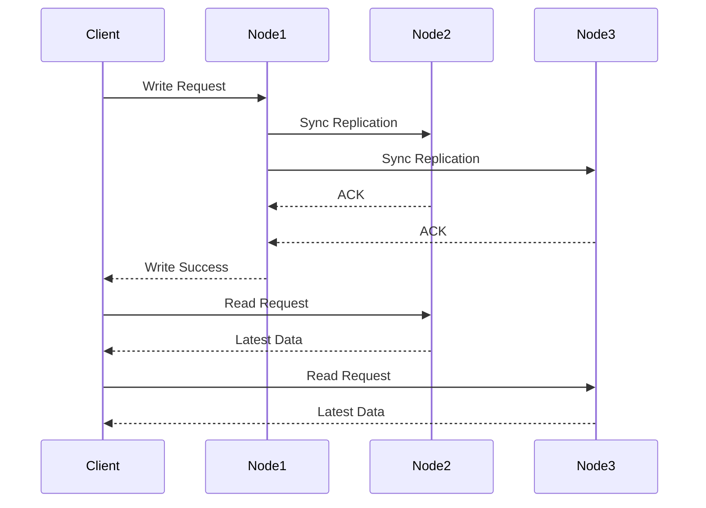
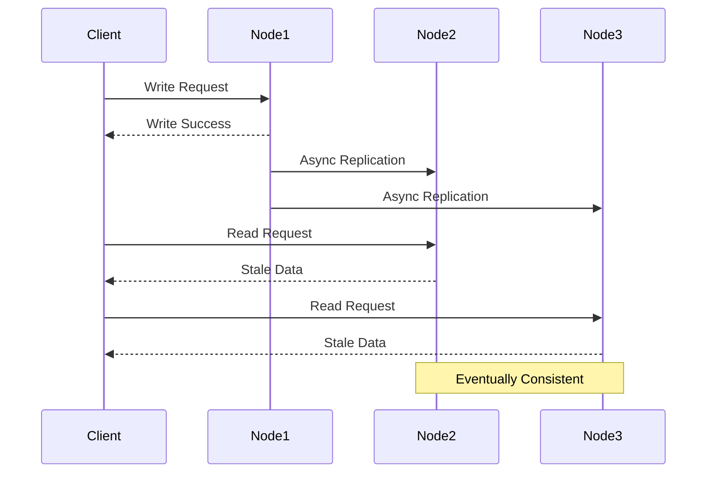

# Strong vs Eventual Consistency

In distributed systems, consistency models define how data behaves across multiple nodes and when changes become visible to different parts of the system. The choice between strong and eventual consistency significantly impacts system performance, availability, and user experience.

## Strong Consistency

### Definition and Characteristics
- All nodes see the same data at the same time
- ACID properties compliance
- Immediate consistency guarantee
- Linearizability and serializability



### Spring Boot Strong Consistency Implementation

#### Database Transaction Management
```java
@Configuration
@EnableTransactionManagement
public class StrongConsistencyConfig {
    
    @Bean
    @Primary
    public DataSource primaryDataSource() {
        HikariConfig config = new HikariConfig();
        config.setJdbcUrl("jdbc:postgresql://primary-db:5432/app");
        config.setUsername("${DB_USER}");
        config.setPassword("${DB_PASSWORD}");
        config.setMaximumPoolSize(20);
        config.setConnectionTimeout(30000);
        config.setIsolateInternalQueries(true);
        config.setTransactionIsolation("TRANSACTION_SERIALIZABLE");
        return new HikariDataSource(config);
    }
    
    @Bean
    public PlatformTransactionManager transactionManager(DataSource dataSource) {
        DataSourceTransactionManager txManager = new DataSourceTransactionManager(dataSource);
        txManager.setDefaultTimeout(30);
        txManager.setRollbackOnCommitFailure(true);
        return txManager;
    }
}

@Service
@Transactional(isolation = Isolation.SERIALIZABLE, propagation = Propagation.REQUIRED)
@Slf4j
public class StronglyConsistentAccountService {
    
    @Autowired
    private AccountRepository accountRepository;
    
    @Autowired
    private TransactionLogRepository transactionLogRepository;
    
    public void transferFunds(String fromAccountId, String toAccountId, BigDecimal amount) {
        log.info("Starting strongly consistent fund transfer: {} -> {}, amount: {}", 
            fromAccountId, toAccountId, amount);
        
        // Read accounts with SELECT FOR UPDATE to ensure strong consistency
        Account fromAccount = accountRepository.findByIdForUpdate(fromAccountId)
            .orElseThrow(() -> new AccountNotFoundException("From account not found: " + fromAccountId));
        
        Account toAccount = accountRepository.findByIdForUpdate(toAccountId)
            .orElseThrow(() -> new AccountNotFoundException("To account not found: " + toAccountId));
        
        // Business logic validation
        if (fromAccount.getBalance().compareTo(amount) < 0) {
            throw new InsufficientFundsException("Insufficient balance in account: " + fromAccountId);
        }
        
        // Atomic balance updates
        fromAccount.setBalance(fromAccount.getBalance().subtract(amount));
        toAccount.setBalance(toAccount.getBalance().add(amount));
        
        // Save changes
        accountRepository.save(fromAccount);
        accountRepository.save(toAccount);
        
        // Log transaction
        TransactionLog txLog = TransactionLog.builder()
            .fromAccountId(fromAccountId)
            .toAccountId(toAccountId)
            .amount(amount)
            .status(TransactionStatus.COMPLETED)
            .timestamp(Instant.now())
            .build();
        
        transactionLogRepository.save(txLog);
        
        log.info("Fund transfer completed successfully with strong consistency");
    }
    
    @Transactional(readOnly = true, isolation = Isolation.REPEATABLE_READ)
    public AccountBalance getConsistentBalance(String accountId) {
        Account account = accountRepository.findById(accountId)
            .orElseThrow(() -> new AccountNotFoundException("Account not found: " + accountId));
        
        // Calculate pending transactions
        BigDecimal pendingAmount = transactionLogRepository
            .findPendingTransactionsByAccountId(accountId)
            .stream()
            .map(TransactionLog::getAmount)
            .reduce(BigDecimal.ZERO, BigDecimal::add);
        
        return AccountBalance.builder()
            .accountId(accountId)
            .availableBalance(account.getBalance())
            .pendingAmount(pendingAmount)
            .totalBalance(account.getBalance().subtract(pendingAmount))
            .lastUpdated(account.getLastModified())
            .build();
    }
}

@Repository
public interface AccountRepository extends JpaRepository<Account, String> {
    
    @Lock(LockModeType.PESSIMISTIC_WRITE)
    @Query("SELECT a FROM Account a WHERE a.id = :id")
    Optional<Account> findByIdForUpdate(@Param("id") String id);
    
    @Query("SELECT a FROM Account a WHERE a.id IN :ids ORDER BY a.id")
    @Lock(LockModeType.PESSIMISTIC_WRITE)
    List<Account> findByIdsForUpdateOrdered(@Param("ids") List<String> ids);
}
```

#### Distributed Locking with Redis
```java
@Component
@Slf4j
public class DistributedLockService {
    
    @Autowired
    private RedisTemplate<String, String> redisTemplate;
    
    private static final String LOCK_PREFIX = "distributed:lock:";
    private static final int DEFAULT_EXPIRE_TIME = 30; // seconds
    
    public boolean acquireLock(String lockKey, String requestId, int expireTime) {
        String key = LOCK_PREFIX + lockKey;
        
        try {
            // SET key value NX EX expireTime
            Boolean result = redisTemplate.opsForValue()
                .setIfAbsent(key, requestId, Duration.ofSeconds(expireTime));
            
            if (Boolean.TRUE.equals(result)) {
                log.debug("Successfully acquired distributed lock: {}", lockKey);
                return true;
            } else {
                log.debug("Failed to acquire distributed lock: {}", lockKey);
                return false;
            }
        } catch (Exception e) {
            log.error("Error acquiring distributed lock: {}", lockKey, e);
            return false;
        }
    }
    
    public boolean releaseLock(String lockKey, String requestId) {
        String key = LOCK_PREFIX + lockKey;
        
        // Lua script to ensure atomic check and delete
        String luaScript = 
            "if redis.call('get', KEYS[1]) == ARGV[1] then " +
            "    return redis.call('del', KEYS[1]) " +
            "else " +
            "    return 0 " +
            "end";
        
        try {
            Long result = redisTemplate.execute(
                RedisScript.of(luaScript, Long.class),
                Collections.singletonList(key),
                requestId
            );
            
            boolean released = Long.valueOf(1).equals(result);
            if (released) {
                log.debug("Successfully released distributed lock: {}", lockKey);
            } else {
                log.warn("Failed to release distributed lock (lock not owned): {}", lockKey);
            }
            return released;
        } catch (Exception e) {
            log.error("Error releasing distributed lock: {}", lockKey, e);
            return false;
        }
    }
    
    public <T> T executeWithLock(String lockKey, String requestId, Supplier<T> operation) {
        boolean lockAcquired = acquireLock(lockKey, requestId, DEFAULT_EXPIRE_TIME);
        
        if (!lockAcquired) {
            throw new LockAcquisitionException("Could not acquire lock: " + lockKey);
        }
        
        try {
            return operation.get();
        } finally {
            releaseLock(lockKey, requestId);
        }
    }
}

@Service
@Slf4j
public class DistributedAccountService {
    
    @Autowired
    private DistributedLockService lockService;
    
    @Autowired
    private AccountRepository accountRepository;
    
    public void transferWithDistributedLock(String fromAccountId, String toAccountId, BigDecimal amount) {
        // Order lock keys to prevent deadlock
        List<String> lockKeys = Arrays.asList(fromAccountId, toAccountId);
        Collections.sort(lockKeys);
        
        String requestId = UUID.randomUUID().toString();
        
        // Acquire locks in order
        List<String> acquiredLocks = new ArrayList<>();
        try {
            for (String accountId : lockKeys) {
                boolean acquired = lockService.acquireLock("account:" + accountId, requestId, 30);
                if (acquired) {
                    acquiredLocks.add(accountId);
                } else {
                    throw new LockAcquisitionException("Failed to acquire lock for account: " + accountId);
                }
            }
            
            // Perform transfer with all locks acquired
            performTransfer(fromAccountId, toAccountId, amount);
            
        } finally {
            // Release locks in reverse order
            Collections.reverse(acquiredLocks);
            for (String accountId : acquiredLocks) {
                lockService.releaseLock("account:" + accountId, requestId);
            }
        }
    }
    
    private void performTransfer(String fromAccountId, String toAccountId, BigDecimal amount) {
        // Implementation with strong consistency
        log.info("Performing transfer with distributed locks: {} -> {}", fromAccountId, toAccountId);
        // Transfer logic here
    }
}
```

#### Two-Phase Commit Implementation
```java
@Service
@Slf4j
public class TwoPhaseCommitCoordinator {
    
    @Autowired
    private List<TransactionParticipant> participants;
    
    @Autowired
    private TransactionLogRepository transactionLogRepository;
    
    public boolean executeDistributedTransaction(String transactionId, TransactionRequest request) {
        log.info("Starting 2PC transaction: {}", transactionId);
        
        // Phase 1: Prepare
        if (!preparePhase(transactionId, request)) {
            log.error("Prepare phase failed for transaction: {}", transactionId);
            abortTransaction(transactionId);
            return false;
        }
        
        // Phase 2: Commit
        boolean commitSuccess = commitPhase(transactionId);
        if (!commitSuccess) {
            log.error("Commit phase failed for transaction: {}", transactionId);
            abortTransaction(transactionId);
            return false;
        }
        
        log.info("2PC transaction completed successfully: {}", transactionId);
        return true;
    }
    
    private boolean preparePhase(String transactionId, TransactionRequest request) {
        List<CompletableFuture<Boolean>> prepareFutures = new ArrayList<>();
        
        for (TransactionParticipant participant : participants) {
            CompletableFuture<Boolean> prepareResult = CompletableFuture.supplyAsync(() -> {
                try {
                    return participant.prepare(transactionId, request);
                } catch (Exception e) {
                    log.error("Prepare failed for participant: {}", participant.getClass().getSimpleName(), e);
                    return false;
                }
            });
            prepareFutures.add(prepareResult);
        }
        
        // Wait for all prepare responses
        try {
            List<Boolean> results = prepareFutures.stream()
                .map(CompletableFuture::join)
                .collect(Collectors.toList());
            
            boolean allPrepared = results.stream().allMatch(Boolean::booleanValue);
            
            // Log prepare result
            TransactionLog prepareLog = TransactionLog.builder()
                .transactionId(transactionId)
                .phase("PREPARE")
                .status(allPrepared ? "SUCCESS" : "FAILED")
                .timestamp(Instant.now())
                .build();
            transactionLogRepository.save(prepareLog);
            
            return allPrepared;
        } catch (Exception e) {
            log.error("Error in prepare phase for transaction: {}", transactionId, e);
            return false;
        }
    }
    
    private boolean commitPhase(String transactionId) {
        List<CompletableFuture<Boolean>> commitFutures = new ArrayList<>();
        
        for (TransactionParticipant participant : participants) {
            CompletableFuture<Boolean> commitResult = CompletableFuture.supplyAsync(() -> {
                try {
                    return participant.commit(transactionId);
                } catch (Exception e) {
                    log.error("Commit failed for participant: {}", participant.getClass().getSimpleName(), e);
                    return false;
                }
            });
            commitFutures.add(commitResult);
        }
        
        try {
            List<Boolean> results = commitFutures.stream()
                .map(CompletableFuture::join)
                .collect(Collectors.toList());
            
            boolean allCommitted = results.stream().allMatch(Boolean::booleanValue);
            
            // Log commit result
            TransactionLog commitLog = TransactionLog.builder()
                .transactionId(transactionId)
                .phase("COMMIT")
                .status(allCommitted ? "SUCCESS" : "FAILED")
                .timestamp(Instant.now())
                .build();
            transactionLogRepository.save(commitLog);
            
            return allCommitted;
        } catch (Exception e) {
            log.error("Error in commit phase for transaction: {}", transactionId, e);
            return false;
        }
    }
    
    private void abortTransaction(String transactionId) {
        for (TransactionParticipant participant : participants) {
            try {
                participant.abort(transactionId);
            } catch (Exception e) {
                log.error("Error aborting transaction for participant: {}", 
                    participant.getClass().getSimpleName(), e);
            }
        }
        
        // Log abort
        TransactionLog abortLog = TransactionLog.builder()
            .transactionId(transactionId)
            .phase("ABORT")
            .status("COMPLETED")
            .timestamp(Instant.now())
            .build();
        transactionLogRepository.save(abortLog);
    }
}

public interface TransactionParticipant {
    boolean prepare(String transactionId, TransactionRequest request);
    boolean commit(String transactionId);
    boolean abort(String transactionId);
}

@Component
@Slf4j
public class DatabaseTransactionParticipant implements TransactionParticipant {
    
    @Autowired
    private JdbcTemplate jdbcTemplate;
    
    private final Map<String, String> preparedTransactions = new ConcurrentHashMap<>();
    
    @Override
    public boolean prepare(String transactionId, TransactionRequest request) {
        try {
            // Start transaction and hold resources
            String connectionId = startTransaction(transactionId, request);
            preparedTransactions.put(transactionId, connectionId);
            
            log.info("Database prepared for transaction: {}", transactionId);
            return true;
        } catch (Exception e) {
            log.error("Database prepare failed for transaction: {}", transactionId, e);
            return false;
        }
    }
    
    @Override
    public boolean commit(String transactionId) {
        try {
            String connectionId = preparedTransactions.get(transactionId);
            if (connectionId == null) {
                log.error("No prepared transaction found: {}", transactionId);
                return false;
            }
            
            commitTransaction(connectionId);
            preparedTransactions.remove(transactionId);
            
            log.info("Database committed transaction: {}", transactionId);
            return true;
        } catch (Exception e) {
            log.error("Database commit failed for transaction: {}", transactionId, e);
            return false;
        }
    }
    
    @Override
    public boolean abort(String transactionId) {
        try {
            String connectionId = preparedTransactions.get(transactionId);
            if (connectionId != null) {
                rollbackTransaction(connectionId);
                preparedTransactions.remove(transactionId);
            }
            
            log.info("Database aborted transaction: {}", transactionId);
            return true;
        } catch (Exception e) {
            log.error("Database abort failed for transaction: {}", transactionId, e);
            return false;
        }
    }
    
    private String startTransaction(String transactionId, TransactionRequest request) {
        // Implementation for starting database transaction
        return UUID.randomUUID().toString();
    }
    
    private void commitTransaction(String connectionId) {
        // Implementation for committing database transaction
    }
    
    private void rollbackTransaction(String connectionId) {
        // Implementation for rolling back database transaction
    }
}
```

## Eventual Consistency

### Definition and Characteristics
- Temporary inconsistency allowed
- High availability and partition tolerance
- BASE properties (Basically Available, Soft state, Eventual consistency)
- Event-driven architecture



### Spring Boot Eventual Consistency Implementation

#### Event-Driven Architecture with RabbitMQ
```java
@Configuration
@EnableRabbit
public class EventualConsistencyConfig {
    
    @Bean
    public DirectExchange eventExchange() {
        return new DirectExchange("event.exchange", true, false);
    }
    
    @Bean
    public Queue accountEventQueue() {
        return QueueBuilder.durable("account.events")
            .withArgument("x-dead-letter-exchange", "account.dlx")
            .withArgument("x-message-ttl", 300000) // 5 minutes
            .build();
    }
    
    @Bean
    public Queue notificationEventQueue() {
        return QueueBuilder.durable("notification.events")
            .withArgument("x-dead-letter-exchange", "notification.dlx")
            .build();
    }
    
    @Bean
    public Binding accountEventBinding() {
        return BindingBuilder.bind(accountEventQueue())
            .to(eventExchange())
            .with("account.updated");
    }
    
    @Bean
    public Binding notificationEventBinding() {
        return BindingBuilder.bind(notificationEventQueue())
            .to(eventExchange())
            .with("notification.send");
    }
    
    @Bean
    public RabbitTemplate rabbitTemplate(ConnectionFactory connectionFactory) {
        RabbitTemplate template = new RabbitTemplate(connectionFactory);
        template.setMessageConverter(new Jackson2JsonMessageConverter());
        template.setRetryTemplate(createRetryTemplate());
        return template;
    }
    
    private RetryTemplate createRetryTemplate() {
        RetryTemplate retryTemplate = new RetryTemplate();
        
        FixedBackOffPolicy backOffPolicy = new FixedBackOffPolicy();
        backOffPolicy.setBackOffPeriod(2000);
        retryTemplate.setBackOffPolicy(backOffPolicy);
        
        SimpleRetryPolicy retryPolicy = new SimpleRetryPolicy();
        retryPolicy.setMaxAttempts(3);
        retryTemplate.setRetryPolicy(retryPolicy);
        
        return retryTemplate;
    }
}

@Service
@Slf4j
public class EventuallyConsistentAccountService {
    
    @Autowired
    private AccountRepository accountRepository;
    
    @Autowired
    private EventPublisher eventPublisher;
    
    @Autowired
    private AccountEventStore eventStore;
    
    @Transactional
    public void updateAccountBalance(String accountId, BigDecimal amount, String operation) {
        log.info("Processing {} operation for account {}: {}", operation, accountId, amount);
        
        // 1. Update local state immediately
        Account account = accountRepository.findById(accountId)
            .orElseThrow(() -> new AccountNotFoundException("Account not found: " + accountId));
        
        BigDecimal previousBalance = account.getBalance();
        
        if ("DEBIT".equals(operation)) {
            account.setBalance(account.getBalance().subtract(amount));
        } else if ("CREDIT".equals(operation)) {
            account.setBalance(account.getBalance().add(amount));
        }
        
        account.setLastModified(Instant.now());
        accountRepository.save(account);
        
        // 2. Store event for eventual consistency
        AccountEvent event = AccountEvent.builder()
            .eventId(UUID.randomUUID().toString())
            .accountId(accountId)
            .operation(operation)
            .amount(amount)
            .previousBalance(previousBalance)
            .newBalance(account.getBalance())
            .timestamp(Instant.now())
            .status(EventStatus.PENDING)
            .build();
        
        eventStore.saveEvent(event);
        
        // 3. Publish event for other services (fire-and-forget)
        eventPublisher.publishAccountUpdated(event);
        
        log.info("Account {} updated locally, event published for eventual consistency", accountId);
    }
    
    @Transactional
    public void transferFundsEventually(String fromAccountId, String toAccountId, BigDecimal amount) {
        String transferId = UUID.randomUUID().toString();
        
        log.info("Starting eventual consistent transfer {}: {} -> {}, amount: {}", 
            transferId, fromAccountId, toAccountId, amount);
        
        try {
            // 1. Debit from source account
            updateAccountBalance(fromAccountId, amount, "DEBIT");
            
            // 2. Create transfer event
            TransferEvent transferEvent = TransferEvent.builder()
                .transferId(transferId)
                .fromAccountId(fromAccountId)
                .toAccountId(toAccountId)
                .amount(amount)
                .status(TransferStatus.INITIATED)
                .timestamp(Instant.now())
                .build();
            
            eventStore.saveTransferEvent(transferEvent);
            
            // 3. Publish transfer event (eventual consistency)
            eventPublisher.publishTransferInitiated(transferEvent);
            
            log.info("Transfer {} initiated, will be eventually consistent", transferId);
            
        } catch (Exception e) {
            log.error("Transfer {} failed during initiation", transferId, e);
            throw new TransferException("Transfer initiation failed", e);
        }
    }
}

@Component
@Slf4j
public class EventPublisher {
    
    @Autowired
    private RabbitTemplate rabbitTemplate;
    
    public void publishAccountUpdated(AccountEvent event) {
        try {
            rabbitTemplate.convertAndSend("event.exchange", "account.updated", event);
            log.debug("Published account updated event: {}", event.getEventId());
        } catch (Exception e) {
            log.error("Failed to publish account updated event: {}", event.getEventId(), e);
            // Event will be retried by background process
        }
    }
    
    public void publishTransferInitiated(TransferEvent event) {
        try {
            rabbitTemplate.convertAndSend("event.exchange", "transfer.initiated", event);
            log.debug("Published transfer initiated event: {}", event.getTransferId());
        } catch (Exception e) {
            log.error("Failed to publish transfer initiated event: {}", event.getTransferId(), e);
        }
    }
    
    public void publishNotification(NotificationEvent event) {
        try {
            rabbitTemplate.convertAndSend("event.exchange", "notification.send", event);
            log.debug("Published notification event: {}", event.getNotificationId());
        } catch (Exception e) {
            log.error("Failed to publish notification event: {}", event.getNotificationId(), e);
        }
    }
}
```

#### Event Sourcing Implementation
```java
@Service
@Slf4j
public class EventSourcingAccountService {
    
    @Autowired
    private EventStore eventStore;
    
    @Autowired
    private AccountSnapshotRepository snapshotRepository;
    
    public Account getAccountById(String accountId) {
        // 1. Try to get latest snapshot
        Optional<AccountSnapshot> snapshot = snapshotRepository.findLatestByAccountId(accountId);
        
        Account account;
        long fromEventNumber = 0;
        
        if (snapshot.isPresent()) {
            account = reconstructFromSnapshot(snapshot.get());
            fromEventNumber = snapshot.get().getEventNumber() + 1;
        } else {
            account = new Account();
            account.setId(accountId);
            account.setBalance(BigDecimal.ZERO);
            account.setCreatedAt(Instant.now());
        }
        
        // 2. Apply events from snapshot point
        List<AccountEvent> events = eventStore.getEventsFromNumber(accountId, fromEventNumber);
        
        for (AccountEvent event : events) {
            applyEvent(account, event);
        }
        
        return account;
    }
    
    public void handleCommand(AccountCommand command) {
        String accountId = command.getAccountId();
        
        // 1. Validate command against current state
        Account currentState = getAccountById(accountId);
        validateCommand(command, currentState);
        
        // 2. Generate events
        List<AccountEvent> events = generateEvents(command, currentState);
        
        // 3. Store events
        for (AccountEvent event : events) {
            eventStore.saveEvent(event);
        }
        
        // 4. Update snapshot if needed
        updateSnapshotIfNeeded(accountId, currentState, events);
        
        // 5. Publish events for read models
        for (AccountEvent event : events) {
            publishEvent(event);
        }
    }
    
    private void applyEvent(Account account, AccountEvent event) {
        switch (event.getEventType()) {
            case "ACCOUNT_CREATED":
                account.setCreatedAt(event.getTimestamp());
                break;
            case "BALANCE_CREDITED":
                account.setBalance(account.getBalance().add(event.getAmount()));
                break;
            case "BALANCE_DEBITED":
                account.setBalance(account.getBalance().subtract(event.getAmount()));
                break;
            case "ACCOUNT_FROZEN":
                account.setStatus(AccountStatus.FROZEN);
                break;
            case "ACCOUNT_UNFROZEN":
                account.setStatus(AccountStatus.ACTIVE);
                break;
        }
        account.setLastModified(event.getTimestamp());
    }
    
    private void validateCommand(AccountCommand command, Account currentState) {
        switch (command.getCommandType()) {
            case "DEBIT_ACCOUNT":
                if (currentState.getBalance().compareTo(command.getAmount()) < 0) {
                    throw new InsufficientFundsException("Insufficient balance");
                }
                if (currentState.getStatus() == AccountStatus.FROZEN) {
                    throw new AccountFrozenException("Account is frozen");
                }
                break;
            case "CREDIT_ACCOUNT":
                if (currentState.getStatus() == AccountStatus.FROZEN) {
                    throw new AccountFrozenException("Account is frozen");
                }
                break;
        }
    }
    
    private List<AccountEvent> generateEvents(AccountCommand command, Account currentState) {
        List<AccountEvent> events = new ArrayList<>();
        
        switch (command.getCommandType()) {
            case "DEBIT_ACCOUNT":
                events.add(AccountEvent.builder()
                    .eventId(UUID.randomUUID().toString())
                    .accountId(command.getAccountId())
                    .eventType("BALANCE_DEBITED")
                    .amount(command.getAmount())
                    .timestamp(Instant.now())
                    .build());
                break;
            case "CREDIT_ACCOUNT":
                events.add(AccountEvent.builder()
                    .eventId(UUID.randomUUID().toString())
                    .accountId(command.getAccountId())
                    .eventType("BALANCE_CREDITED")
                    .amount(command.getAmount())
                    .timestamp(Instant.now())
                    .build());
                break;
        }
        
        return events;
    }
    
    private void updateSnapshotIfNeeded(String accountId, Account account, List<AccountEvent> newEvents) {
        // Create snapshot every 100 events
        long totalEvents = eventStore.getEventCount(accountId);
        if (totalEvents % 100 == 0) {
            AccountSnapshot snapshot = AccountSnapshot.builder()
                .accountId(accountId)
                .balance(account.getBalance())
                .status(account.getStatus())
                .eventNumber(totalEvents)
                .createdAt(Instant.now())
                .build();
            
            snapshotRepository.save(snapshot);
            log.info("Created snapshot for account {} at event number {}", accountId, totalEvents);
        }
    }
    
    private Account reconstructFromSnapshot(AccountSnapshot snapshot) {
        Account account = new Account();
        account.setId(snapshot.getAccountId());
        account.setBalance(snapshot.getBalance());
        account.setStatus(snapshot.getStatus());
        account.setLastModified(snapshot.getCreatedAt());
        return account;
    }
    
    private void publishEvent(AccountEvent event) {
        // Publish to message broker for read model updates
    }
}
```

#### CQRS (Command Query Responsibility Segregation)
```java
@RestController
@RequestMapping("/api/accounts")
@Slf4j
public class AccountController {
    
    @Autowired
    private AccountCommandService commandService;
    
    @Autowired
    private AccountQueryService queryService;
    
    // Command side - Write operations
    @PostMapping("/{accountId}/credit")
    public ResponseEntity<CommandResult> creditAccount(
            @PathVariable String accountId,
            @RequestBody CreditAccountRequest request) {
        
        CreditAccountCommand command = CreditAccountCommand.builder()
            .accountId(accountId)
            .amount(request.getAmount())
            .description(request.getDescription())
            .requestId(UUID.randomUUID().toString())
            .timestamp(Instant.now())
            .build();
        
        CommandResult result = commandService.handle(command);
        return ResponseEntity.accepted().body(result);
    }
    
    @PostMapping("/{accountId}/debit")
    public ResponseEntity<CommandResult> debitAccount(
            @PathVariable String accountId,
            @RequestBody DebitAccountRequest request) {
        
        DebitAccountCommand command = DebitAccountCommand.builder()
            .accountId(accountId)
            .amount(request.getAmount())
            .description(request.getDescription())
            .requestId(UUID.randomUUID().toString())
            .timestamp(Instant.now())
            .build();
        
        CommandResult result = commandService.handle(command);
        return ResponseEntity.accepted().body(result);
    }
    
    // Query side - Read operations
    @GetMapping("/{accountId}")
    public ResponseEntity<AccountView> getAccount(@PathVariable String accountId) {
        AccountView account = queryService.getAccountView(accountId);
        return ResponseEntity.ok(account);
    }
    
    @GetMapping("/{accountId}/balance")
    public ResponseEntity<BalanceView> getBalance(@PathVariable String accountId) {
        BalanceView balance = queryService.getBalanceView(accountId);
        return ResponseEntity.ok(balance);
    }
    
    @GetMapping("/{accountId}/transactions")
    public ResponseEntity<List<TransactionView>> getTransactions(
            @PathVariable String accountId,
            @RequestParam(defaultValue = "0") int page,
            @RequestParam(defaultValue = "20") int size) {
        
        List<TransactionView> transactions = queryService.getTransactionHistory(accountId, page, size);
        return ResponseEntity.ok(transactions);
    }
}

@Service
@Slf4j
public class AccountCommandService {
    
    @Autowired
    private EventStore eventStore;
    
    @Autowired
    private EventPublisher eventPublisher;
    
    public CommandResult handle(AccountCommand command) {
        try {
            // Validate command
            validateCommand(command);
            
            // Generate events
            List<DomainEvent> events = processCommand(command);
            
            // Store events
            for (DomainEvent event : events) {
                eventStore.saveEvent(event);
            }
            
            // Publish events for read model updates
            for (DomainEvent event : events) {
                eventPublisher.publishEvent(event);
            }
            
            return CommandResult.success(command.getRequestId(), events.size());
            
        } catch (Exception e) {
            log.error("Command processing failed: {}", command.getRequestId(), e);
            return CommandResult.failure(command.getRequestId(), e.getMessage());
        }
    }
    
    private void validateCommand(AccountCommand command) {
        if (command.getAmount() != null && command.getAmount().compareTo(BigDecimal.ZERO) <= 0) {
            throw new IllegalArgumentException("Amount must be positive");
        }
    }
    
    private List<DomainEvent> processCommand(AccountCommand command) {
        // Command processing logic
        return Collections.emptyList();
    }
}

@Service
@Slf4j
public class AccountQueryService {
    
    @Autowired
    private AccountViewRepository viewRepository;
    
    @Autowired
    private TransactionViewRepository transactionRepository;
    
    public AccountView getAccountView(String accountId) {
        return viewRepository.findById(accountId)
            .orElseThrow(() -> new AccountNotFoundException("Account view not found: " + accountId));
    }
    
    public BalanceView getBalanceView(String accountId) {
        AccountView account = getAccountView(accountId);
        
        return BalanceView.builder()
            .accountId(accountId)
            .currentBalance(account.getBalance())
            .availableBalance(account.getAvailableBalance())
            .lastUpdated(account.getLastUpdated())
            .build();
    }
    
    public List<TransactionView> getTransactionHistory(String accountId, int page, int size) {
        Pageable pageable = PageRequest.of(page, size, Sort.by("timestamp").descending());
        return transactionRepository.findByAccountId(accountId, pageable).getContent();
    }
}
```

## Configuration and Best Practices

### Application Properties
```yaml
# application.yml
consistency:
  model: "eventual" # strong, eventual
  timeout: 30000
  retry:
    max-attempts: 3
    backoff-delay: 2000

spring:
  datasource:
    primary:
      url: jdbc:postgresql://primary-db:5432/app
      username: ${DB_USER}
      password: ${DB_PASSWORD}
      hikari:
        maximum-pool-size: 20
        connection-timeout: 30000
        isolation: TRANSACTION_SERIALIZABLE
    
  redis:
    host: redis-cluster
    port: 6379
    cluster:
      nodes: redis-1:6379,redis-2:6379,redis-3:6379
    timeout: 2000ms
    
  rabbitmq:
    host: rabbitmq-cluster
    port: 5672
    username: ${RABBITMQ_USER}
    password: ${RABBITMQ_PASSWORD}
    virtual-host: /
    listener:
      simple:
        retry:
          enabled: true
          max-attempts: 3
          initial-interval: 2000
```

Strong consistency provides immediate consistency guarantees but can impact system availability and performance. Eventual consistency offers higher availability and performance but requires careful handling of temporary inconsistencies. The choice depends on business requirements and system constraints.
