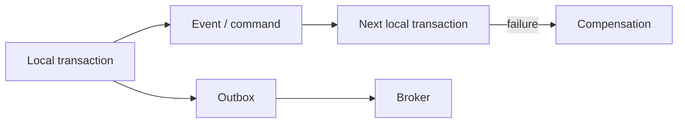

# ACID, Isolation, and Distributed Transactions

Transaction design is about more than preserving correctness in one database. It also defines which guarantees are truly required across concurrent operations and services.

## Quick Decision

| Need | Approach | Cost |
| --- | --- | --- |
| Integrity in one database | ACID transaction | Locks, contention, and less parallelism |
| Consistent reads | Isolation level or snapshot | Version/memory and stale-read considerations |
| Workflow across services | Outbox plus Saga | Compensation and eventual consistency |
| All participants must commit together | 2PC | Coordinator, blocking, and operational complexity |
| Strict ordering of results | Serializable | More conflicts and lower throughput |

## Production Checklist

- Is the transaction boundary and source of truth explicit?
- Is the isolation level chosen for a real anomaly requirement?
- Is a retried transaction idempotent?
- Do distributed flows define timeouts, compensation, and stuck states?
- Are commit, event publication, and read-model updates observable?

## ACID

- **Atomicity:** All effects of a transaction apply, or none do.
- **Consistency:** A transaction moves the database from one valid state to another.
- **Isolation:** Defines how concurrent transactions can observe each other.
- **Durability:** Committed data survives process or node failure.

ACID does not mean that the whole distributed system has one global transaction. A database transaction boundary and a business-process boundary can be different.

## Isolation Levels and Anomalies

| Level | Dirty read | Non-repeatable read | Phantom read | Typical interpretation |
| --- | --- | --- | --- | --- |
| Read uncommitted | Possible | Possible | Possible | Rare reporting use; risky for most workflows |
| Read committed | Prevented | Possible | Possible | Common default |
| Repeatable read | Prevented | Prevented | Database-specific | Stronger reads with snapshot/MVCC |
| Serializable | Prevented | Prevented | Prevented | Strongest isolation, more conflicts |

- **Dirty read:** Reading uncommitted data.
- **Non-repeatable read:** Reading the same row twice and seeing different values.
- **Phantom read:** Seeing new or removed rows for the same predicate.
- **Lost update:** One write overwriting another concurrent write.

The isolation name is not enough; verify the database engine's MVCC, lock, and predicate behavior.

## Serializability

An execution is serializable when it produces the same result as some serial ordering of the transactions. Strict locking, optimistic concurrency control, or serializable snapshot isolation can provide it.

Serializability improves correctness but can increase lock contention, aborts, and retries. If lower isolation is selected, protect invariants with application constraints, unique indexes, version checks, or atomic updates.

## Distributed Transaction Options

### Two-Phase Commit (2PC)

The coordinator first sends **prepare** to every participant and then **commit**. If a participant cannot reach the coordinator after prepare, the transaction can remain uncertain or blocked. Consider 2PC only when strong atomicity is truly required and participants are controlled.

### Outbox Pattern

The business change and the event to publish are written to an outbox in one local transaction. A publisher sends the outbox record to the broker. Broker delivery can still duplicate messages, so consumers must be idempotent.

### Saga Pattern

A long workflow is split into local transactions. If a later step fails, earlier steps are compensated. Compensation is not necessarily restoring the old physical value; it can be a business-level corrective action.

## Relationship to Consistency

A single database transaction can provide strong consistency; an event flow across services commonly produces eventual consistency. If users need read-your-writes, add a policy such as primary reads, version tokens, session affinity, or waiting for a projection.

Before choosing distributed transactions, ask whether the business rule truly requires all steps to commit at once or whether intermediate states and compensation are acceptable.

## Retry and Recovery

After a transaction timeout, it may be unknown whether commit happened. Blind retries can create duplicate payments or events. Design idempotency keys, unique business keys, status queries, and reconciliation jobs together.
