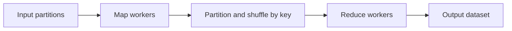

# Batch Processing and MapReduce

Batch processing handles bounded or accumulated data in a time window and is efficient for high-volume workloads. Choose between batch and stream processing based on latency, cost, replay, and data-correctness requirements.

## Quick Decision

| Need | Approach | Concern |
| --- | --- | --- |
| Hourly or daily reporting | Batch | Data freshness is delayed |
| Millisecond-to-second reaction | Stream | State and operational complexity |
| Large independent record set | MapReduce | Shuffle and network cost |
| Queue and scale work | Messaging plus workers | Duplicates and ordering |
| Cleanup before analytics/modeling | Preprocessing pipeline | Schema, lineage, and replay |

## Production Checklist

- Are batch windows, watermarks, late data, and time zones explicit?
- Is the job idempotent and restartable from a checkpoint?
- Are input, intermediate, and output schemas versioned?
- If a broker is used, are lag, retries, and DLQ monitored?
- Can backfills and reruns happen without duplicate results?

## Batch and Stream Comparison

| Dimension | Batch | Stream |
| --- | --- | --- |
| Latency | Minutes to hours | Milliseconds to minutes |
| Operations | Window and scheduler oriented | Continuously running jobs and state |
| Replay | Easy from a dataset | Requires offset/checkpoint management |
| Cost | Resources used per window | Continuous resource usage |
| Data | Bounded dataset | Unbounded event stream |

A hybrid architecture can write the same raw events to live stream consumers and a replayable data lake or batch layer.

## Batch Pipeline


Pipeline stages should be deterministic and replayable. Immutable raw data enables corrected transforms and backfills.

## Preprocessing Pipelines

Preprocessing can include schema validation, type normalization, deduplication, PII masking, enrichment, filtering, and partitioning.

```text
raw event
  → schema validation
  → timestamp/identity normalization
  → deduplication
  → privacy filtering
  → enrichment
  → partitioned curated data
```

For lineage and debugging, retain source, ingestion time, event time, schema version, and processing version. Do not silently drop invalid records; route them to quarantine or a DLQ-like flow.

## MapReduce

MapReduce splits a large data job into three conceptual stages:

1. **Map:** Convert each input record into key/value output.
2. **Shuffle:** Move the same keys to the same reducer and group them.
3. **Reduce:** Aggregate, merge, or summarize each key group.



Map can run in parallel; shuffle is often the most expensive network and disk stage. A skewed key can make one reducer a hot spot. Combiners, a good partition key, and the right output partition count reduce the risk.

## Processing with Messaging Systems

A queue distributes work: a message is usually processed by one consumer. Pub/Sub fans the same event out to multiple independent consumer groups. Adding workers beyond queue or partition concurrency does not create more useful parallelism.

For message-based batch jobs:

- define bounded batch size and maximum processing time,
- acknowledge after successful processing,
- use idempotency keys and checkpoints,
- define retry budgets and a DLQ for poison messages,
- monitor queue depth and processing age.

## Correctness and Operations

Separate event time from processing time. Choose a watermark and correction window for late data. Because the same batch may run more than once, publish atomically and include partition/date/job version in the output.

A failed job should resume from the last successful checkpoint rather than always reprocess the entire dataset. Verify that the checkpoint matches input and output versions.
