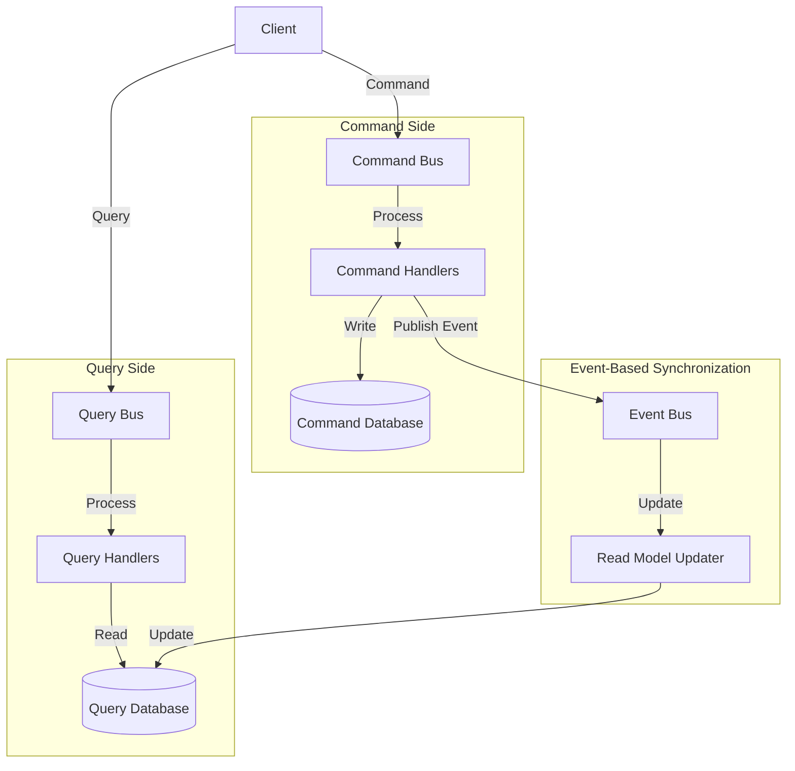
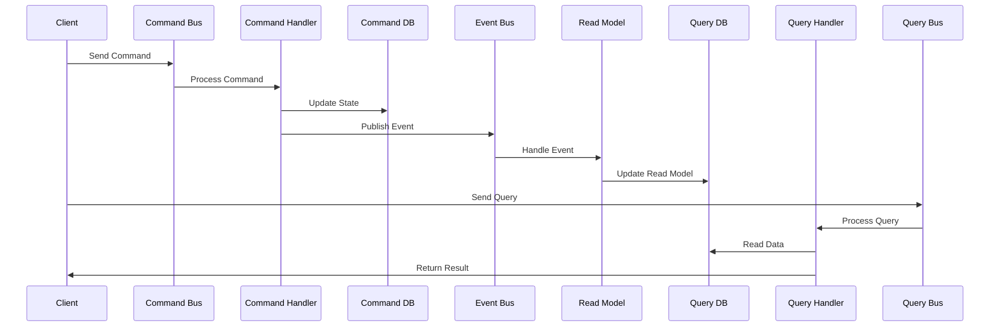
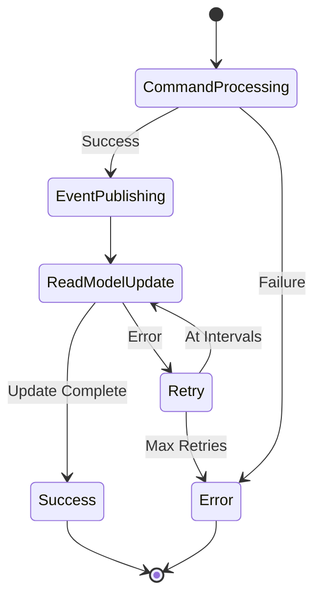

# CQRS (Command Query Responsibility Segregation)

CQRS is an architectural pattern that separates read and write operations into different models. Commands handle write operations (state changes), while queries handle read operations, allowing for independent optimization of each side.

## Core Concepts

### General Architecture Diagram



### Command and Query Flow Diagram



### Event-Based Read Model Update Diagram



### Command Side Configuration
Database configuration for command operations:

```java
@Configuration
@EnableJpaRepositories(
    basePackages = "com.example.command.repositories",
    entityManagerFactoryRef = "commandEntityManagerFactory",
    transactionManagerRef = "commandTransactionManager"
)
public class CommandDataSourceConfig {
    
    @Primary
    @Bean(name = "commandDataSource")
    @ConfigurationProperties("spring.command.datasource")
    public DataSource commandDataSource() {
        return DataSourceBuilder.create()
            .driverClassName("org.postgresql.Driver")
            .build();
    }
    
    @Primary
    @Bean(name = "commandEntityManagerFactory")
    public LocalContainerEntityManagerFactoryBean commandEntityManagerFactory(
            EntityManagerFactoryBuilder builder,
            @Qualifier("commandDataSource") DataSource dataSource) {
        
        return builder
            .dataSource(dataSource)
            .packages("com.example.command.entities")
            .persistenceUnit("command")
            .properties(Map.of(
                "hibernate.dialect", "org.hibernate.dialect.PostgreSQLDialect",
                "hibernate.hbm2ddl.auto", "validate",
                "hibernate.show_sql", "false",
                "hibernate.format_sql", "true"
            ))
            .build();
    }
    
    @Primary
    @Bean(name = "commandTransactionManager")
    public PlatformTransactionManager commandTransactionManager(
            @Qualifier("commandEntityManagerFactory") EntityManagerFactory entityManagerFactory) {
        return new JpaTransactionManager(entityManagerFactory);
    }
}
```

### Query Side Configuration
Separate database configuration for read operations:

```java
@Configuration
@EnableJpaRepositories(
    basePackages = "com.example.query.repositories",
    entityManagerFactoryRef = "queryEntityManagerFactory",
    transactionManagerRef = "queryTransactionManager"
)
public class QueryDataSourceConfig {
    
    @Bean(name = "queryDataSource")
    @ConfigurationProperties("spring.query.datasource")
    public DataSource queryDataSource() {
        return DataSourceBuilder.create()
            .driverClassName("org.postgresql.Driver")
            .build();
    }
    
    @Bean(name = "queryEntityManagerFactory")
    public LocalContainerEntityManagerFactoryBean queryEntityManagerFactory(
            EntityManagerFactoryBuilder builder,
            @Qualifier("queryDataSource") DataSource dataSource) {
        
        return builder
            .dataSource(dataSource)
            .packages("com.example.query.entities")
            .persistenceUnit("query")
            .properties(Map.of(
                "hibernate.dialect", "org.hibernate.dialect.PostgreSQLDialect",
                "hibernate.hbm2ddl.auto", "validate",
                "hibernate.show_sql", "false",
                "hibernate.format_sql", "true",
                "hibernate.default_schema", "read_model"
            ))
            .build();
    }
    
    @Bean(name = "queryTransactionManager")
    public PlatformTransactionManager queryTransactionManager(
            @Qualifier("queryEntityManagerFactory") EntityManagerFactory entityManagerFactory) {
        return new JpaTransactionManager(entityManagerFactory);
    }
}
```

## Command Side Implementation

### Command Definitions
Command objects for write operations:

```java
public abstract class Command {
    protected String commandId;
    protected String correlationId;
    protected Instant timestamp;
    protected String userId;
    
    protected Command() {
        this.commandId = UUID.randomUUID().toString();
        this.timestamp = Instant.now();
    }
    
    // Getters and setters...
}

public class CreateOrderCommand extends Command {
    private String orderId;
    private String customerId;
    private List<OrderItemCommand> items;
    private BigDecimal totalAmount;
    private String shippingAddress;
    
    public CreateOrderCommand() {}
    
    public CreateOrderCommand(String customerId, List<OrderItemCommand> items, 
                            BigDecimal totalAmount, String shippingAddress) {
        super();
        this.orderId = UUID.randomUUID().toString();
        this.customerId = customerId;
        this.items = items;
        this.totalAmount = totalAmount;
        this.shippingAddress = shippingAddress;
    }
    
    // Getters and setters...
}

public class ConfirmOrderCommand extends Command {
    private String orderId;
    private String confirmationNotes;
    
    public ConfirmOrderCommand() {}
    
    public ConfirmOrderCommand(String orderId, String confirmationNotes) {
        super();
        this.orderId = orderId;
        this.confirmationNotes = confirmationNotes;
    }
    
    // Getters and setters...
}

public class CancelOrderCommand extends Command {
    private String orderId;
    private String cancellationReason;
    
    public CancelOrderCommand() {}
    
    public CancelOrderCommand(String orderId, String cancellationReason) {
        super();
        this.orderId = orderId;
        this.cancellationReason = cancellationReason;
    }
    
    // Getters and setters...
}
```

### Command Handlers
Handlers for processing commands:

```java
@Component
@Slf4j
public class CreateOrderCommandHandler implements CommandHandler<CreateOrderCommand> {
    
    private final OrderRepository orderRepository;
    private final CustomerService customerService;
    private final InventoryService inventoryService;
    private final ApplicationEventPublisher eventPublisher;
    private final MeterRegistry meterRegistry;
    
    private final Timer commandProcessingTimer;
    private final Counter commandSuccessCounter;
    private final Counter commandErrorCounter;
    
    public CreateOrderCommandHandler(OrderRepository orderRepository,
                                   CustomerService customerService,
                                   InventoryService inventoryService,
                                   ApplicationEventPublisher eventPublisher,
                                   MeterRegistry meterRegistry) {
        this.orderRepository = orderRepository;
        this.customerService = customerService;
        this.inventoryService = inventoryService;
        this.eventPublisher = eventPublisher;
        this.meterRegistry = meterRegistry;
        
        this.commandProcessingTimer = Timer.builder("command.processing.duration")
            .tag("command", "CreateOrder")
            .description("Time taken to process CreateOrder command")
            .register(meterRegistry);
        this.commandSuccessCounter = Counter.builder("command.processing.success")
            .tag("command", "CreateOrder")
            .description("Number of successful CreateOrder commands")
            .register(meterRegistry);
        this.commandErrorCounter = Counter.builder("command.processing.error")
            .tag("command", "CreateOrder")
            .description("Number of failed CreateOrder commands")
            .register(meterRegistry);
    }
    
    @Override
    @Transactional("commandTransactionManager")
    public CommandResult handle(CreateOrderCommand command) {
        Timer.Sample sample = Timer.Sample.start(meterRegistry);
        
        try {
            // Validate customer
            Customer customer = customerService.findById(command.getCustomerId())
                .orElseThrow(() -> new CustomerNotFoundException(command.getCustomerId()));
            
            if (!customer.isActive()) {
                throw new InvalidCommandException("Customer is not active");
            }
            
            // Validate inventory
            for (OrderItemCommand itemCommand : command.getItems()) {
                if (!inventoryService.isAvailable(itemCommand.getProductId(), itemCommand.getQuantity())) {
                    throw new InsufficientInventoryException(itemCommand.getProductId());
                }
            }
            
            // Create order aggregate
            Order order = new Order(
                command.getOrderId(),
                command.getCustomerId(),
                command.getTotalAmount(),
                convertToOrderItems(command.getItems()),
                command.getShippingAddress()
            );
            
            // Reserve inventory
            for (OrderItemCommand itemCommand : command.getItems()) {
                inventoryService.reserve(itemCommand.getProductId(), itemCommand.getQuantity());
            }
            
            // Save order
            orderRepository.save(order);
            
            // Publish domain events
            order.getUncommittedEvents().forEach(eventPublisher::publishEvent);
            order.markEventsAsCommitted();
            
            commandSuccessCounter.increment();
            log.info("Successfully created order: {}", command.getOrderId());
            
            return CommandResult.success(command.getCommandId(), order.getId());
            
        } catch (Exception e) {
            commandErrorCounter.increment();
            log.error("Failed to create order: {}", command.getOrderId(), e);
            return CommandResult.failure(command.getCommandId(), e.getMessage());
        } finally {
            sample.stop(commandProcessingTimer);
        }
    }
    
    private List<OrderItem> convertToOrderItems(List<OrderItemCommand> itemCommands) {
        return itemCommands.stream()
            .map(itemCmd -> new OrderItem(
                itemCmd.getProductId(),
                itemCmd.getProductName(),
                itemCmd.getQuantity(),
                itemCmd.getUnitPrice()
            ))
            .collect(Collectors.toList());
    }
}

@Component
@Slf4j
public class ConfirmOrderCommandHandler implements CommandHandler<ConfirmOrderCommand> {
    
    private final OrderRepository orderRepository;
    private final ApplicationEventPublisher eventPublisher;
    private final MeterRegistry meterRegistry;
    
    public ConfirmOrderCommandHandler(OrderRepository orderRepository,
                                    ApplicationEventPublisher eventPublisher,
                                    MeterRegistry meterRegistry) {
        this.orderRepository = orderRepository;
        this.eventPublisher = eventPublisher;
        this.meterRegistry = meterRegistry;
    }
    
    @Override
    @Transactional("commandTransactionManager")
    public CommandResult handle(ConfirmOrderCommand command) {
        try {
            Order order = orderRepository.findById(command.getOrderId())
                .orElseThrow(() -> new OrderNotFoundException(command.getOrderId()));
            
            order.confirm(command.getUserId(), command.getConfirmationNotes());
            
            orderRepository.save(order);
            
            // Publish events
            order.getUncommittedEvents().forEach(eventPublisher::publishEvent);
            order.markEventsAsCommitted();
            
            log.info("Successfully confirmed order: {}", command.getOrderId());
            return CommandResult.success(command.getCommandId(), order.getId());
            
        } catch (Exception e) {
            log.error("Failed to confirm order: {}", command.getOrderId(), e);
            return CommandResult.failure(command.getCommandId(), e.getMessage());
        }
    }
}
```

## Query Side Implementation

### Query Definitions
Query objects for read operations:

```java
public abstract class Query<TResult> {
    protected String queryId;
    protected Instant timestamp;
    
    protected Query() {
        this.queryId = UUID.randomUUID().toString();
        this.timestamp = Instant.now();
    }
    
    // Getters and setters...
}

public class GetOrderByIdQuery extends Query<OrderDetailsDto> {
    private String orderId;
    
    public GetOrderByIdQuery() {}
    
    public GetOrderByIdQuery(String orderId) {
        super();
        this.orderId = orderId;
    }
    
    // Getters and setters...
}

public class GetOrdersByCustomerQuery extends Query<List<OrderSummaryDto>> {
    private String customerId;
    private OrderStatus status;
    private Instant fromDate;
    private Instant toDate;
    private int page;
    private int size;
    
    public GetOrdersByCustomerQuery() {}
    
    public GetOrdersByCustomerQuery(String customerId, OrderStatus status, 
                                  Instant fromDate, Instant toDate, int page, int size) {
        super();
        this.customerId = customerId;
        this.status = status;
        this.fromDate = fromDate;
        this.toDate = toDate;
        this.page = page;
        this.size = size;
    }
    
    // Getters and setters...
}
```

### Read Models
Optimized entities for read operations:

```java
@Entity
@Table(name = "order_read_model", schema = "read_model")
public class OrderReadModel {
    
    @Id
    private String orderId;
    
    @Column(name = "customer_id", nullable = false)
    private String customerId;
    
    @Column(name = "customer_name")
    private String customerName;
    
    @Column(name = "customer_email")
    private String customerEmail;
    
    @Column(name = "status", nullable = false)
    @Enumerated(EnumType.STRING)
    private OrderStatus status;
    
    @Column(name = "total_amount", nullable = false, precision = 19, scale = 2)
    private BigDecimal totalAmount;
    
    @Column(name = "item_count")
    private Integer itemCount;
    
    @Column(name = "created_at", nullable = false)
    private Instant createdAt;
    
    @Column(name = "confirmed_at")
    private Instant confirmedAt;
    
    @Column(name = "shipped_at")
    private Instant shippedAt;
    
    @Column(name = "delivered_at")
    private Instant deliveredAt;
    
    @Column(name = "cancelled_at")
    private Instant cancelledAt;
    
    @Column(name = "shipping_address", columnDefinition = "TEXT")
    private String shippingAddress;
    
    @Column(name = "last_updated")
    private Instant lastUpdated;
    
    // Denormalized order items for faster queries
    @OneToMany(mappedBy = "orderId", cascade = CascadeType.ALL, fetch = FetchType.LAZY)
    private List<OrderItemReadModel> items = new ArrayList<>();
    
    // Constructors, getters, setters...
}

@Entity
@Table(name = "order_item_read_model", schema = "read_model")
public class OrderItemReadModel {
    
    @Id
    @GeneratedValue(strategy = GenerationType.IDENTITY)
    private Long id;
    
    @Column(name = "order_id", nullable = false)
    private String orderId;
    
    @Column(name = "product_id", nullable = false)
    private String productId;
    
    @Column(name = "product_name", nullable = false)
    private String productName;
    
    @Column(name = "product_category")
    private String productCategory;
    
    @Column(name = "quantity", nullable = false)
    private Integer quantity;
    
    @Column(name = "unit_price", nullable = false, precision = 19, scale = 2)
    private BigDecimal unitPrice;
    
    @Column(name = "total_price", nullable = false, precision = 19, scale = 2)
    private BigDecimal totalPrice;
    
    // Constructors, getters, setters...
}
```

### Query Handlers
Handlers for processing queries:

```java
@Component
@Slf4j
public class GetOrderByIdQueryHandler implements QueryHandler<GetOrderByIdQuery, OrderDetailsDto> {
    
    private final OrderReadModelRepository orderReadModelRepository;
    private final MeterRegistry meterRegistry;
    
    private final Timer queryProcessingTimer;
    private final Counter queryExecutedCounter;
    
    public GetOrderByIdQueryHandler(OrderReadModelRepository orderReadModelRepository,
                                  MeterRegistry meterRegistry) {
        this.orderReadModelRepository = orderReadModelRepository;
        this.meterRegistry = meterRegistry;
        
        this.queryProcessingTimer = Timer.builder("query.processing.duration")
            .tag("query", "GetOrderById")
            .description("Time taken to process GetOrderById query")
            .register(meterRegistry);
        this.queryExecutedCounter = Counter.builder("query.executed")
            .tag("query", "GetOrderById")
            .description("Number of GetOrderById queries executed")
            .register(meterRegistry);
    }
    
    @Override
    @Transactional(value = "queryTransactionManager", readOnly = true)
    public QueryResult<OrderDetailsDto> handle(GetOrderByIdQuery query) {
        Timer.Sample sample = Timer.Sample.start(meterRegistry);
        
        try {
            Optional<OrderReadModel> orderOpt = orderReadModelRepository
                .findByOrderIdWithItems(query.getOrderId());
            
            if (orderOpt.isEmpty()) {
                return QueryResult.notFound(query.getQueryId(), "Order not found");
            }
            
            OrderReadModel order = orderOpt.get();
            OrderDetailsDto dto = mapToOrderDetailsDto(order);
            
            queryExecutedCounter.increment();
            log.debug("Successfully retrieved order details: {}", query.getOrderId());
            
            return QueryResult.success(query.getQueryId(), dto);
            
        } catch (Exception e) {
            log.error("Failed to retrieve order: {}", query.getOrderId(), e);
            return QueryResult.failure(query.getQueryId(), e.getMessage());
        } finally {
            sample.stop(queryProcessingTimer);
        }
    }
    
    private OrderDetailsDto mapToOrderDetailsDto(OrderReadModel order) {
        List<OrderItemDto> itemDtos = order.getItems().stream()
            .map(item -> new OrderItemDto(
                item.getProductId(),
                item.getProductName(),
                item.getProductCategory(),
                item.getQuantity(),
                item.getUnitPrice(),
                item.getTotalPrice()
            ))
            .collect(Collectors.toList());
        
        return new OrderDetailsDto(
            order.getOrderId(),
            order.getCustomerId(),
            order.getCustomerName(),
            order.getCustomerEmail(),
            order.getStatus(),
            order.getTotalAmount(),
            order.getItemCount(),
            itemDtos,
            order.getShippingAddress(),
            order.getCreatedAt(),
            order.getConfirmedAt(),
            order.getShippedAt(),
            order.getDeliveredAt(),
            order.getCancelledAt()
        );
    }
}

@Component
@Slf4j
public class GetOrdersByCustomerQueryHandler implements QueryHandler<GetOrdersByCustomerQuery, List<OrderSummaryDto>> {
    
    private final OrderReadModelRepository orderReadModelRepository;
    private final MeterRegistry meterRegistry;
    
    public GetOrdersByCustomerQueryHandler(OrderReadModelRepository orderReadModelRepository,
                                         MeterRegistry meterRegistry) {
        this.orderReadModelRepository = orderReadModelRepository;
        this.meterRegistry = meterRegistry;
    }
    
    @Override
    @Transactional(value = "queryTransactionManager", readOnly = true)
    public QueryResult<List<OrderSummaryDto>> handle(GetOrdersByCustomerQuery query) {
        try {
            Pageable pageable = PageRequest.of(query.getPage(), query.getSize(), 
                Sort.by(Sort.Direction.DESC, "createdAt"));
            
            Page<OrderReadModel> ordersPage = orderReadModelRepository
                .findOrdersByCustomerWithFilters(
                    query.getCustomerId(),
                    query.getStatus(),
                    query.getFromDate(),
                    query.getToDate(),
                    pageable
                );
            
            List<OrderSummaryDto> orderSummaries = ordersPage.getContent().stream()
                .map(this::mapToOrderSummaryDto)
                .collect(Collectors.toList());
            
            log.debug("Retrieved {} orders for customer: {}", orderSummaries.size(), query.getCustomerId());
            
            return QueryResult.success(query.getQueryId(), orderSummaries);
            
        } catch (Exception e) {
            log.error("Failed to retrieve orders for customer: {}", query.getCustomerId(), e);
            return QueryResult.failure(query.getQueryId(), e.getMessage());
        }
    }
    
    private OrderSummaryDto mapToOrderSummaryDto(OrderReadModel order) {
        return new OrderSummaryDto(
            order.getOrderId(),
            order.getStatus(),
            order.getTotalAmount(),
            order.getItemCount(),
            order.getCreatedAt(),
            order.getLastUpdated()
        );
    }
}
```

## Event-Driven Read Model Updates

### Read Model Projection Handler
Asynchronous read model updates via domain events:

```java
@Component
@Slf4j
public class OrderReadModelProjectionHandler {
    
    private final OrderReadModelRepository orderReadModelRepository;
    private final CustomerService customerService;
    private final ProductService productService;
    private final MeterRegistry meterRegistry;
    
    public OrderReadModelProjectionHandler(OrderReadModelRepository orderReadModelRepository,
                                         CustomerService customerService,
                                         ProductService productService,
                                         MeterRegistry meterRegistry) {
        this.orderReadModelRepository = orderReadModelRepository;
        this.customerService = customerService;
        this.productService = productService;
        this.meterRegistry = meterRegistry;
    }
    
    @EventListener
    @Async
    @Transactional("queryTransactionManager")
    public void handle(OrderCreatedEvent event) {
        try {
            // Enrich with customer data
            Customer customer = customerService.findById(event.getCustomerId())
                .orElseThrow(() -> new CustomerNotFoundException(event.getCustomerId()));
            
            OrderReadModel readModel = new OrderReadModel();
            readModel.setOrderId(event.getOrderId());
            readModel.setCustomerId(event.getCustomerId());
            readModel.setCustomerName(customer.getFullName());
            readModel.setCustomerEmail(customer.getEmail());
            readModel.setStatus(OrderStatus.PENDING);
            readModel.setTotalAmount(event.getAmount());
            readModel.setItemCount(event.getItems().size());
            readModel.setCreatedAt(event.getTimestamp());
            readModel.setShippingAddress(event.getShippingAddress());
            readModel.setLastUpdated(Instant.now());
            
            // Create item read models with enriched product data
            List<OrderItemReadModel> itemReadModels = new ArrayList<>();
            for (OrderItem item : event.getItems()) {
                Product product = productService.findById(item.getProductId())
                    .orElse(null);
                
                OrderItemReadModel itemReadModel = new OrderItemReadModel();
                itemReadModel.setOrderId(event.getOrderId());
                itemReadModel.setProductId(item.getProductId());
                itemReadModel.setProductName(item.getProductName());
                itemReadModel.setProductCategory(product != null ? product.getCategory() : "Unknown");
                itemReadModel.setQuantity(item.getQuantity());
                itemReadModel.setUnitPrice(item.getUnitPrice());
                itemReadModel.setTotalPrice(item.getUnitPrice().multiply(BigDecimal.valueOf(item.getQuantity())));
                
                itemReadModels.add(itemReadModel);
            }
            
            readModel.setItems(itemReadModels);
            orderReadModelRepository.save(readModel);
            
            log.debug("Created read model for order: {}", event.getOrderId());
            
        } catch (Exception e) {
            log.error("Failed to handle OrderCreatedEvent for read model: {}", event.getOrderId(), e);
            // Consider dead letter queue for failed projections
        }
    }
    
    @EventListener
    @Async
    @Transactional("queryTransactionManager")
    public void handle(OrderConfirmedEvent event) {
        try {
            orderReadModelRepository.findByOrderId(event.getOrderId())
                .ifPresentOrElse(
                    readModel -> {
                        readModel.setStatus(OrderStatus.CONFIRMED);
                        readModel.setConfirmedAt(event.getConfirmedAt());
                        readModel.setLastUpdated(Instant.now());
                        orderReadModelRepository.save(readModel);
                        
                        log.debug("Updated read model for order confirmation: {}", event.getOrderId());
                    },
                    () -> log.warn("Order read model not found for confirmation: {}", event.getOrderId())
                );
            
        } catch (Exception e) {
            log.error("Failed to handle OrderConfirmedEvent for read model: {}", event.getOrderId(), e);
        }
    }
    
    @EventListener
    @Async
    @Transactional("queryTransactionManager")
    public void handle(OrderCancelledEvent event) {
        try {
            orderReadModelRepository.findByOrderId(event.getOrderId())
                .ifPresentOrElse(
                    readModel -> {
                        readModel.setStatus(OrderStatus.CANCELLED);
                        readModel.setCancelledAt(event.getCancelledAt());
                        readModel.setLastUpdated(Instant.now());
                        orderReadModelRepository.save(readModel);
                        
                        log.debug("Updated read model for order cancellation: {}", event.getOrderId());
                    },
                    () -> log.warn("Order read model not found for cancellation: {}", event.getOrderId())
                );
            
        } catch (Exception e) {
            log.error("Failed to handle OrderCancelledEvent for read model: {}", event.getOrderId(), e);
        }
    }
}
```

## Command and Query Bus

### Command Bus Implementation
Central dispatcher for commands:

```java
@Service
@Slf4j
public class CommandBus {
    
    private final Map<Class<?>, CommandHandler<?>> handlers;
    private final MeterRegistry meterRegistry;
    private final Timer commandDispatchTimer;
    
    public CommandBus(List<CommandHandler<?>> handlerList, MeterRegistry meterRegistry) {
        this.meterRegistry = meterRegistry;
        this.handlers = new HashMap<>();
        
        // Register handlers
        handlerList.forEach(handler -> {
            Type[] interfaces = handler.getClass().getGenericInterfaces();
            for (Type type : interfaces) {
                if (type instanceof ParameterizedType) {
                    ParameterizedType paramType = (ParameterizedType) type;
                    if (paramType.getRawType().equals(CommandHandler.class)) {
                        Type commandType = paramType.getActualTypeArguments()[0];
                        handlers.put((Class<?>) commandType, handler);
                        break;
                    }
                }
            }
        });
        
        this.commandDispatchTimer = Timer.builder("command.dispatch.duration")
            .description("Time taken to dispatch commands")
            .register(meterRegistry);
        
        log.info("Registered {} command handlers", handlers.size());
    }
    
    @SuppressWarnings("unchecked")
    public <T extends Command> CommandResult send(T command) {
        Timer.Sample sample = Timer.Sample.start(meterRegistry);
        
        try {
            CommandHandler<T> handler = (CommandHandler<T>) handlers.get(command.getClass());
            
            if (handler == null) {
                throw new CommandHandlerNotFoundException(
                    "No handler found for command: " + command.getClass().getSimpleName());
            }
            
            log.debug("Dispatching command: {} with ID: {}", 
                     command.getClass().getSimpleName(), command.getCommandId());
            
            CommandResult result = handler.handle(command);
            
            // Record metrics
            Timer.Sample.start(meterRegistry)
                .stop(Timer.builder("command.execution.duration")
                    .tag("command", command.getClass().getSimpleName())
                    .tag("result", result.isSuccess() ? "success" : "failure")
                    .register(meterRegistry));
            
            return result;
            
        } catch (Exception e) {
            log.error("Failed to dispatch command: {}", command.getClass().getSimpleName(), e);
            return CommandResult.failure(command.getCommandId(), e.getMessage());
        } finally {
            sample.stop(commandDispatchTimer);
        }
    }
    
    public boolean hasHandler(Class<? extends Command> commandType) {
        return handlers.containsKey(commandType);
    }
}

@Service
@Slf4j
public class QueryBus {
    
    private final Map<Class<?>, QueryHandler<?, ?>> handlers;
    private final MeterRegistry meterRegistry;
    
    public QueryBus(List<QueryHandler<?, ?>> handlerList, MeterRegistry meterRegistry) {
        this.meterRegistry = meterRegistry;
        this.handlers = new HashMap<>();
        
        // Register handlers
        handlerList.forEach(handler -> {
            Type[] interfaces = handler.getClass().getGenericInterfaces();
            for (Type type : interfaces) {
                if (type instanceof ParameterizedType) {
                    ParameterizedType paramType = (ParameterizedType) type;
                    if (paramType.getRawType().equals(QueryHandler.class)) {
                        Type queryType = paramType.getActualTypeArguments()[0];
                        handlers.put((Class<?>) queryType, handler);
                        break;
                    }
                }
            }
        });
        
        log.info("Registered {} query handlers", handlers.size());
    }
    
    @SuppressWarnings("unchecked")
    public <TQuery extends Query<TResult>, TResult> QueryResult<TResult> send(TQuery query) {
        try {
            QueryHandler<TQuery, TResult> handler = 
                (QueryHandler<TQuery, TResult>) handlers.get(query.getClass());
            
            if (handler == null) {
                throw new QueryHandlerNotFoundException(
                    "No handler found for query: " + query.getClass().getSimpleName());
            }
            
            log.debug("Dispatching query: {} with ID: {}", 
                     query.getClass().getSimpleName(), query.getQueryId());
            
            return handler.handle(query);
            
        } catch (Exception e) {
            log.error("Failed to dispatch query: {}", query.getClass().getSimpleName(), e);
            return QueryResult.failure(query.getQueryId(), e.getMessage());
        }
    }
}
```

## REST API Integration

### CQRS Controller
Controller using CQRS pattern:

```java
@RestController
@RequestMapping("/api/orders")
@Slf4j
public class OrderController {
    
    private final CommandBus commandBus;
    private final QueryBus queryBus;
    
    public OrderController(CommandBus commandBus, QueryBus queryBus) {
        this.commandBus = commandBus;
        this.queryBus = queryBus;
    }
    
    @PostMapping
    public ResponseEntity<ApiResponse<String>> createOrder(@Valid @RequestBody CreateOrderRequest request) {
        try {
            CreateOrderCommand command = new CreateOrderCommand(
                request.getCustomerId(),
                request.getItems(),
                request.getTotalAmount(),
                request.getShippingAddress()
            );
            
            CommandResult result = commandBus.send(command);
            
            if (result.isSuccess()) {
                return ResponseEntity.status(HttpStatus.CREATED)
                    .body(ApiResponse.success(result.getAggregateId(), "Order created successfully"));
            } else {
                return ResponseEntity.badRequest()
                    .body(ApiResponse.error(result.getErrorMessage()));
            }
            
        } catch (Exception e) {
            log.error("Failed to create order", e);
            return ResponseEntity.status(HttpStatus.INTERNAL_SERVER_ERROR)
                .body(ApiResponse.error("Internal server error"));
        }
    }
    
    @PutMapping("/{orderId}/confirm")
    public ResponseEntity<ApiResponse<Void>> confirmOrder(@PathVariable String orderId,
                                                        @RequestBody ConfirmOrderRequest request) {
        try {
            ConfirmOrderCommand command = new ConfirmOrderCommand(orderId, request.getConfirmationNotes());
            CommandResult result = commandBus.send(command);
            
            if (result.isSuccess()) {
                return ResponseEntity.ok(ApiResponse.success(null, "Order confirmed successfully"));
            } else {
                return ResponseEntity.badRequest()
                    .body(ApiResponse.error(result.getErrorMessage()));
            }
            
        } catch (Exception e) {
            log.error("Failed to confirm order: {}", orderId, e);
            return ResponseEntity.status(HttpStatus.INTERNAL_SERVER_ERROR)
                .body(ApiResponse.error("Internal server error"));
        }
    }
    
    @GetMapping("/{orderId}")
    public ResponseEntity<ApiResponse<OrderDetailsDto>> getOrder(@PathVariable String orderId) {
        try {
            GetOrderByIdQuery query = new GetOrderByIdQuery(orderId);
            QueryResult<OrderDetailsDto> result = queryBus.send(query);
            
            if (result.isSuccess()) {
                return ResponseEntity.ok(ApiResponse.success(result.getData(), "Order retrieved successfully"));
            } else if (result.isNotFound()) {
                return ResponseEntity.notFound().build();
            } else {
                return ResponseEntity.badRequest()
                    .body(ApiResponse.error(result.getErrorMessage()));
            }
            
        } catch (Exception e) {
            log.error("Failed to retrieve order: {}", orderId, e);
            return ResponseEntity.status(HttpStatus.INTERNAL_SERVER_ERROR)
                .body(ApiResponse.error("Internal server error"));
        }
    }
    
    @GetMapping("/customer/{customerId}")
    public ResponseEntity<ApiResponse<List<OrderSummaryDto>>> getCustomerOrders(
            @PathVariable String customerId,
            @RequestParam(required = false) OrderStatus status,
            @RequestParam(required = false) @DateTimeFormat(iso = DateTimeFormat.ISO.DATE_TIME) Instant fromDate,
            @RequestParam(required = false) @DateTimeFormat(iso = DateTimeFormat.ISO.DATE_TIME) Instant toDate,
            @RequestParam(defaultValue = "0") int page,
            @RequestParam(defaultValue = "20") int size) {
        
        try {
            GetOrdersByCustomerQuery query = new GetOrdersByCustomerQuery(
                customerId, status, fromDate, toDate, page, size);
            
            QueryResult<List<OrderSummaryDto>> result = queryBus.send(query);
            
            if (result.isSuccess()) {
                return ResponseEntity.ok(ApiResponse.success(result.getData(), "Orders retrieved successfully"));
            } else {
                return ResponseEntity.badRequest()
                    .body(ApiResponse.error(result.getErrorMessage()));
            }
            
        } catch (Exception e) {
            log.error("Failed to retrieve orders for customer: {}", customerId, e);
            return ResponseEntity.status(HttpStatus.INTERNAL_SERVER_ERROR)
                .body(ApiResponse.error("Internal server error"));
        }
    }
}
```

CQRS provides several key benefits:

1. **Scalability**: Read and write sides can be scaled independently
2. **Performance**: Optimized read models for complex queries
3. **Flexibility**: Different storage mechanisms for commands and queries
4. **Security**: Fine-grained access control for read vs write operations
5. **Evolution**: Read models can evolve independently of write models

The pattern is particularly useful for:
- Systems with complex read requirements
- High-read, low-write scenarios
- Applications requiring different consistency models
- Systems with complex reporting needs

This implementation provides a complete CQRS solution with Spring Boot, including command/query separation, event-driven read model updates, and proper error handling with metrics.
