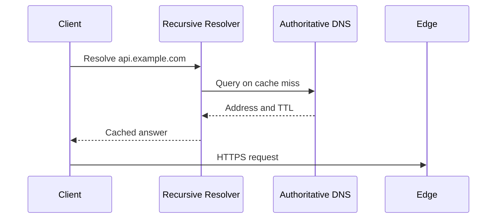

# DNS, CDN, and the Request Path

An HTTP request reaches an application through a sequence of decisions across DNS, edge caching, load balancing, reverse proxies, gateways, and services. Each layer can improve latency or reliability, but each also adds cache, timeout, and failure behavior.

## Quick Decision

| Need | Suitable layer | Critical concern |
| --- | --- | --- |
| Resolve a domain to an address | DNS | TTL, caches, and stale records |
| Serve static or cacheable content | CDN | Cache key, invalidation, and privacy |
| Distribute TCP/UDP flows | L4 load balancer | It cannot inspect content; connection behavior matters |
| Route HTTP and apply header policy | L7 load balancer | TLS, health checks, and retry limits |
| Apply shared API policies | API/Application Gateway | One bottleneck and centralized failure domain |
| Secure proxy in front of an app | Reverse proxy | Headers, timeouts, buffering, and body limits |

## Production Checklist

- Are DNS, CDN, LB, proxy, and gateway health/failure signals separate?
- Is a timeout, retry limit, and maximum payload defined at each layer?
- Does the cache key correctly include authorization, tenant, and content variation?
- Is the L4/L7 choice justified by connection and routing needs?
- Are rate limits and throttles measured per client, identity, tenant, and globally?

## DNS Resolution

The client usually checks operating-system and browser caches before querying a recursive resolver. When needed, the resolver asks root, TLD, and authoritative name servers for A/AAAA, CNAME, or other records. The answer is cached for its TTL.



DNS should not be treated as an instant request router. TTL changes do not reach every client immediately; resolver caches, negative caching, and stale answers can delay rollout or failover. Design client timeouts, retries, and controlled fallbacks instead of assuming the last known endpoint is always safe.

## CDN and Caching

CDN edge nodes serve static assets, media segments, and safely cacheable responses close to users without reaching the origin.

```text
Client → CDN edge
          ├─ cache hit  → response
          └─ cache miss → origin → store/serve response
```

The cache key must correctly separate path, query, method, locale, encoding, tenant, and authorization context. Personalized or sensitive responses must not accidentally enter a public cache. Versioned assets, short TTLs, purge, and stale-while-revalidate are common invalidation choices.

CDN reduces origin requests and bandwidth cost as well as latency. Plan for cache-miss storms, origin shielding, request coalescing, and stale responses.

## Load Balancer: L4 and L7

- **L4:** Distributes TCP/UDP flows by IP and port. It provides high throughput and low overhead with less protocol knowledge.
- **L7:** Routes by HTTP method, host, path, header, or cookie. TLS termination, canaries, authentication integration, and content policy are possible.

L7 provides more features but adds parsing, state, and configuration complexity. Health checks should test whether an instance can serve traffic, not only whether its process has an open port.

## Reverse Proxy

A reverse proxy connects to the origin on behalf of the client and may provide:

- TLS termination and certificate rotation,
- request/response buffering and compression,
- header normalization and access logs,
- body-size, timeout, and connection limits,
- upstream routing and health checks.

Proxy timeouts must be evaluated against the latency budget of the full request chain. Automatic proxy retries can duplicate non-idempotent POST operations.

## API and Application Gateways

An API Gateway centralizes API policies such as authentication, authorization, routing, rate limiting, quotas, transformation, and telemetry. In some platforms, Application Gateway is the product name for L7 routing, WAF, and TLS features; compare actual responsibilities rather than names.

Putting business logic in the gateway turns it into a deployment and latency bottleneck. Keep domain behavior in services and shared edge policy in the gateway.

## Rate Limiting and Throttling

- **Rate limiting:** Bounds how many requests are allowed during a time window.
- **Throttling:** Slows, queues, or rejects work under resource pressure.

The limit key can be an IP, user, API key, tenant, or endpoint. Token buckets allow bursts; leaky buckets smooth output. Define `429`, `Retry-After`, quota headers, and idempotency together.

Rate limiting alone is not overload protection. Queue depth, connection-pool usage, and database saturation should also influence global admission control.

## End-to-End Debug Order

For latency or reachability problems, measure DNS timing → TLS/connection → CDN hit/miss → LB route → proxy queue → gateway policy → service → cache/database. Every hop should carry a correlation ID and timing information.
