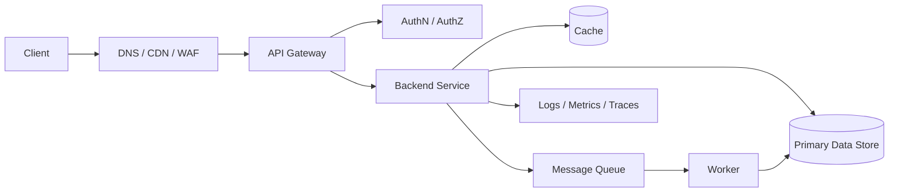

# Backend System Design

Backend system design is the set of decisions that lets a request travel from the user to data and back reliably. This section is a durable reference for balancing scalable APIs, data consistency, performance, reliability, observability, security, and cost.

## When To Use This Section

- When defining the boundaries, data ownership, and API contract of a new backend service.
- When an existing system shows latency, error-rate, cost, or operational-complexity problems.
- When comparing trade-offs around monoliths, microservices, event-driven systems, cache, queues, sharding, or multi-region designs.
- When AI or external resources are limited and you need to quickly recall the core principles.

## Core Flow

Every box in this flow is a decision point: a gateway centralizes control but can become a bottleneck; cache reduces latency but adds consistency risk; queues absorb bursts but introduce delay and replay handling.

## Decision Compass

| Question | Start Here | Typical Trade-off |
| --- | --- | --- |
| Is one service enough? | [Monolith vs Microservice](./basics/monolith-vs-microservice) | Simple operations vs independent scaling |
| How will the API evolve? | [API Versioning](./api/api-versioning) | Backward compatibility vs maintenance load |
| How do we reduce read pressure? | [Caching](./performance/caching) | Low latency vs invalidation complexity |
| How do reads and writes scale? | [Sharding](./performance/sharding), [Replication](./performance/replication) | More capacity vs data distribution cost |
| How do we limit failure spread? | [Circuit Breaker](./reliability/circuit-breaker), [Backpressure](./reliability/backpressure) | Protection vs extra state management |
| How consistent must the data be? | [Strong vs Eventual Consistency](./consistency/strong-vs-eventual), [CAP](./consistency/cap-theorem) | Correctness perception vs availability |
| How will the system be observed? | [Logging](./observability/logging), [Metrics](./observability/metrics), [Tracing](./observability/tracing) | Visibility vs data volume and cost |
| How are access and secrets protected? | [Auth](./security/auth), [Secret Management](./security/secret-management), [TLS/mTLS](./security/tls) | Security vs integration complexity |
| How do we explain the problem and architecture? | [System Thinking](./architecture/system-thinking), [Requirements and C4](./architecture/requirements-and-c4) | Clarity vs documentation cost |
| How do we estimate capacity? | [Back-of-the-Envelope](./architecture/back-of-the-envelope) | Fast assumptions vs measurement accuracy |
| Where is the transaction boundary? | [ACID and Isolation](./consistency/transactions-and-isolation) | Strong guarantees vs throughput |

## Minimum Design Check

Before calling a backend design complete, clarify these points:

- Problem: Which user or business flow does the system support, and what is the most critical failure mode?
- Solution: Are the main components, data-owning services, and sync/async boundaries clear?
- Trade-off: Are rejected alternatives and their reasons explicit?
- Example: Is there at least one successful request, one failure path, and one retry/idempotency flow?
- Measurement: Are latency, throughput, error rate, saturation, and cost signals defined?
- Security: Are authentication, authorization, secrets, TLS, and audit needs covered?
- Cost: Is the price of cache, queues, data copies, observability, and multi-region choices understood?

## Section Map

### 0. Architectural Thinking and Design Process

- [Highload and Systems Thinking](./architecture/system-thinking)
- [Requirements, Trade-offs, and C4](./architecture/requirements-and-c4)
- [Back-of-the-Envelope Estimation](./architecture/back-of-the-envelope)

### 1. Basic Concepts

- [Monolith vs Microservice](./basics/monolith-vs-microservice)
- [Request-Response Model](./basics/request-response-model)
- [HTTP, REST, gRPC](./basics/protocols)
- [Database Concepts](./basics/database-concepts)
- [Data Structures](./basics/data-structures)

### 2. Performance and Scalability

- [Load Balancing](./performance/load-balancing)
- [Caching](./performance/caching)
- [Sharding and Partitioning](./performance/sharding)
- [Replication](./performance/replication)
- [Async Processing and Message Queues](./performance/async-processing)

### 3. Reliability and Consistency

- [Failover](./reliability/failover)
- [Circuit Breaker and Bulkhead](./reliability/circuit-breaker)
- [Health Checks](./reliability/health-checks)
- [Backpressure](./reliability/backpressure)
- [ACID, Isolation, and Distributed Transactions](./consistency/transactions-and-isolation)
- [Consistency Models](./consistency/strong-vs-eventual)
- [Consensus Algorithms](./consistency/consensus-algorithms)

### 4. API, Microservices, and Data Flow

- [API Gateway](./api/api-gateway)
- [Rate Limiting](./api/rate-limiting)
- [GraphQL vs REST vs gRPC](./api/api-comparison)
- [Microservice Communication](./microservices/communication)
- [Service Discovery](./microservices/service-discovery)
- [Event Sourcing](./data-processing/event-sourcing)
- [CQRS](./data-processing/cqrs)
- [Stream Processing](./data-processing/stream-processing)
- [Batch Processing and MapReduce](./data-processing/batch-processing)

### 5. Operations, Security, and Geography

- [Observability](./observability/logging)
- [Observability Stack](./observability/observability-stack)
- [Security](./security/auth)
- [Cloud and Containers](./cloud/containers)
- [SRE](./sre/sli-slo-sla)
- [Operations and Cost](./operations/cost-optimization)
- [Edge and Multi-Region](./edge/multi-region)
- [DNS, CDN, and Request Path](./edge/request-path)
- [Continuous Improvement](./improvement/feedback-loops)

### 15. Large-Scale System Design Scenarios

- [Spotify-Scale and End-to-End Design](./scenarios/large-scale-system-design)

## Starting Route

If you are new, read [System Thinking](./architecture/system-thinking), [Requirements and C4](./architecture/requirements-and-c4), [Back-of-the-Envelope](./architecture/back-of-the-envelope), [Request-Response Model](./basics/request-response-model), [Database Concepts](./basics/database-concepts), [Caching](./performance/caching), [Observability Stack](./observability/observability-stack), and [Large-Scale Scenario](./scenarios/large-scale-system-design) in order. When designing a system, pull only the decision you need from each section; adding unnecessary technology is maintenance debt, not system design.
