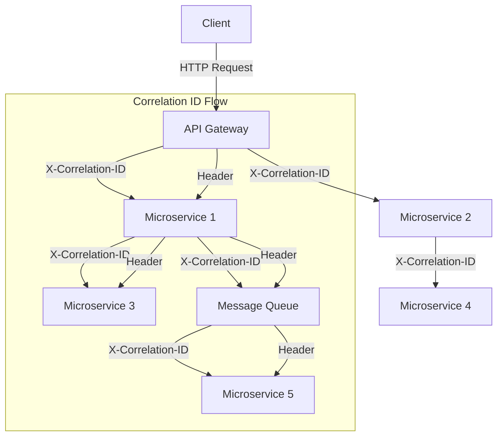
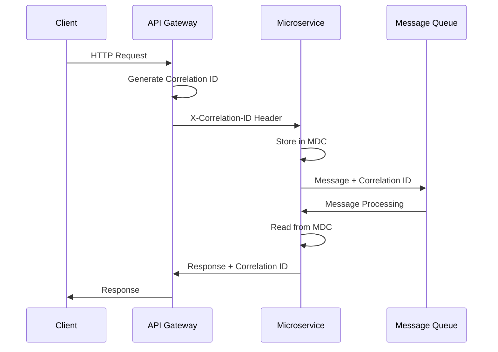
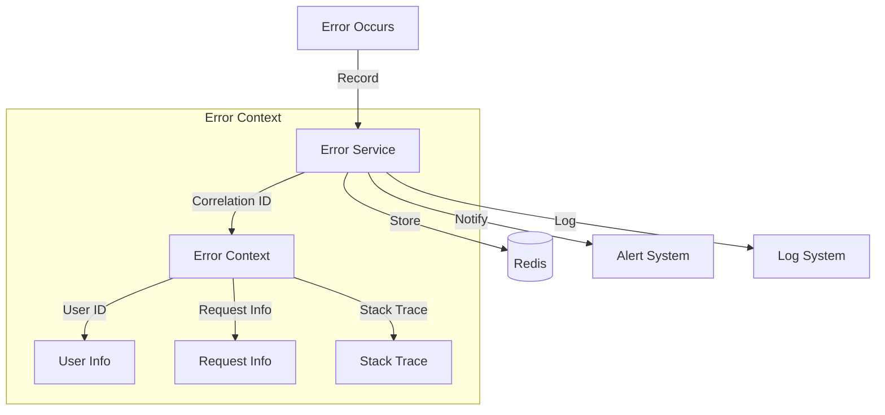

# Distributed Tracing

## Introduction

Distributed tracing extends beyond basic tracing by providing comprehensive request tracking across multiple services, enabling correlation of related operations, and maintaining context throughout complex distributed workflows. This approach is essential for understanding user journeys, debugging cross-service issues, and monitoring business processes.

## System Architecture



## Correlation ID Lifecycle



## Error Correlation Flow



## Correlation ID Implementation

### 1. Basic Correlation ID Service

```java
@Service
@Slf4j
public class CorrelationIdService {

    private static final String CORRELATION_ID_HEADER = "X-Correlation-ID";
    private static final String CORRELATION_ID_MDC_KEY = "correlationId";
    
    public String generateCorrelationId() {
        return UUID.randomUUID().toString();
    }
    
    public void setCorrelationId(String correlationId) {
        if (correlationId == null || correlationId.trim().isEmpty()) {
            correlationId = generateCorrelationId();
        }
        MDC.put(CORRELATION_ID_MDC_KEY, correlationId);
    }
    
    public String getCorrelationId() {
        String correlationId = MDC.get(CORRELATION_ID_MDC_KEY);
        if (correlationId == null) {
            correlationId = generateCorrelationId();
            setCorrelationId(correlationId);
        }
        return correlationId;
    }
    
    public void clearCorrelationId() {
        MDC.remove(CORRELATION_ID_MDC_KEY);
    }
    
    public void executeWithCorrelationId(String correlationId, Runnable task) {
        String previousCorrelationId = getCorrelationId();
        try {
            setCorrelationId(correlationId);
            task.run();
        } finally {
            setCorrelationId(previousCorrelationId);
        }
    }
    
    public <T> T executeWithCorrelationId(String correlationId, Supplier<T> task) {
        String previousCorrelationId = getCorrelationId();
        try {
            setCorrelationId(correlationId);
            return task.get();
        } finally {
            setCorrelationId(previousCorrelationId);
        }
    }
}
```

### 2. HTTP Request Filter

```java
@Component
@Order(Ordered.HIGHEST_PRECEDENCE)
public class CorrelationIdFilter implements Filter {

    private static final String CORRELATION_ID_HEADER = "X-Correlation-ID";
    private static final String REQUEST_ID_HEADER = "X-Request-ID";
    
    private final CorrelationIdService correlationIdService;
    
    public CorrelationIdFilter(CorrelationIdService correlationIdService) {
        this.correlationIdService = correlationIdService;
    }

    @Override
    public void doFilter(ServletRequest request, ServletResponse response, 
                        FilterChain chain) throws IOException, ServletException {
        
        HttpServletRequest httpRequest = (HttpServletRequest) request;
        HttpServletResponse httpResponse = (HttpServletResponse) response;
        
        try {
            // Extract or generate correlation ID
            String correlationId = httpRequest.getHeader(CORRELATION_ID_HEADER);
            if (correlationId == null || correlationId.trim().isEmpty()) {
                correlationId = correlationIdService.generateCorrelationId();
            }
            
            // Set correlation ID in MDC
            correlationIdService.setCorrelationId(correlationId);
            
            // Add correlation ID to response headers
            httpResponse.setHeader(CORRELATION_ID_HEADER, correlationId);
            
            // Generate and set request ID
            String requestId = UUID.randomUUID().toString();
            httpResponse.setHeader(REQUEST_ID_HEADER, requestId);
            MDC.put("requestId", requestId);
            
            // Add request information to MDC
            MDC.put("requestMethod", httpRequest.getMethod());
            MDC.put("requestUri", httpRequest.getRequestURI());
            MDC.put("remoteAddr", httpRequest.getRemoteAddr());
            
            chain.doFilter(request, response);
            
        } finally {
            // Clean up MDC
            correlationIdService.clearCorrelationId();
            MDC.remove("requestId");
            MDC.remove("requestMethod");
            MDC.remove("requestUri");
            MDC.remove("remoteAddr");
        }
    }
}
```

### 3. Logback Configuration with Correlation ID

```xml
<!-- logback-spring.xml -->
<configuration>
    <springProfile name="!local">
        <appender name="STDOUT" class="ch.qos.logback.core.ConsoleAppender">
            <encoder class="net.logstash.logback.encoder.LoggingEventCompositeJsonEncoder">
                <providers>
                    <timestamp/>
                    <logLevel/>
                    <loggerName/>
                    <mdc/>
                    <arguments/>
                    <stackTrace/>
                    <pattern>
                        <pattern>
                            {
                                "timestamp": "%d{yyyy-MM-dd HH:mm:ss.SSS}",
                                "level": "%level",
                                "thread": "%thread",
                                "logger": "%logger{36}",
                                "correlationId": "%X{correlationId:-UNKNOWN}",
                                "requestId": "%X{requestId:-UNKNOWN}",
                                "service": "${spring.application.name:-unknown-service}",
                                "message": "%message",
                                "exception": "%ex"
                            }
                        </pattern>
                    </pattern>
                </providers>
            </encoder>
        </appender>
    </springProfile>

    <springProfile name="local">
        <appender name="STDOUT" class="ch.qos.logback.core.ConsoleAppender">
            <encoder>
                <pattern>%d{HH:mm:ss.SSS} [%thread] %-5level [%X{correlationId:-UNKNOWN}] [%X{requestId:-UNKNOWN}] %logger{36} - %msg%n</pattern>
            </encoder>
        </appender>
    </springProfile>

    <root level="INFO">
        <appender-ref ref="STDOUT"/>
    </root>
</configuration>
```

## Context Propagation Service

### 1. Advanced Context Propagation

```java
@Service
@Slf4j
public class ContextPropagationService {

    private static final String USER_ID_KEY = "userId";
    private static final String SESSION_ID_KEY = "sessionId";
    private static final String TENANT_ID_KEY = "tenantId";
    private static final String REQUEST_SOURCE_KEY = "requestSource";
    
    public void setUserContext(String userId, String sessionId, String tenantId) {
        MDC.put(USER_ID_KEY, userId);
        MDC.put(SESSION_ID_KEY, sessionId);
        MDC.put(TENANT_ID_KEY, tenantId);
    }
    
    public void setRequestSource(String source) {
        MDC.put(REQUEST_SOURCE_KEY, source);
    }
    
    public UserContext getUserContext() {
        return UserContext.builder()
                .userId(MDC.get(USER_ID_KEY))
                .sessionId(MDC.get(SESSION_ID_KEY))
                .tenantId(MDC.get(TENANT_ID_KEY))
                .requestSource(MDC.get(REQUEST_SOURCE_KEY))
                .correlationId(MDC.get("correlationId"))
                .build();
    }
    
    public void clearUserContext() {
        MDC.remove(USER_ID_KEY);
        MDC.remove(SESSION_ID_KEY);
        MDC.remove(TENANT_ID_KEY);
        MDC.remove(REQUEST_SOURCE_KEY);
    }
    
    public Map<String, String> getCurrentContext() {
        Map<String, String> context = new HashMap<>();
        Map<String, String> mdcMap = MDC.getCopyOfContextMap();
        if (mdcMap != null) {
            context.putAll(mdcMap);
        }
        return context;
    }
    
    public void setContext(Map<String, String> context) {
        if (context != null) {
            context.forEach(MDC::put);
        }
    }
    
    public void executeWithContext(Map<String, String> context, Runnable task) {
        Map<String, String> previousContext = getCurrentContext();
        try {
            setContext(context);
            task.run();
        } finally {
            MDC.clear();
            setContext(previousContext);
        }
    }

    @Data
    @Builder
    public static class UserContext {
        private String userId;
        private String sessionId;
        private String tenantId;
        private String requestSource;
        private String correlationId;
    }
}
```

### 2. Thread Pool Context Propagation

```java
@Configuration
@EnableAsync
public class AsyncContextPropagationConfiguration {

    @Bean("contextAwareTaskExecutor")
    public Executor contextAwareTaskExecutor() {
        ThreadPoolTaskExecutor executor = new ThreadPoolTaskExecutor();
        executor.setCorePoolSize(5);
        executor.setMaxPoolSize(10);
        executor.setQueueCapacity(100);
        executor.setThreadNamePrefix("ContextAware-");
        executor.setTaskDecorator(new ContextCopyingDecorator());
        executor.initialize();
        return executor;
    }

    private static class ContextCopyingDecorator implements TaskDecorator {
        @Override
        public Runnable decorate(Runnable runnable) {
            Map<String, String> contextMap = MDC.getCopyOfContextMap();
            return () -> {
                try {
                    if (contextMap != null) {
                        MDC.setContextMap(contextMap);
                    }
                    runnable.run();
                } finally {
                    MDC.clear();
                }
            };
        }
    }

    @Bean
    public CompletableFuture<Void> contextAwareCompletableFuture() {
        return CompletableFuture.runAsync(() -> {
            // Context is automatically propagated
            log.info("Executing with context: {}", MDC.getCopyOfContextMap());
        }, contextAwareTaskExecutor());
    }
}

@Service
@Slf4j
public class AsyncContextService {

    @Async("contextAwareTaskExecutor")
    public CompletableFuture<String> processWithContext(String data) {
        log.info("Processing data: {} with correlation ID: {}", 
                data, MDC.get("correlationId"));
        return CompletableFuture.completedFuture("Processed: " + data);
    }
}
```

## Cross-Service Correlation

### 1. Feign Client Integration

```java
@Component
public class CorrelationIdFeignInterceptor implements RequestInterceptor {

    private final CorrelationIdService correlationIdService;
    
    public CorrelationIdFeignInterceptor(CorrelationIdService correlationIdService) {
        this.correlationIdService = correlationIdService;
    }

    @Override
    public void apply(RequestTemplate requestTemplate) {
        String correlationId = correlationIdService.getCorrelationId();
        requestTemplate.header("X-Correlation-ID", correlationId);
        
        // Add additional context headers
        String userId = MDC.get("userId");
        String tenantId = MDC.get("tenantId");
        String sessionId = MDC.get("sessionId");
        
        if (userId != null) {
            requestTemplate.header("X-User-ID", userId);
        }
        if (tenantId != null) {
            requestTemplate.header("X-Tenant-ID", tenantId);
        }
        if (sessionId != null) {
            requestTemplate.header("X-Session-ID", sessionId);
        }
    }
}

@FeignClient(name = "user-service", configuration = FeignConfiguration.class)
public interface UserServiceClient {
    
    @GetMapping("/users/{id}")
    UserDto getUser(@PathVariable("id") Long id);
    
    @PostMapping("/users")
    UserDto createUser(@RequestBody CreateUserRequest request);
}

@Configuration
public class FeignConfiguration {
    
    @Bean
    public CorrelationIdFeignInterceptor correlationIdInterceptor(
            CorrelationIdService correlationIdService) {
        return new CorrelationIdFeignInterceptor(correlationIdService);
    }
}
```

### 2. RestTemplate Integration

```java
@Component
public class CorrelationIdRestTemplateInterceptor implements ClientHttpRequestInterceptor {

    private final CorrelationIdService correlationIdService;
    
    public CorrelationIdRestTemplateInterceptor(CorrelationIdService correlationIdService) {
        this.correlationIdService = correlationIdService;
    }

    @Override
    public ClientHttpResponse intercept(
            HttpRequest request, 
            byte[] body, 
            ClientHttpRequestExecution execution) throws IOException {
        
        // Add correlation ID to outgoing requests
        String correlationId = correlationIdService.getCorrelationId();
        request.getHeaders().add("X-Correlation-ID", correlationId);
        
        // Add user context headers
        String userId = MDC.get("userId");
        String tenantId = MDC.get("tenantId");
        
        if (userId != null) {
            request.getHeaders().add("X-User-ID", userId);
        }
        if (tenantId != null) {
            request.getHeaders().add("X-Tenant-ID", tenantId);
        }
        
        // Log outgoing request
        log.debug("Outgoing request: {} {} with correlation ID: {}", 
                request.getMethod(), request.getURI(), correlationId);
        
        return execution.execute(request, body);
    }
}

@Configuration
public class RestTemplateConfiguration {
    
    @Bean
    public RestTemplate restTemplate(CorrelationIdRestTemplateInterceptor interceptor) {
        RestTemplate restTemplate = new RestTemplate();
        restTemplate.setInterceptors(Collections.singletonList(interceptor));
        return restTemplate;
    }
}
```

### 3. WebClient Integration

```java
@Configuration
public class WebClientConfiguration {

    @Bean
    public WebClient webClient(CorrelationIdService correlationIdService) {
        return WebClient.builder()
                .filter(correlationIdExchangeFilter(correlationIdService))
                .build();
    }
    
    private ExchangeFilterFunction correlationIdExchangeFilter(
            CorrelationIdService correlationIdService) {
        return ExchangeFilterFunction.ofRequestProcessor(clientRequest -> {
            String correlationId = correlationIdService.getCorrelationId();
            
            ClientRequest newRequest = ClientRequest.from(clientRequest)
                    .header("X-Correlation-ID", correlationId)
                    .header("X-User-ID", MDC.get("userId"))
                    .header("X-Tenant-ID", MDC.get("tenantId"))
                    .build();
            
            return Mono.just(newRequest);
        });
    }
}

@Service
@Slf4j
public class WebClientService {

    private final WebClient webClient;
    
    public WebClientService(WebClient webClient) {
        this.webClient = webClient;
    }
    
    public Mono<String> callExternalService(String data) {
        return webClient.post()
                .uri("/external-api/process")
                .bodyValue(data)
                .retrieve()
                .bodyToMono(String.class)
                .doOnNext(response -> 
                    log.info("Received response with correlation ID: {}", 
                            MDC.get("correlationId")));
    }
}
```

## Message Queue Correlation

### 1. Kafka Producer with Correlation

```java
@Service
@Slf4j
public class CorrelatedKafkaProducer {

    private final KafkaTemplate<String, Object> kafkaTemplate;
    private final CorrelationIdService correlationIdService;
    
    public CorrelatedKafkaProducer(KafkaTemplate<String, Object> kafkaTemplate,
                                  CorrelationIdService correlationIdService) {
        this.kafkaTemplate = kafkaTemplate;
        this.correlationIdService = correlationIdService;
    }
    
    public void sendMessage(String topic, Object message) {
        String correlationId = correlationIdService.getCorrelationId();
        
        ProducerRecord<String, Object> record = new ProducerRecord<>(topic, message);
        
        // Add correlation headers
        record.headers().add("X-Correlation-ID", correlationId.getBytes());
        record.headers().add("X-User-ID", getHeaderValue("userId"));
        record.headers().add("X-Tenant-ID", getHeaderValue("tenantId"));
        record.headers().add("X-Request-Source", getHeaderValue("requestSource"));
        record.headers().add("X-Timestamp", String.valueOf(System.currentTimeMillis()).getBytes());
        
        kafkaTemplate.send(record)
                .addCallback(
                    result -> log.info("Message sent successfully with correlation ID: {}", correlationId),
                    failure -> log.error("Failed to send message with correlation ID: {}", correlationId, failure)
                );
    }
    
    public void sendEventWithContext(String topic, Object event, Map<String, String> additionalContext) {
        String correlationId = correlationIdService.getCorrelationId();
        
        ProducerRecord<String, Object> record = new ProducerRecord<>(topic, event);
        
        // Add standard correlation headers
        record.headers().add("X-Correlation-ID", correlationId.getBytes());
        
        // Add MDC context
        Map<String, String> context = MDC.getCopyOfContextMap();
        if (context != null) {
            context.forEach((key, value) -> 
                record.headers().add("X-MDC-" + key, value.getBytes()));
        }
        
        // Add additional context
        if (additionalContext != null) {
            additionalContext.forEach((key, value) -> 
                record.headers().add("X-Context-" + key, value.getBytes()));
        }
        
        kafkaTemplate.send(record);
    }
    
    private byte[] getHeaderValue(String mdcKey) {
        String value = MDC.get(mdcKey);
        return value != null ? value.getBytes() : new byte[0];
    }
}
```

### 2. Kafka Consumer with Correlation

```java
@Component
@Slf4j
public class CorrelatedKafkaConsumer {

    private final ContextPropagationService contextPropagationService;
    
    public CorrelatedKafkaConsumer(ContextPropagationService contextPropagationService) {
        this.contextPropagationService = contextPropagationService;
    }

    @KafkaListener(topics = "user-events")
    public void handleUserEvent(
            @Payload UserEvent event,
            @Header Map<String, Object> headers,
            ConsumerRecord<String, UserEvent> record) {
        
        try {
            // Extract and set correlation context
            extractAndSetContext(record.headers());
            
            log.info("Processing user event: {} with correlation ID: {}", 
                    event.getEventType(), MDC.get("correlationId"));
            
            // Process the event
            processUserEvent(event);
            
        } finally {
            // Clean up context
            MDC.clear();
        }
    }
    
    private void extractAndSetContext(Headers headers) {
        // Extract correlation ID
        Header correlationHeader = headers.lastHeader("X-Correlation-ID");
        if (correlationHeader != null) {
            String correlationId = new String(correlationHeader.value());
            MDC.put("correlationId", correlationId);
        }
        
        // Extract user context
        extractHeaderToMDC(headers, "X-User-ID", "userId");
        extractHeaderToMDC(headers, "X-Tenant-ID", "tenantId");
        extractHeaderToMDC(headers, "X-Request-Source", "requestSource");
        
        // Extract MDC context
        headers.forEach(header -> {
            String key = header.key();
            if (key.startsWith("X-MDC-")) {
                String mdcKey = key.substring(6); // Remove "X-MDC-" prefix
                String value = new String(header.value());
                MDC.put(mdcKey, value);
            }
        });
    }
    
    private void extractHeaderToMDC(Headers headers, String headerName, String mdcKey) {
        Header header = headers.lastHeader(headerName);
        if (header != null && header.value().length > 0) {
            String value = new String(header.value());
            MDC.put(mdcKey, value);
        }
    }
    
    private void processUserEvent(UserEvent event) {
        // Business logic here
        log.info("Processing event: {}", event);
    }
}
```

## User Journey Tracking

### 1. Journey Tracking Service

```java
@Service
@Slf4j
public class UserJourneyTrackingService {

    private final RedisTemplate<String, Object> redisTemplate;
    private final CorrelationIdService correlationIdService;
    
    private static final String JOURNEY_PREFIX = "journey:";
    private static final Duration JOURNEY_TTL = Duration.ofHours(24);
    
    public UserJourneyTrackingService(RedisTemplate<String, Object> redisTemplate,
                                    CorrelationIdService correlationIdService) {
        this.redisTemplate = redisTemplate;
        this.correlationIdService = correlationIdService;
    }
    
    public void trackJourneyStep(String userId, String step, Map<String, Object> metadata) {
        String correlationId = correlationIdService.getCorrelationId();
        
        JourneyStep journeyStep = JourneyStep.builder()
                .stepName(step)
                .timestamp(Instant.now())
                .correlationId(correlationId)
                .userId(userId)
                .metadata(metadata)
                .serviceName(getServiceName())
                .build();
        
        String journeyKey = JOURNEY_PREFIX + correlationId;
        
        // Add step to journey
        redisTemplate.opsForList().rightPush(journeyKey, journeyStep);
        redisTemplate.expire(journeyKey, JOURNEY_TTL);
        
        log.info("Journey step tracked: {} for user: {} in correlation: {}", 
                step, userId, correlationId);
    }
    
    public List<JourneyStep> getJourney(String correlationId) {
        String journeyKey = JOURNEY_PREFIX + correlationId;
        List<Object> steps = redisTemplate.opsForList().range(journeyKey, 0, -1);
        
        return steps != null ? steps.stream()
                .map(step -> (JourneyStep) step)
                .collect(Collectors.toList()) : Collections.emptyList();
    }
    
    public JourneyAnalytics analyzeJourney(String correlationId) {
        List<JourneyStep> steps = getJourney(correlationId);
        
        if (steps.isEmpty()) {
            return JourneyAnalytics.empty();
        }
        
        JourneyStep firstStep = steps.get(0);
        JourneyStep lastStep = steps.get(steps.size() - 1);
        
        Duration totalDuration = Duration.between(
                firstStep.getTimestamp(), 
                lastStep.getTimestamp()
        );
        
        Map<String, Long> stepCounts = steps.stream()
                .collect(Collectors.groupingBy(
                        JourneyStep::getStepName, 
                        Collectors.counting()
                ));
        
        Map<String, Long> serviceCounts = steps.stream()
                .collect(Collectors.groupingBy(
                        JourneyStep::getServiceName, 
                        Collectors.counting()
                ));
        
        return JourneyAnalytics.builder()
                .correlationId(correlationId)
                .totalSteps(steps.size())
                .totalDuration(totalDuration)
                .startTime(firstStep.getTimestamp())
                .endTime(lastStep.getTimestamp())
                .stepCounts(stepCounts)
                .serviceCounts(serviceCounts)
                .steps(steps)
                .build();
    }
    
    private String getServiceName() {
        return System.getProperty("spring.application.name", "unknown-service");
    }

    @Data
    @Builder
    public static class JourneyStep {
        private String stepName;
        private Instant timestamp;
        private String correlationId;
        private String userId;
        private String serviceName;
        private Map<String, Object> metadata;
    }

    @Data
    @Builder
    public static class JourneyAnalytics {
        private String correlationId;
        private int totalSteps;
        private Duration totalDuration;
        private Instant startTime;
        private Instant endTime;
        private Map<String, Long> stepCounts;
        private Map<String, Long> serviceCounts;
        private List<JourneyStep> steps;
        
        public static JourneyAnalytics empty() {
            return JourneyAnalytics.builder()
                    .totalSteps(0)
                    .totalDuration(Duration.ZERO)
                    .stepCounts(Collections.emptyMap())
                    .serviceCounts(Collections.emptyMap())
                    .steps(Collections.emptyList())
                    .build();
        }
    }
}
```

### 2. Journey Tracking Aspect

```java
@Aspect
@Component
@Slf4j
public class JourneyTrackingAspect {

    private final UserJourneyTrackingService journeyService;
    
    public JourneyTrackingAspect(UserJourneyTrackingService journeyService) {
        this.journeyService = journeyService;
    }

    @Around("@annotation(trackJourney)")
    public Object trackJourneyStep(ProceedingJoinPoint joinPoint, TrackJourney trackJourney) throws Throwable {
        String stepName = trackJourney.step().isEmpty() ? 
                joinPoint.getSignature().getName() : trackJourney.step();
        
        String userId = extractUserId(joinPoint);
        
        Map<String, Object> metadata = new HashMap<>();
        metadata.put("method", joinPoint.getSignature().getName());
        metadata.put("class", joinPoint.getTarget().getClass().getSimpleName());
        
        long startTime = System.currentTimeMillis();
        
        try {
            Object result = joinPoint.proceed();
            
            metadata.put("duration", System.currentTimeMillis() - startTime);
            metadata.put("status", "success");
            
            if (userId != null) {
                journeyService.trackJourneyStep(userId, stepName, metadata);
            }
            
            return result;
            
        } catch (Exception ex) {
            metadata.put("duration", System.currentTimeMillis() - startTime);
            metadata.put("status", "error");
            metadata.put("error", ex.getMessage());
            
            if (userId != null) {
                journeyService.trackJourneyStep(userId, stepName + "-error", metadata);
            }
            
            throw ex;
        }
    }
    
    private String extractUserId(ProceedingJoinPoint joinPoint) {
        // Try to get user ID from MDC first
        String userId = MDC.get("userId");
        if (userId != null) {
            return userId;
        }
        
        // Try to extract from method parameters
        Object[] args = joinPoint.getArgs();
        for (Object arg : args) {
            if (arg instanceof String && arg.toString().matches("\\d+")) {
                return arg.toString();
            }
            // Add more extraction logic as needed
        }
        
        return null;
    }
}

@Target(ElementType.METHOD)
@Retention(RetentionPolicy.RUNTIME)
public @interface TrackJourney {
    String step() default "";
}
```

## Error Correlation Service

### 1. Error Tracking with Context

```java
@Service
@Slf4j
public class ErrorCorrelationService {

    private final RedisTemplate<String, Object> redisTemplate;
    private final CorrelationIdService correlationIdService;
    
    private static final String ERROR_PREFIX = "error:";
    private static final Duration ERROR_TTL = Duration.ofDays(7);
    
    public ErrorCorrelationService(RedisTemplate<String, Object> redisTemplate,
                                 CorrelationIdService correlationIdService) {
        this.redisTemplate = redisTemplate;
        this.correlationIdService = correlationIdService;
    }
    
    public void recordError(Exception exception, String operation) {
        String correlationId = correlationIdService.getCorrelationId();
        
        ErrorEvent errorEvent = ErrorEvent.builder()
                .errorId(UUID.randomUUID().toString())
                .correlationId(correlationId)
                .timestamp(Instant.now())
                .operation(operation)
                .exceptionType(exception.getClass().getSimpleName())
                .message(exception.getMessage())
                .stackTrace(getStackTrace(exception))
                .context(getCurrentContext())
                .serviceName(getServiceName())
                .build();
        
        // Store error for correlation analysis
        String errorKey = ERROR_PREFIX + correlationId;
        redisTemplate.opsForList().rightPush(errorKey, errorEvent);
        redisTemplate.expire(errorKey, ERROR_TTL);
        
        // Store error by ID for quick lookup
        redisTemplate.opsForValue().set(
                ERROR_PREFIX + "id:" + errorEvent.getErrorId(), 
                errorEvent, 
                ERROR_TTL
        );
        
        log.error("Error recorded for correlation ID: {} in operation: {}", 
                correlationId, operation, exception);
    }
    
    public List<ErrorEvent> getErrorsForCorrelation(String correlationId) {
        String errorKey = ERROR_PREFIX + correlationId;
        List<Object> errors = redisTemplate.opsForList().range(errorKey, 0, -1);
        
        return errors != null ? errors.stream()
                .map(error -> (ErrorEvent) error)
                .collect(Collectors.toList()) : Collections.emptyList();
    }
    
    public ErrorAnalytics analyzeErrors(String correlationId) {
        List<ErrorEvent> errors = getErrorsForCorrelation(correlationId);
        
        if (errors.isEmpty()) {
            return ErrorAnalytics.empty();
        }
        
        Map<String, Long> errorTypeCounts = errors.stream()
                .collect(Collectors.groupingBy(
                        ErrorEvent::getExceptionType, 
                        Collectors.counting()
                ));
        
        Map<String, Long> operationCounts = errors.stream()
                .collect(Collectors.groupingBy(
                        ErrorEvent::getOperation, 
                        Collectors.counting()
                ));
        
        Map<String, Long> serviceCounts = errors.stream()
                .collect(Collectors.groupingBy(
                        ErrorEvent::getServiceName, 
                        Collectors.counting()
                ));
        
        return ErrorAnalytics.builder()
                .correlationId(correlationId)
                .totalErrors(errors.size())
                .errorTypeCounts(errorTypeCounts)
                .operationCounts(operationCounts)
                .serviceCounts(serviceCounts)
                .firstError(errors.get(0))
                .lastError(errors.get(errors.size() - 1))
                .errors(errors)
                .build();
    }
    
    private Map<String, String> getCurrentContext() {
        Map<String, String> context = new HashMap<>();
        Map<String, String> mdcMap = MDC.getCopyOfContextMap();
        if (mdcMap != null) {
            context.putAll(mdcMap);
        }
        return context;
    }
    
    private String getStackTrace(Exception exception) {
        StringWriter sw = new StringWriter();
        PrintWriter pw = new PrintWriter(sw);
        exception.printStackTrace(pw);
        return sw.toString();
    }
    
    private String getServiceName() {
        return System.getProperty("spring.application.name", "unknown-service");
    }

    @Data
    @Builder
    public static class ErrorEvent {
        private String errorId;
        private String correlationId;
        private Instant timestamp;
        private String operation;
        private String exceptionType;
        private String message;
        private String stackTrace;
        private Map<String, String> context;
        private String serviceName;
    }

    @Data
    @Builder
    public static class ErrorAnalytics {
        private String correlationId;
        private int totalErrors;
        private Map<String, Long> errorTypeCounts;
        private Map<String, Long> operationCounts;
        private Map<String, Long> serviceCounts;
        private ErrorEvent firstError;
        private ErrorEvent lastError;
        private List<ErrorEvent> errors;
        
        public static ErrorAnalytics empty() {
            return ErrorAnalytics.builder()
                    .totalErrors(0)
                    .errorTypeCounts(Collections.emptyMap())
                    .operationCounts(Collections.emptyMap())
                    .serviceCounts(Collections.emptyMap())
                    .errors(Collections.emptyList())
                    .build();
        }
    }
}
```

### 2. Global Error Handler with Correlation

```java
@RestControllerAdvice
@Slf4j
public class CorrelatedErrorHandler {

    private final ErrorCorrelationService errorCorrelationService;
    
    public CorrelatedErrorHandler(ErrorCorrelationService errorCorrelationService) {
        this.errorCorrelationService = errorCorrelationService;
    }

    @ExceptionHandler(BusinessException.class)
    public ResponseEntity<ErrorResponse> handleBusinessException(
            BusinessException ex, HttpServletRequest request) {
        
        errorCorrelationService.recordError(ex, request.getRequestURI());
        
        ErrorResponse errorResponse = ErrorResponse.builder()
                .correlationId(MDC.get("correlationId"))
                .timestamp(Instant.now())
                .status(HttpStatus.BAD_REQUEST.value())
                .error("Business Error")
                .message(ex.getMessage())
                .path(request.getRequestURI())
                .build();
        
        return ResponseEntity.badRequest().body(errorResponse);
    }
    
    @ExceptionHandler(SystemException.class)
    public ResponseEntity<ErrorResponse> handleSystemException(
            SystemException ex, HttpServletRequest request) {
        
        errorCorrelationService.recordError(ex, request.getRequestURI());
        
        ErrorResponse errorResponse = ErrorResponse.builder()
                .correlationId(MDC.get("correlationId"))
                .timestamp(Instant.now())
                .status(HttpStatus.INTERNAL_SERVER_ERROR.value())
                .error("System Error")
                .message("An internal error occurred")
                .path(request.getRequestURI())
                .build();
        
        return ResponseEntity.status(HttpStatus.INTERNAL_SERVER_ERROR).body(errorResponse);
    }
    
    @ExceptionHandler(Exception.class)
    public ResponseEntity<ErrorResponse> handleGenericException(
            Exception ex, HttpServletRequest request) {
        
        errorCorrelationService.recordError(ex, request.getRequestURI());
        
        ErrorResponse errorResponse = ErrorResponse.builder()
                .correlationId(MDC.get("correlationId"))
                .timestamp(Instant.now())
                .status(HttpStatus.INTERNAL_SERVER_ERROR.value())
                .error("Unexpected Error")
                .message("An unexpected error occurred")
                .path(request.getRequestURI())
                .build();
        
        return ResponseEntity.status(HttpStatus.INTERNAL_SERVER_ERROR).body(errorResponse);
    }

    @Data
    @Builder
    public static class ErrorResponse {
        private String correlationId;
        private Instant timestamp;
        private int status;
        private String error;
        private String message;
        private String path;
    }
}
```

This comprehensive distributed tracing implementation provides end-to-end request correlation, context propagation across services, user journey tracking, and error correlation capabilities essential for debugging and monitoring complex distributed systems.
