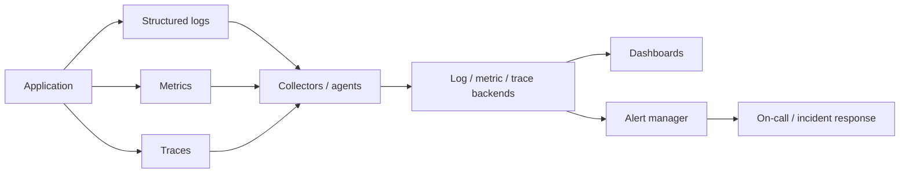

# Observability Stack

Observability helps infer internal state from externally visible outputs. Logs, metrics, and traces are not substitutes; they answer different questions and should be correlated.

## Quick Decision

| Question | Signal | Example answer |
| --- | --- | --- |
| What happened? | Structured logs | Which request produced the error? |
| How much happened? | Metrics | Did error rate or queue depth increase? |
| Where did it slow down? | Traces | Which hop consumed the latency budget? |
| Are users affected? | SLI/SLO | Are success rate and p95 on target? |
| When should we act? | Alerting | Is error budget burn critical? |

## Production Checklist

- Does every request and async message carry a correlation or trace ID?
- Can logs, metrics, and traces be correlated by service, endpoint, region, and version?
- Are latency histograms, throughput, error rate, and saturation monitored together?
- Are alerts action-oriented and based on symptoms and user impact?
- Are cardinality, retention, sampling, and PII costs controlled?

## Stack Architecture



Collector and backend choices can remain vendor-neutral. Plan ingestion backpressure, disk exhaustion, sampling, and application behavior when the telemetry backend is unavailable.

## Logging

Structured logs should include timestamp, level, service, environment, version, request ID, trace ID, route, status, duration, and error code. Do not log secrets, tokens, or unnecessary PII.

Log level can be increased during an incident; permanently emitting DEBUG increases storage, indexing, and network cost. Correlation should allow one request to be followed from gateway to database.

## Metrics

Core metrics include:

- **Latency:** p50/p95/p99 histograms and timeout rate
- **Throughput:** request/message volume and successful processing rate
- **Errors:** status, exception, and business-failure rate
- **Saturation:** CPU, memory, connection pools, queue depth, consumer lag, and disk

Choose counter, gauge, histogram, and summary types for their actual meaning. Do not explode label cardinality with unbounded user IDs or request IDs.

## Tracing

A trace represents a request or message journey as spans. Gateway, service, cache, database, queue publish, and consumer spans show where the latency budget is consumed. Propagate trace context through message headers across async boundaries.

Sampling every request can be expensive. Use tail-based or adaptive sampling for errors and slow traces, with a lower sampling rate for normal traffic.

## Monitoring and Alerting

A dashboard is for exploration; an alert identifies a condition requiring human action. Every alert should contain:

```text
Signal: Which metric and condition?
Impact: Which user or SLO is affected?
Window: How long before it is a real problem?
Action: What is the first check and mitigation?
Owner: Who responds?
```

CPU alone is rarely a user-impact alert. API availability, p99 latency, error-budget burn rate, queue age, or replication lag are often more meaningful. Use duration, hysteresis, and aggregation to reduce flapping.

## SLI, SLO, and Error Budget

An SLI measures user experience; an SLO sets its target; an error budget defines the permitted failure. Examples include:

- monthly successful API request ratio,
- p95 and p99 latency,
- percentage of queue messages completed within a target time,
- time during which stream consumer lag remains below a threshold.

Alerts should consider how quickly the SLO is being consumed, not only resource utilization. See [SLI/SLO/SLA](../sre/sli-slo-sla) for detailed definitions.

## Cost, Privacy, and Reliability

Telemetry also carries production traffic. Sampling, retention, compression, downsampling, and tiered storage control cost. Apply PII masking and access control to observability data as well.

Collector or telemetry-backend failure must not stop the main request path. Use bounded buffers, drop policies, and health metrics to avoid breaking the system while observing it.
