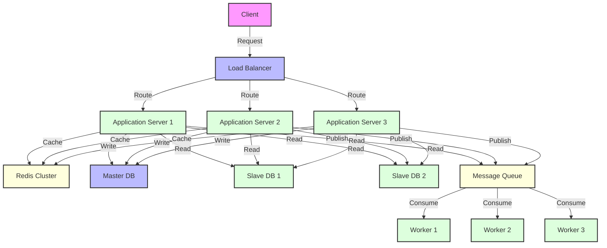

# Performance and Scalability

The success of modern backend systems relies on high performance and effective scalability strategies. This section provides enterprise-level performance optimizations and scalability solutions using the Spring Boot ecosystem.



## The Importance of Performance Optimization

**Why is performance optimization critical?**
- **User Experience**: Fast response times improve user satisfaction
- **Cost Optimization**: Efficient resource utilization reduces operational costs
- **Competitive Advantage**: High-performance systems provide market advantages
- **Scalability**: System stability under increasing load
- **SLA Compliance**: Meeting Service Level Agreement requirements

## Contents

### ✅ [Load Balancing](./load-balancing.md)

Load balancing distributes incoming requests across multiple servers to increase system capacity and prevent single points of failure.

**Covered Topics:**
- **Application-Level Load Balancing**: Client-side load balancing with Spring Cloud LoadBalancer
- **Load Balancing Algorithms**: Round Robin (default), Random, Weighted Response Time, Zone Aware strategies
- **Service Discovery Integration**: Dynamic service registration with Eureka/Consul and health check-based routing
- **Circuit Breaker Integration**: Bypassing unhealthy instances with Resilience4j and fail-fast behavior
- **Infrastructure-Level Solutions**: NGINX/HAProxy reverse proxy, Cloud Load Balancers (AWS ALB/NLB, Azure LB)
- **Monitoring and Optimization**: Micrometer metrics, health checks, auto-scaling strategies

### ✅ [Caching Strategies](./caching.md) 

Caching strategies dramatically improve system performance by minimizing expensive computation and I/O operations.

**Multi-Layer Caching Approach:**
- **Application-Level Caching**: Spring Cache abstraction (@Cacheable, @CacheEvict, @CachePut annotations)
- **Cache Providers**: Redis (distributed), Hazelcast (in-memory grid), Caffeine (local cache), EhCache
- **Distributed Caching**: Spring Data Redis with RedisTemplate, ReactiveRedisTemplate, Redis Cluster/Sentinel
- **HTTP Caching**: ETag support, Last-Modified headers, reverse proxy caching, CDN integration
- **Cache Patterns**: Cache-aside, write-through, write-behind, refresh-ahead strategies
- **Performance Tuning**: Connection pooling, pipeline operations, compression, monitoring

### ✅ [Database Sharding and Partitioning](./sharding.md)

Horizontal and vertical sharding strategies to maintain database performance as data volume increases.

**Comprehensive Sharding Solutions:**
- **Horizontal Sharding**: User ID, geographic region, tenant ID based sharding strategies
- **Shard Key Selection**: Hash-based vs range-based partitioning, consistent hashing algorithms
- **Spring Data JPA Integration**: @Entity with custom sharding, AbstractRoutingDataSource implementations
- **Database Partitioning Types**: Range, Hash, List, Composite partitioning (PostgreSQL/MySQL)
- **Cross-Shard Operations**: Distributed queries, saga pattern for transactions, eventual consistency
- **Monitoring**: Shard utilization balance, query performance metrics, connection pool monitoring
- Shard health monitoring and metrics

### ✅ [Database Replication](./replication.md)
- Master-Slave and Master-Master replication topologies
- Dynamic routing and read/write splitting with Spring Boot
- Load balanced slave selection (Round Robin, Weighted, Health-aware)
- Replication lag handling and read-after-write consistency
- PostgreSQL streaming replication setup
- Connection pool optimization
- Graceful degradation strategies
- Replication monitoring and alerting

### ✅ [Async Processing & Message Queues](./async-processing.md)
- Spring Boot async processing (@Async, CompletableFuture)
- Event-driven architecture with Apache Kafka
- Message queue patterns with RabbitMQ
- Redis Streams and Pub/Sub
- Batch processing strategies
- Resilience with Circuit Breaker pattern
- Dead letter queue handling
- Message deduplication
- Backpressure handling

## Performance Metrics

### Key Metrics
- **Throughput**: Number of requests processed per second
- **Latency**: Request-response time
- **Error Rate**: Percentage of failed requests
- **Resource Utilization**: CPU, Memory, Network usage

### Monitoring with Spring Boot Actuator
```java
@Component
public class PerformanceMetrics {
    
    private final MeterRegistry meterRegistry;
    
    @EventListener
    public void handleRequest(RequestEvent event) {
        Timer.Sample sample = Timer.start(meterRegistry);
        sample.stop(Timer.builder("request.duration")
            .tag("endpoint", event.getEndpoint())
            .register(meterRegistry));
    }
}
```

The strategies in this section form the building blocks for designing high-performance and scalable systems.
