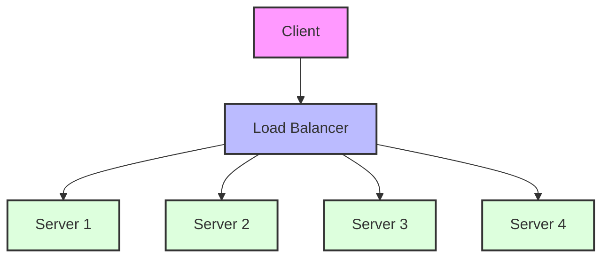
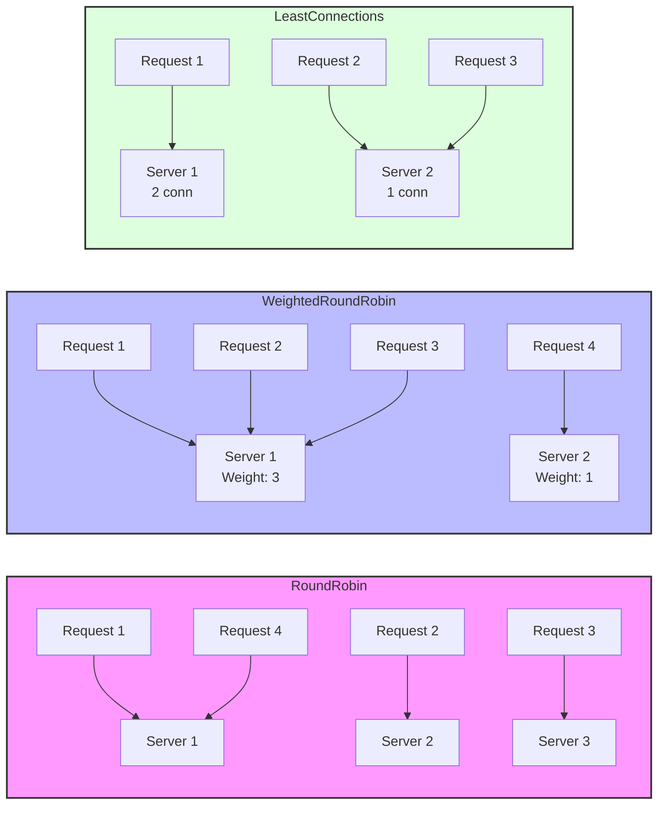
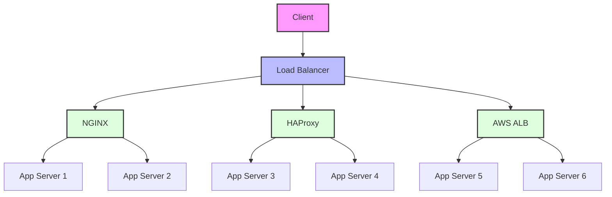

# Load Balancing - Spring Boot Ecosystem

Load balancing is a critical technique that improves system performance and availability by distributing incoming requests across multiple servers. The Spring Boot ecosystem provides various load balancing strategies at both application and infrastructure levels.

## Load Balancing Overview



## Load Balancing Algorithms



## Infrastructure Components



## Application-Level Load Balancing

### Spring Cloud LoadBalancer Configuration

```java
@Configuration
@EnableEurekaClient
public class LoadBalancerConfig {
    
    @Bean
    @LoadBalanced
    public RestTemplate restTemplate() {
        return new RestTemplate();
    }
    
    @Bean
    public ReactorLoadBalancer<ServiceInstance> reactorServiceInstanceLoadBalancer(
            Environment environment,
            LoadBalancerClientFactory loadBalancerClientFactory) {
        String name = environment.getProperty(LoadBalancerClientFactory.PROPERTY_NAME);
        return new RoundRobinLoadBalancer(
            loadBalancerClientFactory.getLazyProvider(name, ServiceInstanceListSupplier.class),
            name
        );
    }
}
```

### Service Discovery Integration

```java
@RestController
public class UserController {
    
    @Autowired
    @LoadBalanced
    private RestTemplate restTemplate;
    
    @GetMapping("/users/{id}")
    public ResponseEntity<User> getUser(@PathVariable Long id) {
        // Load balancer automatically selects an instance of user-service
        String url = "http://user-service/api/users/" + id;
        User user = restTemplate.getForObject(url, User.class);
        return ResponseEntity.ok(user);
    }
}
```

### Custom Load Balancing Strategy

```java
@Configuration
public class CustomLoadBalancerConfiguration {
    
    @Bean
    public ReactorLoadBalancer<ServiceInstance> customLoadBalancer(
            Environment environment,
            LoadBalancerClientFactory loadBalancerClientFactory) {
        String name = environment.getProperty(LoadBalancerClientFactory.PROPERTY_NAME);
        return new CustomWeightedLoadBalancer(
            loadBalancerClientFactory.getLazyProvider(name, ServiceInstanceListSupplier.class),
            name
        );
    }
}

public class CustomWeightedLoadBalancer implements ReactorServiceInstanceLoadBalancer {
    private final String serviceId;
    private final ObjectProvider<ServiceInstanceListSupplier> serviceInstanceListSupplierProvider;
    
    @Override
    public Mono<Response<ServiceInstance>> choose(Request request) {
        ServiceInstanceListSupplier supplier = serviceInstanceListSupplierProvider
            .getIfAvailable(NoopServiceInstanceListSupplier::new);
            
        return supplier.get(request)
            .next()
            .map(serviceInstances -> processInstanceResponse(supplier, serviceInstances));
    }
    
    private Response<ServiceInstance> processInstanceResponse(
            ServiceInstanceListSupplier supplier,
            List<ServiceInstance> serviceInstances) {
        
        if (serviceInstances.isEmpty()) {
            return new EmptyResponse();
        }
        
        // Custom weighted selection logic
        ServiceInstance selected = selectByWeight(serviceInstances);
        return new DefaultResponse(selected);
    }
    
    private ServiceInstance selectByWeight(List<ServiceInstance> instances) {
        // Implement custom weighting algorithm
        // Consider factors like CPU usage, memory, response time
        return instances.stream()
            .max(Comparator.comparing(this::calculateInstanceScore))
            .orElse(instances.get(0));
    }
    
    private double calculateInstanceScore(ServiceInstance instance) {
        // Custom scoring logic based on instance metadata
        Map<String, String> metadata = instance.getMetadata();
        double cpuScore = 100 - Double.parseDouble(metadata.getOrDefault("cpu.usage", "50"));
        double memoryScore = 100 - Double.parseDouble(metadata.getOrDefault("memory.usage", "50"));
        return (cpuScore + memoryScore) / 2;
    }
}
```

## Infrastructure-Level Load Balancing

### NGINX Load Balancer Configuration

```nginx
# Basic load balancing configuration
upstream backend_servers {
    # Round robin (default)
    server app1.example.com:8080;
    server app2.example.com:8080;
    server app3.example.com:8080;
}

# Weighted load balancing
upstream weighted_backend {
    server app1.example.com:8080 weight=3;  # Receives 3x more requests
    server app2.example.com:8080 weight=2;  # Receives 2x more requests
    server app3.example.com:8080 weight=1;  # Receives 1x requests
}

# Least connections
upstream least_conn_backend {
    least_conn;
    server app1.example.com:8080;
    server app2.example.com:8080;
    server app3.example.com:8080;
}

# IP hash for session persistence
upstream session_backend {
    ip_hash;
    server app1.example.com:8080;
    server app2.example.com:8080;
    server app3.example.com:8080;
}

server {
    listen 80;
    server_name api.example.com;
    
    location / {
        proxy_pass http://backend_servers;
        
        # Health check settings
        proxy_connect_timeout 5s;
        proxy_send_timeout 60s;
        proxy_read_timeout 60s;
        
        # Header forwarding
        proxy_set_header Host $host;
        proxy_set_header X-Real-IP $remote_addr;
        proxy_set_header X-Forwarded-For $proxy_add_x_forwarded_for;
        proxy_set_header X-Forwarded-Proto $scheme;
    }
    
    # Health check endpoint
    location /health {
        access_log off;
        return 200 "healthy\n";
        add_header Content-Type text/plain;
    }
}
```

### HAProxy Configuration

```conf
# HAProxy configuration for advanced load balancing
global
    daemon
    maxconn 4096
    log stdout local0
    
defaults
    mode http
    timeout connect 5000ms
    timeout client 50000ms
    timeout server 50000ms
    option httplog
    
# Frontend configuration
frontend api_frontend
    bind *:80
    bind *:443 ssl crt /etc/ssl/certs/api.pem
    
    # Request routing based on path
    acl is_api path_beg /api/
    acl is_admin path_beg /admin/
    
    use_backend api_servers if is_api
    use_backend admin_servers if is_admin
    default_backend web_servers

# Backend configurations
backend api_servers
    balance roundrobin
    option httpchk GET /health
    
    server api1 10.0.1.10:8080 check inter 30s weight 100
    server api2 10.0.1.11:8080 check inter 30s weight 100
    server api3 10.0.1.12:8080 check inter 30s weight 50

backend admin_servers
    balance leastconn
    option httpchk GET /admin/health
    
    server admin1 10.0.2.10:8080 check inter 30s
    server admin2 10.0.2.11:8080 check inter 30s backup

backend web_servers
    balance source
    option httpchk GET /
    
    server web1 10.0.3.10:80 check inter 30s
    server web2 10.0.3.11:80 check inter 30s
    server web3 10.0.3.12:80 check inter 30s

# Statistics page
listen stats
    bind *:8404
    stats enable
    stats uri /stats
    stats refresh 30s
    stats admin if TRUE
```

## Cloud Load Balancing Solutions

### AWS Application Load Balancer

```yaml
# AWS ALB configuration via CloudFormation
Resources:
  ApplicationLoadBalancer:
    Type: AWS::ElasticLoadBalancingV2::LoadBalancer
    Properties:
      Name: api-load-balancer
      Scheme: internet-facing
      Type: application
      Subnets:
        - !Ref PublicSubnet1
        - !Ref PublicSubnet2
      SecurityGroups:
        - !Ref LoadBalancerSecurityGroup
      
  TargetGroup:
    Type: AWS::ElasticLoadBalancingV2::TargetGroup
    Properties:
      Name: api-target-group
      Port: 8080
      Protocol: HTTP
      VpcId: !Ref VPC
      HealthCheckPath: /health
      HealthCheckIntervalSeconds: 30
      HealthyThresholdCount: 2
      UnhealthyThresholdCount: 5
      
  LoadBalancerListener:
    Type: AWS::ElasticLoadBalancingV2::Listener
    Properties:
      DefaultActions:
        - Type: forward
          TargetGroupArn: !Ref TargetGroup
      LoadBalancerArn: !Ref ApplicationLoadBalancer
      Port: 80
      Protocol: HTTP
```

### Spring Boot Health Checks for Load Balancers

```java
@RestController
public class HealthController {
    
    @Autowired
    private DatabaseHealthIndicator databaseHealth;
    
    @Autowired
    private RedisHealthIndicator redisHealth;
    
    // Simple health check for load balancer
    @GetMapping("/health")
    public ResponseEntity<Map<String, String>> health() {
        Map<String, String> status = new HashMap<>();
        status.put("status", "UP");
        status.put("timestamp", Instant.now().toString());
        return ResponseEntity.ok(status);
    }
    
    // Detailed health check
    @GetMapping("/health/detailed")
    public ResponseEntity<Map<String, Object>> detailedHealth() {
        Map<String, Object> health = new HashMap<>();
        health.put("status", "UP");
        health.put("timestamp", Instant.now().toString());
        
        // Database connectivity
        health.put("database", databaseHealth.isHealthy() ? "UP" : "DOWN");
        
        // Redis connectivity
        health.put("redis", redisHealth.isHealthy() ? "UP" : "DOWN");
        
        // Memory usage
        Runtime runtime = Runtime.getRuntime();
        Map<String, Long> memory = new HashMap<>();
        memory.put("total", runtime.totalMemory());
        memory.put("free", runtime.freeMemory());
        memory.put("used", runtime.totalMemory() - runtime.freeMemory());
        health.put("memory", memory);
        
        return ResponseEntity.ok(health);
    }
    
    // Graceful shutdown endpoint
    @PostMapping("/shutdown")
    public ResponseEntity<String> shutdown() {
        // Signal to load balancer that this instance is shutting down
        // Implement graceful shutdown logic
        return ResponseEntity.ok("Shutting down gracefully");
    }
}

@Component
public class DatabaseHealthIndicator {
    @Autowired
    private DataSource dataSource;
    
    public boolean isHealthy() {
        try (Connection connection = dataSource.getConnection()) {
            return connection.isValid(5); // 5 second timeout
        } catch (SQLException e) {
            return false;
        }
    }
}
```

## Load Balancing Best Practices

### 1. Session Persistence Strategies

```java
@Configuration
@EnableRedisHttpSession
public class SessionConfig {
    
    @Bean
    public LettuceConnectionFactory connectionFactory() {
        return new LettuceConnectionFactory(
            new RedisStandaloneConfiguration("redis-server", 6379)
        );
    }
    
    @Bean
    public CookieSerializer cookieSerializer() {
        DefaultCookieSerializer serializer = new DefaultCookieSerializer();
        serializer.setCookieName("JSESSIONID");
        serializer.setCookiePath("/");
        serializer.setDomainNamePattern("^.+?\\.(\\w+\\.[a-z]+)$");
        return serializer;
    }
}
```

### 2. Circuit Breaker Pattern Integration

```java
@Component
public class LoadBalancerCircuitBreaker {
    private final CircuitBreaker circuitBreaker;
    private final LoadBalancer loadBalancer;
    
    public LoadBalancerCircuitBreaker(LoadBalancer loadBalancer) {
        this.loadBalancer = loadBalancer;
        this.circuitBreaker = CircuitBreaker.ofDefaults("load-balancer");
        
        circuitBreaker.getEventPublisher()
            .onStateTransition(event -> 
                log.info("Circuit breaker state transition: {}", event));
    }
    
    public Server selectServerWithCircuitBreaker() {
        return circuitBreaker.executeSupplier(() -> {
            Server server = loadBalancer.selectServer();
            if (!isServerHealthy(server)) {
                throw new ServerUnavailableException("Server is not healthy: " + server);
            }
            return server;
        });
    }
}
```

### 3. Monitoring and Metrics

```java
@Component
public class LoadBalancerMetrics {
    private final MeterRegistry meterRegistry;
    private final Counter requestCounter;
    private final Timer responseTimer;
    
    public LoadBalancerMetrics(MeterRegistry meterRegistry) {
        this.meterRegistry = meterRegistry;
        this.requestCounter = Counter.builder("load_balancer.requests")
            .description("Number of requests handled by load balancer")
            .register(meterRegistry);
        this.responseTimer = Timer.builder("load_balancer.response_time")
            .description("Response time for load balanced requests")
            .register(meterRegistry);
    }
    
    public void recordRequest(String serverName, Duration responseTime, String status) {
        requestCounter.increment(
            Tags.of(
                "server", serverName,
                "status", status
            )
        );
        
        responseTimer.record(responseTime,
            Tags.of("server", serverName)
        );
    }
}
```

Load balancing is essential for building scalable, resilient applications. By implementing appropriate algorithms and monitoring strategies, you can ensure optimal performance and high availability for your Spring Boot applications.
